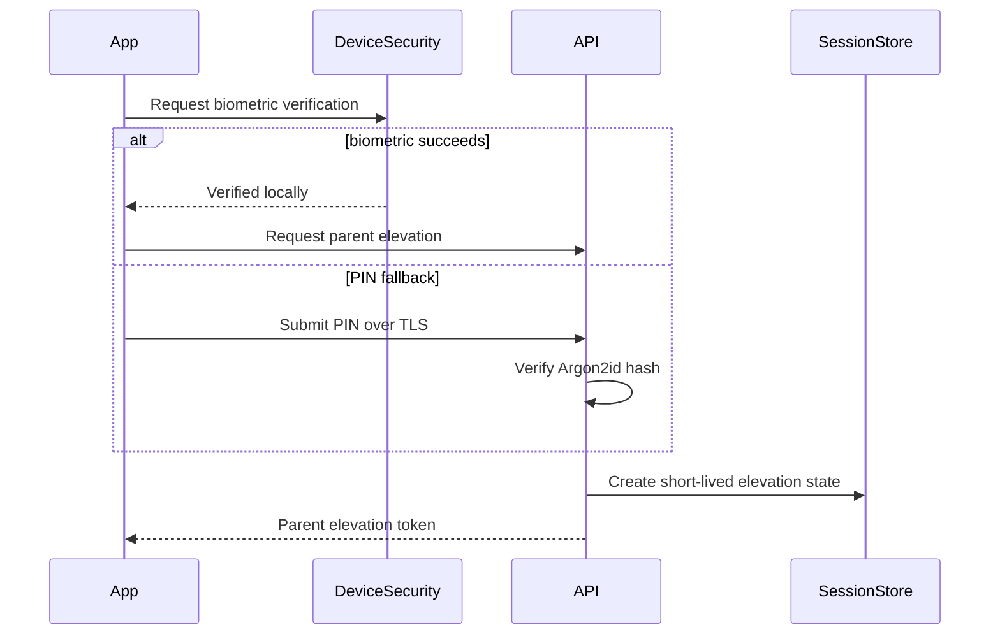

# ADR-0006: Parent Zone Security

- **Status:** Accepted
- **Date:** 2026-07-14
- **Decision owners:** Product, Mobile, Security

## Context

The child-facing application must prevent children from reaching account management, purchases, profile management, contact information, downloads, and parental controls. A device may be shared, so an authenticated account alone is not sufficient protection.

## Decision

Protect Parent Zone with a separate elevation mechanism built around a parent PIN and optional device biometrics.

- A 4-6 digit parent PIN is created during onboarding or before first use of Parent Zone.
- The backend stores only an Argon2id hash with a unique salt.
- Biometric verification is device-local and unlocks access to a short-lived parent-elevation credential; biometrics never replace the server-side PIN recovery path.
- Parent elevation expires after 5 minutes of inactivity and immediately when the app is backgrounded beyond the configured grace interval.
- Sensitive operations such as subscription changes, account deletion, PIN reset, and exporting data require recent re-authentication.
- Failed PIN attempts are rate-limited progressively. Repeated failures trigger cooldown and security logging.
- Child Mode never exposes direct links, deep links, or notifications that bypass the Parent Zone gate.

## Parent Elevation Flow

## Rules

- Parent elevation tokens are audience-restricted and cannot be used as normal access tokens.
- They include account ID, session ID, authentication method, issue time, and expiry.
- No child profile can modify the PIN or biometric settings.
- PIN reset requires account-password verification or verified email recovery.
- PIN values are never logged, returned, or included in analytics.

## Consequences

### Positive

- Clear security boundary between child and parent experiences.
- Supports convenient biometrics without delegating trust entirely to the device.
- Sensitive actions can require stronger and fresher authentication.

### Negative

- Adds state and UX complexity.
- Forgotten PIN recovery must be carefully designed to avoid account lockout.

## Rejected Alternatives

- Simple swipe or arithmetic challenge: not a reliable parental gate.
- Account login only: ineffective on already-authenticated shared devices.
- Biometrics only: unavailable on some devices and unsuitable as the sole recovery mechanism.
