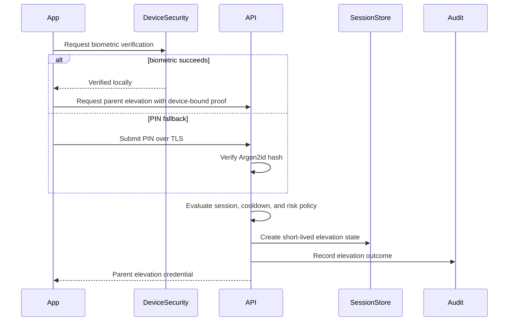

# ADR-0006: Parent Zone Security

- **Status:** Accepted
- **Date:** 2026-07-14
- **Decision owners:** Product, Mobile, Backend, Security
- **Review cadence:** At least annually and after any parental-control bypass or authentication incident

## Context

The child-facing application must prevent children from reaching account management, purchases, profile management, contact information, downloads, subscription settings, privacy controls, and other parent-only capabilities. A device may be shared by multiple family members, so an authenticated account alone is not sufficient protection.

The platform also needs a parent experience that is secure without being frustrating. Parent access may use a PIN, device biometrics, password re-authentication, or verified account recovery depending on risk. The system must distinguish between ordinary Parent Zone access and highly sensitive actions such as deleting an account, changing subscription details, exporting data, resetting the parent PIN, or modifying security settings.

The design must prevent UI bypasses, deep-link bypasses, stale elevation state, brute-force attacks, credential leakage, and client-only enforcement.

## Decision

Protect Parent Zone with a separate, server-recognized elevation mechanism built around a parent PIN and optional device biometrics.

- A 4–6 digit parent PIN is created during onboarding or before first use of Parent Zone.
- The backend stores only an Argon2id hash with a unique salt.
- Device biometrics are verified locally by the operating system.
- Successful biometric verification may request short-lived parent elevation from the backend.
- Parent elevation expires after 5 minutes of inactivity.
- Elevation expires when the app remains backgrounded beyond the configured grace interval.
- Highly sensitive operations require recent account re-authentication in addition to Parent Zone elevation.
- Child Mode must never expose a route, notification action, universal link, or cached screen that bypasses the gate.
- Backend authorization is authoritative; hiding controls in the UI is not considered protection.

## Security Boundary

Parent Zone is a privilege-elevation boundary inside an already authenticated account session.

It separates:

- child-safe discovery and playback;
- child-profile selection;
- parent account settings;
- profile creation and deletion;
- subscriptions and purchases;
- download management;
- notification and privacy settings;
- account recovery and deletion;
- administrative or support-sensitive operations exposed to the account owner.

The elevation mechanism does not create a new account identity. It proves that the current device session completed an approved parent-verification step recently enough for the requested action.

## Authentication Assurance Levels

The platform uses three practical assurance levels:

### Level 1 — Authenticated Account

Sufficient for ordinary account-scoped, non-sensitive operations that do not expose Parent Zone capabilities.

### Level 2 — Parent Zone Elevated

Requires successful parent PIN or approved biometric verification. Suitable for:

- entering Parent Zone;
- managing ordinary child-profile preferences;
- viewing subscription status;
- changing non-critical settings;
- managing downloads;
- reviewing notifications and listening history.

### Level 3 — Recently Re-authenticated

Requires recent password, passkey, verified recovery challenge, or another approved high-assurance method. Required for:

- account deletion;
- personal-data export;
- parent PIN reset;
- email or primary credential changes;
- subscription cancellation or purchase actions where provider policy requires it;
- disabling security protections;
- viewing or changing highly sensitive account information.

The backend determines the minimum assurance level for every protected endpoint.

## Parent PIN Rules

- PIN length is 4–6 digits for usability, with progressive rate limiting compensating for limited entropy.
- Common or sequential PINs may be discouraged or rejected according to product policy.
- PINs are submitted only over TLS.
- PINs are never logged, traced, returned, stored in analytics, copied to the clipboard, or included in crash reports.
- The backend stores an Argon2id hash with a unique salt and approved cost parameters.
- Hash parameters are versioned so they can be upgraded over time.
- Successful verification may trigger rehashing when stronger parameters become standard.
- PIN comparison is performed using the password-hashing library’s constant-time verification path.
- Child profiles cannot create, change, disable, or recover the PIN.

## Biometric Rules

Biometric verification is device-local and relies on operating-system APIs.

- The backend never receives biometric templates or raw biometric data.
- Biometrics unlock a device-bound proof or permit the app to request elevation for the current authenticated session.
- Biometric success alone does not authorize account recovery.
- Devices without biometrics always retain a PIN fallback.
- Changes to device biometric enrollment may invalidate local biometric authorization according to platform capability.
- Biometric failures are not treated as PIN failures but may trigger local cooldown.
- Rooted, jailbroken, or compromised-device signals may disable biometric convenience without blocking secure PIN access.

## Elevation Credential

A parent-elevation credential is short-lived and distinct from the ordinary access token.

Required properties:

- audience restricted to parent-only operations;
- bound to account ID and session ID;
- includes assurance method;
- includes issue time and expiry;
- includes a unique identifier;
- cannot be refreshed independently;
- cannot be used as a normal access token;
- revoked when the underlying session is revoked;
- invalid after PIN reset, password recovery, or account-security changes where policy requires it.

Example claims:

```json
{
  "sub": "account-uuid",
  "sid": "session-uuid",
  "aud": "parent-zone",
  "amr": ["pin"],
  "aal": 2,
  "iat": 1784040000,
  "exp": 1784040300,
  "jti": "elevation-uuid"
}
```

A server-side elevation record may be used for immediate revocation and inactivity tracking.

## Parent Elevation Flow



## Route and UI Enforcement

The mobile application must apply a centralized navigation guard.

- Parent-only routes cannot be reached directly from Child Mode.
- Deep links are resolved through the same guard.
- Push-notification actions are resolved through the same guard.
- Restored navigation state must not reopen Parent Zone after elevation expiry.
- Screenshots or cached screen previews should avoid exposing sensitive parent data.
- Parent Zone should close or obscure sensitive content when the app enters the background.
- The back stack must not return to a protected screen after logout or elevation expiry.
- Accessibility labels and test hooks must not expose secrets.

UI protection supplements, but never replaces, backend authorization.

## Backend Enforcement

Every parent-only endpoint declares its required assurance level.

The backend validates:

- authenticated account;
- active device session;
- account state;
- required parent-elevation audience;
- elevation expiry and inactivity policy;
- assurance method and level;
- profile or resource ownership;
- recent re-authentication where required;
- rate-limit and risk policy.

An endpoint must not trust a client-supplied boolean such as `isParentMode=true`.

## Inactivity and Background Rules

- Default inactivity timeout is 5 minutes.
- User interaction within Parent Zone may refresh server-side inactivity state up to the absolute maximum lifetime.
- Elevation has an absolute lifetime even if the user remains active.
- Brief app backgrounding may use a small configurable grace interval.
- Exceeding the grace interval clears local elevation and requires verification again.
- Device lock causes immediate local Parent Zone lock.
- Session logout or revocation invalidates elevation immediately.

## Failed Attempt Policy

PIN attempts are rate-limited by account, session, device, and IP risk signals.

Recommended progression:

1. a small number of immediate retries;
2. short cooldown;
3. progressively longer cooldown;
4. requirement for account re-authentication or recovery after repeated failures;
5. security notification or support workflow for suspicious patterns.

Rules:

- Error messages must not reveal whether the submitted PIN was close or whether a specific account exists.
- Cooldown state is server authoritative.
- App reinstall or local data clearing must not reset server-side attempt counters.
- Rate-limit responses include stable error codes and retry guidance where safe.
- Repeated failures create security metrics and auditable events.

## PIN Creation and Change

Creating or changing a PIN requires:

- an authenticated account session;
- current Parent Zone elevation if a PIN already exists;
- recent account re-authentication for high-risk cases;
- confirmation of the new PIN;
- invalidation of prior elevation credentials;
- security event recording.

The new PIN is active only after the hash update commits successfully.

## PIN Recovery

PIN recovery must not depend on knowledge of the old PIN.

Approved recovery methods include:

- account password verification;
- verified email recovery challenge;
- passkey or another approved account-level authentication method.

After recovery:

- revoke active Parent Zone elevation credentials;
- optionally revoke device sessions based on risk;
- notify the account owner;
- record an audit event;
- require a new PIN before re-entering Parent Zone where product policy requires it.

Support personnel must never see or set a plaintext PIN on behalf of a user.

## Shared Device Behavior

- Parent elevation is bound to the current account and session.
- Switching account invalidates elevation.
- Switching child profile does not grant Parent Zone access.
- Logging out clears all local parent-elevation state.
- Device backup and restore must not clone reusable elevation credentials.
- Multiple adults using one account share account-level permissions but not necessarily device-local biometric configuration.

## Offline Behavior

Parent Zone security-sensitive changes are not performed offline.

- Previously cached Parent Zone screens may be viewed only if explicitly approved and no sensitive operation is possible.
- PIN verification should require server connectivity unless a formally reviewed device-bound offline verifier is introduced later.
- Subscription, account, privacy, and security changes require online server authorization.
- Offline child playback must not expose Parent Zone navigation shortcuts that bypass the normal gate.

## Notifications and Deep Links

- Parent-targeted notifications do not reveal sensitive account details on a locked screen.
- Opening a parent-only notification action requires Parent Zone verification.
- Universal links and custom URL schemes resolve through the centralized authorization guard.
- Invalid or expired elevation redirects to the gate rather than failing open.

## Audit Events

Record structured events for:

- PIN creation;
- PIN verification success and failure;
- cooldown activation;
- biometric elevation success and failure reason category;
- Parent Zone entry and expiry;
- sensitive-operation re-authentication;
- PIN change and recovery;
- elevation revocation;
- attempted route or deep-link bypass;
- administrator or support action affecting Parent Zone security.

Audit records contain correlation ID, account ID where lawful, session ID, device metadata, assurance method, outcome, and reason code. They never contain the PIN or biometric data.

## Observability

Track at minimum:

- Parent Zone entry success rate;
- PIN failure and cooldown rate;
- biometric fallback rate;
- elevation issuance latency;
- expired-elevation request count;
- sensitive-operation re-authentication failures;
- recovery volume;
- suspected bypass attempts;
- Parent Zone-related support incidents.

Alerts should target abnormal failure spikes, repeated bypass attempts, and widespread inability to issue elevation credentials.

## Privacy and Data Minimization

- Do not collect biometric data.
- Store only the minimum device and risk metadata required for security.
- Avoid recording child activity details in Parent Zone security logs.
- Apply retention limits to verification and risk events.
- Restrict access to audit data by role.
- Include Parent Zone records in account-deletion and privacy-retention workflows.

## Testing Requirements

Automated tests must cover:

- PIN creation, verification, change, and recovery;
- correct Argon2id verification and parameter upgrade;
- rate limiting and cooldown persistence;
- biometric success and PIN fallback;
- elevation issuance, expiry, inactivity, and revocation;
- app backgrounding and device lock;
- deep links, push actions, and restored navigation state;
- logout and account switching;
- assurance-level enforcement for sensitive operations;
- session revocation and PIN reset invalidation;
- offline behavior;
- log and analytics redaction;
- accessibility and back-stack behavior.

Security testing must attempt UI bypass, API bypass, replay, brute force, session fixation, stale-state restoration, and deep-link abuse.

## Operational Runbook Expectations

The runbook must document:

- revoking Parent Zone elevation for one account;
- responding to brute-force patterns;
- recovering from elevation-session store failure;
- handling a suspected bypass vulnerability;
- disabling biometric convenience while preserving PIN access;
- invalidating elevation after a security-policy change;
- investigating audit events without exposing sensitive data.

## Consequences

### Positive

- Establishes a clear boundary between child and parent experiences.
- Supports convenient biometrics without delegating trust entirely to the device.
- Allows sensitive operations to require stronger and fresher authentication.
- Centralized backend enforcement protects every client surface consistently.
- Rate limiting and auditability reduce brute-force and bypass risk.

### Negative

- Adds state, navigation, backend policy, and UX complexity.
- Forgotten PIN recovery must be carefully designed to prevent lockout and abuse.
- Platform-specific biometric behavior increases mobile testing effort.
- Short-lived elevation may occasionally require parents to verify again.

## Rejected Alternatives

- **Simple swipe, long press, or arithmetic challenge:** not a reliable parental gate.
- **Account login only:** ineffective on already-authenticated shared devices.
- **Biometrics only:** unavailable on some devices and unsuitable as the sole recovery method.
- **Client-only PIN verification:** vulnerable to tampering and local-state reset.
- **Permanent Parent Mode toggle:** creates stale privilege and accidental exposure.
- **One unrestricted access token for all operations:** cannot express recent parent verification or assurance level.

## Follow-up Actions

- Define Parent Zone error codes in `Error_Catalog.md`.
- Document elevation token and session storage in `Database_Design.md`.
- Add protected routes and assurance requirements to `API_Specification.md`.
- Add Parent Zone runtime flows to `System_Flows.md`.
- Add metrics and alerts to `Logging_Monitoring.md`.
- Validate platform-specific biometric and background behavior on iOS and Android.

## Decision Compliance

A change is compliant with this ADR only when Parent Zone remains protected by server-recognized, short-lived elevation; PINs remain strongly hashed; biometrics remain device-local; sensitive actions require appropriate assurance; all routes and APIs fail closed; and recovery does not expose or weaken the parent credential.