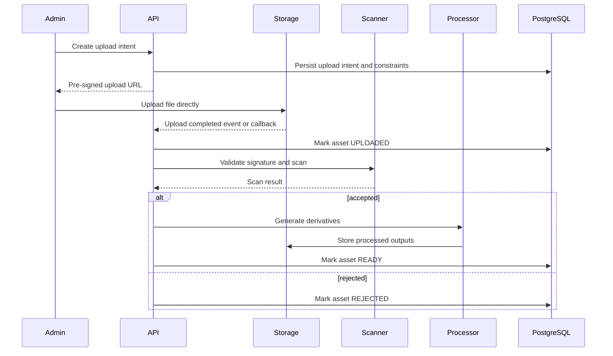

# ADR-0008: Object Storage and CDN Strategy

- **Status:** Accepted
- **Date:** 2026-07-14
- **Decision owners:** Architecture, Backend, DevOps
- **Last reviewed:** 2026-07-15

## Context

Audio files, illustrations, cover images, subtitles, transcripts, and generated derivatives are too large and too static to be stored efficiently in PostgreSQL or served directly by application instances. The platform also needs upload validation, private premium assets, expiring access, rollback-safe versioning, cost control, and a migration path from local development to managed cloud infrastructure.

Media delivery must remain reliable even when backend instances scale horizontally. Application servers must not become a bandwidth bottleneck or a source of memory pressure by proxying large media files.

## Decision

Use S3-compatible object storage as the authoritative binary store and a CDN as the primary media-delivery layer.

- MinIO is used for local development and integration tests.
- Production uses a managed S3-compatible object store.
- PostgreSQL stores metadata, ownership, checksums, lifecycle state, and object keys, not binary content.
- Uploads use pre-signed URLs after the backend creates an upload intent and validates file policy.
- Download and streaming access uses CDN-signed URLs, signed cookies, or short-lived pre-signed URLs according to asset sensitivity.
- Original uploads and processed derivatives are stored separately.
- Object keys are immutable and versioned; replacing content creates a new object.
- Private assets are never exposed through public bucket permissions.
- Application instances do not proxy media during normal operation.

## Scope

This decision applies to:

- story audio;
- cover images and illustrations;
- transcripts and synchronized text files;
- generated thumbnails and optimized image variants;
- processed audio derivatives;
- temporary upload objects;
- downloadable offline packages and manifests;
- administrative export artifacts where object storage is appropriate.

It does not apply to transactional metadata, user state, playback progress, audit records, or other relational data owned by PostgreSQL.

## Bucket and Prefix Strategy

Recommended logical separation:

```text
media-source-private
media-processed-private
media-public
media-quarantine
media-temporary
exports-private
```

Physical buckets may be consolidated by environment where the provider or cost model requires it, but access policies and lifecycle rules must remain independently enforceable.

Object layout:

```text
<environment>/<asset-type>/<entity-id>/<asset-id>/<version>/<filename>
```

Examples:

```text
prod/audio/episode-123/asset-456/v3/master.m4a
prod/image/story-123/asset-778/v2/cover.webp
prod/transcript/episode-123/asset-991/v1/transcript.json
```

Object keys must not contain personal data, email addresses, child names, access tokens, or other sensitive values.

## Asset State Model

A media asset follows an explicit lifecycle:

```text
CREATED -> UPLOAD_PENDING -> UPLOADED -> QUARANTINED -> PROCESSING -> READY
                                                        |             |
                                                        v             v
                                                     REJECTED      DEPRECATED
                                                                      |
                                                                      v
                                                                   DELETED
```

Only `READY` assets may be linked to published content.

State transitions are persisted in PostgreSQL and produce audit and domain events where required.

## Upload Pipeline



## Upload Intent Rules

Every upload intent includes:

- asset type;
- expected content type;
- maximum size;
- target object key;
- expiry time;
- uploader identity;
- expected checksum where available;
- owning story, episode, or content entity;
- environment and bucket;
- correlation ID.

Upload URLs must be scoped to one object key and one HTTP operation.

## Validation and Processing

The platform must validate:

- actual file signature, not only declared MIME type;
- allowed extension and codec;
- file size;
- duration and bitrate for audio;
- image dimensions and pixel count;
- checksum;
- malware scan result;
- decompression or archive risk where applicable;
- metadata consistency;
- duplicate asset policy.

Processing workers may generate:

- optimized audio renditions;
- normalized loudness versions;
- thumbnails;
- WebP or AVIF image variants;
- waveform or duration metadata;
- synchronized-text derivatives;
- offline download packages.

Workers must be idempotent and safe under message redelivery.

## Delivery Strategy

### Public or broadly cacheable content

Public-safe assets may use long-lived CDN caching with immutable versioned URLs.

### Premium or restricted content

Restricted assets use one of:

- short-lived signed CDN URLs;
- signed cookies scoped to a path and expiry;
- short-lived pre-signed object-store URLs when CDN signing is unavailable.

The backend verifies publication state, account ownership, child-profile scope, regional availability, and entitlement before issuing access.

### Cache behavior

- Immutable asset URLs may use long cache lifetimes.
- Replacing content creates a new versioned key rather than overwriting the object.
- CDN invalidation is reserved for emergency removal or policy violations.
- Signed URLs must never be logged.
- Client caches must respect entitlement and expiry metadata.

## Offline Downloads

Offline downloads use a server-issued manifest containing:

- asset IDs and object versions;
- checksums;
- expected sizes;
- expiry and entitlement metadata;
- content version;
- revocation information;
- encryption or packaging metadata where applicable.

The client verifies checksums before marking a download complete. Partial downloads must be resumable. Revoked or expired content becomes unavailable according to the offline synchronization policy.

## Security Rules

- Never trust MIME type supplied by the client.
- Validate file signatures, extension, size, duration, dimensions, and codec.
- Scan uploaded files before publication.
- Keep source and premium buckets private.
- Public access is granted through CDN policy, not bucket-wide permissions.
- Pre-signed URLs are short-lived and scoped.
- Bucket credentials are stored in a secret manager.
- Storage access follows least privilege.
- Production buckets must block anonymous writes.
- Server-side encryption is mandatory in production.
- TLS is required for all storage and CDN traffic.
- Object keys must not reveal sensitive domain data.
- Upload, validation, publication, access issuance, and deletion are auditable.

## Data Integrity

PostgreSQL remains authoritative for asset metadata and lifecycle state.

The object store remains authoritative for binary bytes.

Consistency is maintained through:

- checksums;
- immutable object keys;
- transactional outbox events;
- reconciliation jobs;
- orphan detection;
- missing-object detection;
- idempotent deletion.

A database row must never be marked `READY` before all required objects are confirmed present and validated.

## Lifecycle and Retention

- Failed or abandoned uploads are removed automatically.
- Quarantined objects have short retention unless required for investigation.
- Superseded derivatives may be retained for rollback for a defined period.
- Source assets follow editorial and legal retention rules.
- Hard deletion follows privacy, contractual, and legal requirements.
- Object deletion is asynchronous after database state is committed.
- Deletion failures are retried and surfaced operationally.
- CDN cache invalidation is triggered when immediate removal is required.

## Resilience

If object storage is unavailable:

- new uploads fail safely;
- publication requiring missing assets is blocked;
- existing CDN-cached playback may continue;
- workers retry with bounded backoff;
- asset state remains unchanged until confirmation.

If the CDN is unavailable:

- the client may retry with bounded backoff;
- already downloaded content remains playable;
- fallback to direct object-store URLs is allowed only when explicitly configured and security-equivalent.

## Observability

Required metrics include:

- upload intents created and expired;
- upload success and failure rate;
- scan duration and rejection rate;
- processing queue depth and duration;
- derivative-generation failures;
- signed-URL generation failures;
- CDN hit ratio;
- origin egress volume;
- missing-object and orphan-object counts;
- deletion backlog;
- storage cost by asset class where available.

Logs include asset ID, object key hash or safe identifier, operation, outcome, duration, correlation ID, and error code. Signed URLs and credentials are never logged.

## Cost and Capacity Controls

- Prefer optimized media formats and sizes.
- Use lifecycle rules for temporary and obsolete objects.
- Track storage growth and CDN egress.
- Avoid unnecessary duplicate derivatives.
- Use CDN caching to minimize origin reads.
- Require explicit approval for new high-cost asset classes.

## Testing

Required tests include:

- pre-signed upload URL generation;
- upload authorization scope;
- invalid file signature rejection;
- checksum mismatch handling;
- malware rejection;
- processing idempotency;
- missing-object recovery;
- signed-delivery authorization;
- expired URL behavior;
- lifecycle cleanup;
- MinIO integration tests through Testcontainers or equivalent;
- production-provider contract tests in a safe environment.

## Migration and Provider Portability

Application code depends on an internal storage port, not a provider SDK outside the infrastructure adapter.

Provider migration requires:

1. copying objects while preserving checksums and keys;
2. validating metadata and object counts;
3. switching new writes;
4. switching CDN origin;
5. monitoring reads and errors;
6. removing the old provider only after the rollback window.

## Consequences

### Positive

- Application instances remain stateless and lightweight.
- Media delivery scales independently from backend APIs.
- Local and production environments use compatible APIs.
- Immutable versioning simplifies cache behavior and rollback.
- Provider portability is preserved through S3-compatible interfaces and internal ports.

### Negative

- Requires asynchronous processing and orphan cleanup.
- CDN invalidation and signed URL policies add operational complexity.
- Storage, processing, and egress costs require monitoring.
- Eventual consistency exists between database metadata and object lifecycle operations.

## Rejected Alternatives

- **Store binaries in PostgreSQL:** poor fit for large streaming assets and backup growth.
- **Store media on application disks:** not durable or horizontally scalable.
- **Make every bucket public:** incompatible with premium content protection.
- **Proxy all media through the backend:** creates bandwidth, memory, and scaling bottlenecks.
- **Overwrite objects in place:** weakens rollback, cache correctness, and auditability.

## Follow-up Actions

- Define storage adapter interfaces.
- Add upload-intent persistence and expiry cleanup.
- Define media lifecycle states in `Database_Design.md`.
- Document signed-delivery APIs in `API_Specification.md`.
- Add media events to `Event_Catalog.md`.
- Add storage and CDN dashboards to `Logging_Monitoring.md`.
- Validate lifecycle and retention policies before production launch.
