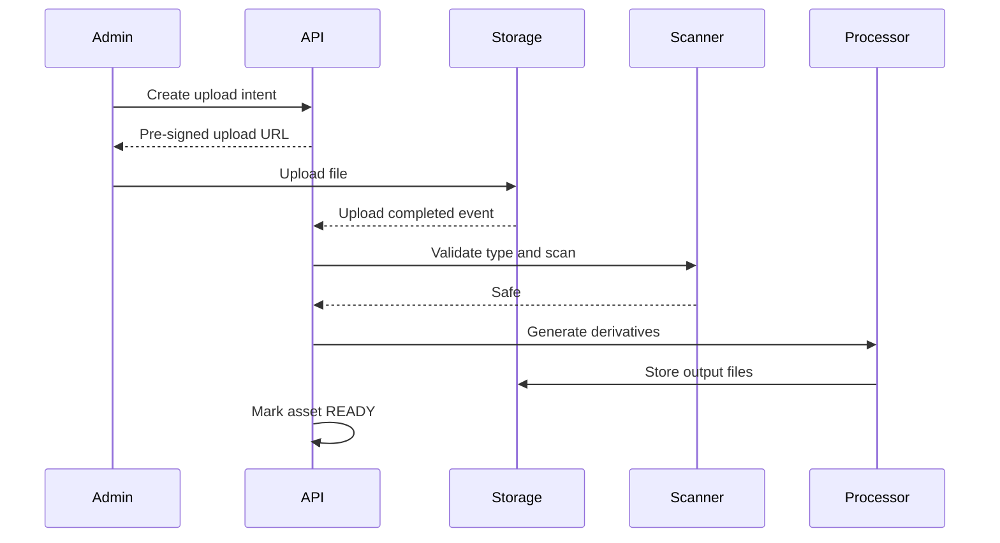

# ADR-0008: Object Storage and CDN Strategy

- **Status:** Accepted
- **Date:** 2026-07-14
- **Decision owners:** Architecture, Backend, DevOps

## Context

Audio files, illustrations, cover images, subtitles, transcripts, and generated derivatives are too large and too static to be stored efficiently in PostgreSQL or served directly by application instances. The platform also needs upload validation, private premium assets, expiring access, and future migration from local development to cloud infrastructure.

## Decision

Use S3-compatible object storage for media assets and a CDN for public or authorized delivery.

- MinIO is used for local development and integration tests.
- Production uses an S3-compatible managed object store.
- PostgreSQL stores metadata, ownership, checksums, lifecycle state, and object keys, not binary content.
- Uploads use pre-signed URLs after the backend creates an upload intent and validates file policy.
- Download and streaming access uses either CDN-signed URLs or short-lived pre-signed URLs.
- Original uploads and processed derivatives are stored separately.
- Object keys are immutable and versioned; replacing content creates a new object.

## Object Layout

```text
<environment>/<asset-type>/<entity-id>/<asset-id>/<version>/<filename>
```

Examples:

```text
prod/audio/episode-123/asset-456/v3/master.m4a
prod/image/story-123/asset-778/v2/cover.webp
```

## Upload Pipeline



## Security Rules

- Never trust MIME type supplied by the client.
- Validate file signatures, extension, size, duration, dimensions, and codec.
- Scan uploaded files before publication.
- Keep private buckets private; public access is granted through CDN policies, not bucket-wide permissions.
- Pre-signed URLs are short-lived and scoped to one object and operation.
- Log upload intent, completion, validation result, publication, and deletion.

## Lifecycle

- Failed or abandoned uploads are removed automatically.
- Superseded derivatives may be retained for rollback for a defined period.
- Hard deletion follows retention and legal requirements.
- Object deletion is performed asynchronously after the database state is committed.

## Consequences

### Positive

- Application instances remain stateless and lightweight.
- Media delivery scales independently from backend APIs.
- Local and production environments use compatible APIs.

### Negative

- Requires asynchronous processing and orphan cleanup.
- CDN invalidation and signed URL policies add operational complexity.

## Rejected Alternatives

- Store binaries in PostgreSQL: poor fit for large streaming assets.
- Store media on application disks: not durable or horizontally scalable.
- Make every bucket public: incompatible with premium content protection.
