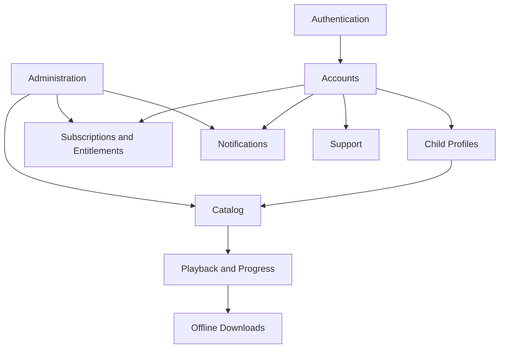

# API Specification

Version: 1.1.0  
Status: Draft for implementation  
Owner: Platform Architecture  
Last updated: 2026-07-14

## 1. Purpose

This document defines the HTTP API contract for KidsAudioBookPlatform. It is the authoritative implementation reference for the Flutter mobile application, the administrative dashboard, backend services, automated tests, and future integrations.

The API is designed for a child-safe mobile product in which a parent owns the account, manages child profiles, controls purchases and settings, while children consume curated audio stories through a simplified experience.

The specification establishes:

- resource naming and versioning;
- authentication and authorization rules;
- request and response conventions;
- validation and error contracts;
- pagination, filtering, sorting, and idempotency;
- APIs for accounts, profiles, catalogue, playback, downloads, subscriptions, notifications, and administration;
- media delivery rules;
- compatibility and deprecation policies;
- observability and security requirements.

The generated OpenAPI definition must remain consistent with this document. A mismatch between implementation and documentation blocks release.

## 2. Scope

### 2.1 Included

The first public version covers:

- parent registration, login, verification, refresh, logout, and password recovery;
- parent account and preference management;
- child profile creation and management;
- Parent Zone verification and sensitive-action protection;
- public and authenticated catalogue browsing;
- stories, series, episodes, categories, collections, narrators, and age recommendations;
- favourites, listening progress, history, and continue-listening;
- playback authorization and signed media URLs;
- offline download grants and synchronization;
- ambient sound catalogue and preferences;
- plans, trials, purchases, subscriptions, and entitlement status;
- in-app notifications and device registration;
- contact and support requests;
- administrative content, user, subscription, campaign, and audit APIs.

### 2.2 Excluded from v1

- public author self-service APIs;
- social features, messaging, public comments, and child-to-child interaction;
- user-generated story uploads;
- public third-party API access;
- direct payment-card processing by the platform backend;
- real-time voice interaction;
- public advertising-provider callbacks.

## 3. API Style

The platform exposes JSON-based REST APIs over HTTPS.

Production base URL:

```text
https://api.example.com/api/v1
```

Local development:

```text
http://localhost:8080/api/v1
```

Administrative APIs:

```text
/api/v1/admin
```

Internal service APIs:

```text
/internal/v1
```

Rules:

1. Resources use plural nouns.
2. HTTP methods express intent.
3. Request and response bodies use JSON unless documented otherwise.
4. Dates and timestamps use ISO 8601.
5. Public identifiers are UUID strings.
6. Monetary values use integer minor units plus ISO currency codes.
7. Breaking changes require a new major API version.
8. Non-CRUD business actions use explicit action subresources.
9. Business rules are always enforced server-side.
10. Child-facing responses expose only information needed by the child experience.

## 4. Transport and Headers

### 4.1 Request headers

| Header | Required | Description |
|---|---:|---|
| `Authorization` | Conditional | Bearer access token for protected endpoints. |
| `Content-Type` | For bodies | `application/json` unless uploading media. |
| `Accept` | Recommended | `application/json`. |
| `Accept-Language` | Recommended | Preferred locale such as `ro-RO`. |
| `X-Correlation-Id` | Optional | Client-generated UUID. Server generates one when absent. |
| `X-Device-Id` | Mobile | Stable app-installation identifier. |
| `Idempotency-Key` | Selected writes | Retry-safe operation key. |
| `If-None-Match` | Optional | Conditional GET. |
| `If-Match` | Selected updates | Optimistic concurrency. |
| `X-Parent-Zone-Proof` | Sensitive actions | Short-lived proof of parent verification. |

### 4.2 Response headers

| Header | Description |
|---|---|
| `X-Correlation-Id` | Correlation identifier propagated through logs and events. |
| `ETag` | Resource or representation version. |
| `Cache-Control` | Explicit caching policy. |
| `Location` | URI of a newly created resource. |
| `Retry-After` | Delay before retrying a limited or unavailable operation. |
| `Deprecation` | Indicates a deprecated endpoint. |
| `Sunset` | Planned removal date. |

The backend must not expose framework, database, infrastructure, or stack-trace information.

## 5. Authentication and Session Model

### 5.1 Access and refresh tokens

The platform uses short-lived JWT access tokens and rotating refresh tokens.

Recommended defaults:

- access token lifetime: 15 minutes;
- refresh token lifetime: 30 days;
- refresh token rotation on every use;
- device-scoped sessions;
- session revocation on logout, password change, suspicious activity, or account disablement;
- refresh tokens stored as secure hashes only.

Minimal access-token claims:

```json
{
  "sub": "f4db7bc7-9613-4d26-aa22-541520544f67",
  "sessionId": "ea3975ff-719b-4c8c-bc73-7388a992db58",
  "roles": ["PARENT"],
  "entitlementsVersion": 8,
  "iat": 1784058000,
  "exp": 1784058900,
  "iss": "kids-audio-book-platform",
  "aud": "kids-audio-book-mobile"
}
```

Child profiles are not authentication principals. The authenticated parent session supplies a profile context and the backend verifies ownership.

### 5.2 Roles

- `PARENT`
- `SUPPORT_AGENT`
- `CONTENT_EDITOR`
- `CONTENT_REVIEWER`
- `BILLING_ADMIN`
- `ADMIN`
- `SUPER_ADMIN`

Administrative endpoints require explicit role and permission checks. UI visibility is not authorization.

### 5.3 Parent Zone proof

Sensitive actions require a recently verified Parent Zone proof.

Examples:

- changing PIN;
- deleting a child profile;
- changing age restrictions;
- viewing sensitive account data;
- initiating account deletion;
- changing subscription-sensitive settings.

Recommended proof lifetime: 5 minutes.

## 6. Authorization Model

Every protected request must validate:

1. access token;
2. session status;
3. account status;
4. role and permission requirements;
5. resource ownership;
6. child profile association;
7. subscription entitlement;
8. Parent Zone proof where required;
9. content availability and regional restrictions;
10. request-specific business rules.

Ownership is always derived from the authenticated principal, never from a trusted client-supplied account ID.

## 7. JSON Conventions

### 7.1 Naming

JSON uses `camelCase`.

### 7.2 Null and absent values

- Omit optional response properties when not applicable.
- Use `null` only when explicit unknown differs from absence.
- PATCH operations must distinguish omitted values from explicit clearing.

### 7.3 Date and time

```text
2026-07-14T18:25:43.511Z
2026-07-14
```

Server timestamps are UTC. User timezone is a separate IANA identifier.

### 7.4 Money

```json
{
  "amountMinor": 2999,
  "currency": "RON"
}
```

Floating-point money is prohibited.

## 8. Response Envelopes

Single-resource endpoints return the resource directly.

Paginated collections:

```json
{
  "items": [],
  "page": {
    "number": 0,
    "size": 20,
    "totalElements": 0,
    "totalPages": 0,
    "hasNext": false
  }
}
```

Cursor-based feeds:

```json
{
  "items": [],
  "nextCursor": null,
  "hasNext": false
}
```

## 9. Error Contract

Errors use a stable Problem Details-inspired contract.

```json
{
  "type": "https://api.example.com/problems/validation-error",
  "title": "Request validation failed",
  "status": 400,
  "code": "VALIDATION_ERROR",
  "detail": "One or more request fields are invalid.",
  "instance": "/api/v1/child-profiles",
  "correlationId": "87e83f1f-4e73-49bd-99b4-9f21ed0e78fa",
  "timestamp": "2026-07-14T18:25:43.511Z",
  "fieldErrors": [
    {
      "field": "displayName",
      "code": "SIZE_OUT_OF_RANGE",
      "message": "Display name must contain between 1 and 40 characters."
    }
  ]
}
```

Standard HTTP mappings:

| HTTP | Code | Meaning |
|---:|---|---|
| 400 | `VALIDATION_ERROR` | Invalid request fields. |
| 400 | `BUSINESS_RULE_VIOLATION` | Valid syntax, invalid domain action. |
| 401 | `AUTHENTICATION_REQUIRED` | Missing or invalid authentication. |
| 401 | `SESSION_EXPIRED` | Session no longer valid. |
| 403 | `ACCESS_DENIED` | Permission missing. |
| 403 | `PARENT_ZONE_REQUIRED` | Recent parent verification required. |
| 403 | `ENTITLEMENT_REQUIRED` | Premium or feature entitlement missing. |
| 404 | `RESOURCE_NOT_FOUND` | Resource absent or not visible. |
| 409 | `RESOURCE_CONFLICT` | Conflicting state. |
| 409 | `VERSION_CONFLICT` | Optimistic-lock conflict. |
| 410 | `RESOURCE_GONE` | Intentionally removed resource. |
| 413 | `PAYLOAD_TOO_LARGE` | Request exceeds limits. |
| 415 | `UNSUPPORTED_MEDIA_TYPE` | Unsupported content type. |
| 422 | `CONTENT_NOT_PROCESSABLE` | Format valid, content rejected. |
| 429 | `RATE_LIMIT_EXCEEDED` | Rate exceeded. |
| 500 | `INTERNAL_ERROR` | Unexpected internal error. |
| 503 | `SERVICE_UNAVAILABLE` | Temporary outage. |

## 10. Pagination, Filtering, and Sorting

Default page size: 20. Maximum page size: 100.

```text
GET /stories?page=0&size=20&sort=publishedAt,desc
```

Rules:

- allow-list sortable fields;
- return `400` for invalid sort fields;
- use repeated query parameters for multi-value filters;
- use cursor pagination for notifications, history, and high-volume feeds;
- ensure stable secondary ordering by `id`.

## 11. Idempotency

`Idempotency-Key` is required for retry-sensitive operations including:

- purchase verification;
- store event application;
- download grant creation;
- support request submission;
- administrative publication actions;
- bulk campaign execution.

The backend stores the key, request fingerprint, result, and expiry. Reusing a key with a different payload returns `409 IDEMPOTENCY_KEY_REUSED`.

## 12. Rate Limiting

Rate limits are applied by client, session, account, IP, and endpoint sensitivity.

Recommended baseline:

| Endpoint group | Baseline |
|---|---:|
| Login | 10 attempts / 15 minutes / account+IP |
| Password reset | 5 / hour / account |
| Parent PIN verify | 5 / 15 minutes / session |
| Catalogue reads | 300 / minute / session |
| Progress updates | 120 / minute / profile |
| Admin writes | 60 / minute / administrator |

Rate-limit responses include `Retry-After`.

## 13. API Resource Overview



# Part I — Identity and Account APIs

## 14. Registration

### `POST /auth/register`

Creates a parent account.

Request:

```json
{
  "email": "parent@example.com",
  "password": "Correct-Horse-Battery-Staple-42",
  "preferredLocale": "ro-RO",
  "timezone": "Europe/Bucharest",
  "termsVersion": "2026-01",
  "privacyVersion": "2026-01"
}
```

Validation:

- valid normalized email;
- password policy enforced server-side;
- accepted legal-document versions must be current;
- locale and timezone must be supported.

Response `201`:

```json
{
  "accountId": "0e17e962-9fd5-4b0a-88fa-77ec9145d91b",
  "status": "PENDING_VERIFICATION",
  "verificationRequired": true
}
```

Errors:

- `409 ACCOUNT_EMAIL_ALREADY_EXISTS`
- `400 PASSWORD_POLICY_VIOLATION`
- `400 LEGAL_VERSION_OUTDATED`

## 15. Email Verification

### `POST /auth/email-verification/confirm`

```json
{
  "token": "opaque-verification-token"
}
```

Response `204`.

Token reuse returns `409 VERIFICATION_TOKEN_ALREADY_USED`.

### `POST /auth/email-verification/resend`

```json
{
  "email": "parent@example.com"
}
```

Always returns `202` to avoid account enumeration.

## 16. Login

### `POST /auth/login`

```json
{
  "email": "parent@example.com",
  "password": "Correct-Horse-Battery-Staple-42",
  "device": {
    "deviceId": "app-installation-id",
    "platform": "IOS",
    "appVersion": "1.0.0"
  }
}
```

Response `200`:

```json
{
  "accessToken": "jwt",
  "accessTokenExpiresInSeconds": 900,
  "refreshToken": "opaque-refresh-token",
  "refreshTokenExpiresInSeconds": 2592000,
  "sessionId": "ea3975ff-719b-4c8c-bc73-7388a992db58",
  "account": {
    "id": "f4db7bc7-9613-4d26-aa22-541520544f67",
    "email": "parent@example.com",
    "preferredLocale": "ro-RO"
  }
}
```

Errors:

- `401 INVALID_CREDENTIALS`
- `403 ACCOUNT_NOT_VERIFIED`
- `423 ACCOUNT_LOCKED`

## 17. Refresh and Logout

### `POST /auth/refresh`

```json
{
  "refreshToken": "opaque-refresh-token",
  "deviceId": "app-installation-id"
}
```

Returns a new access token and rotated refresh token.

### `POST /auth/logout`

Revokes the current session. Returns `204`.

### `POST /auth/logout-all`

Requires Parent Zone proof. Revokes all account sessions. Returns `204`.

## 18. Password Recovery

### `POST /auth/password-reset/request`

```json
{
  "email": "parent@example.com"
}
```

Always returns `202`.

### `POST /auth/password-reset/confirm`

```json
{
  "token": "opaque-reset-token",
  "newPassword": "New-Secure-Password-42"
}
```

Successful reset revokes existing sessions.

## 19. Session Management

### `GET /sessions`

Returns active account sessions.

### `DELETE /sessions/{sessionId}`

Requires Parent Zone proof. Revokes one session.

## 20. Account API

### `GET /me`

Response:

```json
{
  "id": "f4db7bc7-9613-4d26-aa22-541520544f67",
  "email": "parent@example.com",
  "emailVerified": true,
  "preferredLocale": "ro-RO",
  "timezone": "Europe/Bucharest",
  "status": "ACTIVE",
  "createdAt": "2026-07-14T18:25:43Z"
}
```

### `PATCH /me`

```json
{
  "preferredLocale": "en-GB",
  "timezone": "Europe/London"
}
```

### `POST /me/deletion-request`

Requires Parent Zone proof and idempotency key.

### `POST /me/deletion-request/cancel`

Cancels deletion while the grace period remains open.

# Part II — Parent Zone and Profile APIs

## 21. Parent Zone Verification

### `POST /parent-zone/verify`

```json
{
  "pin": "4821"
}
```

Response:

```json
{
  "proof": "opaque-parent-zone-proof",
  "expiresAt": "2026-07-14T18:30:43Z"
}
```

Errors:

- `401 PARENT_PIN_INVALID`
- `423 PARENT_PIN_LOCKED`

### `PUT /parent-zone/pin`

Requires existing Parent Zone proof.

```json
{
  "newPin": "4821"
}
```

### `DELETE /parent-zone/pin`

Requires Parent Zone proof and account password re-authentication.

## 22. Child Profiles

### `GET /child-profiles`

Returns profiles owned by the authenticated account.

### `POST /child-profiles`

```json
{
  "displayName": "Mara",
  "birthYear": 2022,
  "ageBand": "AGE_3_4",
  "avatarKey": "rabbit-lavender",
  "preferredLanguage": "ro"
}
```

Response `201`:

```json
{
  "id": "3afcbf30-5974-4c86-89dc-c1ccf8bf8da9",
  "displayName": "Mara",
  "ageBand": "AGE_3_4",
  "avatarKey": "rabbit-lavender",
  "preferredLanguage": "ro",
  "isDefault": false,
  "createdAt": "2026-07-14T18:25:43Z",
  "version": 0
}
```

Errors:

- `409 PROFILE_LIMIT_REACHED`
- `400 INVALID_AGE_BAND`

### `GET /child-profiles/{profileId}`

Returns profile details.

### `PATCH /child-profiles/{profileId}`

Uses `If-Match` with profile version.

### `DELETE /child-profiles/{profileId}`

Requires Parent Zone proof. Deletion may be soft and asynchronous.

### `POST /child-profiles/{profileId}/select`

Marks the active profile for the current device session.

Response:

```json
{
  "profileId": "3afcbf30-5974-4c86-89dc-c1ccf8bf8da9",
  "selectedAt": "2026-07-14T18:25:43Z"
}
```

## 23. Profile Preferences

### `GET /child-profiles/{profileId}/preferences`

### `PUT /child-profiles/{profileId}/preferences`

```json
{
  "textDisplayEnabled": true,
  "textHighlightEnabled": true,
  "autoplayNextEnabled": false,
  "ambientSoundEnabled": true,
  "ambientSoundType": "RAIN",
  "ambientSoundVolume": 30,
  "storyVolume": 80,
  "sleepTimerMinutes": 30,
  "contentLanguage": "ro"
}
```

### `GET /child-profiles/{profileId}/parental-settings`

Requires Parent Zone proof.

### `PUT /child-profiles/{profileId}/parental-settings`

Requires Parent Zone proof.

```json
{
  "maximumAgeRating": 7,
  "allowAutoplay": true,
  "allowDownloads": true,
  "allowMarketingContent": false,
  "bedtimeStart": "20:30",
  "bedtimeEnd": "07:00",
  "dailyListeningLimitMinutes": 90
}
```

# Part III — Catalogue APIs

## 24. Home Feed

### `GET /child-profiles/{profileId}/home`

Returns a profile-scoped, child-safe home payload.

Query parameters:

- `locale`
- `timeOfDay`
- `limitPerSection`

Response:

```json
{
  "greeting": "Povestea de aseară te așteaptă",
  "continueListening": [],
  "sections": [
    {
      "id": "bedtime",
      "title": "Povești de seară",
      "layout": "HORIZONTAL_CARDS",
      "items": []
    }
  ],
  "backgroundTheme": "EVENING"
}
```

The endpoint must not expose draft content, admin metadata, or unavailable premium assets.

## 25. Stories

### `GET /stories`

Supported filters:

- `profileId`
- `categoryId`
- `seriesId`
- `language`
- `accessTier`
- `ageMin`
- `ageMax`
- `durationMaxSeconds`
- `search`
- `page`, `size`, `sort`

### `GET /stories/{storyId}`

Response:

```json
{
  "id": "f2a4d57e-2937-482f-9b96-e2ad193ab76b",
  "title": "Iepurașul și luna",
  "description": "O poveste liniștită pentru seară.",
  "accessTier": "FREE",
  "recommendedAgeMin": 3,
  "recommendedAgeMax": 6,
  "durationSeconds": 720,
  "coverImage": {
    "url": "https://cdn.example.com/...",
    "width": 1024,
    "height": 1024
  },
  "series": null,
  "episodes": [],
  "isFavourite": false,
  "progress": {
    "positionSeconds": 125,
    "completed": false
  }
}
```

### `GET /stories/{storyId}/related`

Returns profile-safe recommendations.

## 26. Series and Episodes

### `GET /series`

### `GET /series/{seriesId}`

### `GET /series/{seriesId}/episodes`

### `GET /episodes/{episodeId}`

Episode responses include sequence number, story context, access tier, and progress.

## 27. Categories and Collections

### `GET /categories`

### `GET /categories/{categoryId}`

### `GET /collections`

### `GET /collections/{collectionId}`

Collection membership is editorial and ordered.

## 28. Search

### `GET /search`

Query parameters:

- `q` required, minimum 2 characters;
- `profileId` required for child-safe filtering;
- `types=STORY,SERIES`;
- `language`;
- cursor or page parameters.

Search results must respect publication state, profile age restrictions, locale, and entitlement metadata.

## 29. Ambient Sounds

### `GET /ambient-sounds`

Returns available sound metadata and premium eligibility.

```json
{
  "items": [
    {
      "id": "rain-soft",
      "name": "Ploaie liniștită",
      "category": "RAIN",
      "accessTier": "FREE",
      "previewUrl": "https://cdn.example.com/..."
    }
  ]
}
```

# Part IV — Playback and Progress APIs

## 30. Playback Authorization

### `POST /playback/sessions`

Creates a playback session and validates access.

```json
{
  "profileId": "3afcbf30-5974-4c86-89dc-c1ccf8bf8da9",
  "contentType": "STORY",
  "contentId": "f2a4d57e-2937-482f-9b96-e2ad193ab76b",
  "deviceId": "app-installation-id"
}
```

Response:

```json
{
  "sessionId": "ce53126b-aec6-44a9-a3cf-a2d75388cbed",
  "contentId": "f2a4d57e-2937-482f-9b96-e2ad193ab76b",
  "media": {
    "audioUrl": "https://cdn.example.com/signed/...",
    "audioUrlExpiresAt": "2026-07-14T19:25:43Z",
    "textTrackUrl": "https://cdn.example.com/signed/...",
    "illustrationManifestUrl": "https://cdn.example.com/signed/..."
  },
  "resumePositionSeconds": 125,
  "advertisingDecision": {
    "eligibleAfterSession": false,
    "decisionToken": null
  }
}
```

Errors:

- `403 ENTITLEMENT_REQUIRED`
- `403 CONTENT_BLOCKED_BY_PARENTAL_SETTINGS`
- `404 CONTENT_NOT_AVAILABLE`

## 31. Progress Updates

### `PUT /playback/sessions/{sessionId}/progress`

```json
{
  "positionSeconds": 180,
  "durationSeconds": 720,
  "clientUpdatedAt": "2026-07-14T18:28:43Z",
  "sequenceNumber": 7
}
```

Rules:

- idempotent by `sessionId + sequenceNumber`;
- later sequence numbers supersede earlier updates;
- stale offline updates cannot move progress backwards unless explicitly allowed by merge rules;
- completion threshold is server-controlled.

### `POST /playback/sessions/{sessionId}/complete`

Marks the session complete and returns any post-session ad decision.

### `POST /playback/sessions/{sessionId}/stop`

Closes an incomplete session.

## 32. Continue Listening and History

### `GET /child-profiles/{profileId}/continue-listening`

### `GET /child-profiles/{profileId}/history`

History uses cursor pagination.

### `DELETE /child-profiles/{profileId}/history/{entryId}`

Requires Parent Zone proof if product policy treats history as parent-managed.

## 33. Favourites

### `PUT /child-profiles/{profileId}/favourites/{storyId}`

Idempotently adds a favourite.

### `DELETE /child-profiles/{profileId}/favourites/{storyId}`

Idempotently removes it.

### `GET /child-profiles/{profileId}/favourites`

# Part V — Offline Download APIs

## 34. Download Grant

### `POST /downloads/grants`

Requires premium entitlement and idempotency key.

```json
{
  "profileId": "3afcbf30-5974-4c86-89dc-c1ccf8bf8da9",
  "contentType": "STORY",
  "contentId": "f2a4d57e-2937-482f-9b96-e2ad193ab76b",
  "deviceId": "app-installation-id"
}
```

Response:

```json
{
  "grantId": "c730f9fb-a59d-4d5a-a09c-a0f22adfa5c1",
  "expiresAt": "2026-08-14T18:25:43Z",
  "manifest": {
    "version": 3,
    "checksumAlgorithm": "SHA-256",
    "assets": [
      {
        "type": "AUDIO",
        "url": "https://cdn.example.com/signed/...",
        "checksum": "...",
        "sizeBytes": 12345678
      }
    ]
  }
}
```

### `POST /downloads/{grantId}/confirm`

Confirms successful local download.

### `GET /downloads`

Lists active grants for the current device.

### `DELETE /downloads/{grantId}`

Revokes the grant and removes server-side registration.

## 35. Offline Synchronization

### `POST /sync/offline`

Accepts batched local changes.

```json
{
  "deviceId": "app-installation-id",
  "profileId": "3afcbf30-5974-4c86-89dc-c1ccf8bf8da9",
  "changes": [
    {
      "changeId": "local-uuid",
      "type": "PROGRESS_UPDATED",
      "occurredAt": "2026-07-13T21:00:00Z",
      "payload": {
        "contentId": "f2a4d57e-2937-482f-9b96-e2ad193ab76b",
        "positionSeconds": 310,
        "sequenceNumber": 12
      }
    }
  ]
}
```

Response includes per-change status and current server state.

# Part VI — Subscription and Billing APIs

## 36. Plans

### `GET /subscription-plans`

Returns active plans localized for the client.

```json
{
  "items": [
    {
      "id": "premium-monthly",
      "billingPeriod": "MONTHLY",
      "storeProductId": "kids.premium.monthly",
      "displayPrice": "29,99 RON",
      "trialDays": 3,
      "features": ["OFFLINE_DOWNLOADS", "MULTIPLE_PROFILES", "NO_ADS"]
    }
  ]
}
```

The backend does not invent store prices; display price may be client/store-supplied and verified where supported.

## 37. Entitlement Status

### `GET /me/entitlements`

```json
{
  "plan": "PREMIUM",
  "status": "ACTIVE",
  "trial": false,
  "expiresAt": "2026-08-14T18:25:43Z",
  "features": {
    "offlineDownloads": true,
    "multipleProfiles": true,
    "adsDisabled": true
  },
  "version": 8
}
```

## 38. Purchase Verification

### `POST /purchases/verify`

Requires idempotency key.

```json
{
  "provider": "APPLE_APP_STORE",
  "productId": "kids.premium.monthly",
  "transactionReference": "opaque-provider-reference",
  "receipt": "opaque-provider-payload"
}
```

Response:

```json
{
  "verificationStatus": "VERIFIED",
  "subscriptionStatus": "ACTIVE",
  "entitlements": {
    "offlineDownloads": true,
    "multipleProfiles": true,
    "adsDisabled": true
  }
}
```

Errors:

- `422 PURCHASE_VERIFICATION_FAILED`
- `409 PURCHASE_ALREADY_LINKED`

## 39. Subscription Management

### `GET /me/subscription`

### `POST /me/subscription/restore`

### `POST /me/subscription/reconcile`

Cancellation is typically handled by the app store; the API exposes provider guidance rather than pretending to cancel externally managed subscriptions.

# Part VII — Advertising APIs

## 40. Advertising Decision

### `POST /advertising/decisions`

```json
{
  "profileId": "3afcbf30-5974-4c86-89dc-c1ccf8bf8da9",
  "trigger": "SESSION_COMPLETED",
  "playbackSessionId": "ce53126b-aec6-44a9-a3cf-a2d75388cbed"
}
```

Response:

```json
{
  "eligible": true,
  "placement": "POST_SESSION",
  "maximumDurationSeconds": 15,
  "decisionToken": "opaque-decision-token",
  "expiresAt": "2026-07-14T18:35:43Z"
}
```

Premium users always receive `eligible=false`.

### `POST /advertising/decisions/{decisionToken}/result`

Records whether an ad was shown, skipped, unavailable, or failed.

# Part VIII — Notifications and Device APIs

## 41. Device Registration

### `PUT /devices/{deviceId}`

```json
{
  "platform": "IOS",
  "pushToken": "provider-push-token",
  "appVersion": "1.0.0",
  "locale": "ro-RO",
  "timezone": "Europe/Bucharest"
}
```

### `DELETE /devices/{deviceId}`

Removes push registration.

## 42. Notification Inbox

### `GET /notifications`

Cursor-based pagination.

Supported filters:

- `status=UNREAD`
- `category=SYSTEM,OFFER,CONTENT`

### `POST /notifications/{notificationId}/read`

### `POST /notifications/read-all`

### `DELETE /notifications/{notificationId}`

Deletion may represent dismissal rather than physical deletion.

## 43. Notification Preferences

### `GET /notification-preferences`

### `PUT /notification-preferences`

```json
{
  "pushEnabled": true,
  "emailEnabled": true,
  "newContent": true,
  "offers": false,
  "subscriptionUpdates": true,
  "quietHours": {
    "enabled": true,
    "start": "21:00",
    "end": "08:00"
  }
}
```

# Part IX — Support APIs

## 44. Contact Request

### `POST /support/requests`

Requires idempotency key.

```json
{
  "category": "TECHNICAL_ISSUE",
  "subject": "Povestea nu pornește",
  "message": "Audio playback fails after download.",
  "appVersion": "1.0.0",
  "devicePlatform": "IOS"
}
```

Response `202` with request ID.

Attachments, when supported, use a separate signed-upload flow.

# Part X — Administrative APIs

## 45. Administrative Security

All `/admin` endpoints require:

- administrative role;
- explicit permission;
- stronger session policy;
- immutable audit event for privileged writes;
- rate limiting;
- optional MFA depending on role.

## 46. Admin Stories

### `GET /admin/stories`

Filters:

- publication status;
- access tier;
- language;
- editor;
- reviewer;
- created date;
- search.

### `POST /admin/stories`

```json
{
  "slug": "iepurasul-si-luna",
  "contentType": "STANDALONE",
  "accessTier": "FREE",
  "recommendedAgeMin": 3,
  "recommendedAgeMax": 6,
  "primaryLanguage": "ro"
}
```

### `GET /admin/stories/{storyId}`

### `PATCH /admin/stories/{storyId}`

Requires `If-Match`.

### `POST /admin/stories/{storyId}/submit-review`

### `POST /admin/stories/{storyId}/approve`

Requires reviewer permission.

### `POST /admin/stories/{storyId}/reject`

```json
{
  "reason": "Audio normalization must be corrected."
}
```

### `POST /admin/stories/{storyId}/schedule-publication`

```json
{
  "publishAt": "2026-08-01T07:00:00Z"
}
```

### `POST /admin/stories/{storyId}/publish`

Idempotent administrative command.

### `POST /admin/stories/{storyId}/unpublish`

### `POST /admin/stories/{storyId}/archive`

## 47. Admin Localizations

### `PUT /admin/stories/{storyId}/localizations/{locale}`

```json
{
  "title": "Iepurașul și luna",
  "description": "O poveste liniștită pentru seară.",
  "synopsis": "..."
}
```

## 48. Admin Media Upload

### `POST /admin/media/uploads`

Creates a signed upload session.

```json
{
  "assetType": "AUDIO",
  "fileName": "story-ro.mp3",
  "contentType": "audio/mpeg",
  "sizeBytes": 12345678,
  "checksum": "sha256-value"
}
```

Response:

```json
{
  "uploadId": "b86e8ea4-494c-42d6-a1f5-a311f470494c",
  "uploadUrl": "https://storage.example.com/signed/...",
  "expiresAt": "2026-07-14T18:40:43Z",
  "requiredHeaders": {
    "Content-Type": "audio/mpeg"
  }
}
```

### `POST /admin/media/uploads/{uploadId}/complete`

Triggers validation, malware scan, and processing.

### `GET /admin/media/assets/{assetId}`

Returns processing status.

## 49. Admin Categories, Collections, and Series

CRUD endpoints:

- `/admin/categories`
- `/admin/collections`
- `/admin/series`
- `/admin/episodes`

All writes use optimistic concurrency and audit logging.

## 50. Admin Users and Support

### `GET /admin/accounts`

Requires support permission.

### `GET /admin/accounts/{accountId}`

Sensitive fields are masked according to role.

### `POST /admin/accounts/{accountId}/suspend`

### `POST /admin/accounts/{accountId}/restore`

### `POST /admin/accounts/{accountId}/force-logout`

Every action requires reason text and audit metadata.

## 51. Admin Subscriptions

### `GET /admin/subscriptions`

### `GET /admin/subscriptions/{subscriptionId}`

### `POST /admin/subscriptions/{subscriptionId}/reconcile`

### `POST /admin/accounts/{accountId}/entitlement-overrides`

Override requests require billing-admin permission, reason, expiry, and audit.

## 52. Admin Campaigns and Notifications

### `POST /admin/campaigns`

### `POST /admin/campaigns/{campaignId}/preview`

### `POST /admin/campaigns/{campaignId}/schedule`

### `POST /admin/campaigns/{campaignId}/cancel`

Targeting must be privacy-conscious and child-safe.

## 53. Admin Audit

### `GET /admin/audit-events`

Filters:

- actor ID;
- action;
- resource type;
- resource ID;
- date range;
- correlation ID.

Audit records are immutable and never editable through the API.

# Part XI — Caching and Conditional Requests

## 54. Cache Policy

Recommended examples:

| Resource | Policy |
|---|---|
| Published category list | `public, max-age=300` |
| Story details | `private, max-age=60` when profile-dependent |
| Signed media URL | `no-store` |
| Entitlements | `private, no-cache` |
| Account details | `private, no-store` |
| Admin responses | `private, no-store` |

ETags should be used for versioned catalogue resources.

# Part XII — Upload and Media Security

## 55. Upload Requirements

- uploads use signed object-storage URLs;
- file name is informational only;
- backend validates actual MIME type and magic bytes;
- size limits are enforced before and after upload;
- checksum verification is mandatory;
- uploaded assets remain quarantined until scanning and processing complete;
- executable, archive, and unsupported formats are rejected;
- object keys contain no personal data.

# Part XIII — API Versioning and Deprecation

## 56. Compatibility Rules

Backward-compatible changes include:

- adding optional response fields;
- adding new endpoints;
- adding new enum values only when clients are required to tolerate unknown values;
- relaxing validation without changing meaning.

Breaking changes include:

- removing or renaming fields;
- changing field meaning or type;
- making optional fields required;
- changing authorization behavior incompatibly;
- changing pagination semantics.

Deprecated endpoints must publish `Deprecation` and `Sunset` headers and remain supported for a documented migration period.

# Part XIV — OpenAPI Requirements

## 57. OpenAPI Governance

The generated OpenAPI specification must include:

- operation IDs;
- tags by bounded context;
- schemas for all requests and responses;
- standard error schemas;
- security requirements;
- examples;
- validation constraints;
- deprecation markers;
- pagination schemas;
- idempotency headers where required.

CI must fail when generated OpenAPI differs unexpectedly from the committed contract.

# Part XV — Testing Requirements

## 58. Contract Testing

Each endpoint requires:

- happy-path controller test;
- authentication and authorization tests;
- validation tests;
- ownership tests;
- documented error-code tests;
- concurrency tests where `If-Match` applies;
- idempotency tests where required;
- OpenAPI schema validation.

Provider integrations require WireMock or equivalent contract tests.

## 59. Consumer Compatibility

The Flutter app and admin dashboard should generate or validate client models from the OpenAPI contract where practical. Client releases must tolerate additional response fields and unknown enum values where documented.

# Part XVI — Observability

## 60. API Logging and Metrics

Every request produces structured fields:

- correlation ID;
- route template;
- HTTP method;
- response status;
- duration;
- authenticated principal ID where safe;
- session ID hash where safe;
- device platform;
- error code;
- rate-limit result.

Never log:

- passwords;
- PINs;
- access or refresh tokens;
- store receipts;
- raw push tokens;
- child profile names in high-volume technical logs;
- signed media URLs.

Metrics include request rate, latency percentiles, error rate, authorization failures, rate-limit events, and dependency failures.

# Part XVII — Definition of Done

## 61. Endpoint Completion Checklist

An endpoint is complete only when:

- contract is documented here and in OpenAPI;
- authorization is explicit;
- validation rules are implemented;
- error codes are stable;
- audit requirements are implemented;
- logs and metrics exist;
- tests cover success and failure cases;
- data access is paginated and indexed where required;
- retries are safe;
- sensitive data is not exposed;
- mobile and admin consumers have reviewed the contract.

## 62. Final Implementation Rule

No controller may invent behavior independently of the application and domain layers. This document defines the transport contract; domain rules remain authoritative in their owning modules and are referenced by this API rather than duplicated inconsistently.
