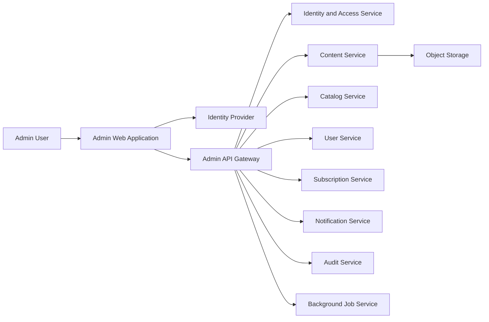
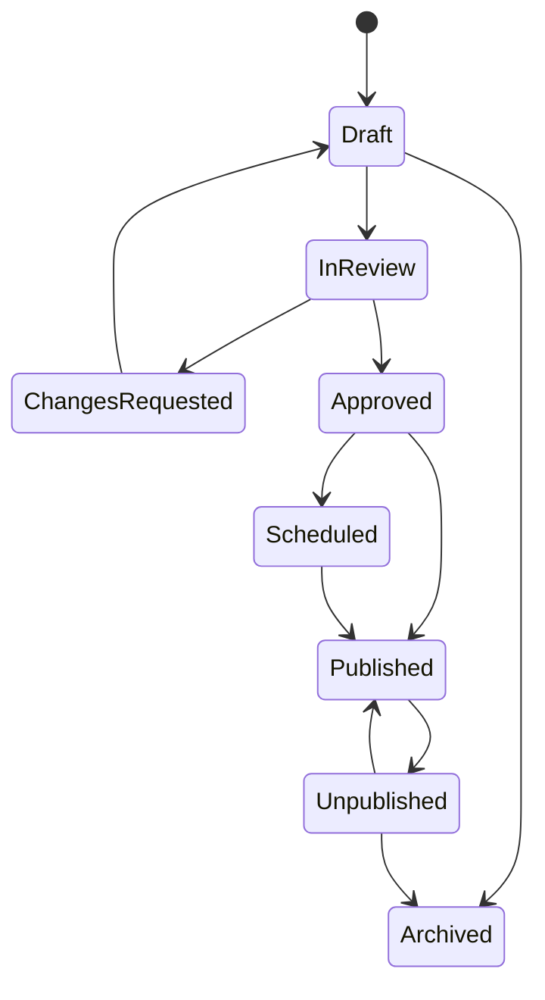
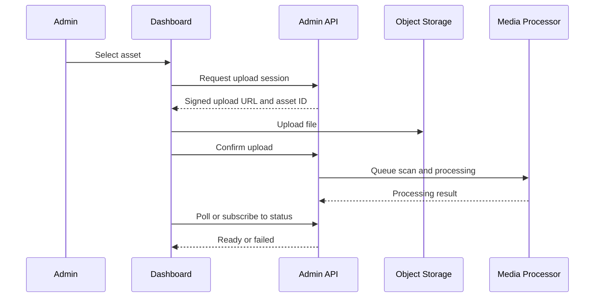

# Admin Dashboard Architecture

Version: 1.0.0  
Status: Draft  
Owner: Platform and Operations  
Last Updated: 2026-07-14

## 1. Purpose

This document defines the architecture, responsibilities, security model, modules, workflows, and operational standards for the KidsAudioBookPlatform administration dashboard.

The dashboard is an internal operational product. It is not a generic content-management interface and it is not available to parents or children. It exists to let authorized staff safely manage content, catalog structure, users, subscriptions, notifications, offers, moderation, and operational incidents without direct database access.

The dashboard must prioritize correctness, traceability, and safe change management over speed of raw data entry.

## 2. Scope

The dashboard covers:

- administrator authentication and authorization;
- content lifecycle management;
- stories, series, episodes, categories, collections, tags, and age ranges;
- audio, illustration, transcript, and metadata assets;
- content review and publishing;
- user and profile support operations;
- subscription and entitlement investigation;
- announcements, campaigns, offers, and discounts;
- notification creation and delivery monitoring;
- moderation and support workflows;
- audit logs and operational reporting;
- feature flags and selected configuration;
- safe bulk operations;
- observability and incident support.

The dashboard does not replace infrastructure consoles, database administration tools, cloud-provider consoles, or source-controlled configuration.

## 3. Architectural Principles

The dashboard follows these principles:

1. every sensitive action is authenticated, authorized, and audited;
2. destructive actions are explicit and reversible where possible;
3. business workflows are performed through backend APIs, never direct database access;
4. permissions are granular and deny by default;
5. content publication requires validation and, for sensitive changes, separation of duties;
6. bulk actions require previews and clear impact summaries;
7. personal data is minimized and masked unless access is necessary;
8. the UI never becomes the only source of a business rule;
9. long-running operations are asynchronous and observable;
10. support staff see only the information required for their role.

## 4. Technology Baseline

Recommended stack:

- React with TypeScript;
- Vite or a comparable build system;
- React Router;
- TanStack Query for server state;
- React Hook Form and Zod for forms and validation;
- a maintained accessible component library;
- OpenAPI-generated API clients;
- OIDC-compatible authentication;
- Sentry or equivalent frontend error reporting;
- Playwright for end-to-end tests.

The exact UI library may change, but accessibility, consistency, and maintainability are mandatory.

## 5. High-Level Architecture



The dashboard is a stateless web client. All authoritative validation, authorization, and mutation logic remains server-side.

## 6. Repository Structure

```text
admin-dashboard/
  src/
    app/
      bootstrap/
      router/
      providers/
      configuration/
    core/
      auth/
      api/
      permissions/
      errors/
      logging/
      design-system/
      tables/
      forms/
    features/
      dashboard/
      stories/
      series/
      episodes/
      categories/
      collections/
      media/
      publishing/
      users/
      subscriptions/
      notifications/
      offers/
      moderation/
      support/
      audit/
      jobs/
      settings/
    shared/
      components/
      hooks/
      utilities/
      types/
  tests/
  e2e/
```

Feature modules own their routes, queries, mutations, forms, and view models. Shared infrastructure must not contain feature-specific business rules.

## 7. Authentication

Administrators authenticate through a dedicated identity provider or administrative realm.

Requirements:

- multi-factor authentication is mandatory for privileged roles;
- short-lived access tokens;
- secure refresh or session handling;
- inactivity timeout;
- explicit logout;
- session revocation;
- device and login event visibility;
- protection against credential stuffing and brute force;
- no reuse of consumer authentication flows without administrative controls.

Administrative and consumer identities must remain logically separated even if they share identity infrastructure.

## 8. Authorization Model

The dashboard uses role-based access control with permission-level enforcement.

Suggested roles:

| Role | Primary Scope |
|---|---|
| Super Admin | emergency and platform-wide administration |
| Content Admin | stories, episodes, series, metadata, publishing |
| Content Reviewer | review, approve, reject, request changes |
| Support Agent | users, profiles, support diagnostics |
| Billing Support | subscriptions, entitlement investigation |
| Marketing Manager | campaigns, offers, announcements |
| Operations Analyst | dashboards, jobs, notifications, audit read access |
| Security Auditor | audit and security event access |

Example permissions:

```text
story.read
story.create
story.update
story.submit_for_review
story.publish
story.unpublish
media.upload
media.approve
user.read_limited
user.suspend
subscription.read
subscription.grant_exception
notification.create
notification.send
campaign.manage
audit.read
role.manage
```

The frontend may hide unavailable controls, but the backend must enforce every permission independently.

## 9. Separation of Duties

High-impact actions may require a second authorized person.

Examples:

- publishing a new story to all users;
- replacing audio in a published story;
- granting manual Premium access;
- sending a notification to the full user base;
- exporting personal data;
- changing administrator roles;
- deleting or permanently redacting content.

The workflow state must record creator, reviewer, approver, timestamps, comments, and final decision.

## 10. Navigation Model

Primary navigation:

```text
Overview
Content
  Stories
  Series
  Episodes
  Categories
  Collections
  Media Library
Publishing
Users and Profiles
Subscriptions
Notifications
Offers and Campaigns
Moderation and Support
Background Jobs
Audit Log
Settings
```

Navigation items are permission-aware. Direct route access is also protected.

## 11. Operational Overview

The landing dashboard shows actionable operational information rather than vanity metrics.

Recommended widgets:

- content awaiting review;
- failed media processing jobs;
- scheduled publications;
- notification delivery failures;
- subscription verification anomalies;
- unresolved support cases;
- recent privileged actions;
- system health summary;
- content availability by language and age range.

Metrics must include timestamps and source definitions.

## 12. Story Management

A story record includes:

- title and slug;
- localized descriptions;
- recommended age range;
- estimated duration;
- free or Premium availability;
- content warnings and themes;
- categories, collections, and tags;
- cover and illustration assets;
- audio variants;
- transcript and synchronization data;
- narrator and production metadata;
- lifecycle state;
- publication schedule;
- version history.

### 12.1 Story Lifecycle



Transitions are permission-controlled and audited.

### 12.2 Editing Rules

Published content is not edited silently. Material changes create a new content version.

Material changes include:

- audio replacement;
- transcript replacement;
- age classification changes;
- Premium/free access changes;
- content-warning changes;
- removal of episodes or illustrations;
- major title or description changes.

## 13. Series and Episode Management

Series management supports:

- series metadata;
- ordered episodes;
- seasons or groups where needed;
- cover art;
- recommended progression;
- publication state;
- free preview configuration;
- episode dependencies;
- localized titles and descriptions.

Reordering episodes requires a preview of affected navigation and recommendation behavior.

## 14. Categories, Tags, and Collections

Taxonomy is centrally managed.

Rules:

- stable machine identifiers separate from labels;
- localized display names;
- unique slugs;
- parent-child hierarchy only where it adds value;
- no duplicate concepts under different labels;
- deprecation instead of immediate deletion when referenced;
- impact analysis before merging categories or tags.

Collections are curated content groups and may be scheduled or targeted by locale, age, entitlement, or campaign.

## 15. Media Library

The media library manages:

- narration audio;
- ambient sounds;
- cover images;
- story illustrations;
- transcript files;
- timing manifests;
- promotional assets.

Each asset stores:

- type;
- original filename;
- MIME type;
- size;
- checksum;
- storage key;
- processing state;
- virus-scan state;
- duration or dimensions;
- version;
- references;
- uploader and timestamps.

### 15.1 Upload Flow



Files are unavailable for publication until scanning and processing succeed.

## 16. Transcript and Synchronization Editing

The dashboard may support transcript and timing adjustments.

Capabilities:

- edit transcript segments;
- preview synchronized highlighting;
- associate illustration cues;
- validate overlapping or missing timestamps;
- compare transcript duration against audio;
- preview on representative mobile layouts;
- keep version history.

Large transcript edits should support import and validation rather than manual-only entry.

## 17. Publishing Workflow

Publishing validates:

- required localized metadata;
- valid age range;
- available and processed audio;
- cover and required illustrations;
- valid transcript manifest where required;
- entitlement configuration;
- category assignment;
- content review approval;
- publication start and optional end dates;
- compatibility with supported mobile versions.

The publish screen displays a complete readiness checklist.

## 18. Scheduled Publishing

Scheduled publications use backend-controlled time and timezone-aware timestamps.

Administrators see:

- local time and UTC;
- target locales;
- affected content;
- current approval status;
- cancellation deadline;
- scheduler job status.

The browser must not be responsible for triggering publication.

## 19. Preview Environments

Content preview supports:

- child profile age simulation;
- locale simulation;
- free and Premium states;
- mobile screen dimensions;
- light and time-of-day themes;
- published and draft versions;
- audio and transcript preview.

Preview links are authenticated, short-lived, and never indexed publicly.

## 20. User Support Operations

Support staff may search by approved identifiers such as:

- account email;
- internal account ID;
- support reference;
- purchase transaction reference.

Default results should mask personal data.

Allowed support actions may include:

- view account status;
- view profile count and non-sensitive metadata;
- revoke sessions;
- resend verification email;
- inspect notification delivery;
- inspect subscription synchronization;
- suspend an account with reason;
- initiate data export or deletion workflow;
- add internal support notes.

Support staff must not see child listening details unless explicitly required and authorized.

## 21. Child Profile Support

Profile support exposes only data necessary for issue resolution:

- profile identifier;
- age band, not full birth date where possible;
- selected preferences;
- content restrictions;
- synchronization health;
- download-device summary;
- last activity time.

Changes to parental controls must be exceptional and audited.

## 22. Subscription Management

The subscription module displays:

- provider;
- product;
- status;
- trial dates;
- renewal or expiry date;
- grace period;
- entitlement status;
- latest verified provider event;
- synchronization errors;
- linked store transaction references.

The dashboard must not display raw payment card information.

### 22.1 Manual Entitlement Exceptions

Manual Premium grants require:

- specific reason;
- start and end date;
- approving permission;
- audit entry;
- visible distinction from store-derived entitlement;
- automatic expiration;
- optional second approval for long periods.

Manual grants must not modify store purchase history.

## 23. Offers and Campaigns

Campaign management supports:

- internal name;
- localized title and message;
- audience criteria;
- eligible products;
- start and end dates;
- usage limits;
- platform restrictions;
- preview;
- approval;
- performance summary.

Audience filters must avoid unsafe targeting based on child behavior or sensitive data.

## 24. Notification Management

Administrators can create:

- in-app announcements;
- parent push notifications;
- transactional templates;
- campaign notifications;
- service-status notices.

The creation workflow includes:

- audience estimate;
- locale preview;
- deep-link validation;
- quiet-hours handling;
- scheduling;
- test send;
- approval;
- delivery monitoring;
- cancellation when still pending.

A global send requires elevated permission and confirmation with the estimated recipient count.

## 25. Notification Templates

Templates use approved variables only.

Example:

```text
Hello {{parentFirstName}},
A new story is available in {{profileName}}'s recommended collection.
```

Template validation prevents unknown variables, unsafe HTML, unsupported deep links, and accidental exposure of child data.

## 26. Moderation and Support Cases

The dashboard may track:

- content reports;
- copyright concerns;
- inappropriate content concerns;
- account abuse;
- billing support;
- technical incidents;
- privacy requests.

Each case contains owner, status, priority, internal notes, related objects, SLA target, and resolution.

## 27. Audit Log

Every sensitive action records:

- actor ID;
- actor role;
- action;
- target type and ID;
- timestamp;
- request correlation ID;
- previous and new values where appropriate;
- reason;
- approval information;
- IP and device metadata within privacy policy;
- result.

Audit records are immutable to dashboard users.

The audit UI supports filtering but not editing or deletion.

## 28. Search

Search must be scoped and permission-aware.

Requirements:

- exact identifier search for support tasks;
- full-text search for content;
- filters for lifecycle, locale, category, age range, entitlement, and date;
- pagination;
- no broad personal-data enumeration;
- rate limits for sensitive searches;
- searchable fields documented per module.

## 29. Tables and Pagination

Administrative lists use server-side filtering, sorting, and pagination.

Rules:

- stable sorting;
- visible active filters;
- shareable URLs for non-sensitive filters;
- configurable page size within limits;
- explicit empty and error states;
- no loading of entire datasets into the browser;
- export only through controlled background jobs.

## 30. Forms and Validation

Validation occurs in three places:

1. immediate UI feedback;
2. schema validation before submission;
3. authoritative backend validation.

The UI maps backend field errors to corresponding controls and displays non-field errors in a clear summary.

Unsaved-change protection is required for long forms.

## 31. Bulk Operations

Supported bulk operations may include:

- add or remove category;
- schedule publication;
- archive drafts;
- resend selected notifications;
- export approved reports;
- update availability metadata.

Bulk workflows require:

- selection summary;
- validation preview;
- affected-count estimate;
- permission check;
- idempotency key;
- asynchronous job for large changes;
- downloadable result report;
- audit entry.

## 32. Background Jobs

The dashboard displays operational jobs such as:

- media processing;
- content import;
- publication;
- notification delivery;
- subscription reconciliation;
- data export;
- account deletion;
- cache revalidation.

Job details include state, progress, start and finish times, initiator, retry count, error summary, and correlation ID.

The UI does not retry jobs blindly. Retry availability depends on job type and failure reason.

## 33. Error Handling

Errors are normalized into:

- validation error;
- authentication expired;
- permission denied;
- conflict;
- not found;
- rate limited;
- dependency unavailable;
- unexpected failure.

Unexpected errors display a support reference or correlation ID. Raw stack traces are never shown.

## 34. Optimistic Updates

Optimistic updates are limited to low-risk reversible actions, such as marking an internal item as read.

High-impact changes including publication, role changes, suspension, billing exceptions, and notification sends wait for backend confirmation.

## 35. Concurrency Control

Editable resources use version fields or ETags.

When two administrators edit the same resource:

- stale updates are rejected;
- the UI shows a conflict;
- users can compare their changes with the latest version;
- overwriting requires explicit refresh and reapplication;
- no silent last-write-wins for content or security-sensitive data.

## 36. Security Controls

Required controls:

- HTTPS only;
- secure cookies or protected token storage according to authentication model;
- Content Security Policy;
- CSRF protection where cookie sessions are used;
- XSS-safe rendering;
- strict file upload policies;
- dependency vulnerability scanning;
- clickjacking protection;
- route and action authorization;
- session timeout;
- re-authentication for critical actions;
- no secrets in frontend bundles.

## 37. Data Privacy

The dashboard follows least-privilege access to personal data.

Rules:

- mask email and identifiers in list views where possible;
- require elevated permission for exports;
- watermark or trace sensitive exports;
- avoid downloading personal data to local machines unless required;
- use retention policies for generated files;
- never expose child names in broad analytics views;
- log access to sensitive user records.

## 38. Accessibility

The dashboard targets WCAG 2.1 AA principles.

Requirements:

- keyboard navigation;
- screen-reader labels;
- focus management;
- accessible tables and dialogs;
- sufficient contrast;
- error summaries;
- non-color-only status indicators;
- scalable text;
- reduced-motion support.

## 39. Localization

The administrative interface may initially be English-only, but content editing must support all product locales.

The UI clearly distinguishes:

- missing translation;
- inherited fallback;
- draft translation;
- approved translation;
- published translation.

Locale-specific previews are mandatory before publication.

## 40. Observability

Frontend telemetry includes:

- page load and route performance;
- API failure category;
- JavaScript errors;
- failed mutations;
- permission-denied events;
- upload failures;
- long-running job monitoring failures;
- build version and environment.

Sensitive payloads must be redacted.

Backend correlation IDs are retained in frontend logs to support incident investigation.

## 41. Analytics

Administrative analytics focus on operations:

- review turnaround time;
- publication failure rate;
- media processing duration;
- notification delivery success;
- support-case resolution time;
- frequency of manual entitlement grants;
- failed login and privileged-action trends.

Analytics must not incentivize unsafe publication speed or expose unnecessary personal data.

## 42. Testing Strategy

### 42.1 Unit Tests

Cover:

- permission predicates;
- form schemas;
- data mappers;
- lifecycle transition rules represented in the client;
- utility functions;
- error mapping.

### 42.2 Component Tests

Cover:

- permission-based rendering;
- form validation;
- table filtering;
- conflict handling;
- upload states;
- publish readiness checklist;
- audit display.

### 42.3 End-to-End Tests

Critical scenarios:

1. administrator login with MFA;
2. create a story draft;
3. upload and process media;
4. submit for review;
5. approve and schedule publication;
6. reject an invalid publication;
7. investigate a subscription issue;
8. create and test a notification;
9. run a safe bulk action;
10. verify audit entries;
11. confirm unauthorized actions remain blocked.

## 43. CI/CD

The dashboard pipeline performs:

- formatting and linting;
- type checking;
- unit and component tests;
- production build;
- dependency and license scanning;
- end-to-end smoke tests;
- artifact generation;
- deployment to staging;
- approval before production;
- post-deployment health check.

Build artifacts are immutable and promoted between environments.

## 44. Environment Strategy

Environments:

- local development;
- integration or development;
- staging;
- production.

Staging uses non-production accounts and sanitized or synthetic data.

Production administrative actions must never be tested casually. Test sends, previews, and simulations must be clearly separated from live actions.

## 45. Feature Flags and Configuration

The dashboard may manage approved business-level feature flags, but infrastructure and security configuration remains source-controlled.

Every flag has:

- identifier;
- description;
- owner;
- scope;
- default;
- environments;
- rollout plan;
- expiration or review date;
- audit history.

## 46. Import and Export

Content import supports validated templates and dry runs.

Before import:

- parse input;
- validate schema;
- detect duplicates;
- show affected records;
- show warnings and errors;
- require confirmation.

Exports are asynchronous for large datasets and expire automatically.

## 47. Disaster and Incident Operations

The dashboard may expose limited emergency controls such as:

- unpublish a harmful story;
- pause a campaign;
- disable a feature flag;
- revoke administrator sessions;
- suspend notification sending.

Emergency controls require elevated permission, explicit reason, confirmation, and immediate audit logging.

They do not replace infrastructure incident procedures.

## 48. Anti-Patterns

The following are prohibited:

- direct database access from the browser;
- shared administrator accounts;
- hard-coded roles only in frontend code;
- destructive actions without confirmation;
- publication without validation;
- silent overwrites;
- unrestricted data exports;
- raw personal data in logs;
- manually editing subscription provider history;
- using dashboard-only validation as the business authority;
- background jobs without status and auditability.

## 49. Definition of Done

A dashboard feature is complete when:

- backend authorization exists;
- UI permissions match backend permissions;
- audit requirements are implemented;
- loading, empty, failure, and conflict states exist;
- accessibility is verified;
- personal data exposure is reviewed;
- unit and end-to-end tests cover critical behavior;
- long-running work is observable;
- documentation and permission catalog are updated;
- rollback or recovery behavior is understood.

## 50. Related Documents

- `Architecture_Principles.md`
- `Software_Architecture.md`
- `Backend_Architecture.md`
- `Database_Design.md`
- `API_Specification.md`
- `Security_Architecture.md`
- `Logging_Monitoring.md`
- `Notifications.md`
- `Mobile_Architecture.md`
