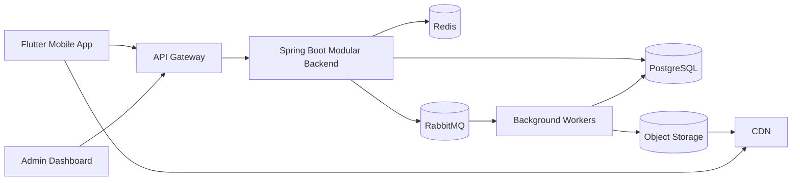
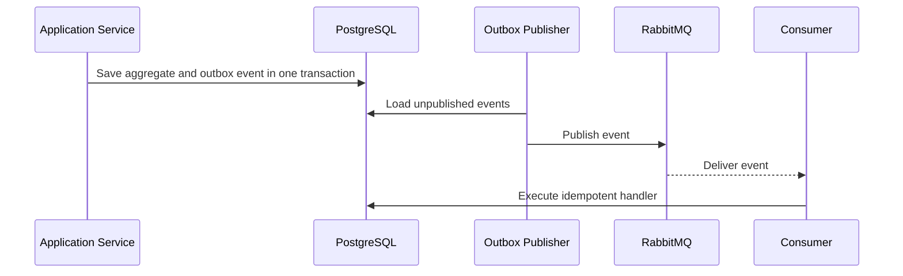
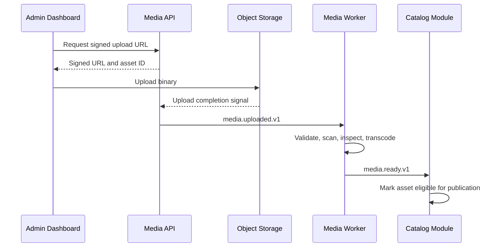

# Backend Architecture

Version: 1.1.0  
Status: Active Draft  
Owner: Architecture  
Last updated: 2026-07-14

## 1. Purpose

This document defines the implementation architecture of the KidsAudioBookPlatform backend. It converts the product vision and high-level software architecture into concrete Java 21 and Spring Boot rules that must be followed by human developers, reviewers, QA engineers, DevOps engineers, and AI coding agents.

The backend must support:

- parent registration, login, account recovery, sessions, and device management;
- protected Parent Zone actions;
- child profiles and profile-specific preferences;
- stories, series, episodes, categories, collections, and ambient audio;
- synchronized text, illustrations, and audio metadata;
- playback sessions, favorites, progress, history, and continue listening;
- free, trial, and premium entitlements;
- offline downloads for eligible users;
- controlled advertising for free users;
- persistent in-app notifications and push delivery;
- content administration, publishing, moderation, and support operations;
- auditability, observability, resilience, and future service extraction.

Where this document uses **must**, the rule is mandatory unless an accepted Architecture Decision Record explicitly replaces it.

## 2. Architectural style

The initial backend is a **modular monolith with strict bounded contexts**. It is not an unstructured monolith, and it is not a distributed microservice system on day one.

The architecture combines:

- domain-driven design for business boundaries;
- clean and hexagonal architecture for dependency direction;
- package-by-feature organization;
- REST for synchronous client-facing operations;
- RabbitMQ for asynchronous cross-module work;
- PostgreSQL as the system of record;
- Redis for cache, coordination, and selected short-lived state;
- S3-compatible object storage for binary media;
- explicit contracts that allow later extraction into microservices.

The deployment model may evolve without changing the conceptual ownership of modules.



## 3. Core backend principles

### 3.1 Domain ownership

Every business concept has exactly one owning module. Other modules may use public application contracts, public events, or dedicated read models, but they must not access another module's repositories, JPA entities, or internal packages.

### 3.2 Dependency direction

Dependencies flow inward:

```text
API / Messaging / Schedulers
            ↓
      Application layer
            ↓
        Domain layer

Infrastructure adapters → application/domain ports
```

The domain layer must not import Spring MVC, JPA, RabbitMQ, Redis, HTTP SDKs, or provider-specific types.

### 3.3 Business rules are server-side

The mobile app and admin dashboard are never the authority for:

- premium access;
- profile ownership;
- trial eligibility;
- publication visibility;
- advertisement frequency;
- offline entitlement;
- subscription status;
- administrative permissions.

Clients may display decisions returned by the backend, but they must not make authoritative decisions independently.

### 3.4 Explicit boundaries over convenience

A short-term convenience that bypasses a module boundary is not acceptable. Cross-module coupling must use a public contract, event, or dedicated query port.

### 3.5 Operational simplicity

The architecture must remain proportionate to the size of the product and team. New infrastructure must solve a measurable problem and be documented through an ADR.

## 4. Technology baseline

The approved baseline is:

| Area | Technology |
|---|---|
| Language | Java 21 |
| Framework | Spring Boot 3.x |
| Build | Maven |
| HTTP | Spring Web MVC |
| Security | Spring Security |
| Persistence | Spring Data JPA and PostgreSQL |
| Migrations | Flyway |
| Cache | Redis |
| Messaging | RabbitMQ |
| Binary media | S3-compatible object storage |
| API contract | OpenAPI 3 |
| Metrics | Micrometer and Prometheus |
| Tracing | OpenTelemetry-compatible tracing |
| Logs | Structured JSON logs, Loki-compatible |
| Tests | JUnit 5, AssertJ, Mockito, Testcontainers, WireMock |

## 5. Bounded contexts

### 5.1 Identity and Access

Owns parent accounts, credentials, sessions, refresh tokens, device sessions, account status, roles, permissions, password recovery, email verification, and Parent Zone security metadata.

It does not own child preferences, subscriptions, or playback state.

### 5.2 Family and Profiles

Owns households, child profiles, age bands, avatar selection, language preferences, accessibility options, parental controls, and profile limits.

A child profile is never an authentication principal. The authenticated principal is the parent account or administrator.

### 5.3 Catalog and Editorial

Owns stories, series, episodes, categories, collections, age recommendations, localized metadata, publication workflow, visibility, premium classification, and editorial scheduling.

### 5.4 Media

Owns media asset metadata, upload lifecycle, signed URLs, checksum validation, scanning state, processing state, renditions, synchronized text assets, illustrations, and offline package manifests.

Binary content must not be stored in PostgreSQL.

### 5.5 Listening

Owns playback sessions, progress, favorites, history, continue-listening, completion, and idempotent offline synchronization.

### 5.6 Subscription and Entitlements

Owns plans, purchases, provider verification, trial state, subscription lifecycle, grace periods, entitlement evaluation, and premium feature access.

### 5.7 Advertising Policy

Owns free-user eligibility, the two-session rule, suppression after premium activation, and ad-decision tracking. It never inserts ads during story playback.

### 5.8 Notifications

Owns notification templates, persisted user notifications, preferences, push delivery, scheduling, retries, and delivery status.

### 5.9 Administration

Owns dashboard-specific orchestration, moderation workflows, support actions, audit searches, and cross-domain administrative views. It must still call the owning domain's application use cases.

### 5.10 Analytics

Owns privacy-conscious product events, aggregation, and reporting. Analytics must never block critical user journeys.

## 6. Repository and module structure

Recommended layout:

```text
backend/
  pom.xml
  app/
    src/main/java/com/kidsaudio/app/
  modules/
    identity/
    family/
    catalog/
    media/
    listening/
    subscription/
    advertising/
    notification/
    administration/
    analytics/
  shared/
    kernel/
    web/
    security/
    observability/
    testing/
```

Each business module follows:

```text
<module>/
  api/
    rest/
    dto/
    mapper/
  application/
    command/
    query/
    service/
    port/
  domain/
    model/
    policy/
    event/
    exception/
  infrastructure/
    persistence/
    messaging/
    integration/
    configuration/
```

### 6.1 Public module surface

A module may expose only:

- application use-case interfaces;
- immutable result models;
- public integration events;
- read-only query contracts;
- approved shared identifiers.

Internal entities, repositories, configuration classes, and JPA models remain package-private or module-internal.

### 6.2 Shared code rules

`shared` must remain small. It may contain:

- technical error representation;
- base identifiers;
- time provider interface;
- correlation and tracing helpers;
- security principal abstractions;
- common test fixtures.

It must not become a dumping ground for business logic.

## 7. Domain modeling rules

### 7.1 Aggregates

An aggregate is a transactional consistency boundary. Changes must pass through the aggregate root.

Examples:

- `ParentAccount`;
- `Household`;
- `ChildProfile`;
- `Story`;
- `Series`;
- `PlaybackProgress`;
- `Subscription`;
- `Notification`.

Aggregates should remain small and avoid loading unrelated collections.

### 7.2 Value objects

Use immutable value objects for validated concepts:

```java
public record EmailAddress(String value) {
    public EmailAddress {
        if (value == null || !value.matches("^[^@\\s]+@[^@\\s]+\\.[^@\\s]+$")) {
            throw new InvalidEmailAddressException();
        }
        value = value.trim().toLowerCase(Locale.ROOT);
    }
}
```

Suitable concepts include email, locale, profile ID, story ID, playback position, age range, checksum, subscription period, and media asset ID.

### 7.3 Policies

Use policy objects for decisions that combine multiple facts:

- `CanCreateChildProfilePolicy`;
- `StoryAvailabilityPolicy`;
- `PremiumTrialEligibilityPolicy`;
- `AdvertisementEligibilityPolicy`;
- `OfflineDownloadEligibilityPolicy`.

Policies must be unit-testable without Spring.

### 7.4 Domain events

Domain events describe completed facts and use past-tense names:

- `ParentRegistered`;
- `ChildProfileCreated`;
- `StoryPublished`;
- `PlaybackCompleted`;
- `SubscriptionActivated`;
- `NotificationRequested`.

Events are immutable and versioned when they leave the module boundary.

## 8. Application layer

Each use case is represented by a command or query and a dedicated handler or application service.

```java
public record CreateChildProfileCommand(
        UUID parentAccountId,
        String displayName,
        LocalDate birthDate,
        String avatarKey,
        Locale locale
) {}
```

```java
public interface CreateChildProfileUseCase {
    ChildProfileResult execute(CreateChildProfileCommand command);
}
```

```java
@Service
@Transactional
final class CreateChildProfileService implements CreateChildProfileUseCase {
    private final HouseholdRepository householdRepository;
    private final EntitlementQuery entitlementQuery;
    private final DomainEventPublisher eventPublisher;

    @Override
    public ChildProfileResult execute(CreateChildProfileCommand command) {
        var household = householdRepository.getRequiredByParentId(command.parentAccountId());
        var entitlement = entitlementQuery.getForAccount(command.parentAccountId());
        var profile = household.createProfile(command, entitlement.profileLimit());
        householdRepository.save(household);
        eventPublisher.publishAll(household.pullDomainEvents());
        return ChildProfileResult.from(profile);
    }
}
```

Application services are responsible for transaction boundaries, authorization requiring domain context, orchestration, persistence, event registration, and returning application results.

Controllers must not orchestrate repositories directly.

## 9. API layer

### 9.1 Route conventions

```text
/api/v1/**           consumer APIs
/api/v1/admin/**     administrative APIs
/internal/v1/**      service-to-service callbacks
```

Internal routes require service authentication and network controls.

### 9.2 Controller rules

Controllers must:

- validate transport-level input;
- resolve the authenticated principal;
- map DTOs into commands or queries;
- invoke an application use case;
- map application results to response DTOs;
- avoid business logic and repository access.

```java
@RestController
@RequestMapping("/api/v1/child-profiles")
final class ChildProfileController {
    private final CreateChildProfileUseCase createChildProfile;

    @PostMapping
    @ResponseStatus(HttpStatus.CREATED)
    ChildProfileResponse create(
            @AuthenticationPrincipal ParentPrincipal principal,
            @Valid @RequestBody CreateChildProfileRequest request) {
        var result = createChildProfile.execute(request.toCommand(principal.accountId()));
        return ChildProfileResponse.from(result);
    }
}
```

### 9.3 DTO separation

Transport DTOs, application models, domain entities, and JPA entities are distinct types.

Bean Validation handles structural validation. Domain objects enforce business invariants.

### 9.4 Error format

All APIs use a consistent problem response:

```json
{
  "type": "https://kidsaudiobook.app/problems/profile-limit-reached",
  "title": "Profile limit reached",
  "status": 409,
  "code": "FAMILY_PROFILE_LIMIT_REACHED",
  "detail": "The current subscription allows one child profile.",
  "instance": "/api/v1/child-profiles",
  "correlationId": "4eb2e274-4d34-4cd6-9737-a83a3161e70f",
  "violations": []
}
```

Stack traces and internal exception details must never be returned.

### 9.5 Pagination, filtering, and sorting

Potentially unbounded collections must be paginated. Defaults:

- default page size: 20;
- maximum page size: 100;
- stable secondary sort by ID;
- cursor pagination for high-volume feeds where offset pagination becomes inefficient.

Filters must be allow-listed. Arbitrary field names from clients must never be converted directly into SQL fragments.

### 9.6 Idempotency

Mutation endpoints vulnerable to retries should accept `Idempotency-Key`:

- purchase verification;
- offline sync batches;
- support overrides;
- content publication;
- provider callbacks.

The idempotency record stores request hash, operation state, and final response reference.

## 10. Persistence architecture

### 10.1 JPA entities

JPA entities belong to infrastructure and must not leak into API or domain contracts.

Prefer explicit mappings rather than exposing bidirectional object graphs. Avoid `FetchType.EAGER` for collections.

### 10.2 Transaction rules

- one application command normally owns one transaction;
- remote calls must not be made inside long database transactions;
- read-only queries use `@Transactional(readOnly = true)` where appropriate;
- event publication uses transactional outbox for cross-module or external delivery;
- optimistic locking is required for concurrently edited aggregates.

```java
@Version
private long version;
```

### 10.3 Query strategy

Use repository methods for simple aggregate access. Use dedicated query repositories or projections for complex reads and dashboard views.

Do not force every read through aggregate loading when a projection is more efficient.

### 10.4 N+1 prevention

Every endpoint returning collections must be reviewed for N+1 queries. Use projections, entity graphs, batch fetching, or explicit joins. Integration tests should verify query counts for critical endpoints.

## 11. Messaging architecture

RabbitMQ is used for asynchronous integration and background work.



### 11.1 Event envelope

```json
{
  "eventId": "2f7af63c-0b88-49ad-bb3c-61e09bf65f17",
  "eventType": "story.published.v1",
  "occurredAt": "2026-07-14T18:30:00Z",
  "producer": "catalog",
  "correlationId": "3d8fd4d6-cf58-4df6-b2c8-302cfacde39e",
  "payload": {
    "storyId": "fcf8cc8e-5a54-47d8-8e98-f9959b94905c",
    "locale": "ro-RO"
  }
}
```

### 11.2 Consumer requirements

Consumers must be:

- idempotent;
- retry-safe;
- observable;
- able to reject poison messages to a dead-letter queue;
- version-aware;
- bounded by explicit concurrency.

### 11.3 Retry policy

Use bounded exponential backoff. Permanent validation failures must not retry indefinitely. Dead-letter records require operational visibility and replay procedures.

## 12. Security architecture

### 12.1 Authentication

Use short-lived access tokens and rotating refresh tokens. Refresh token records are stored server-side as hashes and bound to a device session.

### 12.2 Authorization

Authorization is layered:

1. route-level role checks;
2. account ownership checks;
3. profile ownership checks;
4. entitlement checks;
5. domain-specific policy checks.

`ADMIN` does not imply unrestricted bypass of business rules. Sensitive support actions require explicit permissions and audit entries.

### 12.3 Parent Zone

Parent Zone access requires the authenticated parent plus recent PIN or biometric-backed local confirmation according to the Parent Zone security ADR. The backend tracks verification freshness where sensitive operations require re-authentication.

### 12.4 Input and upload security

All uploads must use allow-listed MIME types, size limits, extension checks, checksum verification, malware scanning, and asynchronous media inspection before publication.

### 12.5 Sensitive data

Passwords, tokens, PINs, secrets, and provider credentials must never appear in logs. Child-related data is minimized and must not be included in analytics unless explicitly required and privacy-reviewed.

## 13. Cache architecture

Redis is an optimization, not the system of record.

Suitable cache targets:

- published catalog cards;
- category and collection metadata;
- entitlement snapshots with short TTL;
- feature flags;
- rate-limit counters;
- short-lived signed URL metadata.

Cache keys follow:

```text
<environment>:<module>:<resource>:<identifier>:<version>
```

Example:

```text
prod:catalog:story-card:fcf8cc8e:v3
```

Invalidation must be event-driven where practical. Cache failure must degrade to database or service access for critical journeys.

## 14. Media pipeline



Application servers must not proxy large audio files unless required for a specific security reason.

## 15. Offline synchronization

The mobile app queues progress and download events locally. Sync endpoints accept batches with stable client event IDs.

Conflict rules:

- progress uses the highest valid playback position unless a later explicit restart exists;
- completion is monotonic unless reset by a parent action;
- duplicate client event IDs are ignored;
- revoked entitlements remove future download authorization but do not corrupt local metadata;
- server timestamps are authoritative for entitlement and publication decisions.

## 16. Scheduling and background jobs

Scheduled work includes:

- publication activation;
- subscription reconciliation;
- expired token cleanup;
- notification dispatch;
- abandoned upload cleanup;
- retention and anonymization;
- outbox publishing.

Jobs must use distributed locking where duplicate execution would be harmful. Every job records start, duration, processed count, failed count, and final status.

## 17. Observability

Every request and message handler must propagate a correlation ID.

Structured log example:

```json
{
  "timestamp": "2026-07-14T18:30:00.123Z",
  "level": "INFO",
  "service": "kids-audio-backend",
  "module": "listening",
  "event": "playback_session_started",
  "correlationId": "3d8fd4d6-cf58-4df6-b2c8-302cfacde39e",
  "accountId": "pseudonymized-id",
  "profileId": "pseudonymized-id",
  "durationMs": 34
}
```

Required metrics include:

- HTTP latency and errors by route;
- database pool usage;
- cache hit ratio;
- RabbitMQ queue depth and consumer failures;
- playback session start failures;
- entitlement evaluation latency;
- media processing duration;
- notification success rate;
- scheduled job outcomes.

Audit records are separate from application logs and are immutable.

## 18. Resilience

Use timeouts on every external dependency. Retries are allowed only for safe or idempotent operations.

Use circuit breakers for unstable external providers such as push, payment verification, or email.

Graceful degradation examples:

- push failure does not block notification persistence;
- analytics failure does not block playback;
- Redis failure falls back to authoritative storage where safe;
- CDN problems return a controlled playback error without corrupting progress;
- advertising provider failure does not interrupt the child experience.

## 19. Testing strategy

### 19.1 Unit tests

Required for aggregates, value objects, policies, mappers with non-trivial rules, and application services.

### 19.2 Integration tests

Use Testcontainers for PostgreSQL, Redis, and RabbitMQ. Integration tests verify migrations, repository behavior, transaction boundaries, event outbox flow, and security configuration.

### 19.3 API tests

Verify status codes, schema, authorization, validation, idempotency, pagination, filtering, and error codes.

### 19.4 Contract tests

Provider integrations and future extracted services require contract tests. WireMock is used for external HTTP providers.

### 19.5 Architecture tests

ArchUnit rules must verify:

- domain packages do not depend on Spring or JPA;
- controllers do not access repositories;
- modules do not access other modules' infrastructure packages;
- public APIs are exposed only from approved packages.

## 20. Documentation requirements

Every public class, controller, use-case interface, event, and externally visible DTO must have useful JavaDoc.

OpenAPI annotations or generated metadata must document:

- purpose;
- authorization;
- request fields;
- responses;
- error codes;
- pagination;
- idempotency requirements.

Code comments explain non-obvious decisions, not what the code literally does.

## 21. Definition of done for backend changes

A backend change is complete only when:

- domain ownership is clear;
- validation exists at transport and domain levels;
- authorization is enforced server-side;
- migrations are included and reversible operationally;
- tests cover happy path and important failures;
- logs and metrics are added where operationally relevant;
- API and event contracts are documented;
- no secrets or personal data are logged;
- architecture boundaries pass automated checks;
- `PROJECT_CHANGELOG.md` is updated for significant changes.

## 22. Extraction readiness

A module is a candidate for microservice extraction only when at least one condition is proven:

- it requires materially different scaling;
- it has an independent release cadence;
- it needs a separate security boundary;
- it is owned by a separate team;
- its failure isolation brings measurable benefit.

Before extraction, confirm:

- clear data ownership;
- stable public contracts;
- event-driven integration where appropriate;
- no direct database coupling;
- independent observability;
- operational readiness.

## 23. Related documents

- `Software_Architecture.md`
- `Architecture_Principles.md`
- `Database_Design.md`
- `API_Specification.md`
- `Security_Architecture.md`
- `Performance_Guidelines.md`
- `Logging_Monitoring.md`
- `Event_Catalog.md`
- `Error_Catalog.md`
- `Implementation_Roadmap.md`
- `docs/00_Project/ADR/`
