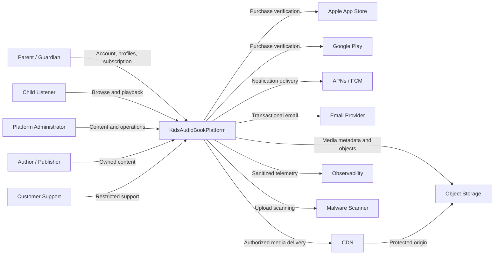
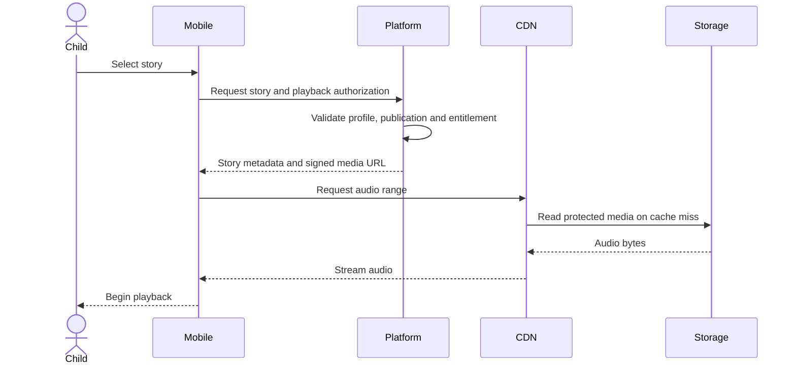
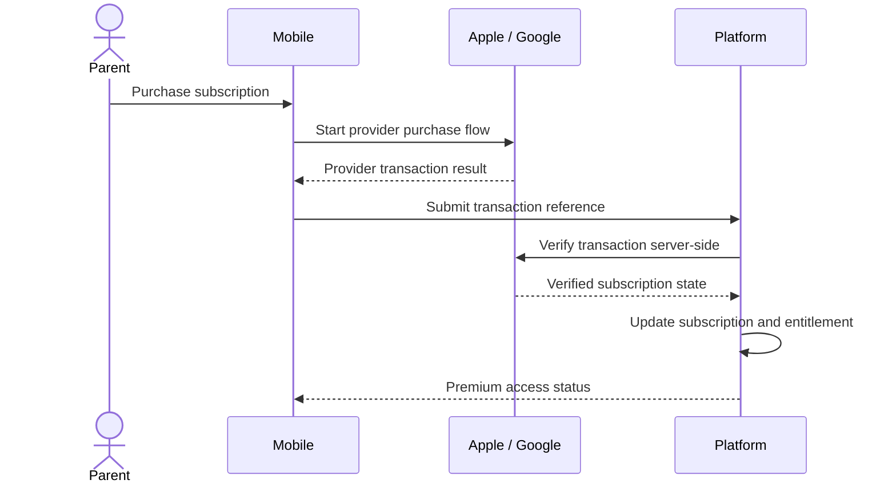
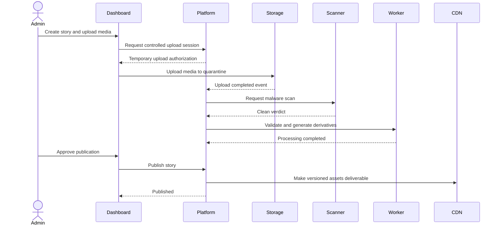

# C4 Model — System Context

Version: 1.0.0  
Status: Active  
Owners: Architecture Team  
Last reviewed: 2026-07-14

## 1. Purpose

This document defines the C4 System Context view for KidsAudioBookPlatform. It describes the platform as a whole, the people who interact with it, the external systems it depends on, and the trust boundaries that shape its architecture.

The context model intentionally avoids implementation details. It answers four questions:

1. Who uses the platform?
2. What value does the platform provide?
3. Which external systems does it integrate with?
4. Where are the primary security and ownership boundaries?

## 2. Platform summary

KidsAudioBookPlatform is a mobile-first digital storytelling platform for children, parents, content administrators, and future content partners.

The platform provides:

- age-appropriate audio stories;
- synchronized text and illustrations;
- child-specific profiles and recommendations;
- parental controls and protected settings;
- playback progress and continuation across sessions;
- offline-capable listening for eligible content;
- subscription and entitlement management;
- administrative content publishing;
- notifications and engagement campaigns;
- analytics and operational visibility.

The initial product targets children aged 0–7, while preserving architectural room for older age groups and additional content formats.

## 3. People and personas

### 3.1 Parent or guardian

The parent owns the account and is the legally responsible user.

Primary responsibilities and capabilities:

- creates and manages the family account;
- creates child profiles;
- configures age, language, interests, and safety preferences;
- enters the protected Parent Zone;
- manages subscription and billing state;
- controls downloads and offline access;
- reviews listening activity and progress;
- receives account, billing, and engagement notifications;
- manages privacy and consent settings.

The parent is the only persona allowed to perform sensitive account-level actions.

### 3.2 Child listener

The child uses a simplified, safe interface through a selected child profile.

Primary capabilities:

- browses approved stories;
- starts, pauses, resumes, and completes playback;
- continues previously started content;
- views synchronized text and illustrations;
- accesses downloaded stories when eligible;
- receives age-appropriate recommendations;
- interacts only with features approved for child use.

The child does not directly access billing, account security, privacy controls, or unrestricted external links.

### 3.3 Platform administrator

The administrator operates the platform through a separate administrative interface.

Primary capabilities:

- creates and edits stories, series, episodes, categories, and collections;
- uploads and validates audio and illustrations;
- manages publication workflows;
- schedules releases;
- reviews moderation and validation results;
- manages featured content and campaigns;
- investigates operational issues;
- reviews audit records according to role permissions;
- manages selected customer-support operations.

Administrative access is isolated from the child-facing experience and requires stronger authentication and authorization controls.

### 3.4 Content author or publisher

This is a future or limited-access persona that may provide licensed content.

Potential capabilities:

- submits manuscripts and media;
- reviews content status;
- updates owned drafts;
- views licensing or performance information;
- collaborates with editorial administrators.

This persona must never gain unrestricted access to content owned by other partners.

### 3.5 Customer support specialist

The support specialist assists parents with account and product issues.

Potential capabilities:

- reviews limited account metadata;
- investigates subscription and entitlement status;
- reviews delivery failures and support-relevant audit events;
- triggers controlled recovery workflows;
- never sees passwords, payment credentials, or unrestricted child data.

Support permissions must follow least privilege and be fully audited.

## 4. External systems

### 4.1 Apple App Store

Responsibilities:

- distributes the iOS application;
- processes Apple in-app purchases;
- exposes subscription transaction data;
- provides server notifications for subscription lifecycle changes;
- participates in receipt or transaction verification.

The platform remains responsible for mapping verified purchase state to internal entitlements.

### 4.2 Google Play

Responsibilities:

- distributes the Android application;
- processes Google Play purchases;
- provides purchase tokens and subscription state;
- sends real-time developer notifications;
- participates in purchase verification.

The platform must not trust mobile-client purchase claims without server-side verification.

### 4.3 Push notification providers

The platform integrates with:

- Apple Push Notification Service for iOS;
- Firebase Cloud Messaging for Android and supported web use cases.

These providers transport notifications but do not own the platform notification state. Delivery attempts, templates, user preferences, and campaign state remain internal responsibilities.

### 4.4 Email provider

An external transactional email service may deliver:

- email verification;
- password recovery;
- security alerts;
- billing notices;
- parental engagement messages;
- support communications.

The provider receives only the minimum data required for message delivery.

### 4.5 Object storage

Object storage contains binary media and generated derivatives, including:

- audio files;
- illustrations;
- thumbnails;
- cover images;
- temporary uploads;
- transcoded media;
- selected administrative exports.

Application services own authorization and metadata. Object storage owns durable binary storage.

### 4.6 Content delivery network

The CDN delivers approved media efficiently to mobile users.

Responsibilities:

- geographically distributed media delivery;
- caching of immutable assets;
- byte-range support for audio playback;
- origin protection;
- traffic absorption;
- optional signed URL or signed cookie enforcement.

The CDN must not make entitlement decisions independently.

### 4.7 Payment and subscription verification systems

For mobile subscriptions, the primary payment systems are Apple and Google. Future channels may include a web payment provider.

The platform owns:

- internal subscription records;
- entitlement calculation;
- grace-period policy;
- reconciliation;
- audit history;
- account-level premium access.

External providers own payment processing and provider-specific transaction state.

### 4.8 Observability and incident-management systems

The platform may integrate with external systems for:

- error tracking;
- metrics visualization;
- log aggregation;
- distributed tracing;
- uptime monitoring;
- on-call alerting;
- incident collaboration.

Sensitive child data and secrets must not be exported into observability tools.

### 4.9 Malware scanning service

Uploaded files may be scanned using an external or self-hosted malware scanner before publication.

The scanner returns a security verdict. It does not approve content quality, ownership, age suitability, or publication state.

### 4.10 Future AI providers

Future AI-supported features may include:

- recommendation assistance;
- metadata enrichment;
- illustration generation;
- narration generation;
- moderation assistance;
- story-generation tools for administrators.

No child conversation or sensitive family data may be shared with an AI provider without an explicit approved architecture, privacy review, legal basis, data-minimization strategy, and documented ADR.

## 5. System context diagram

```mermaid
C4Context
    title KidsAudioBookPlatform — System Context

    Person(parent, "Parent / Guardian", "Owns the family account, manages child profiles, subscription, privacy and Parent Zone settings")
    Person(child, "Child Listener", "Discovers and listens to age-appropriate stories through a protected child profile")
    Person(admin, "Platform Administrator", "Publishes content, manages catalog operations, campaigns and platform support")
    Person(author, "Author / Publisher", "Future partner who submits and manages owned content")
    Person(support, "Customer Support", "Assists parents using restricted and audited operational tools")

    System(platform, "KidsAudioBookPlatform", "Mobile-first audiobook and storytelling platform for children and families")

    System_Ext(apple, "Apple App Store / StoreKit", "iOS distribution, purchases, subscriptions and provider notifications")
    System_Ext(google, "Google Play / Play Billing", "Android distribution, purchases, subscriptions and provider notifications")
    System_Ext(push, "APNs / Firebase Cloud Messaging", "Push notification delivery")
    System_Ext(email, "Transactional Email Provider", "Verification, recovery, security, billing and engagement emails")
    System_Ext(storage, "Object Storage", "Durable storage for audio, images and generated media")
    System_Ext(cdn, "Content Delivery Network", "Efficient delivery of immutable and authorized media")
    System_Ext(observability, "Observability and Alerting", "Metrics, logs, traces, error reporting and on-call alerts")
    System_Ext(scanner, "Malware Scanner", "Security scanning of uploaded media")

    Rel(parent, platform, "Manages account, profiles, subscription and settings", "HTTPS / JSON")
    Rel(child, platform, "Browses stories and controls playback", "HTTPS / media streaming")
    Rel(admin, platform, "Publishes content and operates the platform", "HTTPS / JSON")
    Rel(author, platform, "Submits and manages owned content", "HTTPS / JSON")
    Rel(support, platform, "Performs restricted support actions", "HTTPS / JSON")

    Rel(platform, apple, "Verifies transactions and receives subscription events", "Provider APIs / signed notifications")
    Rel(platform, google, "Verifies purchases and receives subscription events", "Provider APIs / signed notifications")
    Rel(platform, push, "Sends device notifications", "Provider APIs")
    Rel(platform, email, "Sends transactional and approved engagement email", "Provider API")
    Rel(platform, storage, "Stores and retrieves media objects", "Secure storage API")
    Rel(platform, cdn, "Publishes authorized media delivery paths", "HTTPS / signed URLs")
    Rel(cdn, storage, "Reads approved media from protected origin", "Origin access")
    Rel(platform, observability, "Exports sanitized telemetry and alerts", "OTLP / metrics / logs")
    Rel(platform, scanner, "Submits quarantined uploads for scanning", "Secure API")
```

## 6. Simplified context diagram

The following diagram is provided for Markdown renderers that do not support C4 syntax.

## 7. System boundary

KidsAudioBookPlatform owns and is accountable for:

- account and identity records;
- parent and child-profile relationships;
- profile preferences and age configuration;
- content catalog metadata;
- story, series, and episode lifecycle;
- playback state and progress;
- entitlement calculation;
- notification state and preferences;
- audit records;
- internal business events;
- administrative workflows;
- application-level authorization;
- privacy and retention workflows;
- media authorization and signed delivery decisions.

The following remain outside the platform boundary:

- card or bank-account processing;
- Apple and Google purchase execution;
- mobile operating-system security;
- telecommunications network availability;
- physical device ownership;
- external provider uptime;
- third-party email and push transport internals;
- CDN edge implementation details.

External ownership does not remove the platform's responsibility to validate inputs, verify signatures, handle failures, reconcile state, and maintain an internal audit trail.

## 8. Trust boundaries

### 8.1 Public client boundary

Mobile and web clients are untrusted environments.

The backend must assume that a client can be:

- modified;
- automated;
- reverse engineered;
- replayed;
- operated on a compromised device;
- used with forged local state.

No authorization, subscription, age, ownership, or publication decision may rely only on client-side state.

### 8.2 Administrative boundary

Administrative interfaces expose higher-impact operations and require:

- separate authorization policies;
- strong authentication;
- optional multi-factor authentication;
- short-lived elevated sessions;
- immutable audit records;
- restricted network or device controls when justified;
- explicit separation of duties for critical publication and support actions.

### 8.3 External provider boundary

Every external provider response must be treated as untrusted until validated.

Required controls include:

- TLS validation;
- signature or token verification;
- timestamp and replay protection;
- schema validation;
- bounded timeout;
- idempotent event handling;
- retry limits;
- dead-letter or reconciliation workflows;
- provider-specific audit metadata.

### 8.4 Media boundary

Uploaded media is untrusted until it has passed:

- size validation;
- declared-type validation;
- detected-type validation;
- malware scanning;
- metadata extraction controls;
- decoding or transcoding validation;
- moderation and editorial approval where required.

Unapproved uploads remain quarantined and cannot be delivered through the production CDN path.

## 9. Core context interactions

| Source | Destination | Interaction | Synchronous | Business owner |
|---|---|---|---:|---|
| Mobile application | Platform API | Authentication and account operations | Yes | Identity |
| Mobile application | Platform API | Catalog and story metadata | Yes | Catalog |
| Mobile application | Platform API | Playback progress | Yes | Playback |
| Mobile application | CDN | Audio and artwork delivery | Yes | Media Delivery |
| Admin dashboard | Platform API | Content management | Yes | Content Operations |
| Platform | Apple / Google | Purchase verification | Yes | Subscription |
| Apple / Google | Platform | Subscription lifecycle notification | No | Subscription |
| Platform | Push provider | Push dispatch | No | Notifications |
| Platform | Email provider | Email dispatch | No | Notifications |
| Platform | Object storage | Upload and media lifecycle | Mixed | Media |
| Platform | Malware scanner | Upload security scan | No | Media Security |
| Platform | Observability | Telemetry export | No | Platform Operations |

## 10. Primary business capabilities

The system boundary contains the following major capabilities:

1. Identity and account management
2. Parent Zone security
3. Child profile management
4. Content catalog management
5. Series, story, and episode publishing
6. Media upload and processing
7. Discovery and recommendations
8. Playback and progress tracking
9. Offline content access
10. Subscription and entitlement management
11. Notifications and campaigns
12. Audit and compliance
13. Administration and customer support
14. Analytics and product insights
15. Platform operations and observability

These capabilities are logical boundaries. They may initially be implemented within a modular monolith and extracted into independently deployable services only when justified by scale, ownership, release cadence, or reliability requirements.

## 11. Critical user journeys

### 11.1 Start a story

### 11.2 Activate premium access

### 11.3 Publish a story

## 12. Availability expectations

The platform should prioritize availability for:

1. authentication of existing users;
2. child profile selection;
3. catalog reads;
4. story details;
5. playback authorization;
6. playback progress;
7. previously authorized offline playback.

Lower-priority capabilities may degrade without blocking core listening:

- recommendations may fall back to curated content;
- analytics may buffer or drop non-critical events according to policy;
- notifications may be delayed;
- administrative exports may pause;
- campaign scheduling may retry later;
- non-essential dashboards may show stale aggregates.

## 13. Data classification at context level

| Classification | Examples | Context rule |
|---|---|---|
| Public | Published story title, public cover, category name | May be CDN cached after publication approval |
| Internal | Operational identifiers, non-sensitive configuration | Restricted to platform and authorized staff |
| Personal | Parent name, email, child profile preferences | Minimize, encrypt in transit, control access |
| Sensitive | Authentication secrets, reset tokens, Parent Zone credentials | Never log; strict retention and access controls |
| Commercial | Subscription state, provider transaction references | Restricted, audited, reconciled |
| Child-related | Age range, listening progress, interests | Highest privacy care; minimize and purpose-limit |

Payment-card data must not enter the platform when purchases are processed by app-store providers.

## 14. Privacy principles

At the system-context level, the platform follows these rules:

- collect only data required for a defined product or legal purpose;
- make the parent the controller of child-profile settings;
- avoid collecting precise child identity when not required;
- use age ranges rather than exact birth dates where feasible;
- do not expose child activity publicly;
- do not sell child or family data;
- keep advertising out of the premium experience and subject any free-tier advertising to a separate child-safety and legal review;
- provide deletion, export, and consent-management workflows;
- apply retention limits to operational and analytics data;
- require explicit review before introducing new external data processors.

## 15. Architectural constraints

The system context establishes the following constraints:

1. The product is mobile-first.
2. The backend is the authority for business and security decisions.
3. Binary media is delivered through object storage and CDN, not through normal API responses.
4. App-store subscription state must be verified server-side.
5. Child-facing features must remain isolated from account and billing operations.
6. Administrative operations must be strongly authenticated and audited.
7. External notifications and webhooks must be idempotent.
8. External provider failures must not corrupt internal state.
9. Sensitive child data must not be placed in logs, telemetry, or third-party AI prompts.
10. The initial deployment may be a modular monolith, but bounded-context ownership must remain explicit.

## 16. Out-of-scope capabilities for the first production release

Unless later product documents explicitly promote them into scope, the following are excluded from the initial release:

- public social networking;
- child-to-child messaging;
- open user-generated content;
- unrestricted comments or reviews;
- live audio rooms;
- voice cloning;
- conversational AI for children;
- public child profiles;
- cryptocurrency payments;
- direct marketplace payouts to authors;
- smart-speaker, TV, automotive, or wearable applications.

Exclusion from the first release does not imply permanent rejection. Each capability requires its own product, security, privacy, and architectural review.

## 17. Context-level risks

| Risk | Impact | Primary mitigation |
|---|---|---|
| Store notification loss | Incorrect entitlement state | Reconciliation jobs and idempotent provider events |
| Compromised mobile client | Unauthorized operations | Server-side authorization and signed short-lived access |
| Media hotlinking | Excessive cost or unauthorized access | Signed delivery, origin protection and monitoring |
| External provider outage | Delayed notifications or verification | Queues, retries, circuit breakers and grace policies |
| Child-data leakage | Severe privacy and trust impact | Data minimization, access control, audit and redaction |
| Malicious upload | Infrastructure or user harm | Quarantine, scanning, type validation and controlled processing |
| Admin account compromise | High-impact content or data changes | MFA, least privilege, audit and sensitive-action controls |
| Recommendation failure | Poor user experience | Curated and popularity-based fallback content |
| CDN or storage outage | Playback disruption | Offline support, retry behavior and provider resilience planning |

## 18. Ownership and change rules

Changes to the system context require architecture review when they introduce:

- a new user persona;
- a new external processor or provider;
- a new category of personal or child-related data;
- a new payment channel;
- a new public interaction model;
- user-generated content;
- AI processing of personal data;
- a new administrative trust boundary;
- a new external authentication provider;
- a change in legal or geographic operating scope.

Significant changes must be recorded through an Architecture Decision Record.

## 19. Related documents

- `../Software_Architecture.md`
- `../Backend_Architecture.md`
- `../Security_Architecture.md`
- `../API_Specification.md`
- `../Database_Design.md`
- `../Notifications.md`
- `../ADRs/`
- `02_Container_Diagram.md`
- `03_Backend_Component_Diagram.md`
- `04_Mobile_Component_Diagram.md`

## 20. Architecture review checklist

A system-context change is ready only when:

- [ ] every new persona has explicit permissions and restrictions;
- [ ] every external system has an owner and failure strategy;
- [ ] data exchanged with external systems is documented;
- [ ] trust boundaries are identified;
- [ ] privacy and child-safety impact is reviewed;
- [ ] authentication and authorization responsibilities are clear;
- [ ] webhook and callback verification is defined;
- [ ] observability does not expose sensitive data;
- [ ] operational ownership is assigned;
- [ ] an ADR exists for significant changes;
- [ ] affected architecture and security documents are updated.

## 21. AI implementation notes

An AI coding assistant must not infer new external integrations or trust relationships from implementation convenience.

Before generating code that communicates with an external system, the assistant must verify that:

1. the external system appears in an approved architecture document;
2. the exchanged data is documented;
3. credentials are provided through secret management;
4. timeouts and retry rules exist;
5. inbound messages are authenticated;
6. processing is idempotent where required;
7. sensitive values are excluded from logs;
8. tests cover success, timeout, invalid signature, duplicate delivery, malformed payload, and provider failure.

When documentation and code disagree, implementation must stop until the architecture decision is clarified.