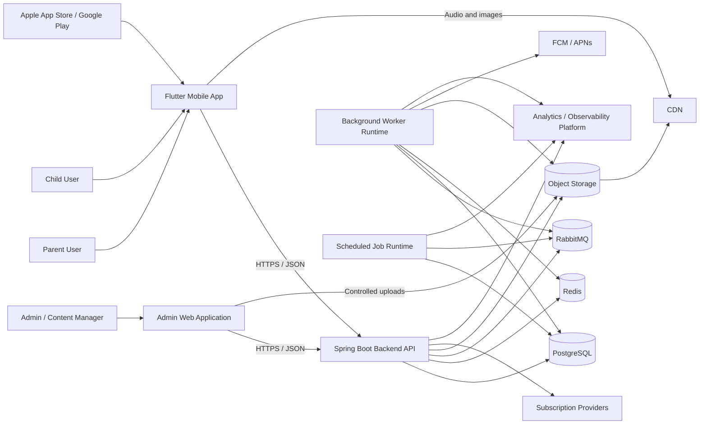
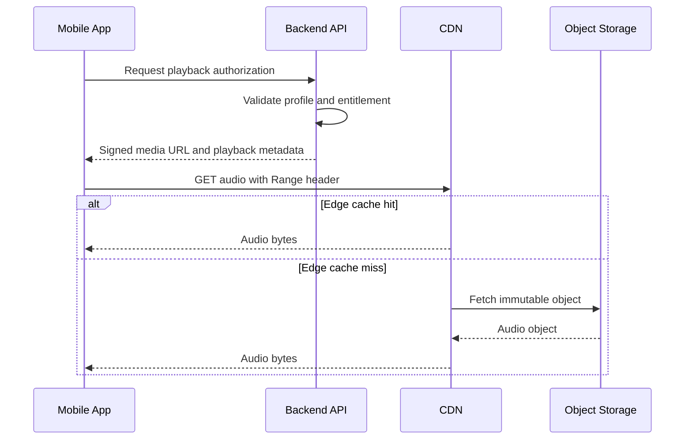
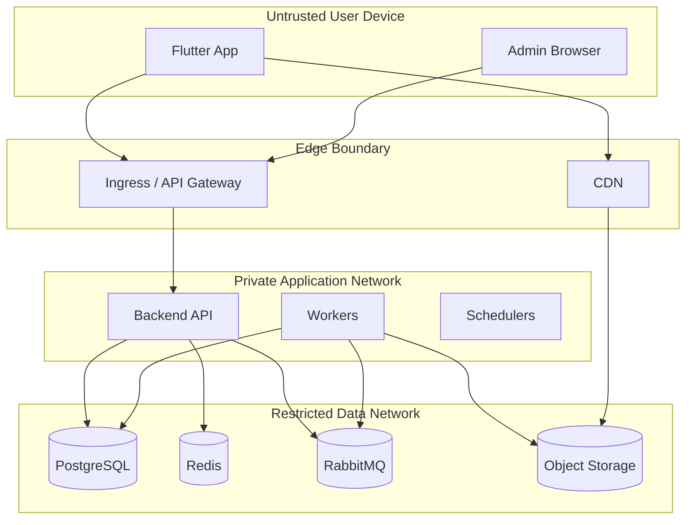

# C4 Model — Container Diagram

Version: 1.0.0  
Status: Active Draft  
Owners: Architecture Team  
Last reviewed: 2026-07-14

## 1. Purpose

This document defines the C4 Level 2 container view for KidsAudioBookPlatform. It shows the major deployable and runtime building blocks, their responsibilities, their communication paths, and the boundaries that must remain stable as the system evolves.

The initial implementation may be deployed as a modular monolith with supporting infrastructure, while preserving module boundaries that allow selected capabilities to be extracted into independent services later.

## 2. Container overview



## 3. Container inventory

| Container | Technology | Primary responsibility | Owns persistent data |
|---|---|---|---|
| Flutter Mobile App | Flutter / Dart | Child and parent user experience, playback, local cache, offline behavior | Local preferences, downloaded media metadata, pending synchronization |
| Admin Web Application | Web SPA | Content administration, moderation, operational management | Browser-local temporary state only |
| Backend API | Java 21 / Spring Boot | Authentication, authorization, business workflows, catalog, profiles, subscriptions, playback authorization | Through PostgreSQL and object storage |
| Background Worker Runtime | Java 21 / Spring Boot worker | Asynchronous notifications, media processing, indexing, retries, outbox consumption | Processing state and job results |
| Scheduled Job Runtime | Java 21 / Spring Scheduler or managed jobs | Reconciliation, cleanup, retention, subscription verification, periodic maintenance | Job execution metadata |
| PostgreSQL | PostgreSQL | Transactional source of truth | Accounts, profiles, catalog metadata, progress, entitlements, notifications, audit data |
| Redis | Redis | Cache, rate limiting, short-lived sessions, distributed coordination | Ephemeral derived data only |
| RabbitMQ | RabbitMQ | Reliable asynchronous messaging and work distribution | Durable messages until acknowledged or expired |
| Object Storage | S3-compatible storage | Audio, artwork, generated derivatives, controlled uploads | Binary media and immutable assets |
| CDN | Managed CDN | Efficient media delivery and edge caching | Cached copies only |

## 4. Flutter Mobile App

The mobile app is the primary product interface. It supports both child and parent experiences while maintaining strict separation between child-safe interactions and protected parent operations.

### Responsibilities

- account sign-in and device-session management;
- child profile selection;
- age-appropriate catalog browsing;
- story and episode playback;
- local progress persistence and synchronization;
- downloaded content and offline playback;
- Parent Zone access with PIN or biometric protection;
- subscription status display;
- push-notification handling;
- safe fallback behavior during network degradation.

### Constraints

- business authorization decisions remain server-side;
- premium entitlement is never trusted solely from local state;
- secrets and privileged service credentials are never embedded in the application;
- local child data is minimized and encrypted where platform capabilities allow;
- all API communication uses HTTPS;
- media access uses short-lived or policy-controlled signed URLs.

## 5. Admin Web Application

The admin interface is a separate container because it has a different threat model, release cadence, and user role profile.

### Responsibilities

- story, series, episode, category, and collection management;
- audio and image upload orchestration;
- content publication workflows;
- user-support operations with restricted permissions;
- notification-template management;
- reporting and audit-log access;
- operational dashboards;
- feature and content configuration.

### Security requirements

- admin authentication is separate from child-profile flows;
- multi-factor authentication should be supported before production administration;
- privileged operations require fine-grained permissions;
- destructive actions require explicit confirmation and audit events;
- browser sessions use secure, short-lived tokens;
- no object-storage credentials are exposed to the browser.

## 6. Backend API

The backend API is the authoritative application boundary for synchronous operations.

### Core responsibilities

- authenticate accounts and device sessions;
- authorize account, parent, child, author, and admin operations;
- manage user accounts and child profiles;
- expose catalog and search read models;
- issue playback authorization and signed media URLs;
- validate subscription entitlements;
- persist playback progress;
- manage favorites, history, and recommendations inputs;
- create notifications and asynchronous work requests;
- record audit and domain events;
- enforce API validation, rate limits, and idempotency.

### Internal structure

The container must be organized by bounded context rather than by technical layer alone. Expected modules include:

- Identity and Access;
- Family and Profiles;
- Catalog;
- Media;
- Playback;
- Progress;
- Subscription and Entitlements;
- Notifications;
- Administration;
- Audit and Compliance;
- Shared Platform capabilities.

### Communication rules

- mobile and admin clients communicate through versioned HTTPS APIs;
- PostgreSQL is used for transactional state;
- Redis is used only for replaceable, derived, or short-lived state;
- RabbitMQ is used for asynchronous work and integration events;
- object storage is accessed through SDKs or signed upload/download flows;
- external providers are called through dedicated integration adapters.

## 7. Background Worker Runtime

The worker container executes operations that should not block user-facing requests.

### Workloads

- push-notification delivery;
- email delivery where introduced;
- audio validation and transcoding;
- image resizing and derivative generation;
- search-index updates;
- analytics event forwarding;
- subscription reconciliation;
- publication side effects;
- data exports;
- cleanup and retention tasks triggered through queues.

### Reliability requirements

- consumers are idempotent;
- every message has a stable event or job identifier;
- retries use exponential backoff with jitter;
- exhausted messages move to a dead-letter queue;
- poison messages do not block healthy work;
- processing outcome is observable through metrics and structured logs;
- message acknowledgement occurs only after the durable state change succeeds.

## 8. Scheduled Job Runtime

Scheduled jobs are separated conceptually from request processing and queue consumers because they have different load and failure characteristics.

### Typical jobs

- subscription-provider reconciliation;
- expired-session cleanup;
- stale upload cleanup;
- notification scheduling;
- outbox recovery;
- content publication activation;
- retention-policy enforcement;
- audit-data archiving;
- recommendation-model refresh;
- operational consistency checks.

A scheduled job must be safe to run more than once. Distributed locking is required when multiple replicas could execute the same schedule.

## 9. PostgreSQL

PostgreSQL is the transactional source of truth.

### Data ownership

Each bounded context owns its tables and migrations. Cross-module access must use application interfaces or approved read models rather than arbitrary direct repository access.

### Rules

- Flyway manages schema evolution;
- foreign keys protect local relational integrity;
- optimistic locking is used for concurrent mutable aggregates where appropriate;
- outbox records are committed in the same transaction as domain state;
- large binary media is never stored in PostgreSQL;
- read-heavy projections may use dedicated tables or materialized views;
- personally identifiable data is minimized and classified.

## 10. Redis

Redis improves latency and protects expensive dependencies but is not authoritative.

### Use cases

- catalog and home-screen cache;
- short-lived entitlement snapshots;
- rate-limit counters;
- verification-code state;
- temporary device-session metadata;
- distributed locks for scheduled work;
- idempotency-key results;
- feature-configuration cache.

### Failure behavior

The platform must continue essential operations when Redis is unavailable, except where Redis is explicitly required for a security control. Cache failures must be visible but should not become full-system failures.

## 11. RabbitMQ

RabbitMQ decouples user-facing transactions from asynchronous work.

### Exchange categories

- domain events;
- integration events;
- command or job queues;
- notification delivery;
- media-processing work;
- dead-letter exchanges.

### Message envelope

Every message should include:

```json
{
  "messageId": "uuid",
  "messageType": "story.published.v1",
  "occurredAt": "2026-07-14T18:30:00Z",
  "correlationId": "uuid",
  "causationId": "uuid",
  "producer": "catalog",
  "schemaVersion": 1,
  "payload": {}
}
```

Messages must not contain secrets or unnecessary personal data.

## 12. Object Storage and CDN

Object storage owns original and derived media files. The CDN delivers immutable media efficiently.

### Asset categories

- story audio;
- episode audio;
- cover artwork;
- thumbnails;
- profile-avatar assets;
- generated preview clips;
- temporary admin uploads;
- exports with short retention.

### Delivery model



The backend must not proxy large media files under normal conditions.

## 13. External integrations

### App stores and subscription providers

Used for subscription purchase validation, renewal state, cancellation, refunds, and entitlement reconciliation.

### Push providers

Firebase Cloud Messaging and Apple Push Notification service deliver device notifications. Delivery success is not equivalent to user interaction and must be tracked separately.

### Analytics and observability

Operational telemetry includes metrics, traces, logs, crash reports, and approved product analytics. Child privacy requirements apply to every analytics event.

## 14. Trust boundaries



No request is trusted because it originates from an official client. Authorization and validation occur at every relevant server boundary.

## 15. Deployment topology

### Initial deployment

The recommended first production topology is:

- one backend API deployment with multiple replicas;
- one worker deployment with independent scaling;
- one scheduled-job deployment with leader or distributed locking;
- managed PostgreSQL;
- managed Redis;
- managed RabbitMQ or equivalent broker;
- managed object storage and CDN;
- centralized logs, metrics, and traces.

### Scaling model

| Container | Primary scaling signal |
|---|---|
| Backend API | Request rate, p95 latency, CPU, thread saturation |
| Workers | Queue depth, oldest-message age, processing latency |
| Scheduler | Job duration, missed schedules, lock contention |
| PostgreSQL | CPU, IOPS, active connections, lock waits, slow queries |
| Redis | Memory, hit ratio, latency, evictions |
| RabbitMQ | Queue depth, consumer utilization, publish rate |
| CDN | Cache hit ratio, origin egress, edge errors |

## 16. Failure scenarios

| Failure | Expected behavior |
|---|---|
| Redis unavailable | Bypass cache for essential reads; restrict security-sensitive flows if required |
| RabbitMQ unavailable | Persist outbox data and recover publication later |
| Push provider unavailable | Retry asynchronously; do not block user transactions |
| Object storage unavailable | Prevent new uploads; preserve metadata; return controlled playback error |
| CDN degraded | Use approved origin fallback only where operationally safe |
| Subscription provider unavailable | Apply documented entitlement grace policy |
| Analytics unavailable | Drop or buffer approved telemetry; never block playback |
| Worker backlog | Scale workers, apply back-pressure, prioritize critical queues |
| PostgreSQL unavailable | Fail fast, reject writes safely, expose health status, avoid retry storms |

## 17. Evolution toward microservices

A container is not automatically a microservice. Extraction is justified only when a bounded context requires independent scaling, deployment, ownership, security, or reliability.

Likely future extraction candidates:

1. Notifications;
2. Media Processing;
3. Search and Recommendations;
4. Subscription and Entitlements;
5. Analytics Ingestion.

Before extraction, the module must already have:

- explicit APIs;
- independent data ownership;
- integration events;
- no direct repository access from other modules;
- observability and operational ownership;
- contract and migration tests.

## 18. Container-level quality requirements

Every deployable container must define:

- health, readiness, and liveness behavior;
- resource requests and limits;
- structured logging;
- distributed tracing;
- metrics and alerts;
- timeout and retry policies;
- secret management;
- dependency inventory;
- vulnerability-scanning policy;
- backup and restore expectations where stateful;
- deployment and rollback procedure.

## 19. Architecture decisions

Changes to the container model require an ADR when they introduce:

- a new deployable runtime;
- a new database or broker;
- a new cross-boundary synchronous dependency;
- a new external provider;
- direct media proxying through the backend;
- a new source of truth;
- a microservice extraction;
- a material change to data ownership.

## 20. Related documents

- `01_System_Context.md`
- `03_Backend_Component_Diagram.md`
- `04_Mobile_Component_Diagram.md`
- `../Software_Architecture.md`
- `../Backend_Architecture.md`
- `../Database_Design.md`
- `../API_Specification.md`
- `../Security_Architecture.md`
- `../Performance_Guidelines.md`
- `../Logging_Monitoring.md`
