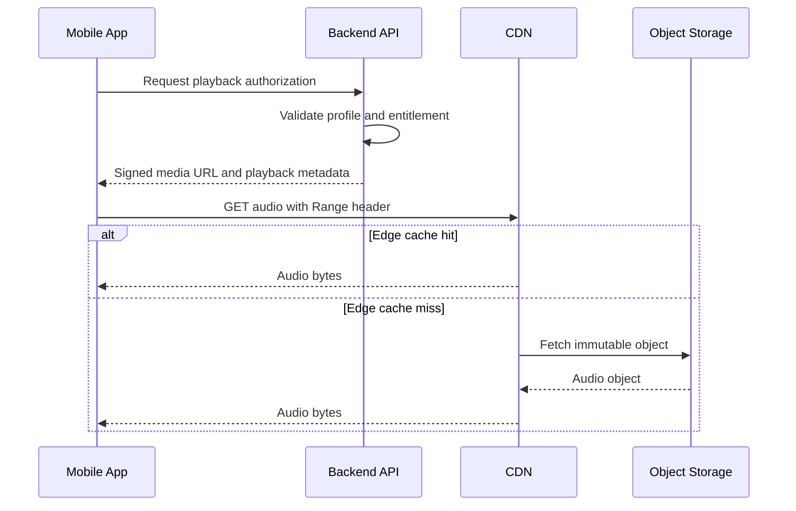
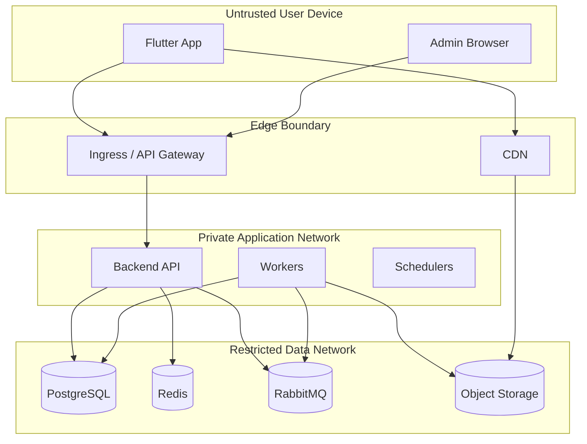

# C4 Model — Container Diagram

Version: 1.0.0  
Status: Active Draft  
Owners: Architecture Team  
Last reviewed: 2026-07-14

## 1. Purpose

This document defines the C4 Level 2 container view for KidsAudioBookPlatform. It shows the major deployable and runtime building blocks, their responsibilities, their communication paths, and the boundaries that must remain stable as the system evolves.

The initial implementation consists of **independently deployable microservices**, each with its own logical database and contracts, per [ADR-0015](../../00_Project/ADR/ADR-0015-microservices-from-first-release.md). The edge gateway is a router and policy enforcement point, not a monolithic backend.

## 2. Container overview

~~~mermaid
flowchart TB
  Parent[Parent / Child] --> Mobile[Flutter Mobile App]
  AdminUser[Admin / Editor] --> AdminWeb[React Admin Dashboard]
  Mobile --> Gateway[HTTPS API Gateway]
  AdminWeb --> Gateway
  subgraph S[Independently deployable Spring Boot services]
    Identity[identity-service]
    Profiles[profiles-service]
    Catalog[catalog-service]
    Media[media-service]
    Playback[playback-service]
    Billing[billing-service]
    Notifications[notifications-service]
    Admin[admin-service]
  end
  Gateway --> Identity
  Gateway --> Profiles
  Gateway --> Catalog
  Gateway --> Media
  Gateway --> Playback
  Gateway --> Billing
  Gateway --> Notifications
  Gateway --> Admin
  Playback --> Profiles
  Playback --> Catalog
  Playback --> Billing
  Playback --> Media
  Catalog --> MQ[(RabbitMQ)]
  Billing --> MQ
  MQ --> Notifications
  subgraph Data[Shared hosting, isolated ownership]
    DB[(Separate service PostgreSQL DBs)]
    Redis[(Redis)]
    Storage[(Object Storage)]
  end
  Identity --> DB
  Profiles --> DB
  Catalog --> DB
  Media --> DB
  Playback --> DB
  Billing --> DB
  Notifications --> DB
  Admin --> DB
  Media --> Storage
  Storage --> CDN[CDN]
  Mobile --> CDN
~~~

**Every arrow to PostgreSQL represents that service's own logical database and credential, never cross-service database access.** RabbitMQ producers/consumers use own transactional outbox/inbox. See [Microservices Architecture](../Microservices_Architecture.md) and [Contracts](../Microservices_Contracts_and_Flows.md).

## 3. Container inventory

| Deployable/Infrastructure | Technology | Responsibility | Stateful ownership |
|---|---|---|---|
| Flutter mobile | Flutter/Dart | Child and parent navigation, audio and offline UI | Device cache under parent profile |
| Admin SPA | React/TypeScript | Privileged editorial and support UI | No primary business data |
| API Gateway | HTTPS ingress / routing | Routing, rate limits, correlation and edge checks | No business database |
| identity-service | Java 21/Spring Boot | Parent sessions, identity, Parent Zone proof | identity_db |
| profiles-service | Java 21/Spring Boot | Child profiles, parental settings | profiles_db |
| catalog-service | Java 21/Spring Boot | Stories, publishing, collections, search | catalog_db |
| media-service | Java 21/Spring Boot + own workers | Asset uploads, safe processing, CDN grants | media_db + private object store |
| playback-service | Java 21/Spring Boot | Playback grants, progress, offline sync | playback_db |
| billing-service | Java 21/Spring Boot + own workers | Store verification, subscriptions, entitlements | billing_db |
| notifications-service | Java 21/Spring Boot + own workers | Inbox, preferences, push/email delivery | notifications_db |
| admin-service | Java 21/Spring Boot | Audit, support and admin orchestration | admin_db |
| advertising-policy-service | Gated Java/Spring Boot service | Optional child-safe post-session policy | Separate advertising_db, not enabled until approved |
| PostgreSQL | Managed cluster or instance | **Independent logical database per service** | Durable service-owned records |
| Redis | Managed cache | Derived/cache and coordination per service namespace | Disposable data |
| RabbitMQ | Durable message broker | Versioned at-least-once events | Durable pending messages |
| Object storage/CDN | Private S3-compatible storage + CDN | Protected original media and signed delivery | Media-owned assets |


## 4. Flutter Mobile App

The mobile app is the primary product interface. It supports both child and parent experiences while maintaining strict separation between child-safe interactions and protected parent operations.

### Responsibilities

- account sign-in and device-session management;
- child profile selection;
- age-appropriate catalog browsing;
- story and episode playback;
- local progress persistence and synchronization;
- downloaded content and offline playback;
- Parent Zone access with PIN or biometric protection;
- subscription status display;
- push-notification handling;
- safe fallback behavior during network degradation.

### Constraints

- business authorization decisions remain server-side;
- premium entitlement is never trusted solely from local state;
- secrets and privileged service credentials are never embedded in the application;
- local child data is minimized and encrypted where platform capabilities allow;
- all API communication uses HTTPS;
- media access uses short-lived or policy-controlled signed URLs.

## 5. Admin Web Application

The admin interface is a separate container because it has a different threat model, release cadence, and user role profile.

### Responsibilities

- story, series, episode, category, and collection management;
- audio and image upload orchestration;
- content publication workflows;
- user-support operations with restricted permissions;
- notification-template management;
- reporting and audit-log access;
- operational dashboards;
- feature and content configuration.

### Security requirements

- admin authentication is separate from child-profile flows;
- multi-factor authentication should be supported before production administration;
- privileged operations require fine-grained permissions;
- destructive actions require explicit confirmation and audit events;
- browser sessions use secure, short-lived tokens;
- no object-storage credentials are exposed to the browser.

## 6. API Gateway and Domain Microservices

The gateway routes each public API path to its service owner. Each service enforces access control and communicates with peers only through explicit internal REST/OpenAPI or versioned RabbitMQ event contracts. A gateway check cannot replace downstream ownership, Parent Zone or entitlement validation.

Service boundaries and contracts are defined in [ADR-0015](../../00_Project/ADR/ADR-0015-microservices-from-first-release.md) and [Microservices Contracts and Flows](../Microservices_Contracts_and_Flows.md). Every service ships a distinct image, independent health checks, migrations, logs/metrics/traces, least-privileged DB user, tests and deployment configuration.

## 7. Service-Owned Background Workers

Media scan/transcode, notifications, billing reconciliation and catalog scheduling run as workers **owned by the relevant service**, deployed independently from its HTTP replicas when useful. There is no single shared business worker with unrestricted access to all databases.

All handlers are idempotent, retry with bounded backoff and dead-letter persistent failures. Business state mutation and outbox insert share a local transaction; consumer effects and inbox dedup share the consumer's database.

## 8. Service-Owned Scheduled Jobs

Each domain service owns its reconciliation, cleanup, retention, backfill and publication jobs. Distributed locks or managed-job singleton controls prevent duplicate execution where necessary. A scheduler never queries a different service's private database.


## 9. PostgreSQL

PostgreSQL is the transactional platform. **Each microservice has a separate logical database**, schema migrations, DB user, connection pool, backup/restore owner and data lifecycle. Multiple logical databases may share one physical managed PostgreSQL cluster for cost reasons.

Allowed cross-service references are stable IDs carried over API/event contracts and consuming service-owned projections. **Direct joins, shared JPA entities, cross-database foreign keys and service-to-service SQL access are forbidden** even on a shared physical cluster. Cross-service operations rely on local transactions and sagas/outbox/inbox, not distributed ACID transactions.


## 10. Redis

Redis improves latency and protects expensive dependencies but is not authoritative.

### Use cases

- catalog and home-screen cache;
- short-lived entitlement snapshots;
- rate-limit counters;
- verification-code state;
- temporary device-session metadata;
- distributed locks for scheduled work;
- idempotency-key results;
- feature-configuration cache.

### Failure behavior

The platform must continue essential operations when Redis is unavailable, except where Redis is explicitly required for a security control. Cache failures must be visible but should not become full-system failures.

## 11. RabbitMQ

RabbitMQ decouples user-facing transactions from asynchronous work.

### Exchange categories

- domain events;
- integration events;
- command or job queues;
- notification delivery;
- media-processing work;
- dead-letter exchanges.

### Message envelope

Every message should include:

```json
{
  "messageId": "uuid",
  "messageType": "story.published.v1",
  "occurredAt": "2026-07-14T18:30:00Z",
  "correlationId": "uuid",
  "causationId": "uuid",
  "producer": "catalog",
  "schemaVersion": 1,
  "payload": {}
}
```

Messages must not contain secrets or unnecessary personal data.

## 12. Object Storage and CDN

Object storage owns original and derived media files. The CDN delivers immutable media efficiently.

### Asset categories

- story audio;
- episode audio;
- cover artwork;
- thumbnails;
- profile-avatar assets;
- generated preview clips;
- temporary admin uploads;
- exports with short retention.

### Delivery model


```mermaid
sequenceDiagram
    participant App as Mobile App
    participant API as Backend API
    participant CDN
    participant Storage as Object Storage

    App->>API: Request playback authorization
    API->>API: Validate profile and entitlement
    API-->>App: Signed media URL and playback metadata
    App->>CDN: GET audio with Range header
    alt Edge cache hit
        CDN-->>App: Audio bytes
    else Edge cache miss
        CDN->>Storage: Fetch immutable object
        Storage-->>CDN: Audio object
        CDN-->>App: Audio bytes
    end
```

The backend must not proxy large media files under normal conditions.

## 13. External integrations

### App stores and subscription providers

Used for subscription purchase validation, renewal state, cancellation, refunds, and entitlement reconciliation.

### Push providers

Firebase Cloud Messaging and Apple Push Notification service deliver device notifications. Delivery success is not equivalent to user interaction and must be tracked separately.

### Analytics and observability

Operational telemetry includes metrics, traces, logs, crash reports, and approved product analytics. Child privacy requirements apply to every analytics event.

## 14. Trust boundaries


```mermaid
flowchart TB
    subgraph PublicDevice[Untrusted User Device]
        Mobile[Flutter App]
        Browser[Admin Browser]
    end

    subgraph Edge[Edge Boundary]
        Gateway[Ingress / API Gateway]
        CDN[CDN]
    end

    subgraph Application[Private Application Network]
        API[Backend API]
        Worker[Workers]
        Scheduler[Schedulers]
    end

    subgraph Data[Restricted Data Network]
        DB[(PostgreSQL)]
        Redis[(Redis)]
        MQ[(RabbitMQ)]
        Storage[(Object Storage)]
    end

    Mobile --> Gateway
    Browser --> Gateway
    Mobile --> CDN
    Gateway --> API
    API --> DB
    API --> Redis
    API --> MQ
    Worker --> MQ
    Worker --> DB
    Worker --> Storage
    CDN --> Storage
```

No request is trusted because it originates from an official client. Authorization and validation occur at every relevant server boundary.

## 15. Deployment topology

### Initial deployment

First production deployments consist of the API gateway plus **independent deployments** of identity, profiles, catalog, media, playback, billing, notifications and admin services. Workers and scheduled jobs are attached to their owning services, not to a shared monolith. Advertising-policy-service is disabled unless compliance gates pass.

Managed PostgreSQL can host isolated databases, with managed RabbitMQ, Redis, object storage, CDN and centralized logs/metrics/traces. Each deployable has its own build, version, health probes, secrets, resource limits and rollback.

### Scaling model

| Deployable | Primary scaling signal |
|---|---|
| Gateway | Edge RPS and saturation |
| Identity | Login/refresh p95, security challenge throughput |
| Profiles | Profile lookups and ownership-check p95 |
| Catalog | Browse/query p95 and index freshness |
| Media | Scan/transcode backlog, upload volume, signing errors |
| Playback | Grant/progress p95 and request concurrency |
| Billing | Purchase verification latency, provider reconciliation lag |
| Notifications | Queue age, delivery retry/DLQ and provider quotas |
| Admin | Privileged request latency and audit backlog |
| Per-service databases | CPU, IOPS, connections, locks, restore health |
| Shared broker/cache/CDN | Queue age, cache hit/error, signed delivery errors |

## 16. Distributed failure scenarios

| Failure | Safe behavior |
|---|---|
| Redis unavailable | Authoritative service DB fallback or fail closed for high-risk decisions |
| RabbitMQ unavailable | Producer outboxes retain work; replay when broker recovers |
| Notifications/ads unavailable | Core eligible playback proceeds, optional side effects delayed |
| Catalog or profile authority unavailable | Deny *new* unsafe playback grants; bounded retry and user-facing fallback |
| Billing authority unavailable | No unverified new Premium grants; apply only explicitly approved grace policy |
| Media/CDN unavailable | Existing player state preserved, controlled retry/error; never leak private assets |
| One service DB unavailable | Only owning service fails; no foreign service database access workaround |
| Worker backlog | Per-service scaling, DLQ and alarms; no cross-domain job purges |

## 17. Microservices evolution

**Microservices are the initial architecture, not a future extraction goal.** Adding, merging or splitting deployables requires an ADR, database migration, versioned contract plan, independent rollout, compatibility tests and operational ownership. A new service is created for a justified bounded context, not merely for an entity or endpoint.


## 18. Container-level quality requirements

Every deployable container must define:

- health, readiness, and liveness behavior;
- resource requests and limits;
- structured logging;
- distributed tracing;
- metrics and alerts;
- timeout and retry policies;
- secret management;
- dependency inventory;
- vulnerability-scanning policy;
- backup and restore expectations where stateful;
- deployment and rollback procedure.

## 19. Architecture decisions

Changes to the container model require an ADR when they introduce:

- a new deployable runtime;
- a new database or broker;
- a new cross-boundary synchronous dependency;
- a new external provider;
- direct media proxying through the backend;
- a new source of truth;
- a microservice extraction;
- a material change to data ownership.

## 20. Related documents

- `01_System_Context.md`
- `03_Backend_Component_Diagram.md`
- `04_Mobile_Component_Diagram.md`
- `../Software_Architecture.md`
- `../Backend_Architecture.md`
- `../Database_Design.md`
- `../API_Specification.md`
- `../Security_Architecture.md`
- `../Performance_Guidelines.md`
- `../Logging_Monitoring.md`
