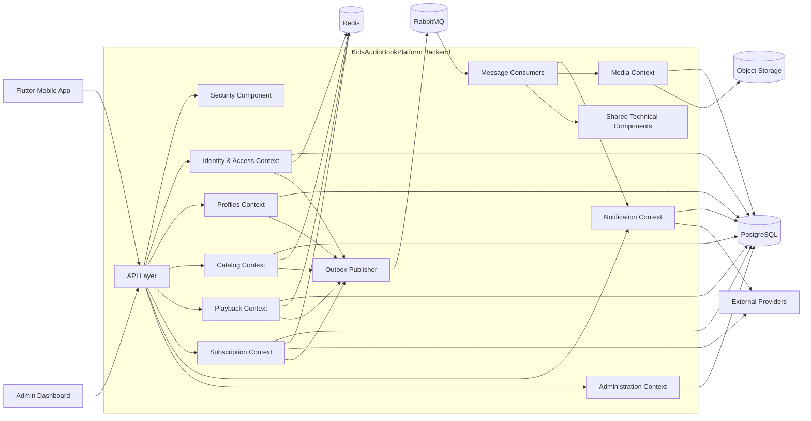
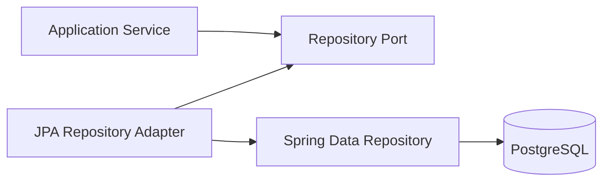
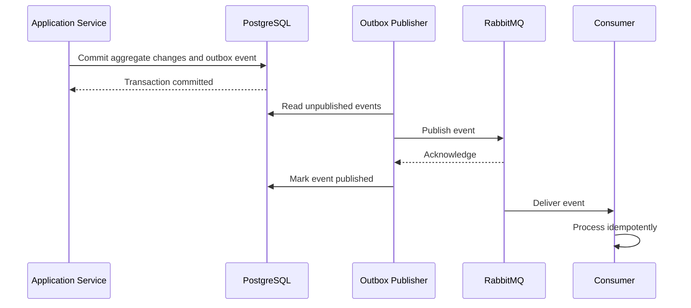
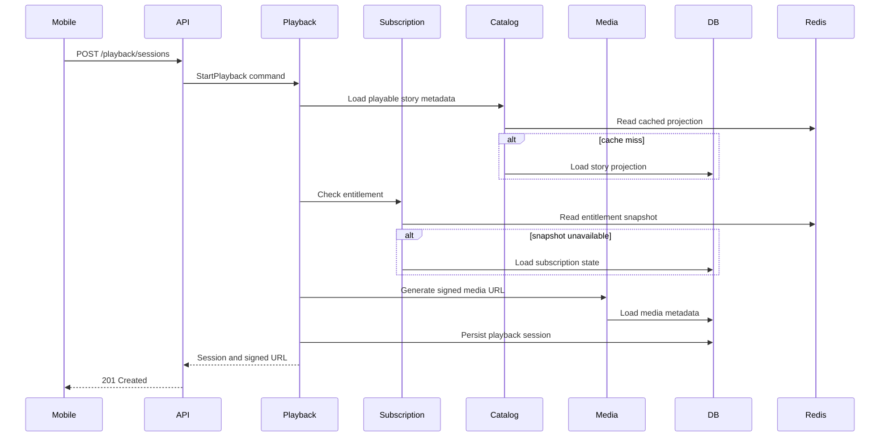
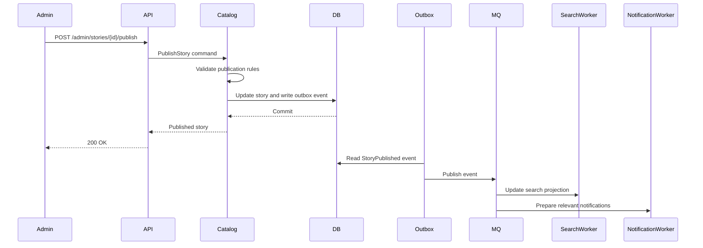

# C4 Model — Backend Component Diagram

Version: 1.0.0  
Status: Active  
Owners: Architecture and Backend Engineering  
Last reviewed: 2026-07-14

## 1. Purpose

This document describes the internal component structure of the KidsAudioBookPlatform backend container. It defines the major backend components, their responsibilities, dependency rules, runtime interactions, and extension points.

The backend is designed as a modular monolith with explicit bounded contexts and clean internal boundaries. The same boundaries are intended to support later extraction into independently deployable services when operational or scaling needs justify it.

## 2. Scope

This component view covers:

- inbound API handling;
- authentication and authorization;
- application orchestration;
- domain logic;
- persistence;
- caching;
- asynchronous messaging;
- media access;
- notifications;
- observability;
- integration with external systems.

It does not define implementation-level classes. Those belong to the code-level design document.

## 3. Architectural style

The backend follows these structural rules:

1. Package by bounded context.
2. Clean Architecture dependency direction.
3. Controllers are transport adapters only.
4. Application services orchestrate use cases.
5. Domain components contain business rules.
6. Infrastructure components implement technical concerns.
7. Persistence models are not exposed through the API.
8. Cross-context communication uses explicit contracts.
9. Asynchronous side effects use domain events and the outbox pattern.
10. External integrations are isolated behind anti-corruption layers.

## 4. High-level component diagram



## 5. API layer

### Responsibilities

- expose REST endpoints;
- deserialize and validate transport payloads;
- resolve authenticated principal and profile context;
- invoke application use cases;
- map domain and application errors to API errors;
- apply pagination, idempotency, and correlation metadata;
- return stable DTOs.

### Prohibited responsibilities

The API layer must not:

- contain business rules;
- access repositories directly;
- publish messages directly;
- construct persistence entities;
- call external providers directly;
- manage transactions.

## 6. Security component

### Responsibilities

- access-token validation;
- refresh-token lifecycle;
- device-session validation;
- role and permission checks;
- Parent Zone PIN and re-authentication checks;
- ownership validation support;
- rate-limit identity resolution;
- security audit event generation.

### Primary collaborators

- Identity & Access Context;
- Redis for short-lived security state;
- PostgreSQL for durable session and account state;
- audit logging component.

## 7. Identity & Access context

### Responsibilities

- account registration and lifecycle;
- authentication;
- password management;
- account verification;
- session and device management;
- consent state;
- parental account ownership;
- roles and permissions.

### Core application services

- `RegisterAccountUseCase`
- `AuthenticateAccountUseCase`
- `RefreshSessionUseCase`
- `RevokeSessionUseCase`
- `ChangePasswordUseCase`
- `VerifyAccountUseCase`
- `UpdateConsentUseCase`

### Domain components

- Account aggregate;
- DeviceSession aggregate;
- Credential policy;
- Consent policy;
- Session risk policy.

### Published events

- `AccountRegistered`
- `AccountVerified`
- `PasswordChanged`
- `SessionCreated`
- `SessionRevoked`
- `ConsentUpdated`

## 8. Profiles context

### Responsibilities

- child-profile creation and management;
- profile preferences;
- age-band and content-suitability settings;
- avatar and room configuration;
- active-profile selection;
- premium-only multi-profile rules.

### Domain components

- ChildProfile aggregate;
- ProfileLimitPolicy;
- AgeSuitabilityPolicy;
- ProfilePreference value objects.

### Published events

- `ChildProfileCreated`
- `ChildProfileUpdated`
- `ChildProfileDeleted`
- `ActiveProfileChanged`

## 9. Catalog context

### Responsibilities

- stories, series, and episodes;
- authors and narrators;
- categories and collections;
- language and age metadata;
- publication workflow;
- free/premium visibility;
- curated and searchable catalog views.

### Internal components

- Catalog Command Service;
- Catalog Query Service;
- Publication Workflow;
- Search Projection Builder;
- Catalog Repository Adapter;
- Catalog Cache Adapter.

### Domain components

- Story aggregate;
- Series aggregate;
- Episode entity;
- PublicationState value object;
- ContentSuitability policy;
- PremiumVisibility policy.

### Published events

- `StoryCreated`
- `StoryUpdated`
- `StoryPublished`
- `StoryUnpublished`
- `EpisodePublished`
- `CatalogMetadataChanged`

## 10. Playback context

### Responsibilities

- playback-session initiation;
- entitlement validation orchestration;
- resume position;
- progress persistence;
- completion tracking;
- listening history;
- offline-playback synchronization;
- continue-listening read model.

### Internal components

- Playback Session Service;
- Progress Service;
- History Service;
- Entitlement Gateway;
- Media URL Gateway;
- Playback Read Model;

### Domain components

- PlaybackSession aggregate;
- ListeningProgress aggregate;
- ProgressPosition value object;
- CompletionPolicy;
- ResumePolicy.

### Published events

- `PlaybackStarted`
- `ProgressUpdated`
- `StoryCompleted`
- `PlaybackStopped`

## 11. Subscription context

### Responsibilities

- subscription state;
- premium entitlements;
- trial lifecycle;
- billing-provider reconciliation;
- purchase receipt validation;
- grace periods;
- feature access decisions.

### Internal components

- Subscription Application Service;
- Entitlement Service;
- Billing Provider Adapter;
- Receipt Validation Adapter;
- Subscription Reconciliation Worker;

### Domain components

- Subscription aggregate;
- Entitlement policy;
- Trial policy;
- Grace-period policy;
- BillingState value object.

### Published events

- `SubscriptionActivated`
- `SubscriptionRenewed`
- `SubscriptionExpired`
- `SubscriptionCancelled`
- `TrialStarted`
- `EntitlementChanged`

## 12. Notification context

### Responsibilities

- in-app notifications;
- push notifications;
- email notifications where applicable;
- templates and localization;
- scheduling;
- retries and dead-letter handling;
- delivery tracking;
- read/unread state.

### Internal components

- Notification Command Service;
- Notification Query Service;
- Template Renderer;
- Localization Resolver;
- Push Provider Adapter;
- Delivery Worker;
- Retry Coordinator;

### Published events

- `NotificationCreated`
- `NotificationScheduled`
- `NotificationDelivered`
- `NotificationFailed`
- `NotificationRead`

## 13. Media context

### Responsibilities

- controlled upload sessions;
- file metadata;
- content-type and size validation;
- malware-scan coordination;
- audio processing and transcoding;
- artwork derivatives;
- signed download URLs;
- storage lifecycle management.

### Internal components

- Upload Session Service;
- Media Validation Service;
- Transcoding Coordinator;
- Derivative Generator;
- Signed URL Service;
- Object Storage Adapter;
- CDN Adapter.

### Published events

- `MediaUploaded`
- `MediaValidated`
- `MediaRejected`
- `TranscodingCompleted`
- `MediaReady`

## 14. Administration context

### Responsibilities

- content management;
- moderation;
- publication approval;
- account support operations;
- operational dashboards;
- audit search;
- administrative exports;
- feature configuration.

Administration commands must pass the same application and domain boundaries as public API commands. Admin controllers must never bypass domain rules by writing directly to persistence.

## 15. Shared technical components

Shared components are limited to technical capabilities that do not own business meaning.

Allowed examples:

- clock abstraction;
- identifier generation;
- correlation and trace support;
- transaction support;
- JSON serialization configuration;
- messaging infrastructure;
- outbox infrastructure;
- generic pagination primitives;
- standardized API error representation;
- metrics and structured logging adapters.

A shared module must not become a dumping ground for cross-context business logic.

## 16. Persistence components

Each bounded context owns its repository interfaces and persistence adapters.



Rules:

- repository interfaces belong to the owning context;
- JPA entities remain in infrastructure;
- domain objects are not required to be JPA entities;
- queries that serve read models may use dedicated projections;
- transactions begin at application-service boundaries;
- cross-context database writes are prohibited.

## 17. Caching components

Caching is implemented through ports owned by the consuming context.

Typical use:

- catalog projections;
- home-screen read models;
- short-lived entitlement snapshots;
- rate-limit counters;
- verification data;
- feature configuration.

Cache access must never leak Redis-specific types into domain or application code.

## 18. Messaging components

### Outbox publisher

The outbox publisher reads committed events from PostgreSQL and publishes them to RabbitMQ.



### Consumer rules

- consumers must be idempotent;
- duplicate delivery must be expected;
- retries must be bounded;
- poison messages move to a dead-letter queue;
- message handlers must emit metrics and structured logs;
- business state changes occur through application services.

## 19. External integration components

Every external provider is isolated behind a context-owned port and an infrastructure adapter.

Examples:

- Apple/Google purchase validation;
- push-notification provider;
- email provider;
- object storage;
- CDN;
- malware-scanning provider;
- analytics provider.

Provider-specific models must not enter the domain layer.

## 20. Critical runtime flow — start playback



## 21. Critical runtime flow — publish story



## 22. Dependency rules

Allowed dependency direction:

```text
API / Messaging Adapters
        ↓
Application Layer
        ↓
Domain Layer
        ↑
Infrastructure Adapters implement ports defined inward
```

Mandatory rules:

- domain depends on no framework;
- application may depend on domain;
- adapters may depend on application and domain contracts;
- one bounded context cannot import another context's persistence package;
- one context may call another only through an explicit application-facing interface or published event;
- shared technical code cannot depend on business contexts.

## 23. Transaction boundaries

A transaction normally covers one application use case and one bounded context.

Do not keep transactions open while:

- calling external providers;
- uploading or downloading media;
- waiting for RabbitMQ;
- performing long-running transformations;
- returning streamed content.

Cross-context workflows use orchestration, events, and compensating behavior rather than distributed transactions.

## 24. Failure handling

| Failure | Expected behavior |
|---|---|
| PostgreSQL unavailable | Reject state-changing operations; return controlled failure |
| Redis unavailable | Fall back to source of truth where safe |
| RabbitMQ unavailable | Persist outbox events and retry later |
| Object storage unavailable | Prevent new media access or upload completion; do not corrupt metadata |
| Billing provider unavailable | Apply documented entitlement grace policy |
| Push provider unavailable | Persist notification and retry asynchronously |
| Search projection stale | Fall back to simpler catalog queries where feasible |

## 25. Observability

Every component must expose or contribute to:

- request and use-case latency;
- success and failure counts;
- database timing;
- cache hit ratio;
- queue lag;
- retry and dead-letter counts;
- external-provider latency;
- business events;
- correlation and trace identifiers.

Metrics must be labeled by stable, low-cardinality values.

## 26. Testing strategy by component

| Component type | Required tests |
|---|---|
| Controller | API contract and authorization tests |
| Application service | Use-case tests with mocked ports or test adapters |
| Domain component | Fast unit tests for business invariants |
| Repository adapter | Integration tests with PostgreSQL |
| Cache adapter | Integration tests with Redis |
| Message publisher/consumer | Contract and integration tests with RabbitMQ |
| External adapter | Contract tests and failure simulations |
| End-to-end flow | Production-like happy-path and critical failure-path tests |

## 27. Microservice extraction readiness

A bounded context is a candidate for extraction when one or more of the following are true:

- it requires independent scaling;
- it has a distinct operational profile;
- release coupling becomes harmful;
- the team ownership model requires separation;
- security or compliance boundaries require isolation;
- its data lifecycle differs materially;
- its failures must be isolated from the rest of the backend.

Before extraction, verify:

- explicit API or event contracts already exist;
- persistence ownership is clear;
- no cross-context table writes exist;
- synchronous dependencies are understood;
- observability is sufficient;
- local transactions do not span contexts.

## 28. Architecture review checklist

- [ ] Component belongs to exactly one bounded context.
- [ ] Business rules are in domain or application components.
- [ ] Controller contains no persistence logic.
- [ ] Repository access is context-owned.
- [ ] Transactions are bounded to one use case.
- [ ] External integrations are behind ports.
- [ ] Events are published through the outbox pattern.
- [ ] Consumers are idempotent.
- [ ] Cache behavior includes failure and invalidation rules.
- [ ] Authorization includes resource ownership.
- [ ] Metrics, logs, and traces are defined.
- [ ] Tests cover business rules and adapters.
- [ ] Cross-context dependencies are explicit.

## 29. Related documents

- `01_System_Context.md`
- `02_Container_Diagram.md`
- `04_Code_Diagram.md`
- `../Software_Architecture.md`
- `../Backend_Architecture.md`
- `../Database_Design.md`
- `../API_Specification.md`
- `../Security_Architecture.md`
- `../Logging_Monitoring.md`
