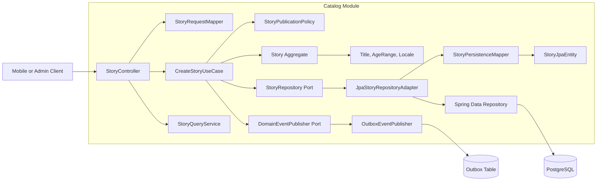
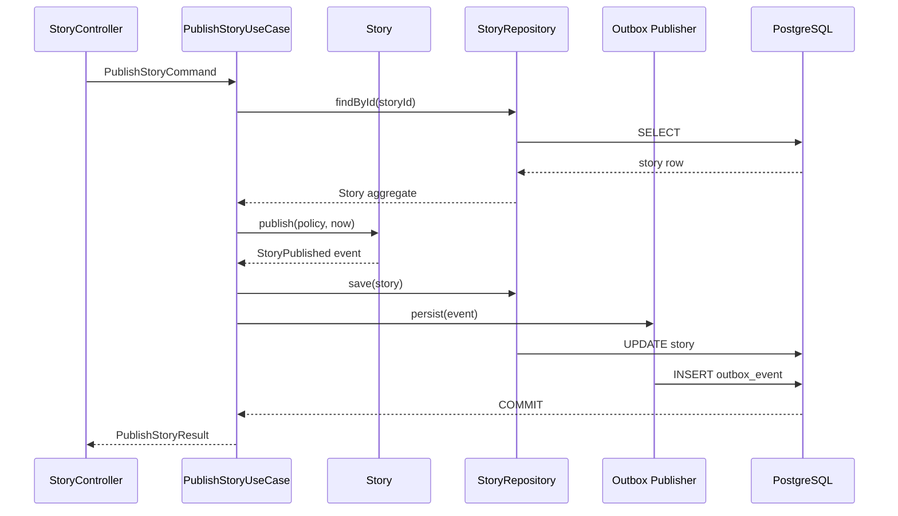
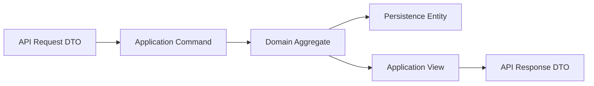
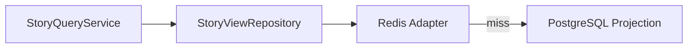

# C4 Code Diagram

Version: 1.0.0  
Status: Active Draft  
Owners: Architecture and Backend Engineering  
Last reviewed: 2026-07-14

## 1. Purpose

This document defines the code-level structure of a backend feature module in KidsAudioBookPlatform. It complements the system context, container, and component diagrams by showing how code inside a bounded context must be organized and how responsibilities flow from the API boundary to the domain and infrastructure layers.

The model is intentionally implementation-oriented. It is the reference for new modules, refactoring, code review, automated architecture tests, and future microservice extraction.

## 2. Scope

This structure applies to Spring Boot modules such as:

- identity;
- profiles;
- catalog;
- playback;
- subscriptions;
- notifications;
- administration;
- analytics;
- media processing.

The examples use the Catalog bounded context, but the same rules apply to every backend module.

## 3. Code-level architecture



## 4. Dependency direction

Dependencies must always point inward toward stable business rules.

```text
API / Infrastructure
        ↓
Application
        ↓
Domain
```

The domain layer must not depend on:

- Spring Framework;
- JPA or Hibernate;
- HTTP abstractions;
- RabbitMQ clients;
- Redis clients;
- serialization libraries;
- cloud SDKs;
- database entities.

Infrastructure implements ports declared by the application or domain layers.

## 5. Required package structure

Each bounded context uses package-by-feature and keeps internal layers inside that feature.

```text
com.kidsaudiobookplatform.catalog
├── api
│   ├── StoryController.java
│   ├── request
│   │   └── CreateStoryRequest.java
│   ├── response
│   │   └── StoryResponse.java
│   └── mapper
│       └── StoryApiMapper.java
├── application
│   ├── command
│   │   ├── CreateStoryCommand.java
│   │   └── CreateStoryUseCase.java
│   ├── query
│   │   ├── GetStoryQuery.java
│   │   └── StoryQueryService.java
│   ├── port
│   │   ├── StoryRepository.java
│   │   └── DomainEventPublisher.java
│   └── dto
│       └── StoryView.java
├── domain
│   ├── model
│   │   ├── Story.java
│   │   ├── StoryId.java
│   │   ├── StoryTitle.java
│   │   ├── AgeRange.java
│   │   └── StoryStatus.java
│   ├── event
│   │   └── StoryPublished.java
│   ├── service
│   │   └── StoryPublicationPolicy.java
│   └── exception
│       └── InvalidStoryStateException.java
└── infrastructure
    ├── persistence
    │   ├── StoryJpaEntity.java
    │   ├── SpringDataStoryRepository.java
    │   ├── JpaStoryRepositoryAdapter.java
    │   └── StoryPersistenceMapper.java
    ├── messaging
    │   └── OutboxDomainEventPublisher.java
    ├── cache
    │   └── CachedStoryQueryAdapter.java
    └── configuration
        └── CatalogModuleConfiguration.java
```

## 6. Layer responsibilities

### 6.1 API layer

Responsibilities:

- deserialize HTTP input;
- validate transport-level constraints;
- invoke exactly one application use case or query;
- map results to API responses;
- map known failures to the shared error contract;
- propagate correlation and tracing context.

The API layer must not:

- contain business decisions;
- access repositories directly;
- open transactions;
- publish messages directly;
- return JPA entities;
- expose domain internals unintentionally.

Example:

```java
@RestController
@RequestMapping("/api/v1/admin/stories")
@RequiredArgsConstructor
final class StoryController {

    private final CreateStoryUseCase createStoryUseCase;
    private final StoryApiMapper mapper;

    @PostMapping
    ResponseEntity<StoryResponse> create(@Valid @RequestBody CreateStoryRequest request) {
        var result = createStoryUseCase.handle(mapper.toCommand(request));
        return ResponseEntity.status(HttpStatus.CREATED)
                .body(mapper.toResponse(result));
    }
}
```

### 6.2 Application layer

Responsibilities:

- coordinate a business use case;
- define transaction boundaries;
- load aggregates through ports;
- invoke domain behavior;
- persist changed aggregates;
- publish domain events through an abstraction;
- enforce authorization decisions that depend on use-case context;
- orchestrate external capabilities without embedding provider details.

Application services must be small and explicit. They do not replace the domain model.

```java
@Service
@RequiredArgsConstructor
final class CreateStoryUseCase {

    private final StoryRepository storyRepository;
    private final DomainEventPublisher eventPublisher;
    private final Clock clock;

    @Transactional
    StoryView handle(CreateStoryCommand command) {
        Story story = Story.create(
                StoryId.newId(),
                StoryTitle.of(command.title()),
                AgeRange.of(command.minimumAge(), command.maximumAge()),
                command.locale(),
                clock.instant());

        storyRepository.save(story);
        eventPublisher.publishAll(story.pullDomainEvents());

        return StoryView.from(story);
    }
}
```

### 6.3 Domain layer

Responsibilities:

- model business concepts;
- protect invariants;
- expose intention-revealing behavior;
- create domain events;
- remain independent of technical frameworks.

```java
public final class Story {

    private final StoryId id;
    private StoryTitle title;
    private StoryStatus status;
    private final List<DomainEvent> events = new ArrayList<>();

    public void publish(StoryPublicationPolicy policy, Instant publishedAt) {
        policy.assertPublishable(this);
        this.status = StoryStatus.PUBLISHED;
        this.events.add(new StoryPublished(id.value(), publishedAt));
    }
}
```

Domain objects must reject invalid state at creation time or at the behavior boundary. Setters that allow arbitrary mutation are prohibited.

### 6.4 Infrastructure layer

Responsibilities:

- implement repository ports;
- map domain objects to persistence models;
- integrate with RabbitMQ, Redis, object storage, payment providers, email, and push services;
- provide framework configuration;
- isolate provider-specific failures and response formats.

```java
@Component
@RequiredArgsConstructor
final class JpaStoryRepositoryAdapter implements StoryRepository {

    private final SpringDataStoryRepository repository;
    private final StoryPersistenceMapper mapper;

    @Override
    public Optional<Story> findById(StoryId id) {
        return repository.findById(id.value()).map(mapper::toDomain);
    }

    @Override
    public void save(Story story) {
        repository.save(mapper.toEntity(story));
    }
}
```

## 7. Command and query separation

Commands change state. Queries return data. They may share infrastructure, but they must remain conceptually separate.

| Type | Characteristics |
|---|---|
| Command | Intent-oriented, transactional, validates invariants, returns minimal result |
| Query | Read-only, projection-oriented, optimized for retrieval, never changes business state |

A query may use a dedicated projection repository instead of rebuilding a full aggregate.

```mermaid
flowchart TD
    HTTP[GET /stories/{id}] --> QueryService
    QueryService --> ProjectionPort
    ProjectionPort --> SQLProjection[Optimized SQL projection]
    SQLProjection --> View[StoryView]
```

## 8. Aggregate boundaries

An aggregate is the consistency boundary for a transaction.

Rules:

- modify one aggregate per transaction by default;
- reference another aggregate by identifier, not by object graph;
- do not model large collections inside an aggregate when they grow independently;
- enforce invariants inside the aggregate boundary;
- coordinate cross-aggregate behavior through application services and events;
- avoid bidirectional JPA relationships as a domain-modeling shortcut.

Examples:

| Aggregate | Owns |
|---|---|
| Story | metadata, publication state, age suitability |
| Series | series identity and ordered episode references |
| ChildProfile | child preferences and profile restrictions |
| Subscription | entitlement lifecycle and provider reference |
| PlaybackProgress | progress for one profile-content pair |

## 9. Value objects

Use value objects for concepts that require validation or domain meaning.

Examples:

- `StoryId`;
- `StoryTitle`;
- `AgeRange`;
- `PlaybackPosition`;
- `LocaleCode`;
- `SubscriptionPeriod`;
- `EmailAddress`.

Value objects must be immutable and compare by value.

```java
public record PlaybackPosition(long milliseconds) {
    public PlaybackPosition {
        if (milliseconds < 0) {
            throw new IllegalArgumentException("Playback position cannot be negative");
        }
    }
}
```

Primitive obsession is discouraged when a primitive has validation, units, or business meaning.

## 10. Domain events

Domain events represent facts that occurred inside the domain.

Naming convention uses past tense:

- `StoryPublished`;
- `ProfileCreated`;
- `PlaybackCompleted`;
- `SubscriptionActivated`;
- `NotificationScheduled`.

Events must contain only the information required by consumers and must not serialize domain entities.

```java
public record StoryPublished(
        UUID eventId,
        UUID storyId,
        String locale,
        Instant occurredAt,
        int schemaVersion
) implements DomainEvent {}
```

Publication to RabbitMQ must use the transactional outbox pattern when event loss would create inconsistent business state.

## 11. Transaction boundary



The aggregate update and outbox insert must commit in the same database transaction.

## 12. Mapping rules

Three representations are intentionally separated:

1. API DTO;
2. domain model;
3. persistence entity.



Rules:

- never annotate domain objects with JPA annotations;
- never return persistence entities from controllers;
- keep mapping deterministic and testable;
- avoid reflection-heavy automatic mapping for critical domain models;
- do not silently discard fields during mapping;
- update mapping tests when schemas evolve.

## 13. Validation responsibilities

Validation occurs at multiple levels.

| Level | Examples |
|---|---|
| API | required JSON fields, maximum text length, syntax |
| Application | actor permissions, command preconditions, idempotency |
| Domain | invariant enforcement, legal state transitions |
| Infrastructure | provider limits, file format support, database constraints |

Duplicated protection is acceptable when layers defend different failure modes. Business rules must still have one authoritative implementation in the domain or application layer.

## 14. Error model

Errors must be explicit and mapped consistently.

```text
Domain exception
    ↓
Application failure classification
    ↓
Global API exception handler
    ↓
Shared API error response
```

Expected business failures must not be logged as unexpected server crashes.

Examples:

| Failure | HTTP status |
|---|---:|
| Invalid input | 400 |
| Unauthenticated | 401 |
| Forbidden operation | 403 |
| Missing resource | 404 |
| State conflict | 409 |
| Rate limit exceeded | 429 |
| Unexpected failure | 500 |

## 15. Idempotency

Commands that may be repeated by mobile clients or external providers must define idempotency behavior.

Candidates:

- subscription webhooks;
- progress synchronization;
- notification requests;
- upload completion callbacks;
- payment reconciliation;
- account deletion requests.

An idempotency key must be scoped to the actor and operation and stored with the result or processing state.

## 16. Caching boundary

Cache behavior belongs behind a port or in the query infrastructure. Domain logic must not know that Redis exists.



Write operations must define cache invalidation explicitly. Time-to-live alone is not sufficient for correctness-sensitive data.

## 17. External integration boundary

Every external provider must be isolated behind an application port and infrastructure adapter.

```text
SubscriptionUseCase
    ↓
SubscriptionProviderPort
    ↓
AppleSubscriptionAdapter / GoogleSubscriptionAdapter
```

Provider DTOs, error codes, and SDK classes must not leak into the domain or API contract.

The adapter translates provider concepts into the platform's canonical model. This is the anti-corruption layer.

## 18. Testing strategy by layer

| Layer | Primary tests |
|---|---|
| Domain | fast unit tests for invariants and state transitions |
| Application | use-case tests with fake or mocked ports |
| Infrastructure | repository, mapper, cache, messaging, and provider integration tests |
| API | controller and contract tests |
| Module | Spring Modulith or equivalent boundary tests |
| End-to-end | critical user journeys only |

Architecture tests must verify that:

- domain packages do not depend on infrastructure;
- controllers do not access repositories;
- modules do not use another module's internal packages;
- API models are not persistence entities;
- forbidden framework annotations do not appear in the domain layer.

Example with ArchUnit:

```java
@AnalyzeClasses(packages = "com.kidsaudiobookplatform")
class ArchitectureTest {

    @ArchTest
    static final ArchRule domainMustNotDependOnInfrastructure =
            noClasses()
                    .that().resideInAPackage("..domain..")
                    .should().dependOnClassesThat()
                    .resideInAnyPackage("..infrastructure..", "org.springframework..", "jakarta.persistence..");
}
```

## 19. Observability at code level

Application boundaries must emit enough telemetry to diagnose failures without logging sensitive data.

Required context:

- correlation ID;
- trace ID;
- authenticated account ID where allowed;
- active profile ID where relevant;
- use-case name;
- result category;
- duration;
- external dependency name;
- retry count.

Do not log:

- passwords;
- refresh tokens;
- parent PINs;
- payment credentials;
- signed media URLs;
- full child data;
- raw provider payloads containing personal data.

## 20. Code-level security rules

- Constructor injection is mandatory.
- Field injection is prohibited.
- Authorization is enforced server-side.
- Repository queries must always apply ownership and access constraints where relevant.
- SQL concatenation is prohibited.
- Deserialization into persistence entities is prohibited.
- File and media handling must occur through validated, bounded workflows.
- Secrets must come from runtime secret management.
- Sensitive values must use dedicated types or redacted representations.
- External responses are untrusted input and must be validated.

## 21. Code review checklist

Before approving a module change, verify:

- the package belongs to the correct bounded context;
- dependency direction remains inward;
- controller logic is transport-only;
- the use case has one clear responsibility;
- domain invariants are protected;
- transaction scope is minimal and explicit;
- repository access is bounded and efficient;
- events are idempotent and versioned;
- API, domain, and persistence models remain separate;
- cache invalidation is defined;
- errors use the shared contract;
- logs exclude sensitive data;
- tests cover success, validation, authorization, and failure cases;
- no internal type leaks across module boundaries.

## 22. Microservice extraction readiness

A module is ready for future extraction when:

- it owns its data model;
- all external access occurs through explicit contracts;
- cross-module calls are limited and observable;
- events are stable and versioned;
- no other module queries its tables directly;
- background jobs are owned by the module;
- configuration and metrics are identifiable by module;
- failure behavior is documented.

The modular monolith must preserve these boundaries before distributed deployment is considered.

## 23. Anti-patterns

The following are prohibited:

- one global `service` package for all features;
- controllers invoking JPA repositories;
- entities used as API responses;
- domain logic inside mappers;
- transaction annotations on controllers;
- generic `BaseService` classes that obscure use cases;
- shared mutable domain objects across modules;
- synchronous RabbitMQ publishing before database commit;
- cross-module table joins from arbitrary repositories;
- catch-all exception handling that hides failures;
- unbounded collection loading;
- provider SDK types in core business code.

## 24. Related documents

- `01_System_Context.md`
- `02_Container_Diagram.md`
- `03_Component_Diagram.md`
- `../Software_Architecture.md`
- `../Backend_Architecture.md`
- `../Database_Design.md`
- `../API_Specification.md`
- `../Security_Architecture.md`
- `../Logging_Monitoring.md`

## 25. AI implementation notes

When an AI coding agent implements a feature from this document, it must:

1. identify the owning bounded context;
2. preserve package-by-feature structure;
3. create explicit API, application, domain, and infrastructure boundaries;
4. avoid adding framework dependencies to the domain;
5. define ports before provider-specific adapters;
6. model business rules as domain behavior rather than controller conditionals;
7. include tests at the appropriate layer;
8. add or update architecture tests;
9. document new cross-module dependencies;
10. propose an ADR when deviating from these rules.

AI-generated code is not accepted solely because it compiles. It must satisfy the architecture, security, performance, observability, and testing constraints defined by the project documentation.
