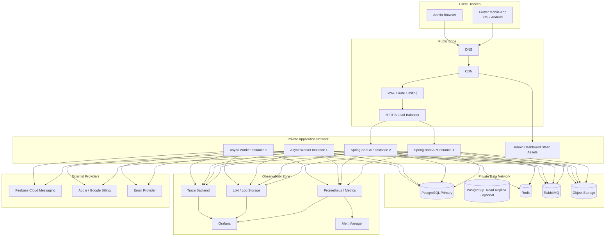
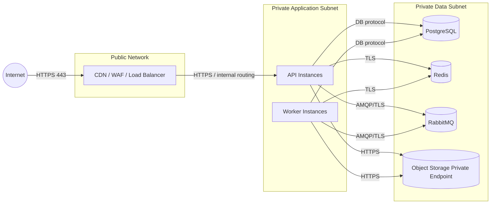
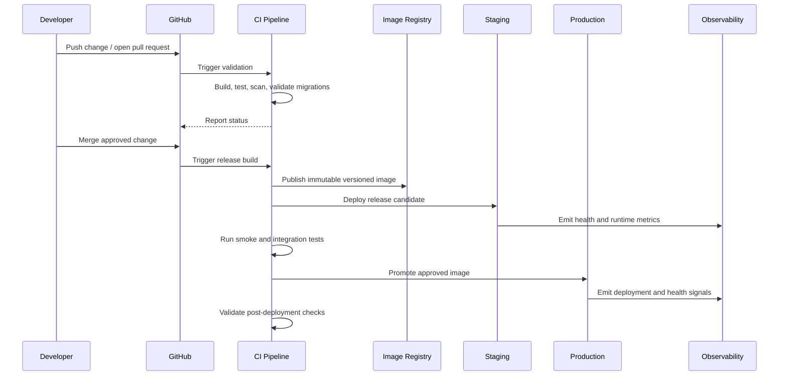

# C4 Deployment Diagram

Version: 1.0.0  
Status: Active Draft  
Owners: Architecture, Backend Engineering, Mobile Engineering, DevOps  
Last reviewed: 2026-07-14

## 1. Purpose

This document defines the deployment view for KidsAudioBookPlatform. It maps the logical containers described in the C4 model to runtime nodes, network boundaries, infrastructure services, and deployment environments.

The deployment model is designed for an initial production-ready modular monolith while preserving clear extraction paths toward independently deployable services.

## 2. Scope

This deployment view covers:

- Flutter mobile applications;
- the admin dashboard;
- edge and API entry points;
- Spring Boot backend instances;
- asynchronous workers;
- PostgreSQL;
- Redis;
- RabbitMQ;
- object storage and CDN;
- observability infrastructure;
- CI/CD and image registry;
- development, staging, and production environments;
- backup and disaster-recovery responsibilities.

## 3. Deployment principles

1. Environments must be isolated.
2. Runtime configuration must remain outside application artifacts.
3. Application nodes must be replaceable and stateless.
4. Persistent data must live only in designated managed stateful services.
5. Production traffic must enter through controlled edge components.
6. Internal infrastructure must not be directly exposed to the public internet.
7. Deployments must be repeatable, observable, and reversible.
8. Secrets must never be embedded in images, repositories, or mobile builds.
9. Background processing must scale independently from synchronous API traffic.
10. Architecture must support zero-downtime or near-zero-downtime releases.

## 4. Production deployment overview

## 5. Deployment nodes

### 5.1 Mobile client

The Flutter application is distributed through Apple App Store and Google Play.

Responsibilities:

- render the child and parent experiences;
- maintain local session state;
- cache approved metadata and artwork;
- support playback and local progress persistence;
- securely store refresh credentials and local entitlement metadata;
- synchronize data with backend APIs;
- receive push notifications.

The mobile application must never contain backend secrets, private API keys, database credentials, or unrestricted storage credentials.

### 5.2 Admin browser and static assets

The admin dashboard is delivered as versioned static assets through CDN or equivalent static hosting.

Responsibilities:

- authenticate administrators;
- invoke backend administration APIs;
- render paginated operational views;
- upload media through controlled upload sessions;
- display long-running job status.

Administrative APIs remain protected by backend authorization and are never trusted solely because the caller loaded the admin UI.

### 5.3 Public edge

The public edge contains:

- DNS;
- TLS termination;
- web application firewall controls;
- IP and identity-aware rate limiting;
- request-size restrictions;
- routing to healthy application instances;
- CDN delivery for immutable assets.

The edge must reject malformed or oversized requests before they consume backend resources where possible.

### 5.4 Spring Boot API instances

API instances host the synchronous HTTP application.

Characteristics:

- stateless across requests;
- horizontally scalable;
- immutable application image;
- no local durable storage;
- readiness and liveness probes;
- graceful shutdown;
- bounded connection and executor pools;
- externalized configuration;
- structured logging and tracing.

Session continuity must rely on signed tokens and designated shared infrastructure, not in-memory affinity.

### 5.5 Asynchronous workers

Workers process operations such as:

- notification dispatch;
- media validation and transformation;
- search indexing;
- analytics aggregation;
- outbox publication;
- scheduled cleanup;
- administrative exports;
- subscription reconciliation.

Workers use the same versioned application image when practical, but run a separate process profile and scale independently from API instances.

### 5.6 PostgreSQL

PostgreSQL stores transactional business data and is the system of record.

Deployment requirements:

- private network access only;
- encrypted connections;
- automated backups;
- point-in-time recovery where supported;
- monitored replication and storage growth;
- least-privilege database users;
- migration execution controlled by the deployment pipeline;
- no direct access from mobile or browser clients.

A read replica may be introduced for proven read-heavy workloads. It must not be used where stale reads break business invariants.

### 5.7 Redis

Redis supports caching, rate limiting, and selected short-lived coordination data.

Deployment requirements:

- private network only;
- authentication and encrypted transport where supported;
- memory limits and eviction policy;
- monitored hit ratio, latency, memory use, and evictions;
- explicit behavior when unavailable.

Redis is not the authoritative source for core business state.

### 5.8 RabbitMQ

RabbitMQ provides durable asynchronous messaging.

Deployment requirements:

- private network access;
- durable queues for business-critical workflows;
- dead-letter exchanges;
- bounded retries;
- publisher confirms where delivery guarantees require them;
- consumer prefetch limits;
- queue-depth and age monitoring;
- backup or mirrored/clustered configuration based on environment criticality.

### 5.9 Object storage and CDN

Object storage contains audio files, illustrations, derivatives, and administrative uploads.

Rules:

- buckets remain private by default;
- clients use short-lived signed upload or download URLs;
- immutable versioned keys are preferred;
- malware and content validation complete before publication;
- CDN serves approved immutable media;
- object lifecycle rules manage temporary and obsolete files;
- backend instances do not proxy large media bodies unless explicitly required.

### 5.10 Observability platform

The observability deployment includes metrics, logs, traces, dashboards, and alert routing.

Production components must export:

- request rate, latency, errors, and saturation;
- JVM and process metrics;
- database-pool metrics;
- cache metrics;
- queue depth and consumer lag;
- external dependency latency;
- business-critical success and failure counters.

Observability infrastructure must not receive secrets or raw sensitive payloads.

## 6. Network boundaries

Mandatory rules:

- no public database endpoints;
- no public RabbitMQ management interface;
- no public Redis endpoint;
- administration access is restricted and audited;
- outbound access is limited to approved external providers where infrastructure permits;
- environment networks and credentials are not shared.

## 7. Environment topology

### 7.1 Local development

Local development may use Docker Compose for:

- PostgreSQL;
- Redis;
- RabbitMQ;
- MinIO;
- local observability components where useful.

Developer environments use synthetic data and non-production credentials.

### 7.2 Continuous integration

CI runs in an ephemeral environment and performs:

- compilation;
- unit tests;
- architecture tests;
- integration tests;
- dependency and secret scanning;
- container-image build;
- image scanning;
- documentation checks;
- migration validation.

CI must not receive production credentials.

### 7.3 Staging

Staging mirrors production structure closely enough to validate:

- deployment behavior;
- migrations;
- integrations using sandbox providers;
- load and performance tests;
- rollback procedures;
- observability and alerts;
- backup restoration exercises.

Staging must not silently share production databases, buckets, queues, or secrets.

### 7.4 Production

Production requires:

- multiple application instances where availability targets require them;
- controlled rolling or blue-green deployment;
- protected data services;
- production-grade backup and recovery;
- alerting and incident ownership;
- audit logging;
- explicit change approval and rollback readiness.

## 8. CI/CD deployment flow

The same immutable artifact must be promoted across environments. Rebuilding different binaries for staging and production is prohibited.

## 9. Release strategy

Preferred strategies:

- rolling deployment for backward-compatible changes;
- blue-green deployment for higher-risk releases;
- feature flags for incomplete or gradually enabled behavior;
- canary deployment when traffic volume and infrastructure justify it.

A release must support rollback at the application level. Database changes require forward-compatible migration design because data migrations may not be safely reversible.

## 10. Database migration deployment rules

Use expand-and-contract migrations:

1. Add backward-compatible schema elements.
2. Deploy code that can work with old and new schema states.
3. Backfill data asynchronously when necessary.
4. Switch reads and writes to the new representation.
5. Remove obsolete schema only after all deployed versions no longer depend on it.

Prohibited patterns:

- destructive schema changes before compatible code is deployed;
- long blocking migrations during peak traffic;
- unreviewed production migration execution;
- application startup depending on an unpredictable long-running migration.

## 11. Health checks

### Liveness

Liveness answers whether the process is alive. It must not fail merely because a downstream dependency is temporarily unavailable.

### Readiness

Readiness answers whether the instance can safely receive traffic. It may consider:

- application initialization;
- required configuration;
- database connectivity;
- migration compatibility;
- essential internal resources.

Optional dependencies should not always remove an instance from service when graceful degradation is possible.

### Startup checks

Slow-starting components may use a startup probe to prevent premature restarts.

## 12. Scaling model

### API scaling signals

Scale API capacity based on a combination of:

- CPU;
- memory;
- request concurrency;
- request latency;
- thread or executor saturation;
- database-pool pressure.

### Worker scaling signals

Scale workers based on:

- queue depth;
- oldest-message age;
- processing duration;
- failure and retry rates;
- CPU and memory.

Scaling application instances without validating downstream capacity is prohibited. PostgreSQL, Redis, RabbitMQ, and external provider quotas must be considered.

## 13. Availability zones and failure isolation

Where the hosting platform supports it, production application instances should be spread across failure domains or availability zones.

Stateful services require provider-appropriate redundancy. The design must consider:

- loss of one application instance;
- loss of one worker instance;
- zone outage;
- database failover;
- Redis outage;
- RabbitMQ outage;
- object-storage degradation;
- external-provider outage.

The platform must preserve playback and core read experiences where possible even when analytics, recommendations, or notification delivery are degraded.

## 14. Backup and recovery

Backups must include:

- PostgreSQL full and incremental/PITR data as supported;
- object-storage versioning or backup policy;
- RabbitMQ definitions and infrastructure configuration;
- encryption-key recovery procedures where applicable;
- infrastructure-as-code and deployment configuration.

Required operational practices:

- document Recovery Point Objective (RPO);
- document Recovery Time Objective (RTO);
- test restoration regularly;
- record restoration evidence;
- protect backups with separate access controls;
- define retention and deletion rules.

A backup that has never been restored in a test is not considered verified.

## 15. Secrets and configuration

Configuration categories:

| Category | Storage |
|---|---|
| Non-sensitive runtime configuration | Environment-specific configuration service or deployment variables |
| Secrets | Approved secret manager |
| Mobile public configuration | Build-time environment configuration with no sensitive values |
| Feature flags | Dedicated feature-flag system or controlled configuration store |
| Certificates and signing material | Secret manager or managed certificate service |

Rules:

- secrets are injected at runtime;
- secret values are redacted from logs;
- rotation does not require rebuilding source code;
- production secrets are inaccessible to normal development environments;
- emergency access is time-bound and audited.

## 16. Deployment observability

Every deployment creates an observable event containing:

- application version;
- commit SHA;
- deployment environment;
- deployment start and completion time;
- result;
- rollback status;
- migration version;
- responsible pipeline or operator.

Dashboards must allow teams to correlate deployments with changes in latency, errors, saturation, queue lag, and business failures.

## 17. Failure scenarios

| Failure | Expected behavior |
|---|---|
| One API instance fails | Load balancer removes it; remaining instances continue |
| Worker instance fails | Unacknowledged messages are redelivered according to queue policy |
| Redis unavailable | Essential reads fall back to PostgreSQL; cache-dependent optimizations degrade |
| RabbitMQ unavailable | Transactional writes use outbox persistence; publication resumes later |
| Object storage unavailable | Metadata remains available; media operations fail safely and visibly |
| Push provider unavailable | Notifications remain persisted and retry later |
| Database unavailable | Readiness fails for dependent APIs; alerts fire; no silent data loss |
| Bad application release | Health checks or smoke tests trigger rollback |
| Bad migration | Deployment stops; recovery follows reviewed migration playbook |
| CDN issue | Clients may use controlled origin fallback only if explicitly configured |

## 18. Security controls by node

### Edge

- TLS enforcement;
- WAF rules;
- DDoS protections where available;
- request-size limits;
- rate limiting;
- security headers.

### Application nodes

- non-root container user;
- read-only filesystem where practical;
- minimal base image;
- no shell or debug tooling in production images unless justified;
- vulnerability scanning;
- restricted service account permissions.

### Data nodes

- private endpoints;
- encryption in transit;
- encryption at rest where supported;
- least-privilege accounts;
- audited administrative access;
- backup protection.

## 19. Infrastructure ownership matrix

| Component | Primary owner | Secondary owner |
|---|---|---|
| Mobile release | Mobile Engineering | Product Operations |
| Admin static deployment | Frontend Engineering | DevOps |
| Spring Boot API | Backend Engineering | DevOps |
| Async workers | Backend Engineering | DevOps |
| PostgreSQL | DevOps / Platform | Backend Engineering |
| Redis | DevOps / Platform | Backend Engineering |
| RabbitMQ | DevOps / Platform | Backend Engineering |
| Object storage and CDN | DevOps / Platform | Backend Engineering |
| Observability stack | DevOps / Platform | All engineering teams |
| CI/CD pipelines | DevOps / Platform | Repository owners |

## 20. Microservice evolution

The initial modular monolith may evolve into separate deployable services when justified by:

- independent scaling needs;
- distinct availability requirements;
- clear data ownership;
- separate release cadence;
- team ownership boundaries;
- proven performance bottlenecks;
- isolation of high-risk workloads.

Potential early extraction candidates include:

- media processing workers;
- notifications;
- search indexing;
- subscription reconciliation;
- analytics aggregation.

Extraction must preserve observability, security, event contracts, idempotency, and operational ownership.

## 21. Deployment review checklist

Before a production release, verify:

- [ ] The immutable artifact passed all required CI checks.
- [ ] Image and dependency scans have no unaccepted critical findings.
- [ ] Configuration and secrets are available in the target environment.
- [ ] Database migrations are backward compatible.
- [ ] Backup and restore prerequisites are valid.
- [ ] Readiness, liveness, and smoke tests are defined.
- [ ] Rollback steps are documented.
- [ ] Dashboards and alerts cover the changed capability.
- [ ] External-provider quotas and sandbox/production endpoints are correct.
- [ ] No state is stored only on application-node local disks.
- [ ] Capacity remains sufficient after deployment.
- [ ] Deployment ownership and incident contacts are known.

## 22. Related documents

- `../Software_Architecture.md`
- `../Backend_Architecture.md`
- `../Security_Architecture.md`
- `../Performance_Guidelines.md`
- `../Logging_Monitoring.md`
- `../Database_Design.md`
- `01_System_Context.md`
- `02_Container_Diagram.md`
- `03_Component_Diagram.md`
- `04_Code_Diagram.md`

## 23. AI implementation notes

An AI coding or infrastructure agent working from this document must:

1. preserve private network boundaries;
2. avoid embedding secrets in code or configuration files;
3. keep application containers stateless;
4. use immutable versioned artifacts;
5. add health checks and observability for every deployable process;
6. use backward-compatible database migrations;
7. define rollback and failure behavior;
8. avoid exposing PostgreSQL, Redis, RabbitMQ, or object-storage administration publicly;
9. document any new deployable component in this C4 deployment view;
10. create or update an ADR for significant topology changes.
