# C4 Runtime Views

Version: 1.0.0  
Status: Active Draft  
Owners: Architecture, Backend Engineering, Mobile Engineering  
Last reviewed: 2026-07-14

## 1. Purpose

This document complements the static C4 diagrams with runtime views for the most important user and administrative flows in KidsAudioBookPlatform.

The runtime views show how containers and components collaborate during real requests, where trust boundaries are crossed, which operations are synchronous or asynchronous, and where failure handling is required.

## 2. Scope

The document covers:

- authentication and session refresh;
- child profile selection;
- catalog browsing;
- story playback authorization;
- playback progress synchronization;
- offline playback reconciliation;
- subscription entitlement validation;
- content publication;
- media upload and processing;
- notification dispatch;
- audit and observability propagation.

## 3. Runtime modeling rules

Every runtime flow must make the following explicit:

1. initiating actor;
2. entry container;
3. trust-boundary transitions;
4. synchronous dependencies;
5. asynchronous messages;
6. transaction boundary;
7. retry behavior;
8. idempotency strategy;
9. timeout behavior;
10. observability context.

A runtime diagram is not complete if it only shows the happy path.

## 4. Authentication and session creation

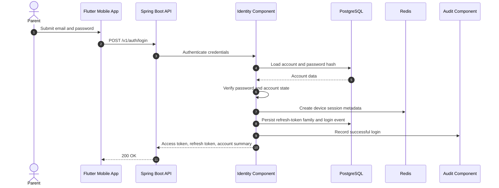

### Runtime rules

- Password verification must use an approved adaptive hash.
- Account-state validation happens before token issuance.
- Refresh tokens are rotated and bound to a token family.
- Device session metadata may be cached in Redis, but authoritative revocation data remains durable.
- Login events must include correlation ID, device ID, IP classification, and outcome.
- Authentication errors must not reveal whether an account exists.

### Failure paths

| Failure | Required behavior |
|---|---|
| Invalid credentials | Return generic authentication failure |
| Locked account | Deny login and emit audit event |
| Redis unavailable | Continue with durable session storage where safe |
| Database unavailable | Fail closed |
| Audit sink delayed | Buffer or persist audit event without blocking indefinitely |

## 5. Access-token refresh

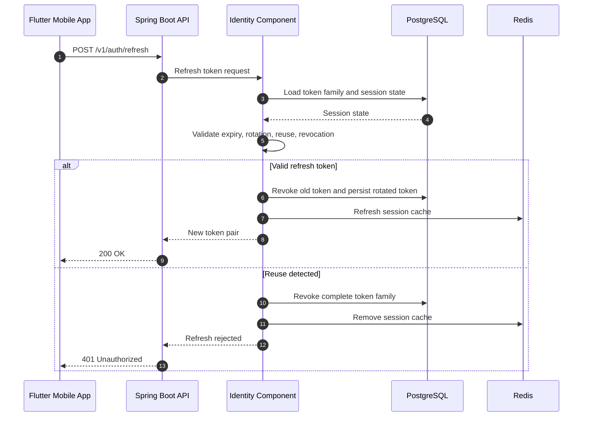

Refresh-token reuse detection must revoke the full token family and force re-authentication.

## 6. Child profile selection

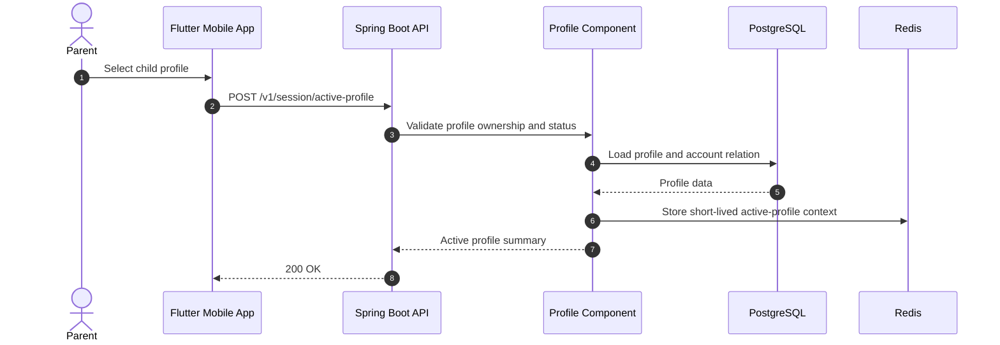

The active profile is a convenience context, not an authorization shortcut. Every profile-scoped request must still validate ownership.

## 7. Browse child home screen

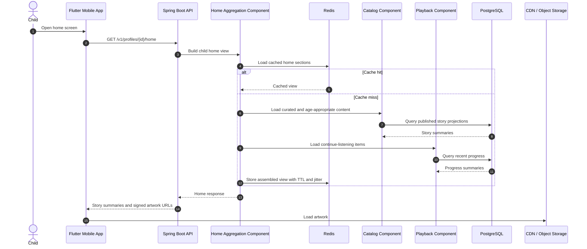

### Performance constraints

- No more than two synchronous internal component calls after cache miss.
- The response must use summary projections, not full aggregates.
- Artwork bytes must not pass through the API.
- A recommendation failure must degrade to curated content.

## 8. Story details and playback authorization

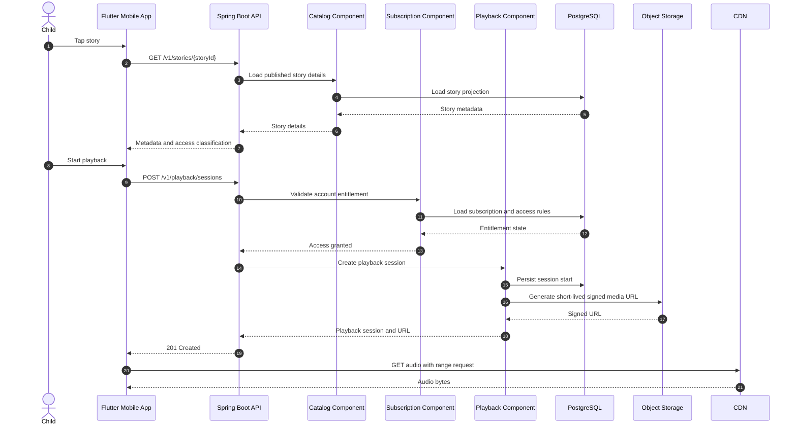

### Security rules

- The story must be published and allowed for the selected profile.
- Premium access must be checked before signed URL generation.
- Signed media URLs must be short-lived and scoped to the requested object.
- The URL response must not expose storage credentials or internal bucket details.

## 9. Playback progress synchronization

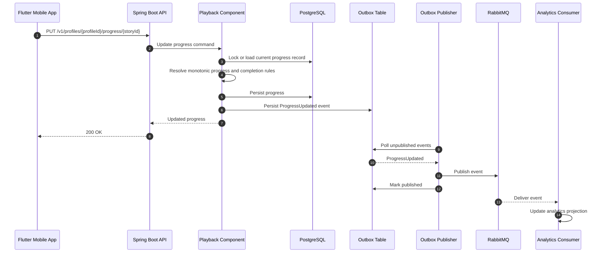

### Consistency rules

- Progress writes must be idempotent.
- The client supplies an operation ID or a version where required.
- Replayed updates must not move progress backward unless the user explicitly restarts a story.
- Completion events must be emitted once per completion transition.
- Event publication uses the transactional outbox pattern.

## 10. Offline playback reconciliation

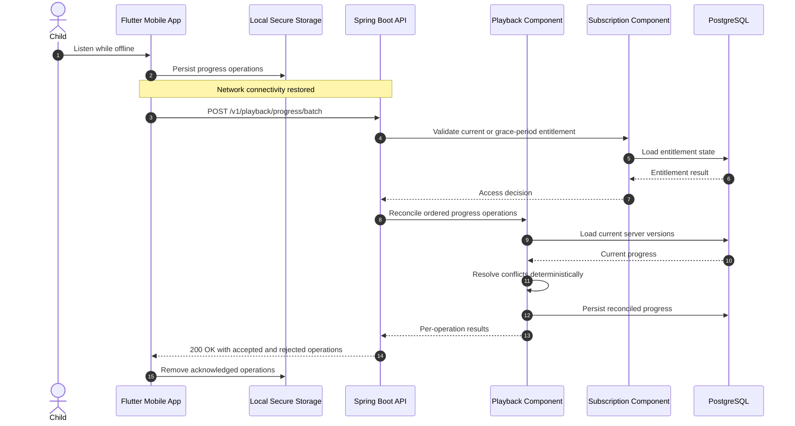

The batch endpoint must return a result for every operation. One invalid operation must not silently discard the full batch unless atomic behavior is explicitly requested.

## 11. Subscription purchase and entitlement activation

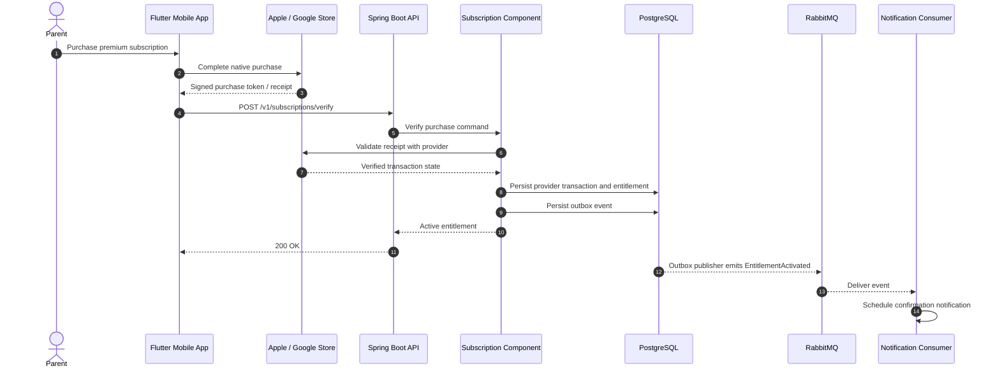

### Idempotency

Provider transaction IDs are unique. Repeated verification of the same transaction must return the existing result and must not create duplicate entitlements.

## 12. Provider webhook processing

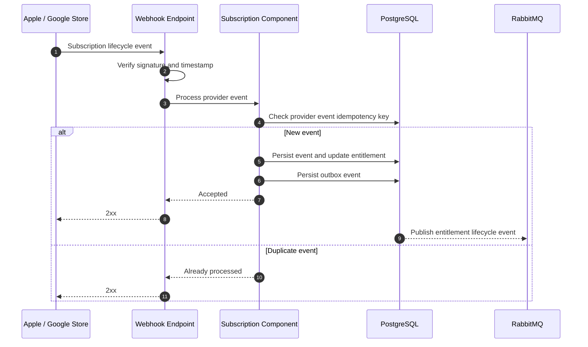

Invalid signatures must be rejected before any business processing.

## 13. Content and media publication

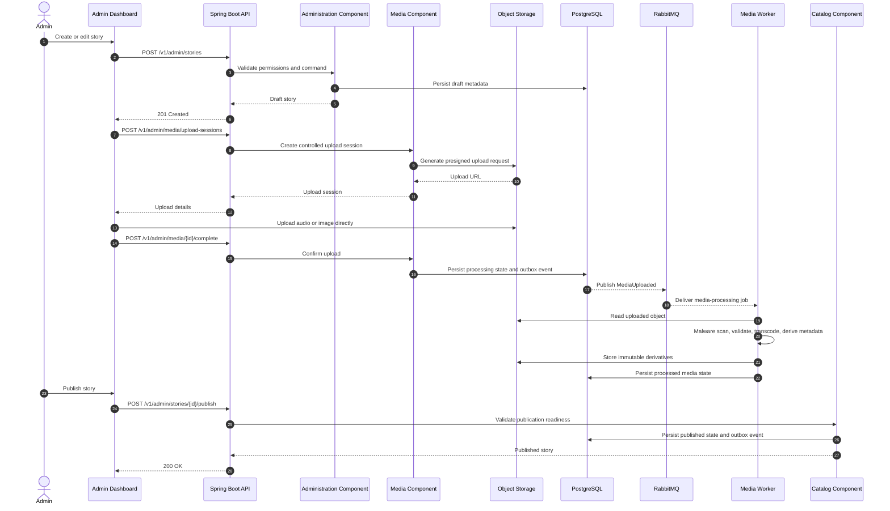

### Publication invariants

A story cannot become published unless:

- required metadata exists;
- age classification is valid;
- at least one playable media asset is in ready state;
- artwork is available;
- language information is complete;
- premium/free classification is explicit;
- moderation and approval rules are satisfied.

## 14. Notification dispatch

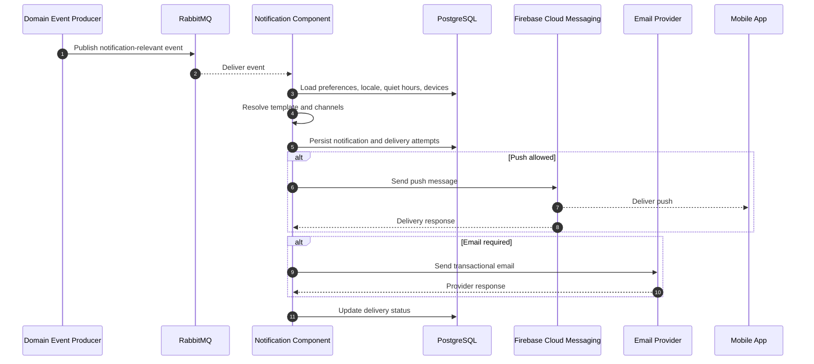

### Delivery rules

- Consumers must be idempotent.
- Notification preferences and quiet hours must be respected.
- Child-facing notifications must use approved safe templates.
- Provider failures use bounded retries and dead-letter handling.
- A notification failure must not roll back the originating business transaction.

## 15. Account deletion and privacy workflow

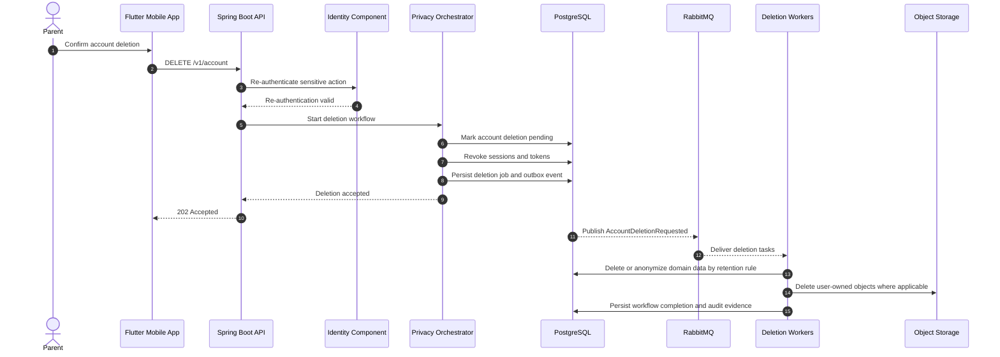

Deletion is an orchestrated workflow, not a single cascading SQL statement. Legal retention requirements must be applied explicitly.

## 16. Correlation and trace propagation

Every synchronous request and asynchronous message must carry observability context.

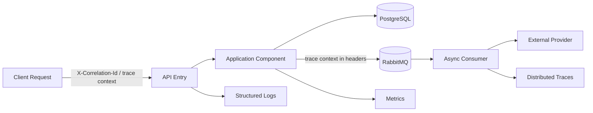

Required fields include:

- correlation ID;
- trace ID and span ID;
- actor type and actor ID where permitted;
- account ID or profile ID where relevant;
- operation name;
- event ID for messages;
- idempotency key for retriable writes;
- source container and component.

Sensitive values, tokens, passwords, PINs, and raw provider receipts must never be logged.

## 17. Timeout hierarchy

Timeouts must be layered so that callers stop waiting after callees.

Example request budget:

| Layer | Maximum budget |
|---|---:|
| Mobile request | 10 seconds |
| API handler | 8 seconds |
| Internal component orchestration | 6 seconds |
| External provider call | 3 seconds |
| Database query target | 500 ms for interactive paths |
| Redis operation target | 100 ms |

These are design defaults, not universal constants. Each integration must document its own measured limits.

## 18. Retry matrix

| Operation | Retry allowed | Notes |
|---|---|---|
| GET catalog projection | Yes | Small bounded retry for transient infrastructure failure |
| Password authentication | No automatic retry | User controls retry |
| Refresh-token rotation | No blind retry | Requires idempotent request handling |
| Progress upsert | Yes | Must use operation ID or version |
| Provider receipt verification | Yes | Bounded, only for transient errors |
| Push notification delivery | Yes | Exponential backoff and dead-letter queue |
| Media processing | Yes | Job must be idempotent |
| Account deletion task | Yes | Step-level checkpointing required |
| Validation failure | No | Deterministic failure |
| Authorization failure | No | Fail immediately |

## 19. Runtime anti-patterns

The following are prohibited:

- calling external providers inside an open database transaction;
- publishing messages before the authoritative transaction commits;
- synchronous notification delivery in a user-facing request;
- streaming audio through the Spring Boot API under normal operation;
- loading complete entities for list screens;
- unbounded retries;
- retrying non-idempotent commands without a key;
- using Redis as the sole source of truth;
- relying on active-profile cache as authorization proof;
- logging tokens, passwords, PINs, receipts, or private child data.

## 20. Runtime review checklist

Before approving a new runtime flow, verify:

- [ ] The initiating actor and entry point are clear.
- [ ] Authorization occurs at the correct boundary.
- [ ] Profile and resource ownership are validated.
- [ ] The transaction boundary is explicit.
- [ ] External calls occur outside database transactions.
- [ ] Message publication uses the outbox pattern where required.
- [ ] Idempotency behavior is documented.
- [ ] Timeout and retry behavior are documented.
- [ ] Cache failure behavior is defined.
- [ ] Partial failure behavior is defined.
- [ ] Correlation and trace context are propagated.
- [ ] Sensitive information is excluded from logs.
- [ ] Metrics and alerting signals are identified.
- [ ] The mobile client can recover from network interruption.
- [ ] The flow remains valid if it is later split across microservices.

## 21. Related documents

- `../Software_Architecture.md`
- `../Backend_Architecture.md`
- `../Mobile_Architecture.md`
- `../API_Specification.md`
- `../Database_Design.md`
- `../Security_Architecture.md`
- `../Logging_Monitoring.md`
- `../Notifications.md`
- `01_System_Context.md`
- `02_Container_Diagram.md`
- `03_Component_Diagram.md`
- `04_Code_Diagram.md`
- `05_Deployment_Diagram.md`
