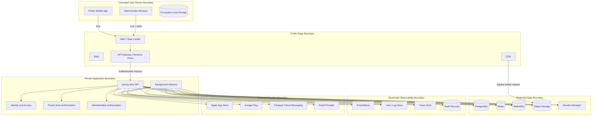
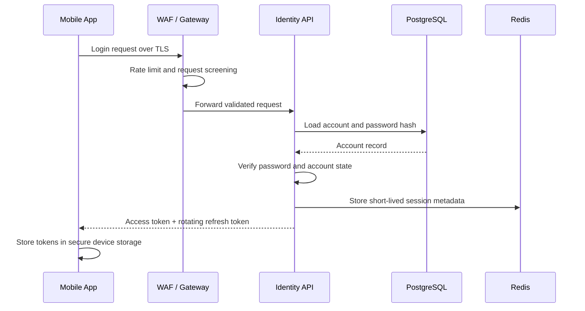
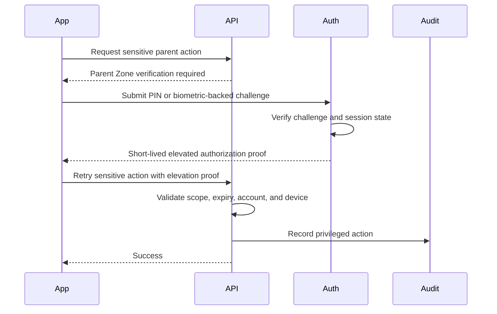
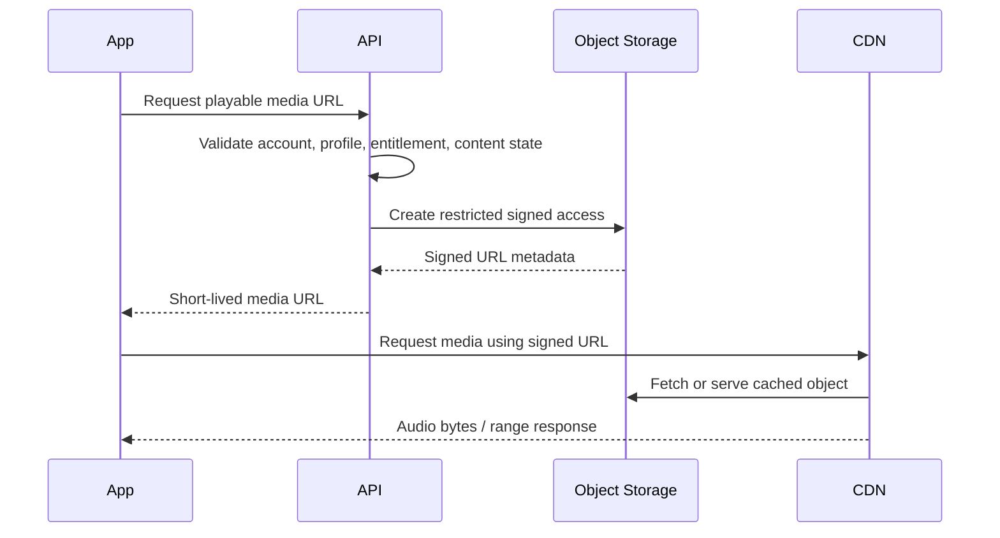

# Security and Trust Boundaries

Version: 1.0.0  
Status: Active Draft  
Owner: Architecture and Security Engineering  
Last reviewed: 2026-07-14

## 1. Purpose

This document defines the security-oriented C4 view for KidsAudioBookPlatform. It identifies trust boundaries, sensitive assets, privileged components, authentication and authorization checkpoints, and the controls required when data crosses from one boundary to another.

This view complements:

- `Security_Architecture.md`;
- `01_System_Context.md`;
- `02_Container_Diagram.md`;
- `05_Deployment_Diagram.md`;
- `06_Runtime_Views.md`.

## 2. Security design principles

1. No request is trusted because of network location alone.
2. Authentication and authorization are separate controls.
3. Parent and administrator actions require stronger protection than child playback actions.
4. Each bounded context validates resource ownership independently.
5. Tokens, secrets, payment identifiers, and private child data must never appear in logs.
6. External integrations are treated as untrusted even when they are official providers.
7. Media delivery is authorized by the backend but served through time-limited signed URLs.
8. Every privileged change creates an immutable audit record.
9. Service credentials are scoped to the minimum required permissions.
10. Security controls must fail closed for sensitive operations.

## 3. Primary trust boundaries



## 4. Asset classification

| Asset | Classification | Examples | Minimum controls |
|---|---|---|---|
| Public | Public | Published story title, public artwork | Integrity, CDN caching |
| Internal | Internal | Feature configuration, internal identifiers | Authentication, access control |
| Confidential | Confidential | Parent email, child profile metadata, playback history | Encryption, ownership checks, audit |
| Restricted | Restricted | Password hashes, refresh tokens, secrets, admin credentials | Strong encryption, strict access, rotation |
| Regulated or payment-adjacent | Highly restricted | Store transaction identifiers, entitlement evidence | Minimal retention, no raw payment data, audit |

Child profile data is confidential even when it does not contain a legal name. Usage patterns, favorites, age ranges, and listening history must be treated as sensitive.

## 5. Identity zones

### 5.1 Child session

A child session is intentionally limited. It may:

- browse age-appropriate catalog content;
- play entitled stories;
- update playback progress;
- manage child-safe preferences;
- access already authorized offline content.

It must not:

- change account credentials;
- purchase or cancel subscriptions;
- create or delete profiles;
- reveal parent account details;
- enter administrative functions;
- modify privacy or retention settings.

### 5.2 Parent session

A parent session may perform account and family-management actions after normal authentication. Sensitive operations require Parent Zone verification through a PIN, biometrics, or re-authentication.

Sensitive operations include:

- creating or deleting child profiles;
- changing age or content restrictions;
- managing subscriptions;
- exporting or deleting account data;
- changing credentials;
- authorizing a new device;
- viewing detailed child activity.

### 5.3 Administrator session

Administrative access requires:

- individual named accounts;
- MFA;
- short session lifetime;
- least-privilege roles;
- re-authentication for destructive actions;
- complete audit logging;
- no shared credentials.

Production database access must not be implied by application administrator privileges.

## 6. Authentication flow boundary



Controls:

- credentials are never logged;
- password verification uses a modern adaptive hash;
- login responses do not reveal whether an email exists;
- repeated failures trigger progressive throttling;
- refresh tokens rotate after use;
- reuse of an invalidated refresh token revokes the token family;
- access tokens remain short-lived.

## 7. Authorization checkpoints

Authorization is enforced at multiple layers.

| Layer | Responsibility |
|---|---|
| Gateway | Reject malformed or clearly unauthenticated requests |
| Controller/API adapter | Validate required authentication context and request shape |
| Application service | Enforce use-case permissions and ownership |
| Domain model | Enforce invariant-level business rules |
| Repository query | Scope data access to authorized account or profile |
| Object storage signer | Grant access only to approved media resources |

A valid token is not sufficient proof that the caller may access a resource.

Example ownership rule:

```text
requestedChildProfile.accountId must equal authenticatedAccount.id
```

The comparison must be enforced server-side and must not rely on identifiers supplied by the client.

## 8. Parent Zone trust elevation



The elevation proof must:

- be short-lived;
- be tied to the authenticated account and device session;
- contain a narrow scope;
- be single-use for destructive operations where practical;
- never be accepted by administrative endpoints.

## 9. Administrative boundary

The admin dashboard is a separate trust zone from the consumer mobile application.

Required controls:

- separate client registration or audience;
- separate role namespace;
- MFA enforcement;
- IP or device restrictions when operationally feasible;
- stricter rate limits;
- explicit approval for high-risk actions;
- immutable audit event containing actor, action, target, timestamp, result, and correlation ID;
- no direct object-storage write without a backend-issued upload session.

Examples of high-risk actions:

- publishing or unpublishing content;
- deleting media;
- changing subscription entitlements;
- suspending accounts;
- initiating data deletion;
- modifying notification campaigns;
- assigning administrator roles.

## 10. Media trust boundary

Audio and artwork bytes should normally bypass the API after authorization.



Controls:

- signed URLs are short-lived;
- object keys are unguessable but are not treated as authorization;
- private buckets reject anonymous access;
- CDN origin access is restricted;
- range requests are supported without exposing unrelated objects;
- upload and download permissions are separate;
- newly uploaded media is quarantined until validation completes.

## 11. Upload security boundary

All uploaded audio, images, and documents are untrusted.

Required pipeline:

1. backend creates a scoped upload session;
2. client uploads to a quarantine location;
3. worker validates size, type, signature, and metadata;
4. malware scanning runs where supported;
5. media is transcoded or normalized;
6. generated derivatives are stored under immutable keys;
7. approved assets are promoted to the publishable area;
8. failures retain no public access path.

File extensions are not trusted. Validation must use content signatures and decoding attempts.

## 12. External billing boundary

Apple and Google billing responses are external input.

Controls:

- purchase evidence is validated server-side;
- webhook signatures or provider authenticity mechanisms are verified;
- transaction processing is idempotent;
- entitlement changes are recorded with provider evidence;
- duplicate and out-of-order events are tolerated;
- raw payment-card data is never collected or stored;
- client-provided subscription state is never authoritative.

## 13. Messaging boundary

RabbitMQ is inside the protected application network but messages are still treated as untrusted inputs because they can be duplicated, delayed, reordered, or malformed.

Consumers must:

- validate schema and version;
- verify required identifiers;
- be idempotent;
- enforce authorization assumptions using authoritative data when necessary;
- avoid carrying secrets in payloads;
- move poison messages to a dead-letter queue;
- emit security-relevant failures to monitoring.

## 14. Redis boundary

Redis may hold:

- rate-limit counters;
- short-lived session metadata;
- cache entries;
- verification challenges;
- idempotency markers.

Redis must not become the sole durable source for:

- account ownership;
- subscription entitlement history;
- audit records;
- published content state;
- data deletion workflows.

Controls:

- private network access only;
- authentication and encryption where supported;
- explicit key namespaces;
- bounded TTLs;
- no plaintext secrets;
- safe behavior when Redis is unavailable.

## 15. Database boundary

PostgreSQL controls:

- separate credentials for API, workers, migrations, and read-only operations where practical;
- no superuser account for application runtime;
- parameterized queries only;
- encrypted connections;
- backups encrypted and access-controlled;
- audit-sensitive tables protected from application-level deletion;
- migration credentials available only during deployment;
- production access logged and time-bounded.

Application queries must include account or profile ownership predicates rather than loading unrestricted data and filtering in memory.

## 16. Secrets boundary

Secrets include:

- database credentials;
- RabbitMQ credentials;
- object-storage keys;
- JWT signing keys;
- provider API keys;
- email and push credentials;
- webhook verification secrets.

Rules:

- secrets never enter source control;
- local development uses documented non-production values;
- CI/CD receives secrets through protected secret storage;
- rotation procedures are documented and tested;
- services receive only the secrets they need;
- secret values are redacted from logs and error messages;
- signing keys support overlap during rotation.

## 17. Observability boundary

Observability platforms contain sensitive operational information and require restricted access.

Logs must not include:

- passwords;
- access or refresh tokens;
- Parent Zone PINs;
- full signed URLs;
- raw payment evidence;
- private child information;
- provider secrets;
- complete request or response bodies by default.

Safe fields include:

- correlation ID;
- trace ID;
- anonymized or internal actor ID;
- endpoint template;
- result code;
- latency;
- event type;
- bounded error category.

Audit records are distinct from diagnostic logs and have stricter integrity and retention requirements.

## 18. Threat scenarios and controls

| Threat | Primary controls |
|---|---|
| Credential stuffing | Rate limiting, breached-password controls, anomaly detection |
| Token theft | Short access-token lifetime, secure device storage, refresh rotation |
| Insecure direct object reference | Server-side ownership checks and scoped queries |
| Child entering Parent Zone | PIN/biometric elevation and short-lived proof |
| Privilege escalation | Explicit roles, deny-by-default, role-change audit |
| Malicious upload | Quarantine, type validation, malware scan, transcoding |
| Signed URL sharing | Short TTL, entitlement validation, optional device/session binding |
| Webhook forgery | Signature verification, replay protection, idempotency |
| Queue poisoning | Schema validation, bounded retries, DLQ |
| Secret leakage | Secret manager, log redaction, scanning, rotation |
| Data scraping | Rate limits, pagination bounds, anomaly detection |
| Admin account compromise | MFA, short sessions, least privilege, audit alerts |
| Dependency compromise | Lock files, SBOM, dependency scanning, trusted registries |

## 19. Security monitoring signals

Alert on:

- unusual login failure volume;
- refresh-token reuse;
- repeated Parent Zone failures;
- access attempts across account boundaries;
- unexpected administrator role changes;
- large content or user exports;
- repeated signed-URL generation failures;
- invalid billing webhook signatures;
- dead-letter spikes caused by malformed events;
- secret-scanner findings;
- sudden increases in 401 or 403 responses;
- administrator access from unusual locations or devices.

Alerts must include correlation information without exposing sensitive data.

## 20. Security review checklist

Before a new container, component, endpoint, event, or integration is approved:

- [ ] Trust boundary crossings are identified.
- [ ] Authentication requirements are explicit.
- [ ] Authorization and ownership checks are defined.
- [ ] Sensitive fields are classified.
- [ ] Log-redaction requirements are documented.
- [ ] Rate limits and abuse controls are defined.
- [ ] Secrets and credentials have an owner and rotation plan.
- [ ] External inputs are validated and authenticated where possible.
- [ ] Retry and replay behavior is safe.
- [ ] Audit events are defined for privileged actions.
- [ ] Failure behavior is fail-closed where required.
- [ ] Data-retention and deletion requirements are covered.
- [ ] Security tests are part of the Definition of Done.

## 21. Required security tests

At minimum:

- authentication success and failure cases;
- refresh-token rotation and replay detection;
- cross-account resource-access attempts;
- child-session attempts against Parent Zone endpoints;
- missing, expired, or wrong-scope elevation proofs;
- administrator role and permission tests;
- malicious and oversized upload tests;
- forged and replayed webhook tests;
- signed-URL expiry tests;
- log-redaction tests;
- dependency and secret scanning in CI;
- rate-limit and abuse-path tests.

## 22. Change governance

Any architecture change that introduces a new trust boundary, identity type, privileged role, external provider, public endpoint, data store, or media path requires:

1. an update to this document;
2. a security review;
3. corresponding threat scenarios;
4. updated tests;
5. an ADR when the decision is architecturally significant.
