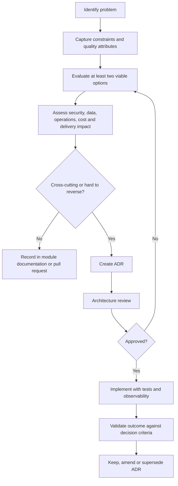

# Architecture Decision Guide

Version: 1.0.0  
Status: Active Draft  
Owners: Architecture and Engineering  
Last reviewed: 2026-07-14

## 1. Purpose

This guide defines how architectural decisions are made, documented, reviewed, and revisited in KidsAudioBookPlatform. Its goal is to keep implementation choices consistent across backend, mobile, administration, data, infrastructure, security, and integrations.

The guide complements the ADR collection. ADRs record important decisions; this document defines the process and criteria used to reach them.

## 2. Decision principles

Architectural decisions must:

1. solve a concrete product or engineering problem;
2. optimize for the current stage without blocking credible future evolution;
3. prefer reversible choices when uncertainty is high;
4. make ownership and operational impact explicit;
5. minimize accidental complexity;
6. include security, privacy, observability, and testing implications;
7. be based on measurable constraints rather than technology preference;
8. preserve child safety and parental control as non-negotiable requirements;
9. avoid distributing a problem before a modular solution has been validated;
10. include a migration or rollback path when the change is high risk.

## 3. When an ADR is required

An ADR is required when a decision changes one or more of the following:

- system boundaries;
- bounded-context ownership;
- data ownership or consistency model;
- public API contracts;
- asynchronous event contracts;
- authentication or authorization model;
- privacy or child-safety controls;
- persistence technology;
- messaging technology;
- deployment topology;
- scalability model;
- observability strategy;
- third-party provider;
- mobile offline behavior;
- subscription or entitlement validation;
- media-delivery architecture;
- irreversible or expensive migration paths.

An ADR is usually not required for local implementation details that do not affect contracts or architectural boundaries.

## 4. Decision workflow



## 5. Required decision inputs

Before selecting an option, document:

- user journey affected;
- functional requirement;
- expected traffic and data volume;
- latency and availability targets;
- privacy classification;
- compliance constraints;
- failure modes;
- operational ownership;
- expected implementation effort;
- migration complexity;
- rollback strategy;
- assumptions that still need validation.

Decisions based on unknowns must identify how those unknowns will be measured.

## 6. Quality-attribute priority

For this platform, the default order of priority is:

1. child safety and privacy;
2. correctness of identity, parental controls, subscriptions, and entitlements;
3. reliability of playback and progress;
4. security and abuse resistance;
5. maintainability and testability;
6. predictable performance;
7. operability and observability;
8. scalability;
9. cost efficiency;
10. development convenience.

This order can change for a specific feature, but the exception must be explicit.

## 7. Synchronous versus asynchronous communication

Use synchronous communication when:

- the caller requires an immediate result;
- the operation is short and bounded;
- the response is needed to complete the user journey;
- the dependency is sufficiently reliable;
- transaction semantics are local to one bounded context.

Use asynchronous communication when:

- eventual completion is acceptable;
- work may be slow or bursty;
- retries are expected;
- the producer should not wait for consumers;
- multiple consumers react independently;
- processing can be safely made idempotent;
- the operation should survive temporary downstream outages.

### 7.1 Decision table

| Question | Prefer synchronous | Prefer asynchronous |
|---|---|---|
| Does the user need the result now? | Yes | No |
| Is the work potentially long-running? | No | Yes |
| Must producer and consumer be available together? | Acceptable | Avoid |
| Are retries likely? | Rare | Expected |
| Are there multiple independent consumers? | Usually no | Often yes |
| Can completion be eventual? | No | Yes |

### 7.2 Platform examples

- Login and token refresh: synchronous REST.
- Story catalog browsing: synchronous REST with caching.
- Save playback progress: synchronous acknowledgement, with optional asynchronous analytics.
- Media validation and transcoding: asynchronous.
- Push notification delivery: asynchronous.
- Subscription webhook processing: asynchronous after signature validation and durable persistence.
- Administrative export generation: asynchronous.

## 8. REST versus messaging

Use REST for commands and queries that require immediate caller feedback. Use RabbitMQ for durable domain or integration events and background work.

Do not use messaging merely to avoid defining a clean module API. Do not use REST chains for operations that can tolerate eventual consistency.

### 8.1 REST contract requirements

- explicit versioning strategy;
- validated request models;
- stable error catalogue;
- bounded timeouts;
- idempotency for retryable writes;
- authorization at resource level;
- correlation and trace propagation;
- pagination for collections.

### 8.2 Messaging contract requirements

- event name and semantic owner;
- schema version;
- immutable event identity;
- occurred-at timestamp;
- correlation and causation identifiers;
- idempotent consumer behavior;
- retry and dead-letter policy;
- compatibility rules;
- data-minimization review.

## 9. Data-store selection

### 9.1 PostgreSQL

Use PostgreSQL for:

- authoritative transactional data;
- accounts and profiles;
- catalog metadata;
- subscriptions and entitlements;
- playback progress;
- notification records;
- audit records;
- outbox events.

PostgreSQL remains the default source of truth unless an ADR explicitly changes ownership.

### 9.2 Redis

Use Redis for:

- bounded caches;
- short-lived tokens or verification state;
- rate-limit counters;
- distributed coordination where justified;
- ephemeral feature or session data.

Redis must not become the only source of truth for critical business state.

### 9.3 Object storage

Use object storage for:

- audio files;
- images and illustrations;
- generated derivatives;
- administrative exports;
- large immutable artifacts.

Store metadata and ownership references in PostgreSQL. Never store large media payloads directly in relational columns without an approved exception.

### 9.4 Search engine

Do not introduce a dedicated search engine until PostgreSQL search is proven insufficient through measured requirements. Adoption requires an ADR covering indexing, synchronization, reindexing, failure handling, and operating cost.

## 10. Cache decision guide

Introduce a cache only when at least one of these is true:

- repeated reads create measurable load;
- latency objectives cannot be met efficiently from the source;
- the data is stable enough for a clear invalidation strategy;
- the cached result can be safely reconstructed.

Every cache decision must define:

- key structure;
- owner;
- TTL;
- invalidation method;
- stale-data tolerance;
- fallback behavior;
- metrics;
- data sensitivity.

A cache without an invalidation and failure strategy is not approved.

## 11. Consistency model

Use strong consistency for:

- credentials and security-sensitive state;
- Parent Zone protection;
- profile ownership;
- subscription and entitlement transitions;
- content-publication state changes;
- account deletion state;
- payment-provider event deduplication.

Eventual consistency is acceptable for:

- analytics;
- recommendations;
- notification delivery;
- search indexing;
- read-model refreshes;
- derived counters;
- campaign metrics.

The user experience must clearly tolerate the chosen delay.

## 12. Transaction boundaries

A database transaction must remain inside one bounded context and one authoritative database boundary.

Rules:

- do not hold transactions open while calling external systems;
- publish external events through the transactional outbox pattern;
- keep transactions short;
- retry only safe operations;
- use idempotency for duplicate commands and webhooks;
- avoid distributed transactions;
- define compensation for multi-step workflows.

## 13. Modular monolith versus microservices

The default architecture is a modular monolith with independently owned bounded contexts and explicit internal contracts.

A module becomes a microservice only when evidence shows a clear benefit, such as:

- materially different scaling profile;
- separate release cadence;
- strong security isolation requirement;
- distinct availability objective;
- separate operational ownership;
- persistent delivery bottlenecks caused by shared deployment;
- technology requirements that cannot reasonably coexist;
- high change coupling that cannot be solved through modular design.

Do not extract a service solely because a module exists.

### 13.1 Extraction readiness checklist

- Domain boundary is stable.
- Data ownership is explicit.
- Public contract is versioned.
- Events are documented.
- Consumers tolerate eventual consistency.
- Observability is sufficient.
- Deployment and rollback are automated.
- Failure isolation provides real value.
- Operational ownership exists.
- Migration plan has been tested.

## 14. Build versus buy

Prefer a managed or external capability when it is non-differentiating and difficult to operate safely, such as push delivery, app-store billing integration, transactional email, or CDN delivery.

Prefer building when:

- the behavior is core product differentiation;
- privacy requirements make outsourcing unsuitable;
- provider lock-in creates unacceptable risk;
- the capability is simple and cheaper to own;
- external products cannot satisfy child-safety or parental-control requirements.

Every provider decision must cover portability, data processing, failure behavior, rate limits, cost, security review, and exit strategy.

## 15. Security decision gate

Every significant decision must answer:

- What trust boundary changes?
- What data classification is involved?
- Which identities can access the capability?
- Is resource ownership enforced?
- Are secrets introduced?
- Can the feature be abused at scale?
- Is rate limiting required?
- Are audit records required?
- Does the change affect children or parental consent?
- What happens after account deletion?

Security review is mandatory for authentication, authorization, uploads, media access, subscriptions, administration, and child-data processing.

## 16. Observability decision gate

Every production feature must define:

- logs required for diagnosis;
- metrics required for health and business outcomes;
- trace boundaries;
- alert conditions;
- dashboards;
- correlation identifiers;
- sensitive-data redaction;
- ownership of alerts;
- expected degraded behavior.

A feature that cannot be diagnosed in production is not complete.

## 17. Failure-mode decision gate

For each dependency, document:

- timeout;
- retry eligibility;
- retry count and backoff;
- circuit-breaker behavior;
- fallback;
- idempotency;
- dead-letter handling;
- operator visibility;
- recovery procedure.

Examples:

| Dependency | Default degraded behavior |
|---|---|
| Redis unavailable | Read essential data from PostgreSQL; disable nonessential cache-dependent behavior |
| RabbitMQ unavailable | Persist outbox work and recover later; do not silently lose events |
| Push provider unavailable | Keep notification record and retry asynchronously |
| Billing provider unavailable | Use documented entitlement grace rules where allowed |
| CDN artwork failure | Show safe placeholder; do not block playback |
| Analytics unavailable | Continue core user journey |

## 18. Mobile architecture decisions

Mobile decisions must consider:

- offline behavior;
- local data sensitivity;
- secure storage;
- battery and bandwidth impact;
- app lifecycle interruptions;
- background execution limits;
- store-review constraints;
- backward compatibility with older app versions;
- synchronization conflicts;
- accessibility and child-friendly interaction.

Server contracts must not assume all users upgrade immediately.

## 19. Decision scoring model

Use the following weighted criteria when options are difficult to compare:

| Criterion | Weight |
|---|---:|
| Security and privacy | 5 |
| Correctness and data integrity | 5 |
| Maintainability | 4 |
| Reliability | 4 |
| Delivery complexity | 3 |
| Performance | 3 |
| Operability | 3 |
| Scalability | 2 |
| Cost | 2 |
| Reversibility | 3 |

Score each option from 1 to 5. The score supports discussion but does not replace engineering judgment.

## 20. ADR template

```markdown
# ADR-XXX: Decision title

Status: Proposed | Accepted | Superseded | Deprecated
Date: YYYY-MM-DD
Owners: ...

## Context
What problem and constraints led to this decision?

## Decision drivers
- Driver 1
- Driver 2

## Considered options
1. Option A
2. Option B
3. Option C

## Decision
What was selected and why?

## Consequences
### Positive
- ...

### Negative
- ...

### Risks
- ...

## Security and privacy impact
- ...

## Operational impact
- ...

## Migration and rollback
- ...

## Validation
How will we know the decision worked?

## Related documents
- ...
```

## 21. Review checklist

Before approval:

- The problem is stated without assuming a solution.
- Constraints are measurable where possible.
- At least two viable alternatives were considered.
- Data ownership is explicit.
- Security and privacy impact is reviewed.
- Child-safety implications are reviewed.
- Failure modes are documented.
- Operational ownership exists.
- Testing and observability are defined.
- Migration and rollback are realistic.
- Cost and provider lock-in are understood.
- C4 diagrams and related documents will be updated.
- The decision is as simple as the requirements allow.

## 22. Revisit triggers

A decision must be revisited when:

- assumptions are disproved by production data;
- SLOs are repeatedly missed;
- security requirements change;
- scale increases significantly;
- provider behavior or cost changes materially;
- a module's ownership changes;
- operational burden becomes disproportionate;
- new legal or child-privacy requirements apply;
- the selected technology reaches end of support.

Superseded decisions remain in history and link to their replacements.

## 23. Related documents

- `../Software_Architecture.md`
- `../Backend_Architecture.md`
- `../Database_Design.md`
- `../API_Specification.md`
- `../Security_Architecture.md`
- `../Performance_Guidelines.md`
- `01_System_Context.md`
- `02_Container_Diagram.md`
- `03_Component_Diagram.md`
- `04_Code_Diagram.md`
- `05_Deployment_Diagram.md`
- `06_Runtime_Views.md`
- `07_Security_Trust_Boundaries.md`

## 24. AI implementation notes

AI-assisted implementation must not silently introduce a new architectural pattern, dependency, external provider, database, queue, trust boundary, or cross-context coupling.

When a requested implementation conflicts with this guide, the AI must:

1. identify the conflict;
2. avoid inventing an implicit exception;
3. propose the smallest compliant design;
4. request or generate an ADR when the decision is architectural;
5. preserve existing contracts unless an approved migration is included.
