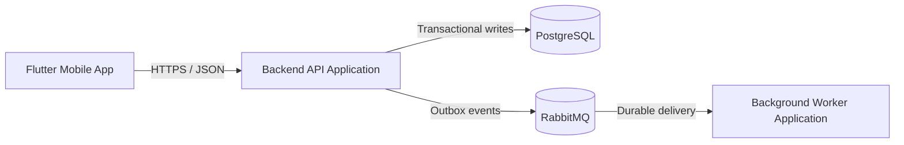

# Diagram Maintenance Guide

Version: 1.0.0  
Status: Active Draft  
Owner: Project Architecture  
Last updated: 2026-07-15

## 1. Purpose

This document defines how the KidsAudioBookPlatform architecture diagrams are created, reviewed, versioned, validated, published, and kept synchronized with implementation.

The diagrams are engineering assets. They are not decorative documentation and must remain accurate enough to support design reviews, onboarding, implementation planning, incident analysis, security review, and future service extraction.

This guide applies to:

- C4 System Context diagrams;
- C4 Container diagrams;
- C4 Component diagrams;
- code-level diagrams;
- deployment diagrams;
- runtime and sequence diagrams;
- trust-boundary diagrams;
- data-flow diagrams;
- supporting dependency and ownership diagrams.

## 2. Objectives

The maintenance process must ensure that diagrams:

- represent the current intended architecture;
- distinguish current state from target state;
- use consistent naming across documents and code;
- expose system, security, data, and deployment boundaries;
- identify ownership and responsibility;
- remain readable at the intended abstraction level;
- can be rendered in GitHub without manual fixes;
- are updated in the same change that modifies architecture;
- link to the relevant ADRs, contracts, and operational documentation.

## 3. Source of Truth

The Markdown and Mermaid source committed to the repository is the source of truth.

Rendered screenshots, exported PNG files, presentation copies, whiteboard diagrams, and external design-tool links are secondary representations. They must not be treated as authoritative unless their source is also versioned in the repository.

When multiple artifacts conflict, use this priority order:

1. accepted Architecture Decision Records;
2. implementation and deployable configuration;
3. API, event, and database contracts;
4. C4 and runtime diagrams;
5. explanatory prose and exported images.

A conflict between these artifacts must be resolved explicitly. It must not be hidden by changing only one document.

## 4. Diagram Inventory

The canonical C4 documentation is located under `docs/03_Architecture/C4_Model/`.

| File | Primary purpose | Expected update trigger |
|---|---|---|
| `01_System_Context.md` | People, platform, and external systems | New actor, external system, or system boundary |
| `02_Container_Diagram.md` | Deployable applications and data stores | New deployable unit, database, queue, or client |
| `03_Component_Diagram.md` | Major backend and client components | New bounded context or major component dependency |
| `04_Code_Diagram.md` | Representative code organization and dependency direction | Package, module, or architectural pattern change |
| `05_Deployment_Diagram.md` | Runtime infrastructure and environments | Hosting, network, scaling, or topology change |
| `06_Runtime_Views.md` | Important end-to-end interactions | New critical flow or material behavior change |
| `07_Security_Trust_Boundaries.md` | Trust zones and sensitive transitions | Authentication, authorization, data exposure, or provider change |
| `08_Architecture_Decision_Guide.md` | Decision process and ADR linkage | Governance process change |
| `10_Diagram_Maintenance_Guide.md` | Diagram lifecycle and quality rules | Maintenance process change |
| `15_Architecture_Roadmap.md` | Target evolution and staged architecture | Strategic architecture sequencing change |
| `16_Known_Technical_Debt.md` | Known architecture gaps | New debt, mitigation, or retirement |
| `20_Architecture_Operations_Handbook.md` | Operating the architecture | Operational responsibility or procedure change |
| `21_Architecture_KPI_and_Metrics.md` | Architecture health measurements | KPI, SLO, or measurement change |
| `22_Cost_and_Capacity_Model.md` | Capacity and cost assumptions | Load, pricing, scaling, or infrastructure change |

The inventory in `C4_Model/README.md` must remain synchronized with this list.

## 5. Ownership

### 5.1 Document owner

The Project Architecture owner is accountable for:

- maintaining the diagram standards;
- resolving conflicts between architecture documents;
- ensuring that major changes have appropriate diagrams;
- approving changes that alter system boundaries;
- coordinating periodic reviews.

### 5.2 Change owner

The engineer or team introducing an architecture-affecting change is responsible for updating all affected diagrams in the same pull request or commit series.

The change owner must not delegate documentation correctness to a future cleanup task unless the architecture owner explicitly accepts the temporary gap and records it as technical debt.

### 5.3 Reviewers

Review should include the owners of the affected areas:

- backend architecture for modules, data, messaging, and APIs;
- mobile architecture for Flutter, offline, playback, and device security;
- admin architecture for privileged workflows;
- security for trust boundaries and sensitive data;
- platform or DevOps for deployment and operational topology;
- product or domain owner when boundaries change business responsibility.

## 6. Change Triggers

A diagram review is mandatory when a change introduces or modifies:

- a bounded context;
- a deployable application or worker;
- a database, schema, cache, queue, topic, exchange, or object store;
- an external provider;
- a synchronous or asynchronous integration;
- an authentication or authorization boundary;
- a new category of sensitive data;
- a public API or event contract with architectural impact;
- a background job or scheduled process;
- an offline synchronization path;
- a media upload or delivery path;
- a scaling or high-availability mechanism;
- a new environment, region, network zone, or ingress path;
- a service extraction or consolidation;
- an ownership transfer;
- a material failure, retry, or recovery strategy.

A diagram update may also be required after:

- a production incident;
- a security review;
- a penetration test;
- a disaster-recovery exercise;
- a capacity review;
- a major framework or infrastructure upgrade.

## 7. Abstraction Rules

Each diagram must stay within its intended level of abstraction.

### 7.1 System Context

Include:

- people or actor roles;
- KidsAudioBookPlatform as one system;
- external systems and providers;
- high-level relationships.

Do not include:

- internal modules;
- database tables;
- classes;
- queue names;
- low-level protocols unless essential to the context.

### 7.2 Container

Include:

- mobile app;
- admin dashboard;
- backend API;
- worker applications;
- databases and infrastructure stores;
- message broker;
- object storage and CDN;
- major external providers;
- primary communication protocols.

Do not include:

- individual classes;
- every table;
- every endpoint;
- incidental utility libraries.

### 7.3 Component

Include:

- bounded contexts;
- application services;
- ports and adapters where architecturally important;
- owned data and external dependencies;
- cross-module communication.

Do not include every package or method.

### 7.4 Code

Code diagrams are representative. They must explain dependency direction and organization rather than reproduce the complete repository tree.

### 7.5 Runtime

Runtime diagrams must show:

- initiating actor;
- authoritative decision points;
- synchronous versus asynchronous interactions;
- persistence boundaries;
- external providers;
- failure or retry behavior when important;
- correlation and audit behavior for privileged flows.

### 7.6 Deployment

Deployment diagrams must distinguish:

- environment boundaries;
- public and private network paths;
- ingress and egress;
- stateless and stateful workloads;
- scaling units;
- secrets and configuration sources;
- observability destinations;
- backup and recovery dependencies.

## 8. Naming Conventions

Names must match the canonical names used in architecture documents and implementation.

Use:

- `Flutter Mobile App` for the consumer mobile client;
- `Admin Dashboard` for the privileged web client;
- `Backend API Application` for the initial API runtime;
- `Background Worker Application` for asynchronous processing;
- bounded-context names from `Software_Architecture.md`;
- external-provider names only when the provider is an approved architecture decision.

Avoid:

- ambiguous names such as `Service`, `Manager`, or `System` without context;
- temporary project nicknames;
- different names for the same component across diagrams;
- implementation class names in high-level diagrams;
- acronyms that are not defined in the document.

Identifiers inside Mermaid source should be stable and concise. Human-readable labels may change, but identifiers should not be renamed without reason because unnecessary renames make reviews harder.

## 9. Visual Conventions

Diagrams should use consistent visual semantics.

Recommended conventions:

- actors are placed at the edges;
- clients appear before backend systems in left-to-right flows;
- authoritative systems of record are visually distinct from caches;
- external systems are clearly marked;
- asynchronous communication is labeled as events or queues;
- trust boundaries are explicitly named;
- optional or future components are marked as target-state elements;
- failure paths use notes or separate diagrams rather than overcrowding the happy path.

Color must not be the only carrier of meaning. Labels, shapes, and boundaries must remain understandable in dark mode, light mode, monochrome export, and for users with color-vision differences.

## 10. Mermaid Standards

All diagrams committed as Mermaid must render using GitHub-supported Mermaid syntax.

Rules:

- use fenced code blocks with the `mermaid` language identifier;
- prefer simple graph, flowchart, sequence, state, and class syntax;
- avoid experimental features that GitHub does not reliably render;
- quote labels containing punctuation when required;
- avoid excessively long node labels;
- break large diagrams into multiple focused diagrams;
- do not encode secrets, real user identifiers, private URLs, or credentials;
- keep direction explicit, such as `LR` or `TB`;
- verify that special characters do not break parsing;
- include explanatory prose before or after complex diagrams.

Example:

## 11. Current State and Target State

A diagram must clearly identify whether it describes:

- current production state;
- current implementation target;
- transitional state;
- future option;
- rejected alternative.

Target-state components must not appear as if they already exist.

Use explicit labels such as:

- `Current MVP`;
- `Target after service extraction`;
- `Optional future capability`;
- `Transitional adapter`.

When current and target states differ materially, create separate diagrams rather than mixing both into one ambiguous view.

## 12. ADR Integration

A diagram change must reference an ADR when it reflects a decision that:

- changes the architecture style;
- introduces a new datastore or broker;
- changes a trust boundary;
- creates a new deployable service;
- changes the source of truth;
- introduces a new provider dependency;
- changes API or event compatibility strategy;
- changes the deployment or resilience model.

The diagram should reference the ADR in nearby prose. The ADR should reference the affected diagram when practical.

Minor corrections, label fixes, and synchronization with an already accepted ADR do not require a new ADR.

## 13. Pull Request and Commit Review

Every architecture-affecting change must answer:

1. Which diagrams are affected?
2. Does the diagram represent current or target state?
3. Which ADR authorizes the change?
4. Are API, event, database, security, and deployment documents consistent?
5. Has ownership changed?
6. Are new failure modes visible?
7. Are trust boundaries still correct?
8. Can the diagram be rendered by GitHub?
9. Has obsolete architecture been removed or clearly marked?
10. Are follow-up gaps recorded as technical debt?

A reviewer must compare the diagram against both implementation and related documentation. Visual plausibility alone is not sufficient approval.

## 14. Review Checklist

### Structure

- [ ] The diagram uses the correct C4 abstraction level.
- [ ] The title and purpose are clear.
- [ ] Current and target states are not mixed ambiguously.
- [ ] Major relationships are labeled.
- [ ] The diagram is readable without excessive zoom.

### Naming and ownership

- [ ] Names match implementation and canonical documentation.
- [ ] Bounded-context ownership is clear.
- [ ] Data ownership is clear.
- [ ] External providers are identified.
- [ ] Deprecated names have been removed.

### Security

- [ ] Trust boundaries are accurate.
- [ ] Authentication and authorization decision points are visible where relevant.
- [ ] Privileged admin paths are separated from consumer paths.
- [ ] Sensitive data flows are minimized and labeled.
- [ ] Provider callbacks are treated as untrusted input.

### Data and messaging

- [ ] Systems of record are distinguished from caches and projections.
- [ ] Synchronous and asynchronous interactions are distinguishable.
- [ ] Transactional outbox usage is reflected where relevant.
- [ ] Retry, dead-letter, replay, and idempotency responsibilities are represented in runtime views when material.
- [ ] Object storage and CDN delivery paths do not incorrectly pass media through application servers.

### Deployment and operations

- [ ] Deployable units match actual or approved deployment plans.
- [ ] Scaling boundaries are correct.
- [ ] Health, observability, and operational dependencies are included where relevant.
- [ ] Backup and recovery dependencies are not contradicted.
- [ ] Environment-specific behavior is documented.

### Consistency

- [ ] Related ADRs are linked.
- [ ] Related architecture documents are updated.
- [ ] API, event, and database contracts do not contradict the diagram.
- [ ] Diagram syntax renders correctly in GitHub.
- [ ] The C4 inventory remains accurate.

## 15. Validation and Automation

Where practical, CI should validate:

- Mermaid syntax;
- broken Markdown links;
- duplicate or missing diagram titles;
- references to nonexistent ADRs;
- required metadata fields;
- stale generated exports, if exports are committed;
- prohibited terms or deprecated component names.

Architecture tests in the codebase should complement diagrams by enforcing:

- allowed module dependencies;
- forbidden cross-context persistence access;
- separation between consumer and admin APIs;
- domain independence from infrastructure frameworks;
- package visibility rules;
- event ownership and schema boundaries.

Automation does not replace architecture review. It detects mechanical drift but cannot confirm that a diagram expresses the correct design.

## 16. Review Cadence

Diagram reviews occur:

- during every architecture-affecting change;
- before each major release;
- after a material production incident;
- after a security or compliance review;
- during quarterly architecture health reviews once the product is operational;
- before extracting a module into an independent service;
- before changing hosting, region, network, or storage strategy.

The review owner records:

- review date;
- reviewed diagrams;
- participants;
- identified drift;
- required corrections;
- accepted temporary gaps;
- follow-up owners and due dates.

## 17. Stale Diagram Policy

A diagram is stale when it materially contradicts implementation, accepted decisions, or operating reality.

When a stale diagram is discovered:

1. mark the affected section as stale if immediate correction is not possible;
2. link the accepted ADR or implementation source that supersedes it;
3. create or update a technical-debt entry;
4. assign an owner and target date;
5. prevent the diagram from being used as authoritative guidance until corrected.

A knowingly stale diagram must not remain silently published.

## 18. Deprecation and Removal

A diagram may be removed when:

- the represented component no longer exists;
- the information is fully superseded by a more appropriate diagram;
- the abstraction no longer provides engineering value;
- keeping it would create ambiguity.

Before removal:

- verify that no active document links to it;
- preserve historical decisions in ADRs rather than obsolete diagrams;
- update `C4_Model/README.md`;
- note the replacement artifact in the commit or pull-request description.

Historical diagrams that remain useful should be clearly labeled and moved to an archive location rather than mixed with active architecture.

## 19. Incident-Driven Updates

After an incident, diagrams must be reviewed when the incident reveals:

- an undocumented dependency;
- an incorrect trust assumption;
- an unexpected data path;
- missing failure isolation;
- unclear ownership;
- an inaccurate deployment topology;
- an undocumented retry or queue behavior;
- an unexpected scaling bottleneck.

The post-incident update should describe the corrected architecture, not the incident timeline. Incident chronology belongs in the incident report.

## 20. Service Extraction Updates

When a module is extracted from the modular monolith, update at minimum:

- System Context, if external actors or providers change;
- Container Diagram;
- Component Diagram;
- Deployment Diagram;
- Runtime Views;
- Security Trust Boundaries;
- data ownership and database boundaries;
- API and event contracts;
- operations ownership and observability paths;
- Architecture Roadmap and Known Technical Debt.

The old in-process path must be removed from active diagrams only after the extracted service is the authoritative production path.

## 21. Definition of Diagram Completion

A diagram change is complete when:

- the abstraction level is correct;
- the source renders successfully;
- names and boundaries match implementation and accepted decisions;
- current and future states are explicit;
- affected trust and data boundaries are visible;
- related ADRs and documents are linked;
- reviewers from affected ownership areas have approved the change;
- stale or superseded elements are removed or marked;
- no known contradiction remains with code, contracts, or deployment configuration.

## 22. Related Documents

- `README.md`
- `01_System_Context.md`
- `02_Container_Diagram.md`
- `03_Component_Diagram.md`
- `04_Code_Diagram.md`
- `05_Deployment_Diagram.md`
- `06_Runtime_Views.md`
- `07_Security_Trust_Boundaries.md`
- `08_Architecture_Decision_Guide.md`
- `15_Architecture_Roadmap.md`
- `16_Known_Technical_Debt.md`
- `20_Architecture_Operations_Handbook.md`
- `../Software_Architecture.md`
- `../Architecture_Principles.md`
- `../System_Flows.md`
- `../../00_Project/ADR/README.md`
