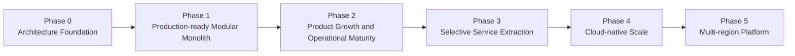
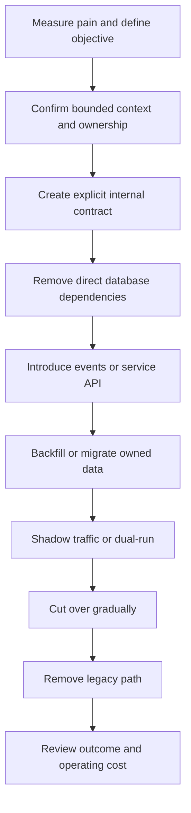
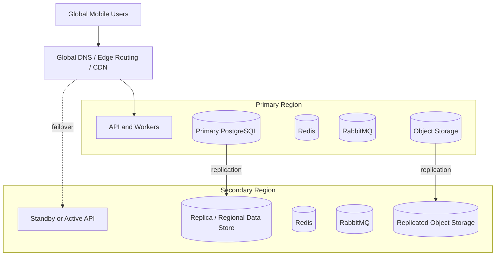
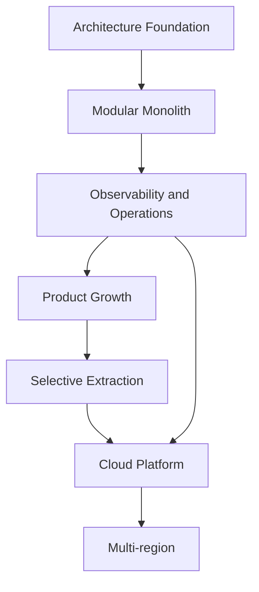

# Architecture Roadmap

Version: 1.0.0  
Status: Active Draft  
Owners: Architecture and Engineering  
Last reviewed: 2026-07-14

## 1. Purpose

This document defines the staged architecture roadmap for KidsAudioBookPlatform. It translates the product vision into a sequence of technical milestones that can be delivered safely without premature complexity.

The roadmap is intentionally evolutionary. The platform starts as a modular monolith with clear bounded contexts and extraction boundaries. Distributed infrastructure is introduced only when measurable scale, reliability, organizational, or deployment needs justify it.

## 2. Roadmap principles

1. Build the smallest architecture that satisfies the current product stage.
2. Preserve explicit module and data ownership from the first release.
3. Prefer reversible decisions while uncertainty is high.
4. Introduce operational complexity only when measurable benefits exceed its cost.
5. Keep security, child safety, privacy, and parental control non-negotiable in every phase.
6. Require observability before scaling.
7. Automate repeatable delivery and testing before increasing deployment frequency.
8. Extract microservices based on evidence, not fashion.
9. Keep mobile compatibility and API evolution explicit.
10. Review roadmap assumptions after every major release.

## 3. Target evolution

Progression between phases is not automatic. Each transition requires explicit evidence and an architecture review.

## 4. Phase 0 — Architecture foundation

### 4.1 Objective

Create an implementation-ready foundation before feature development accelerates.

### 4.2 Required outcomes

- product vision and PRD are approved;
- bounded contexts are named and responsibilities are explicit;
- modular-monolith structure is defined;
- API conventions and error model are documented;
- PostgreSQL ownership and migration rules are defined;
- security architecture covers Parent, Child, and Admin zones;
- C4 views and critical runtime flows exist;
- engineering standards and Definition of Done are available;
- ADR process is active;
- local development environment is reproducible;
- CI validates build, tests, formatting, and static analysis.

### 4.3 Exit criteria

Phase 0 is complete when a developer or coding agent can implement the first bounded context without inventing architectural rules.

## 5. Phase 1 — Production-ready modular monolith

### 5.1 Objective

Deliver the first production release using one deployable backend application while maintaining strong internal boundaries.

### 5.2 Initial bounded contexts

- Identity and Access;
- Account and Parent Zone;
- Child Profiles;
- Catalog and Discovery;
- Series, Stories, and Episodes;
- Media Management;
- Playback and Progress;
- Subscriptions and Entitlements;
- Notifications;
- Administration;
- Audit and Compliance.

### 5.3 Core technology baseline

| Area | Baseline |
|---|---|
| Backend | Java 21 and Spring Boot |
| Mobile | Flutter for iOS and Android |
| Database | PostgreSQL |
| Cache | Redis where justified |
| Messaging | RabbitMQ for asynchronous workflows |
| Migrations | Flyway |
| Media | S3-compatible object storage and CDN |
| Observability | Structured logs, metrics, traces, dashboards |
| Delivery | Containerized deployment with automated CI/CD |

### 5.4 Architectural constraints

- Each bounded context owns its domain model.
- Cross-context access occurs through application contracts, not direct repository access.
- Database tables have explicit ownership even when hosted in one PostgreSQL instance.
- Domain events are published through an outbox where reliability is required.
- Media bytes are served from object storage/CDN, not proxied through normal API endpoints.
- Notifications, media processing, exports, and analytics do not block user-facing requests.
- Mobile APIs remain versioned and backward compatible for supported app versions.

### 5.5 Production capabilities

- account creation and authentication;
- secure refresh-token rotation;
- child-profile management;
- curated catalog browsing;
- playback and progress synchronization;
- premium entitlement validation;
- admin content lifecycle;
- controlled media upload and processing;
- transactional push notifications;
- audit trail for sensitive operations;
- backup and restore procedures;
- operational dashboards and alerting.

### 5.6 Exit criteria

- core API SLOs are met under expected peak load;
- no critical security findings remain open;
- backups have been restored in a test environment;
- production incidents can be investigated using logs, metrics, and traces;
- releases and rollbacks are automated and documented;
- domain boundaries remain enforceable using architecture tests.

## 6. Phase 2 — Product growth and operational maturity

### 6.1 Objective

Improve scalability, resilience, delivery speed, and product intelligence without immediately splitting the backend into many services.

### 6.2 Expected enhancements

- richer search and discovery;
- recommendations based on safe, explainable signals;
- content localization;
- offline playback and entitlement rules;
- notification campaigns and scheduling;
- advanced parental insights;
- editorial workflows and approval stages;
- customer-support tooling;
- analytics read models;
- feature flags and controlled experiments;
- retention and deletion automation.

### 6.3 Architecture improvements

- dedicated read projections for home and catalog screens;
- materialized views or search index where query evidence justifies them;
- expanded cache strategy with measurable hit-rate targets;
- queue isolation for high-volume workflows;
- idempotency for all external webhooks and critical commands;
- automated contract tests for external providers;
- performance regression tests in CI or scheduled pipelines;
- dependency and container vulnerability scanning;
- documented capacity model and quarterly review.

### 6.4 Operational maturity targets

| Capability | Target state |
|---|---|
| Availability | Core APIs meet agreed monthly SLO |
| Recovery | Tested RPO and RTO |
| Deployment | Safe automated rollback or progressive delivery |
| Observability | Golden signals plus business metrics |
| Incident response | Runbooks, severity model, post-incident review |
| Cost visibility | Storage, egress, database, queue, and compute costs tracked |
| Data governance | Retention, export, deletion, and audit workflows verified |

### 6.5 Exit criteria

Phase 2 is complete when scale bottlenecks are measurable, operational procedures are repeatable, and the team can identify which modules—if any—would benefit from independent deployment.

## 7. Phase 3 — Selective service extraction

### 7.1 Objective

Extract only bounded contexts with clear operational or organizational justification.

### 7.2 Extraction criteria

A module becomes a service candidate when several of the following are true:

- it has a clearly isolated domain and data model;
- it requires independent scaling;
- its release cadence differs materially from the core application;
- failures must be isolated from playback or authentication;
- it has intensive asynchronous workloads;
- it is owned by a stable team;
- its external dependencies create distinct resilience requirements;
- modular-monolith boundaries have already been proven;
- the migration benefit exceeds distributed-system overhead.

A large codebase alone is not sufficient justification.

### 7.3 Likely early candidates

| Candidate | Typical justification |
|---|---|
| Media Processing | CPU-intensive jobs, independent worker scaling |
| Notifications | Provider isolation, campaign throughput, retry behavior |
| Search and Discovery | Specialized indexing and query infrastructure |
| Analytics | High-volume event ingestion and aggregation |
| Subscription Reconciliation | External-provider workflows and scheduled verification |

Identity, Parent Zone, Child Profiles, and core entitlement decisions should remain conservative extraction candidates because they participate in sensitive transactional flows.

### 7.4 Extraction sequence

### 7.5 Data migration rules

- The target service must become the sole writer for its owned data.
- Dual writes without a reconciliation mechanism are prohibited.
- The outbox pattern is preferred for reliable change propagation.
- Backfill jobs must be resumable and observable.
- Data correctness is validated before traffic cutover.
- Rollback behavior is documented before migration starts.

### 7.6 Exit criteria

- extracted services have clear SLOs and ownership;
- distributed tracing covers cross-service flows;
- contracts are versioned and tested;
- failure isolation is better than before extraction;
- operational cost and complexity are accepted explicitly;
- no hidden shared-database coupling remains.

## 8. Phase 4 — Cloud-native scale

### 8.1 Objective

Support substantially higher usage and delivery frequency using standardized platform capabilities.

### 8.2 Platform capabilities

- infrastructure as code;
- automated environment provisioning;
- workload identity and managed secrets;
- autoscaling using meaningful saturation signals;
- managed PostgreSQL with replicas and point-in-time recovery;
- managed Redis and messaging where appropriate;
- CDN and object-storage lifecycle automation;
- centralized telemetry and alert routing;
- progressive delivery and automated rollback;
- policy-based image and dependency admission;
- cost allocation by environment and service.

### 8.3 Reliability improvements

- bulkheads between critical and background workloads;
- per-dependency circuit breakers and timeout budgets;
- queue partitioning by workload class;
- rate limits protecting critical paths;
- graceful degradation for recommendations, analytics, artwork, and notifications;
- regular disaster-recovery exercises;
- chaos or failure-injection testing for critical dependencies.

### 8.4 Data evolution

- read replicas for read-heavy administrative or reporting workloads;
- partitioning only for tables with measured growth and query benefits;
- dedicated analytical storage when transactional PostgreSQL is no longer appropriate;
- archive and purge pipelines aligned with retention policies;
- schema compatibility checks for events and APIs.

### 8.5 Exit criteria

- scaling policies have been load-tested;
- infrastructure is reproducible;
- deployment does not rely on manual server changes;
- critical dependencies have tested failover behavior;
- unit economics are understood at realistic traffic levels.

## 9. Phase 5 — Multi-region platform

### 9.1 Objective

Provide geographic resilience and lower delivery latency when user distribution and business requirements justify it.

### 9.2 Preconditions

Multi-region operation must not be introduced until:

- single-region reliability is mature;
- data-residency requirements are understood;
- conflict behavior is explicitly modeled;
- operational ownership exists around the clock where required;
- cost has been reviewed and accepted;
- failover has been rehearsed.

### 9.3 Possible topology

### 9.4 Key design decisions

- active-passive versus active-active;
- global versus regional account data;
- entitlement consistency requirements;
- regional message delivery and deduplication;
- progress-update conflict resolution;
- failover DNS and connection behavior;
- backup independence from replication;
- data-residency and deletion propagation.

### 9.5 Exit criteria

- regional failover meets documented RTO;
- data loss remains within RPO;
- consistency behavior is accepted by product and engineering;
- reconciliation procedures are automated;
- operational teams can diagnose region-specific failures.

## 10. Cross-phase workstreams

Certain work continues throughout every phase.

### 10.1 Security and privacy

- threat modeling for new flows;
- dependency and image scanning;
- secrets rotation;
- least-privilege reviews;
- auditability of sensitive actions;
- privacy retention and deletion verification;
- mobile security and secure local storage;
- child-safety review of product changes.

### 10.2 Quality engineering

- unit, integration, contract, and end-to-end tests;
- architecture tests;
- performance and resilience tests;
- migration testing with representative data;
- backward-compatibility testing for supported mobile versions;
- release smoke tests and rollback verification.

### 10.3 Observability

- structured logs with correlation IDs;
- distributed traces for critical journeys;
- infrastructure and dependency metrics;
- business metrics for playback, progress, entitlement, and notification flows;
- actionable alerts tied to runbooks;
- dashboard review after incidents and major releases.

### 10.4 Documentation governance

- ADRs for significant decisions;
- C4 updates in the same change as architecture modifications;
- blueprint updates before implementation of major modules;
- versioned API and event contracts;
- explicit technical-debt register;
- quarterly architecture review.

## 11. Milestone dependency map

The roadmap deliberately places observability and operational maturity before service extraction and large-scale infrastructure changes.

## 12. Decision gates

Every phase transition requires a written review covering:

1. Product need.
2. Current bottleneck or risk.
3. Evidence from telemetry or delivery history.
4. Proposed architecture change.
5. Alternatives considered.
6. Security and privacy impact.
7. Data ownership and migration impact.
8. Reliability and disaster-recovery impact.
9. Operational and financial cost.
10. Rollback or exit strategy.

The decision must be recorded in an ADR when it changes system boundaries, data ownership, critical infrastructure, public contracts, or security posture.

## 13. Roadmap metrics

The roadmap must be reviewed using measurable indicators:

- active users and concurrent playback sessions;
- request throughput and latency percentiles;
- error and retry rates;
- queue depth and processing lag;
- database size, growth, locks, and query latency;
- cache hit ratio and eviction rate;
- media storage and egress;
- deployment frequency and failure rate;
- mean time to restore service;
- production incident count and severity;
- team ownership and coordination cost;
- infrastructure cost per active user.

Metrics support decisions; they do not replace architectural judgment.

## 14. Risks and mitigations

| Risk | Mitigation |
|---|---|
| Premature microservices | Require extraction evidence and ADR approval |
| Modular-monolith boundary erosion | Architecture tests and ownership reviews |
| Shared database becoming permanent coupling | Explicit table ownership and access rules |
| Mobile API fragmentation | Compatibility policy and contract testing |
| Scaling without observability | Block phase transition until telemetry exists |
| Infrastructure cost growth | Capacity planning and cost allocation |
| Security debt during rapid delivery | Security gates in Definition of Done |
| Event-driven complexity | Use events only for justified asynchronous workflows |
| Uncontrolled cache inconsistency | Document source of truth, TTL, and invalidation |
| Multi-region data conflicts | Model consistency and reconciliation before rollout |

## 15. Review cadence

- Review quarterly during active development.
- Review after each major production incident.
- Review before introducing a new deployable service.
- Review before changing the primary database, messaging platform, or deployment model.
- Review when product strategy materially changes.

Each review updates assumptions, completed milestones, blocked items, and measurable triggers for the next phase.

## 16. Definition of Done

This roadmap is considered effective when:

- current architecture phase is explicitly identified;
- every planned transition has measurable triggers;
- architecture investments are tied to product or operational outcomes;
- teams can explain why the current architecture is appropriate;
- obsolete milestones are removed or revised;
- roadmap decisions are traceable to ADRs and implementation plans.

## 17. Related documents

- `../Software_Architecture.md`
- `../Backend_Architecture.md`
- `../Performance_Guidelines.md`
- `../Security_Architecture.md`
- `../Logging_Monitoring.md`
- `01_System_Context.md`
- `02_Container_Diagram.md`
- `05_Deployment_Diagram.md`
- `06_Runtime_Views.md`
- `07_Security_Trust_Boundaries.md`
- `08_Architecture_Decision_Guide.md`

## 18. AI implementation notes

An AI coding agent must not introduce a later-phase architecture capability merely because it is described in this roadmap. Before implementation, it must identify the active phase and follow the constraints of that phase.

In particular, an agent must not:

- create a new microservice without an approved ADR;
- introduce a second database technology without documented need;
- bypass bounded-context APIs through direct repository access;
- add distributed infrastructure to solve an unmeasured problem;
- weaken security, privacy, or observability requirements for delivery speed.

When uncertainty exists, the agent must preserve the modular-monolith boundary and request an architecture decision.