# Known Technical Debt

Version: 1.0.0  
Status: Active Register  
Owners: Architecture and Engineering  
Last reviewed: 2026-07-14

## 1. Purpose

This document records known, accepted, suspected, and emerging technical debt in KidsAudioBookPlatform. Its goal is to prevent architectural compromises from becoming undocumented tribal knowledge.

Technical debt is not automatically a defect. Some debt is an intentional trade-off made to reduce time-to-market, validate product assumptions, or avoid premature complexity. Every accepted debt item must still have an owner, impact assessment, review date, and exit condition.

## 2. Scope

The register covers:

- backend architecture and bounded contexts;
- Flutter mobile application;
- admin dashboard;
- PostgreSQL schema and migrations;
- Redis usage;
- RabbitMQ topology and event contracts;
- media storage and delivery;
- authentication and authorization;
- subscriptions and entitlements;
- observability and operations;
- testing and CI/CD;
- documentation and architecture governance.

## 3. Debt principles

1. Debt must be explicit.
2. Debt must have a measurable impact.
3. Debt must have an accountable owner.
4. Debt must have a review date.
5. Debt must have a trigger for repayment.
6. Critical security debt cannot be accepted indefinitely.
7. Debt that repeatedly causes incidents must be promoted in priority.
8. New features must not silently increase existing debt.
9. Removing debt must not break public contracts without a migration plan.
10. A large rewrite is not the default repayment strategy.

## 4. Classification

| Category | Description | Examples |
|---|---|---|
| Architectural | Structural compromise affecting module boundaries or evolution | shared persistence access, cross-context coupling |
| Code | Local maintainability or complexity problem | oversized service, duplicated validation |
| Data | Schema, migration, indexing, ownership, or retention debt | missing partitioning strategy, weak constraints |
| Integration | Fragile or incomplete external-system integration | provider-specific logic in domain layer |
| Security | Known weakness or missing control | incomplete secret rotation, missing device revocation |
| Performance | Known bottleneck or unvalidated scaling assumption | expensive catalog query, missing cache invalidation |
| Reliability | Weak recovery, retry, or failure isolation | non-idempotent consumer, missing DLQ runbook |
| Testing | Missing automated confidence | no contract tests, weak load test coverage |
| Operations | Missing observability, automation, or support capability | incomplete dashboards, manual recovery |
| Documentation | Missing, stale, or contradictory documentation | diagrams not synchronized with code |

## 5. Priority model

Debt priority is determined from impact, likelihood, and remediation urgency.

| Priority | Meaning | Expected response |
|---|---|---|
| P0 | Immediate security, data-loss, or severe availability risk | Stop normal work and remediate |
| P1 | High user, compliance, reliability, or delivery impact | Plan into current or next delivery cycle |
| P2 | Material maintainability or scalability impact | Schedule in roadmap with owner |
| P3 | Localized inefficiency or quality concern | Address opportunistically or during related work |
| P4 | Cosmetic or low-cost improvement | Track only when useful |

## 6. Scoring model

Each item may be scored from 1 to 5 for:

- user impact;
- engineering impact;
- security or compliance impact;
- probability of causing failure;
- cost growth if postponed.

Suggested score:

```text
Debt Score = User Impact
           + Engineering Impact
           + Security/Compliance Impact
           + Failure Probability
           + Delay Cost
```

Guidance:

| Score | Suggested priority |
|---:|---|
| 21-25 | P0 or P1 |
| 16-20 | P1 |
| 11-15 | P2 |
| 6-10 | P3 |
| 5 | P4 |

The score supports prioritization but does not replace engineering judgment.

## 7. Technical debt lifecycle

```mermaid
flowchart LR
    Detect[Detect debt]
    Record[Record item]
    Assess[Assess impact and priority]
    Accept[Accept temporarily]
    Plan[Plan remediation]
    Remediate[Implement remediation]
    Validate[Validate outcome]
    Close[Close item]
    Escalate[Escalate priority]

    Detect --> Record
    Record --> Assess
    Assess --> Accept
    Accept --> Plan
    Plan --> Remediate
    Remediate --> Validate
    Validate --> Close
    Accept -->|incident, risk increase, repeated cost| Escalate
    Escalate --> Plan
```



## 8. Required fields for every debt item

Each debt entry must contain:

- unique ID;
- title;
- category;
- affected components;
- description;
- reason the debt exists;
- current impact;
- future risk;
- priority;
- owner;
- discovery date;
- target review date;
- repayment trigger;
- proposed remediation;
- estimated effort;
- dependencies;
- acceptance authority;
- current status;
- related ADRs, incidents, issues, and pull requests.

## 9. Status model

| Status | Meaning |
|---|---|
| Proposed | Identified but not yet reviewed |
| Accepted | Explicitly accepted for a limited period |
| Planned | Remediation has been scheduled |
| In Progress | Remediation work has started |
| Mitigated | Risk reduced but root debt remains |
| Resolved | Root cause removed and validated |
| Rejected | Item was investigated and determined not to be debt |
| Superseded | Replaced by a newer debt item or architectural decision |

## 10. Current baseline debt register

The entries below describe expected debt risks during the initial modular-monolith phase. Owners must replace assumptions with implementation evidence as the system matures.

### TD-001 — Shared PostgreSQL instance across bounded contexts

| Field | Value |
|---|---|
| Category | Architectural / Data |
| Priority | P2 |
| Status | Accepted |
| Affected components | All backend bounded contexts |
| Reason | A single database simplifies initial delivery and operations |
| Current impact | Logical boundaries depend on schema and repository discipline rather than physical isolation |
| Future risk | Cross-context joins and direct table access may prevent clean service extraction |
| Owner | Backend Architecture |
| Review trigger | First service extraction proposal or repeated cross-context coupling |
| Proposed remediation | Enforce schema ownership, repository boundaries, integration APIs, and migration plans before extraction |

Acceptance conditions:

- each table has one owning bounded context;
- no module reads another module's tables directly;
- cross-context data is accessed through application contracts or read models;
- Flyway migrations remain ownership-aware.

### TD-002 — Modular monolith depends on convention enforcement

| Field | Value |
|---|---|
| Category | Architectural |
| Priority | P2 |
| Status | Accepted |
| Affected components | Spring Boot backend |
| Reason | A modular monolith is intentionally preferred over premature microservices |
| Current impact | Module isolation is not guaranteed by deployment boundaries |
| Future risk | Package-level coupling can turn the application into a distributed-unfriendly monolith |
| Owner | Architecture |
| Review trigger | New bounded context, architecture violation, or service extraction |
| Proposed remediation | ArchUnit rules, package visibility, module tests, dependency matrix, architecture review gate |

### TD-003 — Initial event contracts may evolve rapidly

| Field | Value |
|---|---|
| Category | Integration |
| Priority | P2 |
| Status | Accepted |
| Affected components | RabbitMQ publishers and consumers |
| Reason | Product workflows are still evolving |
| Current impact | Event schemas may require backward-compatible additions |
| Future risk | Breaking consumers, replay failures, or duplicated provider-specific data |
| Owner | Backend Architecture |
| Review trigger | First external consumer or multiple independently deployed consumers |
| Proposed remediation | Versioned contracts, schema validation, compatibility tests, consumer-driven contract tests |

### TD-004 — Recommendation engine starts with simple rules

| Field | Value |
|---|---|
| Category | Product / Architectural |
| Priority | P3 |
| Status | Accepted |
| Affected components | Catalog and personalization |
| Reason | Real usage data is required before advanced recommendation investment |
| Current impact | Recommendations may be less personalized |
| Future risk | Product engagement may plateau if rules remain static |
| Owner | Product and Catalog Engineering |
| Review trigger | Sufficient behavioral data, measurable engagement gap, or roadmap commitment |
| Proposed remediation | Introduce feature-based ranking, experimentation, and later model-backed recommendations behind an abstraction |

### TD-005 — Search initially relies on PostgreSQL capabilities

| Field | Value |
|---|---|
| Category | Performance / Data |
| Priority | P3 |
| Status | Accepted |
| Affected components | Catalog search and admin search |
| Reason | Avoid operating a dedicated search platform before justified |
| Current impact | Search features are limited to PostgreSQL indexing and full-text capabilities |
| Future risk | Complex ranking, typo tolerance, faceting, or multilingual search may become difficult |
| Owner | Catalog Engineering |
| Review trigger | Search p95 exceeds target, relevance complaints increase, or advanced search becomes required |
| Proposed remediation | Introduce a search abstraction and evaluate OpenSearch, Elasticsearch, or another dedicated engine |

### TD-006 — Subscription provider logic may be centralized initially

| Field | Value |
|---|---|
| Category | Integration |
| Priority | P2 |
| Status | Accepted |
| Affected components | Subscriptions and entitlements |
| Reason | Apple and Google flows must be delivered quickly and consistently |
| Current impact | Provider-specific behavior may accumulate in one module |
| Future risk | Difficult expansion to web billing, promotions, family plans, or additional stores |
| Owner | Subscription Engineering |
| Review trigger | Third billing channel, high provider divergence, or recurring entitlement defects |
| Proposed remediation | Provider adapters, normalized purchase model, anti-corruption layer, provider contract tests |

### TD-007 — Observability maturity grows incrementally

| Field | Value |
|---|---|
| Category | Operations |
| Priority | P2 |
| Status | Accepted |
| Affected components | All production components |
| Reason | Initial development may precede final production telemetry platform |
| Current impact | Some dashboards, alerts, or traces may be incomplete during early environments |
| Future risk | Slow incident diagnosis and hidden performance regressions |
| Owner | Platform Engineering |
| Review trigger | Production readiness review |
| Proposed remediation | Minimum telemetry baseline, SLO dashboards, alert catalog, trace propagation, operational runbooks |

Minimum production baseline:

- structured logs;
- correlation IDs;
- request metrics;
- error metrics;
- database pool metrics;
- Redis metrics;
- RabbitMQ queue depth and consumer lag;
- external dependency latency;
- business-critical metrics;
- actionable alerts.

### TD-008 — Media processing pipeline may begin with limited orchestration

| Field | Value |
|---|---|
| Category | Reliability / Operations |
| Priority | P2 |
| Status | Accepted |
| Affected components | Media upload, validation, derivatives, and publishing |
| Reason | Initial media volume is expected to be manageable |
| Current impact | Processing stages may rely on simple queue-driven workers |
| Future risk | Difficult recovery, duplicate work, weak visibility, or partial publication |
| Owner | Media Engineering |
| Review trigger | Increased volume, repeated retries, long processing time, or multi-stage workflow growth |
| Proposed remediation | Explicit workflow state machine, idempotent stages, replay support, operator dashboard |

### TD-009 — Offline playback synchronization complexity

| Field | Value |
|---|---|
| Category | Mobile / Data |
| Priority | P2 |
| Status | Accepted |
| Affected components | Flutter playback, progress, downloads, entitlement validation |
| Reason | Offline-first behavior requires staged implementation |
| Current impact | Conflict handling may initially cover only common cases |
| Future risk | Progress rollback, stale entitlement, duplicate downloads, storage leakage |
| Owner | Mobile and Playback Engineering |
| Review trigger | Offline feature release or repeated synchronization defects |
| Proposed remediation | Formal conflict rules, local operation journal, reconciliation tests, download lifecycle management |

### TD-010 — Admin dashboard may initially share backend APIs

| Field | Value |
|---|---|
| Category | Architectural / Security |
| Priority | P2 |
| Status | Accepted |
| Affected components | Admin dashboard and backend API |
| Reason | Separate admin infrastructure may be unnecessary at initial scale |
| Current impact | Public and administrative API concerns coexist in one deployable backend |
| Future risk | Expanded attack surface, competing performance needs, or release coupling |
| Owner | Architecture and Security |
| Review trigger | Admin traffic growth, external content partners, or stricter operational separation |
| Proposed remediation | Separate admin API surface, stronger network boundary, independent deployment if justified |

### TD-011 — Test data management is not fully automated initially

| Field | Value |
|---|---|
| Category | Testing / Operations |
| Priority | P2 |
| Status | Accepted |
| Affected components | Integration, performance, and end-to-end tests |
| Reason | Foundational application capabilities are still being established |
| Current impact | Some environments may depend on manually maintained fixtures |
| Future risk | Flaky tests, unrealistic performance results, and slow developer onboarding |
| Owner | QA and Platform Engineering |
| Review trigger | First shared staging environment or performance test baseline |
| Proposed remediation | Versioned seed data, factories, synthetic datasets, environment reset automation |

### TD-012 — Full disaster-recovery automation is deferred

| Field | Value |
|---|---|
| Category | Reliability / Operations |
| Priority | P1 before production scale |
| Status | Accepted temporarily |
| Affected components | PostgreSQL, object storage, configuration, secrets, queues |
| Reason | Initial environments prioritize delivery and architecture validation |
| Current impact | Recovery procedures may include manual steps |
| Future risk | Recovery time may exceed business expectations |
| Owner | Platform Engineering |
| Review trigger | Production launch readiness |
| Proposed remediation | Tested backups, documented RPO/RTO, restore automation, recovery drills, infrastructure-as-code |

### TD-013 — Security automation coverage may be incomplete in early CI

| Field | Value |
|---|---|
| Category | Security / CI/CD |
| Priority | P1 |
| Status | Accepted temporarily |
| Affected components | Backend, mobile, admin, container images, dependencies |
| Reason | CI pipeline capabilities may be introduced incrementally |
| Current impact | Some checks may depend on manual review |
| Future risk | Vulnerable dependency or secret may reach a shared environment |
| Owner | Security and Platform Engineering |
| Review trigger | Before production deployment |
| Proposed remediation | SAST, dependency scanning, secret scanning, container scanning, SBOM generation, signed artifacts |

### TD-014 — Documentation consistency requires continuous governance

| Field | Value |
|---|---|
| Category | Documentation |
| Priority | P2 |
| Status | Accepted |
| Affected components | All project documentation |
| Reason | The documentation set is large and evolves alongside architecture |
| Current impact | Cross-document duplication or stale references may appear |
| Future risk | AI agents and engineers may implement contradictory rules |
| Owner | Architecture |
| Review trigger | Every architecture-changing pull request and quarterly documentation audit |
| Proposed remediation | Canonical-source rules, link validation, documentation review checklist, changelog discipline |

## 11. Debt acceptance rules

A debt item may be accepted only when:

- the business or engineering reason is documented;
- no P0 risk remains;
- security and privacy implications are reviewed;
- an owner is assigned;
- a review date is defined;
- an exit condition exists;
- the debt does not invalidate a committed SLO or legal requirement;
- the acceptance authority is appropriate for the risk.

## 12. Debt that cannot be silently accepted

The following require explicit architecture and security approval:

- plaintext secrets;
- missing authorization on protected resources;
- unencrypted sensitive data in transit;
- direct child access to parent-only operations;
- unbounded queues or thread pools;
- non-recoverable schema migrations;
- missing auditability for privileged operations;
- known data-loss paths;
- unsupported dependencies with critical vulnerabilities;
- public exposure of internal administrative APIs;
- cross-context database access that bypasses ownership rules.

## 13. Repayment strategies

Prefer incremental remediation:

1. add characterization tests;
2. isolate the debt behind an interface;
3. define the target contract;
4. migrate one path at a time;
5. measure operational and performance impact;
6. remove old behavior;
7. update ADRs and diagrams;
8. close the debt item only after validation.

A rewrite is justified only when incremental change has a demonstrably higher risk or cost.

## 14. Pull request requirements

A pull request introduces technical debt when it intentionally violates or postpones an established standard.

Such a pull request must include:

```text
Technical Debt ID: TD-XXX
Reason: <why the compromise is required>
Impact: <current and future consequences>
Owner: <accountable person or team>
Review date: <date>
Repayment trigger: <measurable condition>
```

A pull request that resolves debt must include:

- the debt ID;
- tests proving expected behavior;
- migration or rollback notes where relevant;
- updated documentation and diagrams;
- evidence that temporary compatibility code was removed or deliberately retained.

## 15. Review cadence

| Review | Frequency | Scope |
|---|---|---|
| Feature review | Every architecture-affecting feature | New or increased debt |
| Sprint or iteration review | At least monthly | P1/P2 items and blocked remediation |
| Architecture review | Quarterly | Entire register and systemic patterns |
| Production readiness review | Before launch | Security, reliability, data, and operations debt |
| Incident review | After significant incident | Debt that contributed to the incident |

## 16. Metrics

Track:

- open debt by priority;
- average age by priority;
- debt introduced versus resolved per quarter;
- incidents linked to known debt;
- delivery delays caused by debt;
- repeated architecture-rule violations;
- percentage of accepted debt without an active owner;
- overdue review dates;
- remediation lead time.

Debt metrics must not be used to reward superficial item closure. Quality of remediation matters more than raw closure count.

## 17. Debt review checklist

- Is the debt still real?
- Has the impact increased or decreased?
- Is the current priority still correct?
- Does the owner remain accountable?
- Has the review date passed?
- Has the repayment trigger occurred?
- Did the debt contribute to an incident or defect?
- Can a related feature repay part of the debt?
- Is the proposed remediation still appropriate?
- Does an ADR need to be created or updated?
- Do C4 diagrams or other architecture documents need changes?

## 18. Debt item template

```markdown
### TD-XXX — Title

| Field | Value |
|---|---|
| Category | Architectural / Code / Data / Integration / Security / Performance / Reliability / Testing / Operations / Documentation |
| Priority | P0 / P1 / P2 / P3 / P4 |
| Status | Proposed / Accepted / Planned / In Progress / Mitigated / Resolved / Rejected / Superseded |
| Affected components | ... |
| Description | ... |
| Reason | ... |
| Current impact | ... |
| Future risk | ... |
| Owner | ... |
| Discovery date | YYYY-MM-DD |
| Review date | YYYY-MM-DD |
| Repayment trigger | ... |
| Proposed remediation | ... |
| Estimated effort | ... |
| Dependencies | ... |
| Acceptance authority | ... |
| Related references | ADRs, issues, PRs, incidents |
```

## 19. Closure criteria

A debt item is resolved only when:

- the root cause has been removed or explicitly superseded;
- automated tests cover the affected behavior;
- production or production-like validation is complete where relevant;
- obsolete compatibility paths are removed;
- operational runbooks are updated;
- architecture and API documentation are synchronized;
- the owner records the outcome and evidence;
- no equivalent hidden debt remains under a different name.

## 20. Related documents

- `../Software_Architecture.md`
- `../Backend_Architecture.md`
- `../Database_Design.md`
- `../Security_Architecture.md`
- `../Performance_Guidelines.md`
- `../Logging_Monitoring.md`
- `08_Architecture_Decision_Guide.md`
- `09_Architecture_Review_Checklist.md`
- `13_Architecture_Compliance.md`
- `15_Architecture_Roadmap.md`
- `../../ADR/`

## 21. AI implementation notes

AI-assisted changes must not hide compromises. When an AI agent generates or modifies code, it must:

- identify any rule it cannot fully satisfy;
- reference an existing debt ID or propose a new one;
- avoid introducing silent cross-context dependencies;
- avoid disabling tests, validation, security checks, or static analysis merely to obtain a passing build;
- preserve compatibility unless a migration is explicitly approved;
- update affected architecture documentation;
- include a clear remediation path for temporary implementations.

An AI-generated `TODO` without an owner, debt ID, or exit condition is not an acceptable technical debt record.
