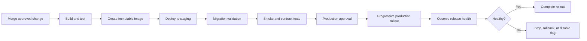

# Release and Deployment Strategy

Version: 1.0.0  
Status: Active Draft  
Owners: Architecture, Backend Engineering, Mobile Engineering, DevOps  
Last reviewed: 2026-07-15

## 1. Purpose

This document defines how KidsAudioBookPlatform components are versioned, promoted, deployed, validated, observed, and rolled back. It covers the Spring Boot backend, background workers, Flutter mobile application, admin dashboard, database migrations, RabbitMQ contracts, Redis changes, object-storage assets, and infrastructure configuration.

The goal is to make releases repeatable, low-risk, auditable, and compatible with mobile clients that cannot be upgraded immediately.

## 2. Release principles

1. Every release is produced by CI from reviewed source control.
2. The same immutable artifact is promoted between environments.
3. Deployments are separated from feature exposure through feature flags where practical.
4. Database and event-contract changes remain backward compatible during rollout.
5. Health checks confirm process availability, but business smoke tests confirm product correctness.
6. Rollback procedures are defined before production deployment.
7. Production changes are observable through deployment markers, metrics, logs, and traces.
8. Manual production changes are prohibited except through documented emergency procedures.
9. Secrets and environment-specific configuration are injected at runtime and never embedded in artifacts.
10. Mobile releases account for phased store distribution and old-client compatibility.

## 3. Deployable units

| Unit | Artifact | Deployment mechanism | Independent rollback |
|---|---|---|---|
| Backend application | OCI container image | Container platform | Yes |
| Background workers | OCI container image | Container platform | Yes |
| Admin dashboard | Versioned static bundle/container | CDN or container platform | Yes |
| Flutter Android app | Signed AAB | Google Play release tracks | Limited by store rollout |
| Flutter iOS app | Signed IPA archive | App Store Connect | Limited by store rollout |
| Database schema | Flyway migrations | Controlled deployment step | Forward correction preferred |
| Infrastructure | Versioned IaC | CI/CD pipeline | Depends on resource type |
| Media derivatives | Immutable object versions | Processing pipeline | Yes through metadata switch |

A shared repository does not imply a shared release cadence. Each deployable unit has an explicit version, artifact digest, changelog entry, and compatibility declaration.

## 4. Environments

| Environment | Purpose | Data policy | Deployment policy |
|---|---|---|---|
| Local | Developer iteration | Synthetic local data | On demand |
| CI | Automated verification | Ephemeral synthetic data | Per pipeline |
| Development | Shared integration | Synthetic or anonymized fixtures | Automatic from approved branch policy |
| Staging | Production-like validation | Synthetic, seeded, or legally approved anonymized data | Controlled promotion |
| Production | Live customer workloads | Production data | Approved release workflow |

Staging must reproduce production-relevant topology, authentication, messaging, storage, migrations, and observability closely enough to detect deployment and integration defects.

## 5. Artifact creation

CI creates immutable artifacts and records:

- source commit SHA;
- semantic version;
- build timestamp;
- dependency lock state;
- container digest or mobile build identifier;
- test results;
- software bill of materials;
- vulnerability scan results;
- generated OpenAPI and event-contract versions;
- database migration set;
- release notes.

Artifacts must never be rebuilt differently for staging and production. Environment variation is supplied through runtime configuration.

## 6. Backend deployment flow

Production deployment uses a rolling, canary, or blue-green strategy based on platform capability and risk. The chosen strategy must prevent simultaneous replacement of every healthy instance.

## 7. Readiness and health checks

### Liveness

Confirms that the process is running and not permanently deadlocked. Liveness must not fail because a temporary downstream dependency is unavailable.

### Readiness

Confirms that an instance can safely receive traffic. Readiness may depend on essential startup state, database connectivity, migration compatibility, and required configuration.

### Startup

Allows slow initialization without triggering premature restarts.

Health endpoints must not reveal secrets, internal topology, credentials, or detailed exception messages to public callers.

## 8. Database compatibility

Database changes follow expand-and-contract:

1. add backward-compatible structures;
2. deploy code able to coexist with old and new representations;
3. backfill data separately when needed;
4. switch readers and writers;
5. remove obsolete structures only after the compatibility window ends.

A release must declare its supported schema range. Destructive migrations are never coupled to the first release that stops using the old structure.

## 9. API and event compatibility

During rolling deployment, old and new application versions may run simultaneously. Therefore:

- response fields may be added but not repurposed;
- required request fields are not introduced without a compatibility path;
- consumers ignore unknown optional event fields;
- event schema breaks require a new version;
- dual publishing or dual consumption may be used during migration;
- queue bindings and routing keys are created before producers depend on them;
- removed contracts remain available through the documented deprecation window.

## 10. Feature flags

Feature flags may separate deployment from release. Every production flag requires:

- owner;
- purpose;
- default state;
- eligible audience;
- expiry or review date;
- telemetry;
- safe fallback;
- removal plan.

Security controls, authorization checks, data validation, and migration correctness must not depend on an optional remote flag service being available.

## 11. Progressive delivery

Higher-risk backend changes should progress through bounded cohorts:

1. internal traffic or test accounts;
2. small production percentage;
3. expanded percentage after health validation;
4. full rollout.

Evaluation includes:

- error rate;
- p95 and p99 latency;
- resource saturation;
- queue lag and dead letters;
- database lock and query impact;
- authentication and entitlement failures;
- playback-start success;
- crash-free mobile sessions where applicable;
- business-flow completion rates.

Automatic rollback thresholds should be used where signals are reliable. Human approval remains required for ambiguous business regressions.

## 12. Mobile release strategy

Mobile clients cannot be assumed to update immediately. The backend publishes:

- minimum supported version;
- recommended version;
- latest version;
- version-specific capability information;
- upgrade severity and localized message.

Mobile releases use internal testing, closed testing, phased rollout, and production rollout. Emergency rollback may require halting distribution and shipping a corrective build; therefore server-side feature flags and backward-compatible APIs are essential.

Forced upgrades are reserved for security, legal, data-integrity, or protocol incompatibility reasons. Normal feature adoption should use capability negotiation.

## 13. Admin dashboard releases

The admin dashboard is deployed independently from the backend but must declare compatible API versions. High-risk administrative features require role validation, audit logging, and smoke tests before exposure.

Static bundles are immutable and cache-busted by content hash. CDN invalidation is used only when necessary because versioned asset paths are preferred.

## 14. Deployment validation

Required production checks include:

- artifact digest matches the approved release;
- expected configuration version is loaded;
- migrations completed or were intentionally skipped;
- instances become ready;
- authentication succeeds;
- catalog query succeeds;
- playback authorization succeeds;
- RabbitMQ publish and consume path is healthy;
- Redis fallback behavior is acceptable;
- object-storage signed access works;
- notification creation path works;
- critical dashboards and alerts receive telemetry.

Validation uses synthetic test accounts and must not modify real child data.

## 15. Rollback strategy

Rollback options are selected in this order:

1. disable the affected feature flag;
2. stop progressive rollout;
3. route traffic back to the previous healthy version;
4. deploy the previous application artifact;
5. apply a forward database correction if schema state prevents application rollback;
6. invoke disaster-recovery procedures for severe data corruption.

Rollback does not mean reversing every database migration. Application versions must remain compatible with expanded schemas during the rollback window.

## 16. Emergency changes

Emergency production changes require:

- identified incident commander;
- documented reason and scope;
- peer approval where available;
- minimal change surface;
- immediate verification;
- audit record;
- follow-up pull request or reconciliation commit;
- retrospective action if normal controls were bypassed.

Emergency access credentials are tightly controlled, time-limited, and monitored.

## 17. Release observability

Every deployment emits a release marker containing:

- environment;
- component;
- version;
- commit SHA;
- artifact digest;
- deployment start and completion;
- actor or pipeline identity;
- rollout strategy;
- migration version;
- outcome.

Dashboards must support comparison before and after deployment. Alerts include the active release version and link to the corresponding deployment record.

## 18. Roles and approvals

| Activity | Responsible | Approval expectation |
|---|---|---|
| Code review | Engineering | At least one qualified reviewer |
| Architecture-impacting change | Architecture owner | ADR or documented approval |
| Production release | Release owner or DevOps | Controlled approval |
| Database destructive phase | Backend and DevOps | Explicit compatibility confirmation |
| Mobile store submission | Mobile release owner | Product and technical verification |
| Emergency release | Incident commander | Expedited controlled approval |

The author of a high-risk change should not be the sole approver of its production release.

## 19. Release evidence and audit

Release evidence is retained according to policy and includes:

- approval history;
- artifact identifiers;
- test and scan results;
- deployment logs;
- migration outcome;
- smoke-test results;
- rollout metrics;
- rollback or incident details;
- release notes.

This evidence must make it possible to answer what changed, who approved it, what artifact ran, and how the system behaved afterward.

## 20. Failure modes and controls

| Failure mode | Primary control | Recovery |
|---|---|---|
| Bad application release | Progressive rollout and health gates | Stop or rollback |
| Incompatible migration | Pre-deployment validation and expand-contract | Forward correction or compatible rollback |
| Missing secret/configuration | Startup validation | Restore correct configuration and redeploy |
| Queue contract mismatch | Contract tests and versioned schemas | Restore bindings or compatible consumer |
| Mobile/backend incompatibility | Compatibility matrix and capability negotiation | Server fallback or corrective mobile release |
| CDN serves stale dashboard | Versioned assets | Correct release pointer or invalidate cache |
| Partial deployment | Deployment controller and readiness | Resume or revert rollout |

## 21. Definition of done

A release-related change is complete only when:

- artifact versioning is defined;
- compatibility is documented;
- migrations and rollback behavior are understood;
- smoke tests exist;
- telemetry and alerts cover the risk;
- operational ownership is clear;
- release notes are prepared;
- temporary flags or compatibility code have removal tasks.

## 22. Review cadence

This strategy is reviewed:

- before the first production launch;
- after material deployment incidents;
- when infrastructure topology changes;
- when independent services are extracted;
- when mobile distribution requirements change;
- at least twice per year.

## 23. Related documents

- `ADR-0001-modular-monolith-first.md`
- `ADR-0011-feature-flags.md`
- `ADR-0012-flyway-database-migrations.md`
- `ADR-0013-versioning-strategy.md`
- `05_Deployment_Diagram.md`
- `13_Resilience_and_Failure_Mode_Catalog.md`
- `20_Architecture_Operations_Handbook.md`
- `Logging_Monitoring.md`
- `Testing_Strategy.md`
