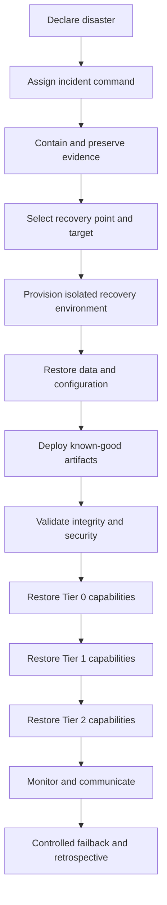

# Backup and Disaster Recovery

Version: 1.0.0  
Status: Active Draft  
Owners: Architecture, Backend Engineering, DevOps, Security  
Last reviewed: 2026-07-15

## 1. Purpose

This document defines backup, restore, disaster-recovery, and continuity requirements for KidsAudioBookPlatform. It covers PostgreSQL, Redis, RabbitMQ, object storage, configuration, secrets, deployment metadata, audit records, mobile distribution dependencies, and operational documentation.

The objective is to restore safe service within agreed recovery targets while preserving data integrity, security, and auditability.

## 2. Principles

1. Backups are useful only when restoration is tested.
2. PostgreSQL remains the authoritative store for transactional business data.
3. Redis is treated as reconstructable unless a specific use case is explicitly classified otherwise.
4. RabbitMQ is not a long-term archive; durable business facts must exist in authoritative storage.
5. Object-storage metadata and binary assets must be recoverable together.
6. Backups are encrypted, access-controlled, monitored, and separated from the primary failure domain.
7. Recovery procedures must not depend on the unavailable production system.
8. Child privacy and account-security controls remain enforced during incidents and restores.
9. Recovery prioritizes correctness and safety over immediate restoration of non-critical features.
10. Every disaster-recovery exercise produces evidence and follow-up actions.

## 3. Recovery terminology

- **RPO — Recovery Point Objective:** maximum acceptable data-loss window.
- **RTO — Recovery Time Objective:** maximum acceptable time to restore a capability.
- **MTPD — Maximum Tolerable Period of Disruption:** longest period the business can tolerate the capability being unavailable.
- **Backup:** protected copy used to restore data or configuration.
- **Restore:** reconstruction of a component from backup.
- **Failover:** switch to a prepared alternate resource or region.
- **Failback:** controlled return to the preferred environment after stabilization.

## 4. Capability tiers

| Tier | Capability examples | Initial RPO | Initial RTO |
|---|---|---:|---:|
| Tier 0 | Identity, authorization, subscription entitlements, audit integrity | 15 minutes | 2 hours |
| Tier 1 | Catalog, media metadata, playback progress, downloads, notifications | 1 hour | 4 hours |
| Tier 2 | Admin reporting, analytics, recommendations, non-critical campaigns | 24 hours | 24 hours |

These are initial architecture targets, not contractual guarantees. Production targets must be reviewed against actual hosting capabilities, business commitments, cost, and legal obligations.

## 5. Data inventory and backup policy

| Component | Authoritative? | Backup approach | Restore expectation |
|---|---|---|---|
| PostgreSQL | Yes | Automated snapshots plus point-in-time recovery logs | Restore to isolated instance and validate |
| Object storage | Yes for binary assets | Versioning, lifecycle protection, replication or backup | Restore object versions and metadata consistency |
| Redis | No by default | Optional persistence for operational continuity | Rebuild from PostgreSQL and configuration |
| RabbitMQ | No for long-term business state | Durable queues, definitions export, optional broker snapshot | Recreate topology and replay from outbox where possible |
| Secrets/configuration | Yes for operation | Versioned secret manager and protected configuration backup | Restore without exposing secret values |
| Infrastructure definitions | Yes for topology | Version-controlled IaC | Recreate environment |
| Container images | Yes for release recovery | Immutable registry retention | Redeploy known-good digest |
| Audit records | Yes | Included in database backups with stronger retention controls | Integrity-validated restore |
| Observability data | Operational | Provider retention/export based on policy | Partial recovery acceptable |

## 6. PostgreSQL backup strategy

PostgreSQL protection includes:

- automated full or storage-level snapshots;
- continuous WAL archiving or managed point-in-time recovery;
- backup encryption in transit and at rest;
- retention across daily, weekly, and monthly windows;
- backup copies outside the primary availability zone or equivalent failure domain;
- monitoring for backup age, completion, size anomalies, and restore eligibility;
- documented database version and extension compatibility;
- periodic logical exports for selected critical reference data where useful.

Backups must include all schemas required by the selected restoration point. Partial restoration is performed only through a documented, tested procedure.

## 7. Object-storage protection

Object storage must use:

- immutable or versioned object keys;
- bucket versioning where supported;
- deletion protection for critical production buckets;
- lifecycle rules that do not expire the last recoverable copy prematurely;
- replication or independent backup for published media and original uploads;
- checksum metadata;
- inventory reports for reconciliation;
- restricted deletion permissions;
- audit logs for administrative deletion and policy changes.

Database metadata and object versions must be restorable to a mutually consistent state. Missing derivatives may be regenerated from validated originals where processing is deterministic and the original remains available.

## 8. Redis recovery

Redis contains cache, counters, idempotency state, short-lived elevation state, and coordination data. By default:

- cache entries are rebuilt lazily or through controlled warm-up;
- rate-limit counters may reset only under an approved conservative fallback policy;
- idempotency loss is mitigated by durable database uniqueness and operation records for high-risk workflows;
- parent elevation sessions are invalidated after recovery;
- distributed locks are not restored as active ownership claims;
- stale entitlement cache is discarded.

Redis persistence may improve restart continuity but does not replace authoritative database recovery.

## 9. RabbitMQ recovery

RabbitMQ recovery requires:

- version-controlled exchange, queue, binding, dead-letter, and policy definitions;
- durable queues and persistent messages for flows that require them;
- publisher confirms;
- transactional outbox records retained until publication is confirmed;
- consumer idempotency;
- dead-letter inspection and replay procedures;
- monitoring of queue depth, unacknowledged messages, and oldest message age.

After broker loss, infrastructure recreates topology. Unpublished outbox entries are republished, and consumers safely tolerate duplicates. Business state must never rely only on an in-flight message.

## 10. Configuration, secrets, and release recovery

Recovery requires access to:

- infrastructure-as-code repositories;
- environment configuration versions;
- secret-manager backups or provider recovery capability;
- trusted signing keys and documented rotation procedures;
- container registry artifacts and digests;
- mobile signing materials protected by dedicated controls;
- DNS, certificate, CDN, and domain configuration;
- deployment and migration history;
- operational runbooks.

Secret recovery is tested without exporting plaintext secrets into tickets, chat, logs, or documentation.

## 11. Disaster scenarios

### 11.1 Accidental data deletion

Response:

1. stop the destructive path;
2. preserve logs and audit evidence;
3. identify scope and last known good point;
4. restore into isolation;
5. validate referential and business integrity;
6. merge or replace data using an approved plan;
7. notify affected stakeholders where required.

### 11.2 Corrupt database migration

Response:

- stop rollout;
- isolate writes if continuing would increase damage;
- use a forward corrective migration where safe;
- restore to a new database when corruption cannot be corrected safely;
- reconcile external provider events and outbox state;
- validate application and schema compatibility before reopening traffic.

### 11.3 Primary region or hosting failure

Response:

- declare incident and disaster-recovery mode;
- establish authoritative communication channel;
- assess whether failover is safer than waiting;
- provision or activate alternate environment;
- restore database and storage state;
- deploy known-good artifacts;
- update traffic routing;
- execute smoke and integrity tests;
- restore capabilities by priority tier.

### 11.4 Object-storage deletion or corruption

Response:

- prevent further lifecycle or deletion actions;
- identify affected versions through inventory and audit logs;
- restore objects from version history, replica, or backup;
- verify checksums;
- regenerate derivatives where possible;
- reconcile publication and download manifests.

### 11.5 Credential compromise

Response:

- revoke affected credentials and sessions;
- rotate secrets and signing keys according to blast radius;
- preserve evidence;
- validate backup integrity and administrative access history;
- restore services using newly issued credentials;
- do not restore compromised active credentials from backup.

### 11.6 Ransomware or destructive administrative access

Response:

- isolate affected systems;
- protect immutable backup copies;
- disable compromised identities;
- establish a clean recovery environment;
- verify artifacts and infrastructure definitions;
- restore from a known-good point;
- perform security validation before reconnecting traffic.

## 12. Recovery sequence

Dependencies are restored in an order that supports correctness: identity and data stores before business APIs; business APIs before optional workers and analytics.

## 13. Restore validation

A restore is not successful until validation confirms:

- database connectivity and migration state;
- expected table and row-count ranges;
- foreign-key and uniqueness integrity;
- authentication and session behavior;
- subscription and entitlement correctness;
- representative catalog and media references;
- signed media access;
- playback progress retrieval;
- outbox and inbox consistency;
- RabbitMQ topology and consumption;
- audit-record availability;
- absence of unexpected privileged accounts;
- telemetry from restored services;
- backup point and known data-loss window are documented.

Validation uses automated scripts plus manual business checks for critical flows.

## 14. Backup security

Backups must be protected through:

- least-privilege access;
- separate administrative roles;
- encryption with managed key rotation;
- immutability or deletion protection where available;
- network restrictions;
- access logging and alerting;
- periodic permission reviews;
- no use of production backups in lower environments without approved anonymization;
- secure destruction after retention expires.

The ability to restore a backup is a privileged security capability and must be audited.

## 15. Retention

Retention periods are documented by data class and aligned with legal, contractual, operational, and privacy requirements. Backup retention must not silently extend personal-data retention indefinitely.

When deletion requests apply, the platform records the deletion in active systems and allows protected backup copies to expire through their controlled retention schedule unless law or policy requires another process. Restored backups must reapply deletion tombstones or equivalent suppression records before normal operation.

## 16. Testing schedule

| Test | Minimum cadence |
|---|---|
| Automated backup completion check | Daily |
| PostgreSQL restore into isolated environment | At least quarterly |
| Point-in-time recovery exercise | At least twice per year |
| Object-storage sample restore and checksum validation | Quarterly |
| RabbitMQ topology recreation and outbox replay | Twice per year |
| Secret/configuration recovery exercise | At least annually |
| Full disaster-recovery simulation | At least annually and before major production expansion |
| Tabletop incident exercise | Twice per year |

Critical architecture or provider changes trigger an additional recovery test.

## 17. Recovery runbook requirements

Every runbook includes:

- trigger conditions;
- decision owner;
- prerequisites and access requirements;
- exact recovery sequence;
- commands or automation references;
- validation steps;
- abort conditions;
- communication responsibilities;
- rollback or failback instructions;
- evidence to retain;
- escalation contacts represented by role, not personal data.

Runbooks must be accessible when primary collaboration and production systems are unavailable.

## 18. Communication

During a disaster, communication includes:

- incident severity and scope;
- affected capabilities and regions;
- data-loss assessment status;
- current recovery phase;
- next decision point;
- customer or legal notification requirements;
- internal status cadence;
- final recovery confirmation.

Unverified claims about data loss or recovery time are avoided. Technical and customer-facing communication use a single approved source of truth.

## 19. Roles

| Role | Responsibility |
|---|---|
| Incident Commander | Coordinates decisions, priorities, and communication |
| Technical Recovery Lead | Directs infrastructure and application recovery |
| Database Recovery Owner | Selects and validates database recovery point |
| Security Lead | Handles containment, evidence, and credential safety |
| Product/Business Representative | Prioritizes capabilities and customer impact |
| Communications Owner | Maintains stakeholder updates |
| Scribe | Records timeline, decisions, evidence, and actions |

One person may hold multiple roles for a small team, but responsibilities remain explicit.

## 20. Failback

Failback is a planned change, not an automatic reversal. It requires:

- stable alternate environment;
- reconciled data and message state;
- validated primary environment;
- controlled replication or synchronization;
- scheduled traffic transition;
- rollback plan;
- heightened monitoring;
- confirmation that no writes are lost or duplicated.

## 21. Metrics and alerts

Track:

- age of latest successful backup;
- failed or incomplete backup jobs;
- WAL/archive lag;
- snapshot and backup size anomalies;
- replication status;
- object replication backlog;
- restore-test success rate;
- measured RPO and RTO during exercises;
- expired backup credentials;
- unauthorized backup-access attempts;
- untested runbooks and overdue exercises.

Backup failure alerts are actionable and owned. Repeated backup failure is treated as a production reliability incident.

## 22. Exit criteria after recovery

Disaster mode ends only when:

- required capabilities meet minimum health criteria;
- data integrity is validated;
- security containment is confirmed;
- traffic is stable;
- monitoring and alerting are operational;
- known data loss is documented;
- stakeholder communication is completed;
- temporary access and infrastructure are reviewed;
- follow-up issues have owners and deadlines.

## 23. Review cadence

This document is reviewed:

- before production launch;
- after every restore or disaster exercise;
- after material incidents;
- after changing database, object-storage, hosting, or secret providers;
- when recovery targets change;
- at least twice per year.

## 24. Related documents

- `05_Deployment_Diagram.md`
- `13_Resilience_and_Failure_Mode_Catalog.md`
- `14_Data_Retention_and_Privacy_Map.md`
- `17_Release_and_Deployment_Strategy.md`
- `20_Architecture_Operations_Handbook.md`
- `22_Cost_and_Capacity_Model.md`
- `ADR-0012-flyway-database-migrations.md`
- `Database_Design.md`
- `Logging_Monitoring.md`
