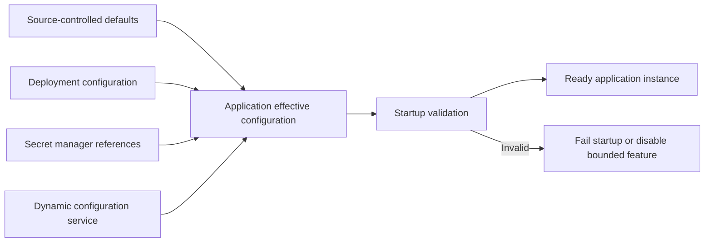

# Environment and Configuration Model

Version: 1.0.0  
Status: Active Draft  
Owners: Architecture, Backend Engineering, Mobile Engineering, DevOps, Security  
Last reviewed: 2026-07-15

## 1. Purpose

This document defines how KidsAudioBookPlatform environments, runtime configuration, secrets, feature controls, provider endpoints, certificates, and environment-specific behavior are managed.

The objective is to keep artifacts immutable, prevent configuration drift, protect secrets, make deployments reproducible, and ensure that local, CI, development, staging, and production environments behave predictably.

## 2. Principles

1. Build once and promote the same immutable artifact.
2. Configuration is external to application binaries and container images.
3. Secrets are never committed to source control or embedded in client applications.
4. Every configuration key has an owner, type, default policy, validation rule, and sensitivity classification.
5. Production-safe defaults are preferred over permissive defaults.
6. Missing critical configuration causes startup failure rather than silent unsafe behavior.
7. Environment differences are explicit and documented.
8. Configuration changes are reviewed, versioned, auditable, and reversible.
9. Feature flags do not replace security, authorization, or data-integrity controls.
10. Mobile applications are treated as untrusted public clients and receive only public configuration.

## 3. Environment model

| Environment | Primary purpose | Stability | Data policy | External integrations |
|---|---|---|---|---|
| Local | Individual development | Disposable | Synthetic | Local emulators or sandboxes |
| CI | Automated build and verification | Ephemeral | Generated fixtures | Mocked, containerized, or sandboxed |
| Development | Shared integration | Frequently changing | Synthetic | Sandboxes and test providers |
| Staging | Production-like validation | Controlled | Synthetic or approved anonymized | Production-like sandboxes |
| Production | Live customer service | Highly controlled | Production | Live providers |

Temporary preview environments may exist for pull requests, but they must be isolated, automatically expired, and prevented from using production credentials or production personal data.

## 4. Configuration categories

### 4.1 Static application configuration

Examples:

- thread-pool defaults;
- request-size limits;
- supported media codecs;
- retry-policy defaults;
- module enablement that is fixed for a release;
- route and serialization behavior.

This configuration is versioned with source code when it is not environment-specific.

### 4.2 Environment configuration

Examples:

- database host and pool size;
- Redis and RabbitMQ endpoints;
- object-storage bucket names;
- public API base URLs;
- log level policy;
- provider sandbox or live mode;
- CDN domain;
- deployment-region identifiers.

Environment configuration is managed through deployment tooling or a configuration service.

### 4.3 Secrets

Examples:

- database credentials;
- API keys;
- signing private keys;
- OAuth client secrets;
- push-provider credentials;
- email-provider credentials;
- object-storage access credentials;
- webhook verification secrets.

Secrets are stored in an approved secret manager and injected at runtime through protected mechanisms.

### 4.4 Dynamic product configuration

Examples:

- supported mobile versions;
- editorial scheduling limits;
- quiet-hour defaults;
- download limits;
- trial duration where legally and commercially appropriate;
- notification throttling;
- regional availability.

Dynamic product configuration requires schema validation, ownership, audit history, and safe fallback behavior.

### 4.5 Feature flags

Feature flags are managed according to `ADR-0011-feature-flags.md`. They are temporary release controls with explicit lifecycle, telemetry, and removal expectations.

## 5. Configuration hierarchy

Configuration precedence is explicit and deterministic:

1. secure runtime secret injection;
2. environment-specific deployment configuration;
3. approved dynamic configuration;
4. application defaults committed with source;
5. no implicit machine-local fallback in shared environments.

A higher-precedence source may override only keys designed to be overridden. The effective configuration source should be visible through safe operational diagnostics without exposing secret values.

## 6. Naming conventions

Configuration keys use stable, hierarchical names:

```text
<domain>.<component>.<purpose>
```

Examples:

```text
database.primary.pool.maxSize
messaging.notification.retry.maxAttempts
media.download.manifest.expiry
security.session.accessToken.ttl
observability.tracing.sampleRate
```

Environment variables may use an uppercase transformed representation:

```text
DATABASE_PRIMARY_POOL_MAX_SIZE
```

Names must communicate units where ambiguity exists, for example `timeoutMs`, `ttlSeconds`, or `maxBytes`.

## 7. Configuration schema

Every configuration item should define:

| Attribute | Description |
|---|---|
| Key | Stable canonical name |
| Owner | Team or bounded context responsible |
| Type | String, integer, boolean, duration, URL, enum, list, structured object |
| Required | Whether startup or feature operation requires it |
| Default | Safe default or explicit absence |
| Range/validation | Allowed values and constraints |
| Sensitivity | Public, internal, confidential, secret |
| Reload behavior | Startup-only, reloadable, or deployment-required |
| Environments | Where the key applies |
| Failure behavior | Fail closed, disable feature, or use safe fallback |
| Audit requirement | Whether changes require durable audit |
| Removal date | For temporary configuration |

Unstructured arbitrary key-value maps are avoided for critical controls.

## 8. Startup validation

Applications validate configuration before accepting traffic. Validation includes:

- required keys are present;
- URLs and hosts are syntactically valid;
- numeric values are within safe ranges;
- timeouts and TTLs use explicit units;
- production does not use sandbox endpoints;
- production secrets are not known placeholders;
- signing key identifiers are available;
- storage buckets and queue names match environment policy;
- incompatible options are rejected;
- dangerous development modes are disabled;
- configuration schema version is supported.

Critical validation failure prevents readiness and produces a concise operational error without logging secret values.

## 9. Secrets management

Secrets must:

- be generated with appropriate entropy;
- be stored in an approved managed secret system;
- be encrypted at rest and in transit;
- have least-privilege access policies;
- be separated by environment;
- be rotatable without rebuilding artifacts;
- be referenced by identifier rather than copied into configuration files;
- never appear in logs, metrics, traces, crash reports, analytics, or support exports;
- have access and modification auditing;
- be removed when no longer required.

Local development uses documented local-only secrets or emulators. Real production secrets must never be distributed to developer machines.

## 10. Secret rotation

Rotation procedures define:

1. new secret or key creation;
2. dual-validity period where required;
3. deployment or configuration update;
4. validation of new credential usage;
5. revocation of the old credential;
6. monitoring for residual use;
7. audit evidence and incident handling if rotation was compromise-driven.

Signing-key rotation publishes overlapping verification keys so active short-lived tokens remain verifiable during the transition.

## 11. Public mobile configuration

Mobile configuration may include only information safe for public distribution, such as:

- API base URL;
- public analytics identifiers where approved;
- minimum and recommended app versions;
- supported locales;
- public feature capability metadata;
- CDN public host;
- public certificate-pinning metadata where the chosen implementation requires it.

The application package must not contain private API keys, shared secrets, database credentials, provider private tokens, signing private keys, or administrative endpoints assumed to be hidden.

Any key shipped in a mobile binary is considered public.

## 12. Backend configuration boundaries

Each bounded context owns its configuration namespace. Shared platform configuration is limited to cross-cutting concerns such as:

- HTTP server behavior;
- observability;
- database connectivity;
- messaging infrastructure;
- cache connectivity;
- object-storage connectivity;
- security key references.

A module must not read another module's private configuration directly. Shared values are exposed through approved configuration contracts.

## 13. Dynamic configuration changes

Dynamic configuration is used only when runtime change is materially valuable. Changes require:

- authorization;
- validation before publication;
- version number;
- effective timestamp;
- actor and reason;
- old and new values with secret masking;
- rollback capability;
- propagation monitoring;
- bounded cache duration;
- safe behavior if the configuration service is unavailable.

Security-sensitive changes may require recent parent/admin re-authentication or multi-party approval depending on operational risk.

## 14. Reload behavior

Configuration keys are classified as:

- **startup-only** — require process restart or redeployment;
- **gracefully reloadable** — applied to new operations while in-flight work uses prior state;
- **immediately reloadable** — applied atomically with strong validation;
- **not dynamically changeable** — intentionally fixed in code or architecture decision.

Reloadable configuration must avoid partially applied state across replicas. Versioned snapshots and convergence metrics are preferred.

## 15. Configuration distribution



Configuration distribution must tolerate temporary provider unavailability according to the classification of each key. Critical secrets cannot be silently substituted with stale or placeholder values.

## 16. Environment isolation

Environments are isolated through:

- separate credentials;
- separate databases and schemas;
- separate Redis namespaces or instances;
- separate RabbitMQ virtual hosts or clusters;
- separate object-storage buckets;
- separate signing keys;
- separate push, email, billing, and analytics provider projects;
- separate domain names and certificates;
- explicit environment tags in logs and metrics;
- access policies preventing cross-environment writes.

Production services must never fall back automatically to development or staging resources.

## 17. Data policy by environment

- Production personal data stays in production unless an approved legal and security process authorizes another use.
- Lower environments use synthetic data by default.
- Anonymized production-derived datasets require documented anonymization, approval, retention, and deletion procedures.
- Backups are not copied into lower environments for convenience.
- Test accounts in production are clearly marked, controlled, and excluded from customer communication and analytics where appropriate.

## 18. Provider configuration

Every external provider configuration defines:

- sandbox and production endpoints;
- credential reference;
- timeout and retry policy;
- webhook URL and verification secret;
- expected region;
- data classification;
- fallback behavior;
- rate limits;
- health and observability signals;
- owner and escalation path;
- contract version.

Provider modes must not be selected only through an easily mistyped boolean. Explicit environment-aware enumerations and startup validation are preferred.

## 19. Certificates and trust material

TLS certificates, certificate authorities, public verification keys, and trust-store configuration have:

- clear ownership;
- automated expiry monitoring;
- renewal procedure;
- staged rollout;
- rollback path;
- secure storage for private keys;
- inventory by environment and domain;
- emergency replacement procedure.

Certificate expiry is treated as a preventable production incident and alerted well before expiration.

## 20. Configuration observability

Track:

- active configuration schema version;
- non-secret configuration version;
- time of last successful refresh;
- replica convergence;
- validation failures;
- rejected changes;
- fallback usage;
- stale configuration age;
- expired or near-expiry secrets and certificates;
- feature-flag evaluation failures;
- environment-policy violations.

Logs may include configuration key names and versions but never secret values.

## 21. Drift detection

Drift occurs when runtime state differs from approved configuration or infrastructure definitions. Controls include:

- immutable deployment artifacts;
- infrastructure-as-code plans;
- configuration version comparison;
- periodic environment inventory;
- policy checks in CI/CD;
- deployment reconciliation;
- alerts for manual changes;
- documented emergency-change reconciliation.

Manual console changes in production must be exceptional, audited, and reconciled back into source-controlled definitions immediately after stabilization.

## 22. Failure modes

| Failure mode | Required behavior |
|---|---|
| Required secret missing | Fail startup/readiness |
| Dynamic configuration service unavailable | Use last validated snapshot only where approved |
| Invalid configuration published | Reject atomically and retain previous version |
| Replicas use different versions | Alert and block risky rollout progression |
| Production points to sandbox provider | Fail startup or provider initialization |
| Secret expires | Alert before expiry; fail safely if unusable |
| Mobile remote config unavailable | Use bundled public safe defaults |
| Feature flag service unavailable | Apply documented fail-open or fail-closed policy per flag |
| Configuration contains unknown keys | Warn or reject according to schema strictness |

## 23. Change workflow

1. Identify configuration owner and affected environments.
2. Update schema, documentation, and validation.
3. Review security and compatibility impact.
4. Test in CI and development.
5. Promote to staging.
6. Validate effective configuration and behavior.
7. Approve production change.
8. Apply through controlled deployment tooling.
9. Confirm convergence and metrics.
10. Remove obsolete keys and temporary compatibility logic.

High-risk configuration changes use progressive rollout or bounded target groups.

## 24. Rollback

Every configuration change must have a rollback plan. Rollback may restore the prior version, disable a feature, revert provider routing, or redeploy a known-good artifact when configuration and code are coupled.

A rollback must not restore revoked credentials or known-vulnerable settings. Security-driven changes may require forward correction instead.

## 25. Access control

Access follows least privilege:

| Role | Typical access |
|---|---|
| Developer | Local and selected development configuration |
| QA | Development/staging non-secret operational controls |
| DevOps | Deployment configuration and controlled secret references |
| Security | Secret policy, key lifecycle, audit review |
| Product/Admin operator | Approved dynamic product configuration only |
| Application runtime | Read only the secrets and keys required by its component |

Direct production secret viewing is minimized and audited.

## 26. Testing requirements

Tests include:

- schema validation;
- missing-required-key behavior;
- boundary and range validation;
- production-mode safety checks;
- configuration reload concurrency;
- stale snapshot behavior;
- secret rotation compatibility;
- environment isolation;
- provider sandbox/live separation;
- mobile bundled-default behavior;
- rollback to prior configuration version.

Configuration tests run in CI and production-like staging.

## 27. Definition of done

A new configuration key is complete only when:

- naming follows conventions;
- owner and sensitivity are defined;
- schema and validation exist;
- safe default or required status is explicit;
- environment scope is documented;
- reload behavior is known;
- failure and fallback behavior are tested;
- secret handling is appropriate;
- observability exists;
- removal plan exists for temporary keys.

## 28. Review cadence

This document is reviewed:

- before production launch;
- after configuration-related incidents;
- when adopting a new secret or configuration provider;
- when adding environments or regions;
- when service extraction changes ownership boundaries;
- at least twice per year.

## 29. Related documents

- `ADR-0005-jwt-refresh-token-strategy.md`
- `ADR-0011-feature-flags.md`
- `ADR-0013-versioning-strategy.md`
- `05_Deployment_Diagram.md`
- `12_Security_Control_Matrix.md`
- `17_Release_and_Deployment_Strategy.md`
- `18_Backup_and_Disaster_Recovery.md`
- `20_Architecture_Operations_Handbook.md`
- `Technology_Stack.md`
- `Security_Architecture.md`
