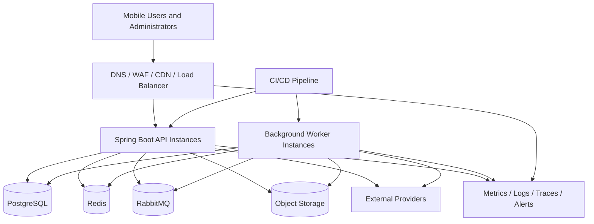
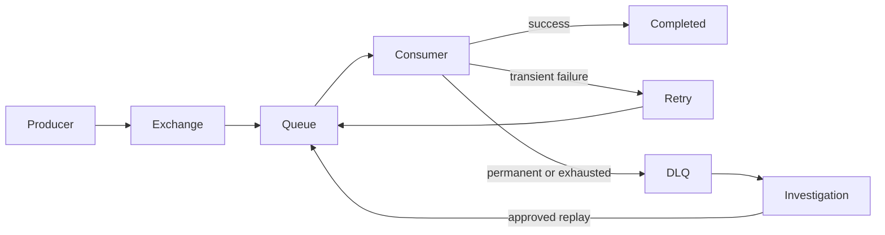
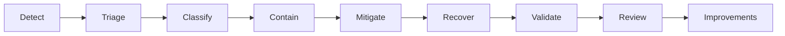

# Architecture Operations Handbook

Version: 1.0.0  
Status: Active Draft  
Owners: Architecture, Platform Engineering, Backend Engineering  
Last reviewed: 2026-07-14

## 1. Purpose

This handbook defines how the architecture of KidsAudioBookPlatform is operated after design and implementation. It connects architectural intent with production behavior, incident response, capacity management, deployment decisions, resilience testing, and continuous improvement.

The goal is to ensure that the platform remains secure, observable, recoverable, performant, and understandable as usage and technical complexity grow.

## 2. Scope

This document applies to:

- Flutter mobile applications;
- administrative web applications;
- Spring Boot APIs and background workers;
- PostgreSQL;
- Redis;
- RabbitMQ;
- object storage and CDN;
- external integrations;
- monitoring, logging, tracing, and alerting;
- CI/CD and production deployment workflows.

It complements the structural C4 views. The C4 model explains what exists and how components relate; this handbook explains how those components are operated safely.

## 3. Operational architecture principles

1. Production behavior must be observable.
2. Every critical dependency must have a documented failure mode.
3. Recovery procedures must be tested, not assumed.
4. Deployments must be reversible.
5. Capacity decisions must be based on measured demand.
6. User-facing paths receive priority over background work.
7. Operational access follows least privilege.
8. Manual production changes must be exceptional and auditable.
9. Incidents must produce durable improvements.
10. Architecture documentation must reflect production reality.

## 4. Production ownership model

| Area | Primary owner | Supporting roles |
|---|---|---|
| Mobile runtime | Mobile Engineering | Backend, Product, QA |
| Public and parent APIs | Backend Engineering | Platform, Security |
| Admin APIs and dashboard | Backend / Frontend | Security, Support |
| PostgreSQL | Platform Engineering | Backend Engineering |
| Redis | Platform Engineering | Backend Engineering |
| RabbitMQ and workers | Backend / Platform | Observability |
| Object storage and CDN | Platform Engineering | Backend, Security |
| Billing integrations | Backend Engineering | Product, Finance, Support |
| Push and email delivery | Backend Engineering | Product, Support |
| Monitoring and alerting | Platform Engineering | All engineering teams |
| Incident command | Assigned incident commander | Relevant service owners |

Every production component must have:

- a named owner;
- an escalation path;
- a dashboard;
- alerts for critical failure modes;
- a runbook;
- a documented recovery strategy.

## 5. Operational topology

The production topology must prevent direct public access to PostgreSQL, Redis, RabbitMQ, and internal administration endpoints.

## 6. Service criticality tiers

### Tier 0 — Safety and identity

Examples:

- authentication;
- authorization;
- account and child-profile ownership validation;
- Parent Zone protection;
- security audit trail.

Tier 0 failures may require immediate release rollback or traffic restriction.

### Tier 1 — Core listening experience

Examples:

- catalog discovery;
- story metadata;
- entitlement validation;
- playback authorization;
- progress persistence;
- signed media access.

Tier 1 services have the strongest availability and latency objectives.

### Tier 2 — Supporting product capabilities

Examples:

- notifications;
- recommendations;
- analytics ingestion;
- search indexing;
- administrative exports.

Tier 2 degradation must not block Tier 0 or Tier 1 journeys.

### Tier 3 — Internal and batch capabilities

Examples:

- historical reporting;
- non-urgent maintenance jobs;
- bulk administrative operations;
- cleanup and archival processes.

Tier 3 work is paused first during resource pressure.

## 7. Service-level indicators and objectives

Core indicators:

- request success rate;
- p50, p95, and p99 latency;
- playback authorization success;
- playback-start delay;
- progress synchronization success;
- authentication success and failure rate;
- queue processing lag;
- notification delivery rate;
- database availability and query latency;
- cache hit ratio and error rate;
- external-provider error rate.

Initial objectives must align with `Performance_Guidelines.md` and be reviewed after production usage becomes available.

Error budgets are used to balance feature delivery and reliability. When a critical SLO is exhausted, reliability work takes priority over non-critical feature work until risk is reduced.

## 8. Health checks

### 8.1 Liveness

Liveness verifies that the process is running and can make progress. It must not depend on every downstream system.

A liveness failure may trigger process restart.

### 8.2 Readiness

Readiness verifies that the instance can safely receive traffic. It may include checks for:

- required configuration;
- database connectivity;
- migration compatibility;
- essential security material;
- critical internal initialization.

An instance that is alive but not ready must be removed from traffic without unnecessary restart loops.

### 8.3 Dependency health

Dependency health is reported separately from process health. Redis, RabbitMQ, object storage, and third-party providers must not all be folded into one binary application health result.

## 9. Deployment operating model

Every deployment must include:

- immutable build artifacts;
- traceability to commit SHA;
- automated tests;
- dependency and image scanning;
- migration compatibility review;
- deployment health verification;
- rollback criteria;
- post-deployment observation.

Preferred release strategies:

| Strategy | Use case |
|---|---|
| Rolling deployment | Routine backward-compatible releases |
| Blue/green | High-risk platform or runtime changes |
| Canary | Behavior changes requiring production validation |
| Feature flags | Incremental exposure and rapid disablement |

A deployment is not complete when containers start. It is complete when critical telemetry confirms healthy production behavior.

## 10. Database change operations

Database changes use an expand-and-contract approach.

### Expand

- add backward-compatible columns or tables;
- deploy code able to work with old and new structures;
- backfill in bounded batches;
- monitor locks, replication, and query impact.

### Migrate

- switch reads and writes gradually;
- verify data correctness;
- keep rollback possible.

### Contract

- remove deprecated structures only after all consumers are migrated;
- document irreversible steps;
- take validated backups before high-risk operations.

Forbidden production practices:

- destructive schema changes bundled with incompatible application rollout;
- unbounded backfills during peak traffic;
- manual table edits without migration history;
- long-running exclusive locks without reviewed maintenance planning.

## 11. RabbitMQ and worker operations

Operational metrics:

- queue depth;
- publish rate;
- delivery rate;
- consumer utilization;
- processing latency;
- retry count;
- dead-letter volume;
- oldest-message age.

Rules:

- consumers must be idempotent;
- retries must be bounded;
- poison messages must enter a dead-letter workflow;
- worker concurrency must respect downstream capacity;
- queues must have explicit ownership;
- replay procedures must be documented.

## 12. Redis operations

Redis must be treated as disposable acceleration infrastructure unless explicitly documented otherwise.

Monitor:

- memory utilization;
- eviction rate;
- hit ratio;
- command latency;
- connection count;
- blocked clients;
- replication state where applicable.

Required behavior:

- essential reads fall back to PostgreSQL when safe;
- cache keys are versioned;
- TTLs are explicit;
- cache stampedes are controlled;
- no business-critical truth exists only in cache.

## 13. Object storage and CDN operations

Monitor:

- upload failures;
- malware-scan failures;
- object-processing backlog;
- signed-URL generation failures;
- CDN cache hit ratio;
- origin latency;
- media egress;
- range-request success;
- missing or unauthorized objects.

Operational rules:

- immutable media versions use unique keys;
- replacement assets do not reuse cache identifiers;
- access policies are least-privilege;
- direct upload sessions expire;
- orphaned uploads are cleaned by scheduled jobs;
- deletion workflows account for CDN propagation and retention requirements.

## 14. External-provider operations

External dependencies include app-store billing, push notifications, email delivery, and future content or analytics providers.

Each integration requires:

- timeout policy;
- retry policy;
- circuit breaker or rate protection;
- idempotency behavior;
- webhook verification;
- fallback or degradation strategy;
- provider-status dashboard;
- support escalation procedure.

External-provider failure must not consume unlimited application threads, connections, or queue capacity.

## 15. Alerting standards

Alerts must be actionable. Every alert requires:

- owner;
- severity;
- user impact description;
- dashboard link;
- runbook link;
- escalation rule;
- recovery signal.

### Severity model

| Severity | Description | Expected response |
|---|---|---|
| SEV-1 | Broad outage, security incident, or critical data risk | Immediate incident command |
| SEV-2 | Major degradation of core journey | Urgent coordinated response |
| SEV-3 | Limited degradation or operational risk | Same-day investigation |
| SEV-4 | Warning, trend, or maintenance issue | Planned remediation |

Avoid alerting on every individual failure. Alert on sustained impact, budget burn, saturation, and conditions requiring human action.

## 16. Incident response lifecycle

### 16.1 Detect

Detection may come from telemetry, users, support, security systems, or external providers.

### 16.2 Triage

Confirm:

- affected journeys;
- affected regions or clients;
- start time;
- recent deployments;
- dependency status;
- security or data-integrity risk.

### 16.3 Contain

Containment actions may include:

- disabling a feature flag;
- stopping a worker;
- restricting traffic;
- revoking credentials;
- pausing a campaign;
- isolating a compromised component.

### 16.4 Mitigate and recover

Prefer reversible mitigation. Recovery must be validated using user-journey checks and telemetry, not only infrastructure status.

### 16.5 Review

Significant incidents require a blameless post-incident review including:

- timeline;
- impact;
- root and contributing causes;
- detection gaps;
- response gaps;
- corrective actions;
- documentation and architecture updates.

## 17. Standard failure scenarios

### PostgreSQL unavailable

Expected behavior:

- reject operations requiring authoritative data;
- avoid retry storms;
- preserve queued work where safe;
- expose accurate health status;
- page the database owner;
- restore from failover or recovery procedure.

### Redis unavailable

Expected behavior:

- bypass cache for essential operations;
- rate-limit fallback load;
- disable non-essential cache-dependent features if necessary;
- monitor PostgreSQL saturation.

### RabbitMQ unavailable

Expected behavior:

- fail fast or persist through transactional outbox;
- do not lose committed business events;
- pause non-essential publishers if backlogs threaten capacity;
- reconcile events after recovery.

### Object storage or CDN unavailable

Expected behavior:

- metadata browsing may continue;
- playback and upload errors must be explicit;
- placeholder images may be used;
- clients must not loop aggressively;
- provider recovery must be monitored.

### Billing provider unavailable

Expected behavior:

- do not invent entitlements;
- use documented grace policy for recently verified subscriptions;
- persist reconciliation work;
- prevent duplicate purchase handling.

### Push or email provider unavailable

Expected behavior:

- persist notifications;
- retry according to policy;
- do not block user transactions;
- expose delivery delay metrics.

## 18. Capacity and saturation management

Track capacity for:

- API CPU and memory;
- request concurrency;
- JVM heap and allocation rate;
- database connections;
- database CPU, IOPS, locks, and storage;
- Redis memory and throughput;
- RabbitMQ queue depth and disk usage;
- worker concurrency;
- object-storage volume;
- CDN and network egress;
- external-provider quotas.

Capacity reviews must include current usage, peak usage, growth trend, failure threshold, and planned headroom.

Autoscaling is not a substitute for fixing inefficient queries, unbounded work, or broken retry behavior.

## 19. Backup, restore, and disaster recovery

Required assets:

- PostgreSQL backups;
- object-storage versioning or backup strategy;
- configuration and infrastructure definitions;
- secret recovery procedure;
- RabbitMQ topology definitions;
- critical audit records.

Recovery planning must define:

- Recovery Point Objective (RPO);
- Recovery Time Objective (RTO);
- restoration order;
- validation steps;
- responsible owners;
- communication plan.

Restore tests must occur on a schedule. A backup that has never been restored is not considered verified.

## 20. Security operations

Security operations include:

- dependency and container vulnerability monitoring;
- secret rotation;
- certificate renewal;
- privileged-access review;
- failed-login and anomaly monitoring;
- audit-log review;
- incident containment;
- mobile release security checks;
- provider credential revocation procedures.

Sensitive production access must be time-bounded where possible and fully auditable.

## 21. Operational access rules

- Production database access is read-only by default.
- Write access requires explicit approval and auditability.
- Shared administrator accounts are prohibited.
- Secrets must not be copied into tickets, chat, logs, or documentation.
- Emergency changes must be documented after stabilization.
- Access reviews occur periodically and after team changes.

## 22. Runbook standard

Each runbook must contain:

1. purpose and scope;
2. alert or trigger;
3. user impact;
4. prerequisites and access requirements;
5. diagnostic steps;
6. safe mitigation actions;
7. rollback or recovery actions;
8. validation steps;
9. escalation path;
10. related dashboards and documents.

Runbooks must use commands and identifiers that are safe to execute and must clearly mark destructive steps.

## 23. Production readiness review

Before a new capability reaches production, verify:

- ownership is assigned;
- architecture and ADRs are current;
- dashboards exist;
- alerts exist and were tested;
- logs include correlation context;
- health checks are correct;
- SLO impact is understood;
- database and queue capacity were reviewed;
- security review is complete;
- deployment and rollback were tested;
- migrations are backward-compatible;
- failure modes and fallbacks are defined;
- support and incident documentation exists;
- data retention and deletion behavior is implemented.

## 24. Operational review cadence

| Review | Cadence |
|---|---|
| Critical alert review | Weekly |
| SLO and error-budget review | Monthly |
| Capacity review | Monthly or before major campaigns |
| Access review | Quarterly |
| Disaster-recovery exercise | At least twice per year |
| Architecture-production drift review | Quarterly |
| Dependency and runtime lifecycle review | Quarterly |
| Runbook validation | After incidents and at least annually |

## 25. Architecture-production drift

Drift occurs when production behavior no longer matches documented architecture.

Examples:

- an undocumented synchronous dependency appears;
- one module reads another module's tables directly;
- a cache becomes a de facto source of truth;
- a queue has no owner;
- an external integration bypasses the approved adapter;
- production scaling differs materially from the deployment view.

Drift must be either corrected or documented through an ADR and architecture update.

## 26. Operational anti-patterns

The following are prohibited:

- restarting services repeatedly without understanding the cause;
- increasing timeouts to hide dependency slowness;
- increasing connection pools to hide inefficient queries;
- unlimited retries;
- alerting without ownership;
- undocumented manual production fixes;
- disabling security checks to restore service without incident command approval;
- treating average latency as sufficient evidence of health;
- running destructive migrations and application changes as one irreversible step;
- relying on a single person for recovery knowledge.

## 27. Continuous improvement

Operational improvements are created from:

- incidents;
- near misses;
- capacity trends;
- security findings;
- user complaints;
- support patterns;
- performance tests;
- disaster-recovery exercises;
- architecture reviews.

Each accepted improvement must have an owner, priority, target date, and closure evidence.

## 28. Related documents

- `README.md`
- `01_System_Context.md`
- `02_Container_Diagram.md`
- `05_Deployment_Diagram.md`
- `06_Runtime_Views.md`
- `07_Security_Trust_Boundaries.md`
- `15_Architecture_Roadmap.md`
- `16_Known_Technical_Debt.md`
- `../Performance_Guidelines.md`
- `../Logging_Monitoring.md`
- `../Security_Architecture.md`
- `../Backend_Architecture.md`
- `../Database_Design.md`

## 29. Final operational rule

A component is not production-ready merely because it works in a development environment. It is production-ready only when the team can detect its failures, understand their impact, recover safely, and verify that the system has returned to a healthy state.
