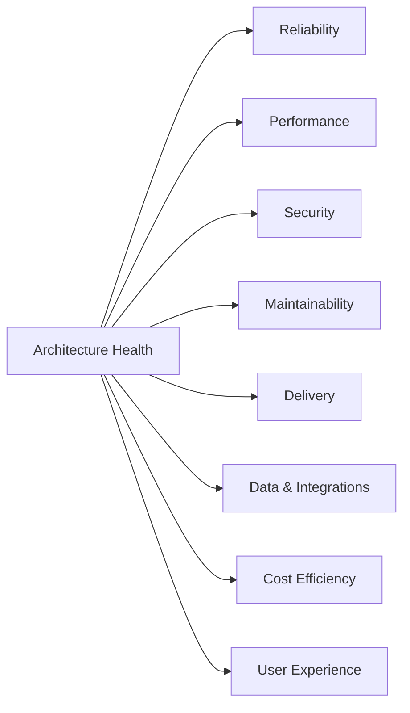
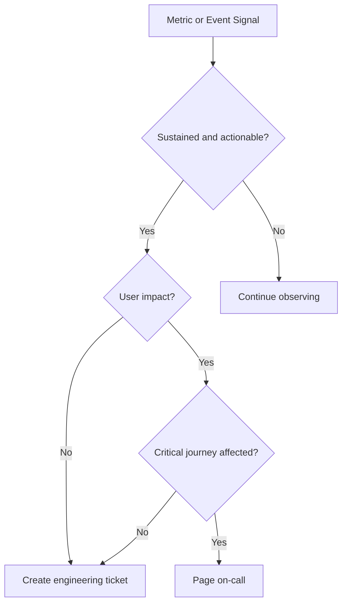
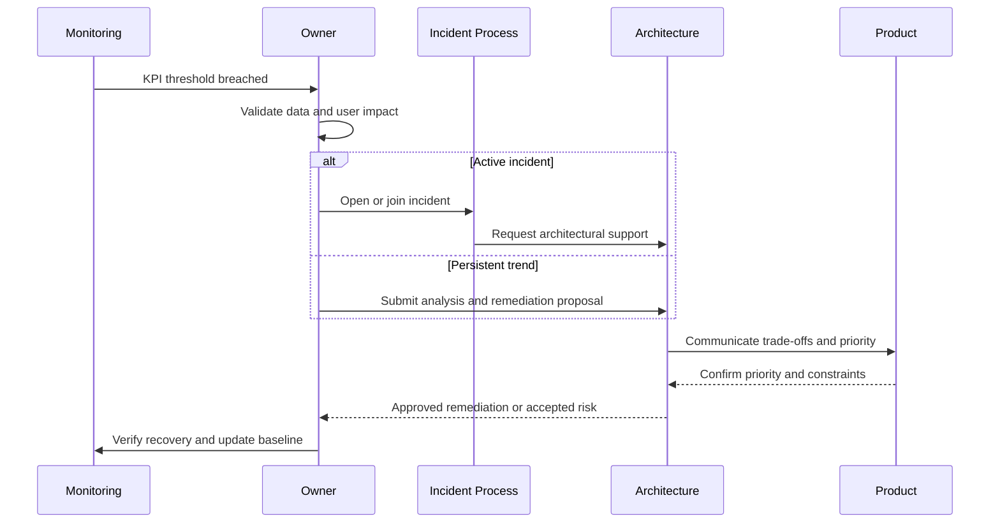

# Architecture KPI and Metrics

Version: 1.0.0  
Status: Active Draft  
Owners: Architecture, Engineering, SRE, Product  
Last reviewed: 2026-07-14

## 1. Purpose

This document defines the official architecture measurement framework for KidsAudioBookPlatform. It translates architectural goals into measurable indicators that can be reviewed continuously instead of being evaluated only through subjective opinions.

The framework covers technical health, delivery quality, platform reliability, scalability, security, maintainability, cost efficiency, and user-facing performance.

## 2. Measurement principles

1. Every architectural objective must have at least one measurable signal.
2. Metrics must support decisions, not vanity reporting.
3. Percentiles are preferred over averages for latency.
4. Business and technical indicators must be reviewed together.
5. A metric without an owner and response action is incomplete.
6. Targets must be realistic, versioned, and periodically reassessed.
7. Metrics must not expose child or parent personal data.
8. Trends matter more than isolated values.
9. Architecture metrics must be automated where possible.
10. Teams must avoid optimizing one metric at the expense of system-wide health.

## 3. KPI categories

The architecture KPI model is organized into eight categories:

- Reliability and availability
- Performance and scalability
- Security and privacy
- Maintainability and modularity
- Delivery and change health
- Data and integration quality
- Cost and resource efficiency
- User-experience architecture signals



## 4. Reliability and availability KPIs

| KPI | Definition | Initial target | Review cadence | Owner |
|---|---|---:|---|---|
| Core API availability | Successful service time for user-critical APIs | >= 99.9% monthly | Weekly / Monthly | SRE + Backend |
| Playback authorization availability | Availability of entitlement and media-access path | >= 99.95% monthly | Weekly | Backend + SRE |
| Error rate | 5xx responses divided by total requests | < 0.5% | Daily | Backend |
| Mean time to detect | Time between incident start and detection | < 5 minutes for critical incidents | Per incident | SRE |
| Mean time to restore | Time between detection and restoration | < 60 minutes for Sev-1 | Per incident | SRE |
| Queue processing success | Successfully processed RabbitMQ messages | >= 99.9% | Daily | Backend |
| Backup success | Completed and verified backups | 100% scheduled runs | Daily | DevOps |
| Restore test success | Successful restore rehearsal | 100% quarterly exercises | Quarterly | DevOps |

### 4.1 Availability calculation

Availability must be calculated using user-visible service windows, not only infrastructure process uptime.

```text
Availability = (Total period - qualifying outage duration) / Total period
```

Planned maintenance is excluded only when it is approved, communicated, and executed inside the defined maintenance policy.

### 4.2 Critical journey availability

Availability must be tracked separately for:

- sign in and token refresh;
- child profile selection;
- catalog browse;
- story detail retrieval;
- entitlement validation;
- playback URL generation;
- progress synchronization;
- subscription restoration;
- Parent Zone access.

A healthy global API metric must not hide a broken critical journey.

## 5. Performance and scalability KPIs

| KPI | Definition | Initial target |
|---|---|---:|
| Read API p95 | 95th percentile read latency | <= 400 ms |
| Write API p95 | 95th percentile write latency | <= 700 ms |
| Catalog query p95 | Catalog filtering and pagination | <= 500 ms |
| Authentication p95 | Login or token refresh | <= 800 ms |
| Playback-start authorization p95 | Entitlement check and signed URL generation | <= 500 ms |
| Progress-save p95 | Progress persistence request | <= 400 ms |
| Database query p95 | Important transactional queries | <= 100 ms where practical |
| Cache hit ratio | Hits divided by cache lookups | >= 80% for approved hot datasets |
| Queue lag | Time between publication and consumption | <= 30 seconds for normal events |
| Mobile frame health | Frames rendered within platform budget | >= 99% non-janky during core flows |
| Cold start | Mobile app cold-start time on supported devices | Tracked by device tier |

### 5.1 Saturation metrics

Every production component must expose saturation signals:

- CPU utilization;
- memory utilization and headroom;
- JVM heap and native memory;
- garbage-collection pause time;
- HTTP worker or virtual-thread pressure;
- database connection-pool utilization;
- PostgreSQL active connections and lock waits;
- Redis memory and eviction pressure;
- RabbitMQ queue depth and consumer utilization;
- object-storage request latency;
- CDN cache hit ratio;
- mobile memory and battery impact.

### 5.2 Scalability efficiency

Scalability tests must measure whether adding resources creates proportional capacity gains.

```text
Scaling efficiency = throughput gain percentage / resource increase percentage
```

A sustained efficiency below 0.6 requires investigation before additional infrastructure is purchased.

## 6. Security and privacy KPIs

| KPI | Definition | Target |
|---|---|---:|
| Critical unresolved vulnerabilities | Open critical findings in production scope | 0 |
| High vulnerabilities beyond SLA | High findings older than remediation target | 0 |
| Secret exposure incidents | Confirmed leaked credentials or keys | 0 |
| Dependency scan coverage | Deployable artifacts scanned | 100% |
| SAST coverage | Relevant repositories scanned | 100% |
| Container image scan coverage | Production images scanned before release | 100% |
| Privileged action audit coverage | Sensitive admin and Parent Zone actions logged | 100% |
| Failed-login anomaly detection | Monitored authentication abuse patterns | 100% enabled |
| Security patch latency | Time to patch critical supported dependency | Within defined SLA |
| Data-retention compliance | Records handled according to approved retention policy | 100% |

Security metrics must never include raw credentials, child names, private profile data, payment details, or access tokens.

## 7. Maintainability and modularity KPIs

### 7.1 Dependency health

Track:

- forbidden cross-module dependencies;
- cyclic dependencies;
- direct infrastructure access from API layers;
- direct database-table access across bounded contexts;
- usage of internal packages by unrelated modules;
- number of architecture-rule violations detected by ArchUnit or equivalent checks.

Target: zero new violations in protected branches.

### 7.2 Code health indicators

| Indicator | Guidance |
|---|---|
| Cyclomatic complexity | Track trend and investigate high-risk classes or methods |
| Service size | Large application services require decomposition review |
| Controller size | Controllers must remain transport-focused |
| Duplicate logic | Repeated domain rules must be consolidated deliberately |
| Test-to-code trend | Used as a signal, never as an isolated quality score |
| Public API documentation | Required for shared or externally consumed contracts |
| Deprecated API usage | Must decrease over time |
| Unsupported dependency count | Must remain zero in production scope |

### 7.3 Architecture fitness functions

The following must be automated in CI where feasible:

- package dependency rules;
- bounded-context access rules;
- API compatibility checks;
- migration validation;
- OpenAPI linting;
- event-schema compatibility checks;
- container vulnerability checks;
- forbidden secret patterns;
- documentation-link validation;
- Mermaid rendering validation for critical diagrams.

## 8. Delivery and change-health KPIs

| KPI | Definition | Desired direction |
|---|---|---|
| Deployment frequency | Successful production deployments | Increase safely |
| Lead time for change | Commit to production | Decrease |
| Change failure rate | Deployments causing rollback, hotfix, or incident | Decrease |
| Mean time to recovery | Time to recover from failed change | Decrease |
| Rollback success rate | Rollbacks completed without secondary incident | Increase |
| Migration failure rate | Failed Flyway or data migrations | Approach zero |
| Architecture review turnaround | Time from request to decision | Predictable and bounded |
| Documentation freshness | Critical docs reviewed within cadence | Increase |

Architecture governance must not become a delivery bottleneck. Long review time without increased quality is itself an architecture-process defect.

## 9. Data and integration quality KPIs

### 9.1 Data quality

Track:

- invalid records rejected at boundaries;
- orphaned references;
- duplicate business identifiers;
- failed migrations;
- missing required localization fields;
- inconsistent entitlement state;
- stale read models;
- unprocessed outbox events;
- retention-policy violations.

### 9.2 Integration health

| KPI | Definition | Target |
|---|---|---:|
| Store webhook success | Valid Apple/Google billing events processed | >= 99.9% |
| Push-provider acceptance | Notifications accepted by provider | >= 99% excluding invalid tokens |
| Email-provider acceptance | Transactional messages accepted | >= 99% |
| Dead-letter growth | Net growth in DLQs without resolution | 0 sustained growth |
| Duplicate event side effects | User-visible duplicate effects | 0 |
| Contract compatibility failures | Breaking consumer/provider mismatches | 0 in production |
| External timeout rate | Timed-out dependency calls | Tracked per dependency |

## 10. Cost and resource-efficiency KPIs

Cost must be measured per meaningful unit, not only as a total invoice.

Recommended metrics:

- infrastructure cost per monthly active account;
- storage cost per published audio hour;
- CDN egress cost per playback hour;
- notification cost per delivered message;
- database cost per active user;
- observability cost per million requests;
- idle resource percentage;
- cache savings compared with source-system load;
- failed-work cost from retries and duplicate processing.

### 10.1 Cost guardrails

- Cost optimization must not weaken child safety or security.
- Media quality may be optimized only within product-approved quality levels.
- Logs may be sampled or tiered, but required audit records must be retained.
- Reserved capacity or long-term commitments require validated usage trends.
- New microservices must include an operating-cost estimate.

## 11. User-experience architecture signals

Architecture must support product-quality indicators, including:

- time to interactive for the child home screen;
- time to first playable audio byte;
- playback interruption rate;
- resume-success rate;
- offline playback success;
- profile-switch success rate;
- entitlement false-negative rate;
- artwork failure rate;
- notification-open latency where measurable;
- Parent Zone authentication failure rate;
- battery usage during long playback sessions.

These metrics must be segmented by app version, operating system, device tier, and network quality where privacy-safe.

## 12. Metric ownership model

Every production metric must define:

| Field | Description |
|---|---|
| Name | Stable machine and human-readable name |
| Purpose | Decision supported by the metric |
| Owner | Team responsible for interpretation and action |
| Source | System producing the data |
| Formula | Exact calculation |
| Dimensions | Allowed labels or segmentation |
| Target | Expected threshold or range |
| Alert | Conditions requiring action |
| Runbook | Response procedure |
| Retention | How long metric data is stored |

Metrics without an owner must not generate paging alerts.

## 13. Cardinality and privacy rules

Metrics labels must never contain:

- account IDs;
- child profile IDs;
- email addresses;
- names;
- access tokens;
- device tokens;
- full URLs containing identifiers;
- unbounded error messages;
- story titles when a stable low-cardinality category is sufficient.

Use bounded labels such as:

- endpoint template;
- HTTP status class;
- service name;
- deployment environment;
- app version;
- operating-system family;
- queue name;
- bounded event type;
- error category.

## 14. Dashboard model

### 14.1 Executive architecture dashboard

Shows:

- SLO compliance;
- critical-journey availability;
- change failure rate;
- critical security findings;
- monthly infrastructure cost trend;
- major technical-debt trend;
- incident count and severity;
- architecture roadmap status.

### 14.2 Engineering dashboard

Shows:

- endpoint latency percentiles;
- error rates;
- database and cache performance;
- queue lag;
- JVM and container saturation;
- deployment markers;
- application-version distribution;
- dependency failures.

### 14.3 Mobile-experience dashboard

Shows:

- cold and warm start;
- frame performance;
- playback start;
- crash-free sessions;
- offline sync results;
- battery and memory indicators;
- failure rates by app version and device tier.

### 14.4 Security dashboard

Shows:

- vulnerability backlog;
- remediation age;
- failed-login anomalies;
- privileged-action volume;
- token-refresh abuse patterns;
- WAF/rate-limit events;
- image and dependency scan status.

## 15. Alerting rules

Alerts must be actionable and mapped to severity.

| Severity | Example | Response |
|---|---|---|
| Sev-1 | Core playback path unavailable | Immediate paging and incident command |
| Sev-2 | Significant latency or partial critical-path degradation | Urgent response during on-call window |
| Sev-3 | Non-critical degradation or growing backlog | Ticket plus working-hours response |
| Sev-4 | Trend or capacity warning | Planned engineering work |

Avoid alerts based only on instantaneous CPU or memory values. Prefer multi-signal alerts combining user impact, errors, saturation, and persistence.



## 16. Review cadence

| Review | Cadence | Participants |
|---|---|---|
| Operational health | Daily | On-call engineering |
| Service KPI review | Weekly | Backend, Mobile, SRE |
| SLO review | Monthly | Engineering and Product |
| Security metrics review | Monthly or after major finding | Security and Engineering |
| Cost review | Monthly | Architecture, DevOps, Product |
| Architecture health review | Quarterly | Architecture Council |
| Target recalibration | At least twice yearly | Architecture, Product, SRE |

## 17. KPI breach workflow



## 18. Architecture scorecard

A quarterly scorecard may summarize architecture health, but it must preserve the underlying details.

Suggested score areas:

- Reliability: 20%
- Performance and scalability: 15%
- Security and privacy: 20%
- Maintainability and modularity: 15%
- Delivery health: 10%
- Data and integration quality: 10%
- Cost efficiency: 5%
- Documentation and governance: 5%

A combined score must never hide a critical security or child-safety failure. Any critical red condition overrides the aggregate score.

## 19. Anti-patterns

The following are prohibited:

- reporting averages without percentiles;
- defining metrics that no team owns;
- paging on non-actionable signals;
- using user identifiers as metric labels;
- hiding failed requests by excluding error responses;
- changing SLO formulas to avoid reporting breaches;
- optimizing synthetic benchmarks while real user experience degrades;
- measuring code volume as developer productivity;
- treating test coverage percentage as proof of correctness;
- adding dashboards without a review or response process.

## 20. Implementation checklist

Before introducing a new service, bounded context, or critical feature:

- [ ] Critical user journeys are identified.
- [ ] SLIs and SLOs are defined.
- [ ] Metrics have owners.
- [ ] Labels are bounded and privacy-safe.
- [ ] Dashboards exist for normal and degraded behavior.
- [ ] Alerts link to runbooks.
- [ ] Capacity metrics are exposed.
- [ ] External dependency health is visible.
- [ ] Business and technical signals can be correlated.
- [ ] Deployment markers appear on dashboards.
- [ ] Logging and tracing support diagnosis.
- [ ] Cost impact can be estimated.
- [ ] KPI review cadence is assigned.

## 21. Related documents

- `../Software_Architecture.md`
- `../Performance_Guidelines.md`
- `../Logging_Monitoring.md`
- `../Security_Architecture.md`
- `05_Deployment_Diagram.md`
- `06_Runtime_Views.md`
- `20_Architecture_Operations_Handbook.md`
- `15_Architecture_Roadmap.md`
- `16_Known_Technical_Debt.md`

## 22. Definition of done

This framework is considered operational when:

- all core journeys have SLIs and SLOs;
- dashboards are deployed and accessible;
- alerts are mapped to owners and runbooks;
- architecture reviews reference measurable evidence;
- quarterly scorecards are generated from verified data;
- metric privacy and cardinality rules are enforced;
- product and engineering jointly review user-facing indicators;
- target changes are versioned and approved.
