# Cost and Capacity Model

Version: 1.0.0  
Status: Active Draft  
Owners: Architecture, Platform Engineering, Backend Engineering, FinOps  
Last reviewed: 2026-07-14

## 1. Purpose

This document defines how KidsAudioBookPlatform estimates, monitors, and controls infrastructure capacity and operating cost. It connects product growth, technical load, storage growth, media delivery, reliability targets, and financial guardrails.

The model is intentionally vendor-neutral. Concrete provider prices must be maintained separately because they change over time.

## 2. Objectives

The platform must:

- support predictable user growth without emergency scaling;
- maintain performance and reliability targets under peak demand;
- avoid overprovisioning during early product stages;
- make media storage and egress costs visible;
- define clear capacity thresholds before saturation;
- connect architectural decisions to measurable cost impact;
- support unit economics such as cost per active account and cost per playback hour.

## 3. Capacity domains

Capacity planning covers the following domains:

| Domain | Primary drivers | Main saturation signal |
|---|---|---|
| API compute | requests per second, endpoint complexity | CPU, latency, thread or connection saturation |
| Background workers | event volume, media jobs, notification jobs | queue depth, consumer lag |
| PostgreSQL | reads, writes, data size, indexes | query latency, locks, IOPS, connection usage |
| Redis | cache keys, sessions, rate limits | memory use, evictions, latency |
| RabbitMQ | published events, retries, payload size | queue depth, disk use, publish confirms |
| Object storage | audio, images, derivatives, backups | storage growth and request volume |
| CDN | playback and artwork traffic | egress, cache hit ratio, origin load |
| Observability | logs, metrics, traces, retention | ingestion rate and storage growth |
| Mobile delivery | release size, downloads, asset requests | package size and startup time |

## 4. Core workload variables

The following variables form the baseline model:

| Variable | Description |
|---|---|
| `MAU` | monthly active accounts |
| `DAU` | daily active accounts |
| `CPP` | average child profiles per account |
| `SPU` | average sessions per active user per day |
| `APS` | average API requests per session |
| `PPH` | playback hours per active user per month |
| `PUM` | progress updates per playback minute |
| `NPU` | notifications per active user per month |
| `ASG` | average audio storage growth per published story |
| `IMG` | average image storage growth per published story |
| `RET` | observability retention period |
| `CR` | CDN cache hit ratio |

Every forecast must state assumptions and confidence level. Unknown values must not be silently treated as exact.

## 5. Request capacity model

A first-order estimate for average API requests per second is:

```text
average_rps = (DAU × SPU × APS) / active_seconds_per_day
```

Peak traffic must use a peak multiplier:

```text
peak_rps = average_rps × peak_factor
```

Initial planning should test multiple peak factors rather than assume one value. Recommended scenarios:

- normal peak: 3× average;
- campaign or release spike: 6× average;
- incident or retry storm: 10× average.

The platform must validate these assumptions using load tests and production telemetry.

## 6. Concurrency model

Concurrent playback sessions can be estimated as:

```text
concurrent_playbacks = total_daily_playback_seconds / active_seconds_per_day
```

Apply a peak factor for after-school and bedtime concentration.

Concurrency affects:

- entitlement checks;
- signed URL generation;
- progress writes;
- notification and analytics events;
- CDN traffic;
- offline synchronization bursts.

Audio bytes should be delivered by CDN/object storage, not streamed through the application servers.

## 7. Storage growth model

### 7.1 Audio storage

For each story, store the original asset only when operationally required. Derivatives should be explicit.

```text
audio_storage = story_count × average_audio_size × derivative_factor × replication_factor
```

The derivative factor includes:

- multiple bitrates;
- multiple formats;
- preview clips;
- localized audio versions;
- temporary processing artifacts.

Temporary artifacts must have lifecycle policies.

### 7.2 Image storage

```text
image_storage = story_count × average_image_size × image_variant_count
```

Variants may include:

- source image;
- mobile thumbnail;
- catalog card image;
- story detail image;
- admin preview;
- localized or seasonal variants.

### 7.3 Database storage

Database growth includes:

- business rows;
- indexes;
- audit history;
- outbox events;
- notification history;
- playback progress;
- idempotency records;
- migration overhead;
- write-ahead logs and backups.

A planning estimate must include an index multiplier and retention policies.

```text
database_capacity = logical_data × index_factor × operational_headroom
```

Never plan to run a production database near full disk capacity.

## 8. Network and CDN egress

Media delivery will likely become the dominant variable infrastructure cost.

```text
monthly_audio_egress = playback_hours × average_bitrate × protocol_overhead
```

Cost controls:

- maximize CDN cache hit ratio;
- use immutable versioned media paths;
- choose mobile-appropriate bitrates;
- support range requests;
- avoid repeated entitlement calls during one playback session;
- avoid proxying audio through backend services;
- measure abandoned playback and unnecessary prefetching;
- use signed URLs with appropriate validity windows.

Prefetching must be conservative. Downloading content the child never plays directly increases cost and battery usage.

## 9. Capacity tiers

The following tiers are conceptual and must be recalibrated using real measurements.

| Tier | Product state | Architecture expectation |
|---|---|---|
| T0 | local development | Docker Compose, minimal data |
| T1 | internal alpha | single backend instance acceptable, no HA guarantee |
| T2 | private beta | redundant API instances, managed backups, basic alerting |
| T3 | public launch | horizontal scaling, CDN, queue workers, tested recovery |
| T4 | growth | autoscaling, read optimization, stronger isolation and capacity forecasting |
| T5 | large scale | selective service extraction, regional strategy, advanced FinOps |

Scaling to a new tier requires evidence, not calendar dates.

## 10. Headroom policy

Production components must retain operational headroom.

Default planning thresholds:

- sustained CPU target below 70%;
- database connections below 70% of safe limit;
- Redis memory below 75% of configured maximum;
- RabbitMQ disk alarms must never be near trigger during normal load;
- storage volumes must have enough space for growth, maintenance, replication, and recovery;
- worker capacity must process expected peak load faster than events arrive.

Short bursts above these values are acceptable only when latency and error budgets remain healthy.

## 11. Scaling triggers

### 11.1 API compute

Scale or optimize when:

- p95 latency violates SLOs under expected load;
- sustained CPU exceeds target;
- connection pools saturate;
- garbage collection materially affects latency;
- one endpoint dominates resource use;
- retry storms amplify traffic.

### 11.2 PostgreSQL

Act when:

- slow-query count increases;
- lock waits affect user requests;
- buffer cache efficiency drops materially;
- storage growth exceeds forecast;
- replica lag grows, when replicas are introduced;
- connection utilization approaches safe limits;
- maintenance cannot complete in the available window.

Database scaling must start with query and schema review before adding hardware blindly.

### 11.3 RabbitMQ workers

Scale consumers when:

- queue lag exceeds business SLO;
- oldest-message age grows continuously;
- retry queues grow;
- processing time increases;
- consumers spend excessive time waiting on external dependencies.

### 11.4 Redis

Act when:

- eviction rate increases;
- hit ratio declines unexpectedly;
- latency rises;
- hot keys appear;
- memory fragmentation becomes unhealthy;
- cache failure causes unacceptable database load.

## 12. Cost allocation model

Costs should be allocated by functional driver where practical.

| Cost area | Suggested allocation driver |
|---|---|
| API compute | API requests or active users |
| Workers | processed jobs or events |
| PostgreSQL | active accounts and stored records |
| Redis | cached objects and request volume |
| RabbitMQ | messages published and consumed |
| Audio storage | published audio minutes |
| CDN egress | playback hours and artwork traffic |
| Push notifications | delivered notifications |
| Observability | ingestion volume and retention |
| Backups | protected data volume |

The goal is visibility, not false precision.

## 13. Unit economics

Track at least:

- infrastructure cost per MAU;
- infrastructure cost per DAU;
- cost per playback hour;
- media storage cost per published story;
- notification cost per delivered notification;
- observability cost per production request;
- database cost per active account;
- cost of free user versus premium user;
- gross infrastructure margin for premium subscriptions.

Cost per premium subscriber must include shared platform costs and media delivery.

## 14. Cost guardrails

Every architecture proposal that materially affects recurring cost must include:

- expected value;
- expected monthly cost at current scale;
- expected monthly cost at projected scale;
- cost sensitivity to traffic growth;
- cheaper alternatives considered;
- rollback or disable strategy;
- monitoring metric and budget owner.

Examples requiring explicit review:

- introducing a search cluster;
- retaining detailed traces for long periods;
- generating many audio derivatives;
- aggressive offline prefetching;
- adding a new third-party SaaS dependency;
- multi-region active-active deployment;
- storing analytics events indefinitely.

## 15. Build-versus-buy cost review

The decision must include more than license price.

Evaluate:

- engineering implementation time;
- operational ownership;
- support burden;
- security and compliance review;
- vendor lock-in;
- migration cost;
- usage-based pricing risk;
- reliability and support SLA;
- data export capability;
- expected product lifetime.

A managed service may be cheaper than self-hosting even when the invoice is higher, because operational labor has a real cost.

## 16. Environment strategy

Non-production environments must be representative without duplicating full production cost.

Rules:

- development uses local containers where practical;
- shared test environments use bounded resources;
- staging mirrors topology and configuration patterns, not necessarily production scale;
- performance environments use production-like data and temporary scale;
- idle ephemeral environments should be shut down automatically;
- test media retention must be limited;
- logs and traces in non-production require shorter retention by default.

## 17. Autoscaling principles

Autoscaling is permitted only when the scaling signal represents actual saturation.

Good signals:

- CPU for compute-bound services;
- request concurrency;
- queue depth divided by active consumers;
- oldest-message age;
- custom work-per-second metrics.

Poor isolated signals:

- raw request count without latency context;
- memory use for applications that intentionally retain cache;
- queue depth without processing-time awareness.

Autoscaling must define minimum, maximum, cooldown, and failure behavior.

## 18. Performance-to-cost trade-offs

Common trade-offs:

| Decision | Performance effect | Cost effect |
|---|---|---|
| Larger cache | lower database load | higher Redis cost |
| More API replicas | more throughput and resilience | higher compute cost |
| Higher audio bitrate | better audio quality | higher storage and egress |
| Longer observability retention | better investigation history | higher storage cost |
| More indexes | faster reads | slower writes and more storage |
| Aggressive prefetch | faster next playback | higher egress and battery use |
| Multi-region | lower regional latency and resilience | major infrastructure complexity and cost |

Decisions must optimize product value, not only minimize invoice size.

## 19. Forecast scenarios

Every quarterly review should model at least three scenarios:

### 19.1 Conservative

- slower acquisition;
- stable content publication rate;
- moderate playback frequency;
- low campaign spikes.

### 19.2 Expected

- roadmap-aligned growth;
- expected subscription conversion;
- normal content expansion;
- seasonal usage peaks.

### 19.3 Aggressive

- viral growth or major partnership;
- high trial activation;
- increased playback hours;
- rapid catalog localization;
- large push-notification campaigns.

The aggressive scenario is not the default provisioning target, but it must have a documented response plan.

## 20. Capacity review process

```mermaid
flowchart LR
    Product[Product Forecast] --> Workload[Workload Assumptions]
    Workload --> LoadTest[Load and Benchmark Tests]
    LoadTest --> Capacity[Capacity Forecast]
    Capacity --> Cost[Cost Forecast]
    Cost --> Review[Architecture and FinOps Review]
    Review --> Budget[Approved Budget and Guardrails]
    Budget --> Operate[Production Operation]
    Operate --> Metrics[Actual Metrics]
    Metrics --> Variance[Forecast Variance Analysis]
    Variance --> Workload
```



## 21. Review cadence

- monthly: actual cost, major variance, anomalies;
- quarterly: capacity forecast and growth assumptions;
- before launch: production readiness and peak model;
- before major campaign: spike capacity and fallback plan;
- before architectural changes: cost impact review;
- after incidents: capacity assumptions and guardrails review.

## 22. Required dashboards

Dashboards must show:

- cost by environment;
- cost by infrastructure category;
- cost trend versus MAU and playback hours;
- API requests and latency;
- database size and growth;
- Redis memory and hit ratio;
- queue lag and throughput;
- object storage growth;
- CDN egress and cache hit ratio;
- observability ingestion and retention;
- forecast versus actual variance.

## 23. Cost anomaly response

When cost materially deviates from forecast:

1. confirm the data is correct;
2. identify the dominant cost category;
3. correlate with traffic, releases, campaigns, and incidents;
4. distinguish healthy growth from waste;
5. apply immediate guardrails if needed;
6. create a root-cause record;
7. update forecasts and architecture decisions.

Potential anomaly causes:

- cache bypass;
- repeated media download;
- retry loop;
- excessive log volume;
- abandoned temporary objects;
- queue reprocessing;
- missing CDN caching;
- accidental high-cardinality metrics;
- non-production resources left running.

## 24. Acceptance checklist

Before a production launch or major scale increase:

- [ ] Workload assumptions are documented.
- [ ] Peak factors are defined.
- [ ] Load tests use representative data.
- [ ] API and worker capacity are measured.
- [ ] Database growth is forecast.
- [ ] Audio storage and egress are forecast.
- [ ] CDN cache behavior is validated.
- [ ] Observability cost is estimated.
- [ ] Headroom thresholds are configured.
- [ ] Scaling triggers and limits are defined.
- [ ] Cost dashboards exist.
- [ ] Budget owners are assigned.
- [ ] Anomaly alerts are configured.
- [ ] Degradation and emergency controls are documented.

## 25. Related documents

- `../Performance_Guidelines.md`
- `../Database_Design.md`
- `../Backend_Architecture.md`
- `05_Deployment_Diagram.md`
- `15_Architecture_Roadmap.md`
- `20_Architecture_Operations_Handbook.md`
- `21_Architecture_KPI_and_Metrics.md`

## 26. AI implementation notes

AI-assisted implementation must not invent capacity numbers as facts. Generated recommendations must:

- label assumptions clearly;
- use variables where production data is unavailable;
- avoid hardcoding provider-specific prices in architecture documents;
- include monitoring and rollback requirements;
- consider media egress and observability cost;
- preserve the rule that audio delivery bypasses application servers;
- treat cost optimization as a quality attribute, not a reason to weaken security or reliability.
