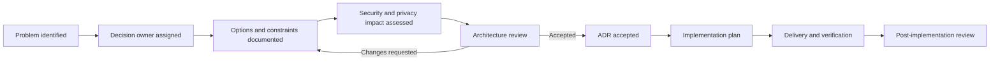

# Architecture Governance and Review Process

Version: 1.0.0  
Status: Active  
Owners: Architecture, Engineering Leadership  
Last reviewed: 2026-07-15

## 1. Purpose

This document defines how architectural decisions are proposed, reviewed, approved, implemented, verified, and revisited for KidsAudioBookPlatform. It ensures that architecture remains intentional as the platform evolves from a modular monolith toward independently deployable services.

## 2. Governance Principles

1. Architecture decisions must be explicit and discoverable.
2. Decisions should be proportional to risk and reversibility.
3. Child safety, privacy, security, and data integrity take precedence over delivery speed.
4. Teams own decisions inside their bounded contexts while respecting platform-wide constraints.
5. Exceptions require documented approval and an expiry or review date.
6. Architecture documentation must reflect the deployed system.
7. Decisions are reviewed using evidence from production metrics, incidents, delivery outcomes, and operational cost.

## 3. Decision Levels

| Level | Scope | Required artifact | Approval |
|---|---|---|---|
| Local | Internal implementation with no contract or operational impact | Code review notes | Module maintainers |
| Module | Domain model, persistence, internal API, module dependency | Design note or lightweight ADR | Module owner and one reviewer |
| Platform | Shared infrastructure, security model, public API, event schema, data ownership | Full ADR | Architecture and affected owners |
| Strategic | Deployment topology, major technology, service extraction, compliance posture | ADR plus review meeting | Architecture and engineering leadership |

## 4. When an ADR Is Required

An ADR is mandatory when a change:

- introduces or replaces a core technology;
- changes a bounded-context boundary or data owner;
- creates a new public API or incompatible contract;
- changes authentication, authorization, encryption, retention, or privacy behavior;
- introduces a new infrastructure dependency;
- extracts a module into a separately deployed service;
- changes consistency, availability, or disaster-recovery guarantees;
- creates a recurring operational cost or vendor lock-in;
- accepts meaningful technical debt or a policy exception.

## 5. Review Workflow

## 6. Review Checklist

Every platform-level review must cover:

- problem statement and decision drivers;
- affected users and bounded contexts;
- security, privacy, and child-safety impact;
- data ownership and retention;
- synchronous and asynchronous contracts;
- failure modes and degraded behavior;
- migration, rollback, and compatibility;
- observability and support requirements;
- performance and capacity assumptions;
- operational cost and ownership;
- test strategy and acceptance criteria;
- alternatives considered and reasons for rejection.

## 7. Roles and Responsibilities

### Decision Owner

- defines the problem and constraints;
- prepares the proposal;
- gathers affected stakeholders;
- records the decision and follow-up actions;
- verifies that implementation matches the accepted design.

### Architecture

- protects cross-platform principles and boundaries;
- challenges hidden coupling and premature complexity;
- reviews security, resilience, and operability;
- maintains the ADR and C4 indexes.

### Engineering Owners

- validate implementation feasibility;
- identify migration and delivery risks;
- own testing, rollout, and operational readiness.

### Security and Privacy Reviewers

Must participate when the proposal affects credentials, child-related data, parental controls, payment state, access control, telemetry, data export, deletion, or retention.

## 8. Exception Management

An approved exception must record:

- the violated principle;
- business or technical justification;
- affected components;
- compensating controls;
- owner;
- risk level;
- expiry or review date;
- removal plan.

Expired exceptions block further expansion of the affected implementation until reviewed.

## 9. Documentation Rules

- Accepted ADRs are immutable except for status and links to superseding decisions.
- Superseded ADRs remain in the repository.
- C4 diagrams must be updated when boundaries, containers, deployment topology, or major integrations change.
- API and event catalogs must be updated in the same pull request as contract changes.
- Operational runbooks must be updated before release when support behavior changes.

## 10. Architecture Review Cadence

- Pull-request review: for every material architectural change.
- Monthly review: open risks, exceptions, debt, and upcoming decisions.
- Quarterly review: roadmap, capacity, cost, security posture, and service-extraction candidates.
- Incident-triggered review: after severe incidents or repeated failure patterns.
- Release-readiness review: before major production releases.

## 11. Verification

Architecture compliance is verified through:

- ArchUnit and dependency tests;
- API and event contract tests;
- migration and rollback rehearsals;
- security scanning and threat-model review;
- observability dashboards and SLO results;
- production incident findings;
- periodic documentation-to-deployment checks.

## 12. Decision Quality Metrics

Track:

- percentage of material changes with an ADR;
- overdue architecture exceptions;
- documentation drift findings;
- incidents caused by undocumented assumptions;
- number of cross-module boundary violations;
- ADR follow-up actions completed on time;
- decisions revisited due to new production evidence.

## 13. Completion Criteria

A decision is considered implemented only when:

1. the accepted artifact is committed;
2. code and infrastructure changes are delivered;
3. tests validate the intended guarantees;
4. telemetry and alerts are available;
5. migration and rollback paths are documented;
6. relevant diagrams and catalogs are updated;
7. operational ownership is assigned.
