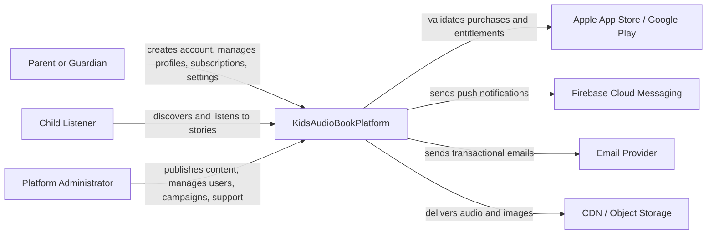
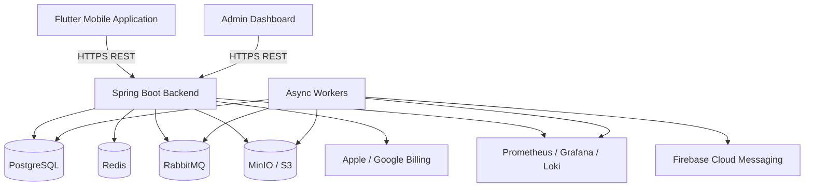
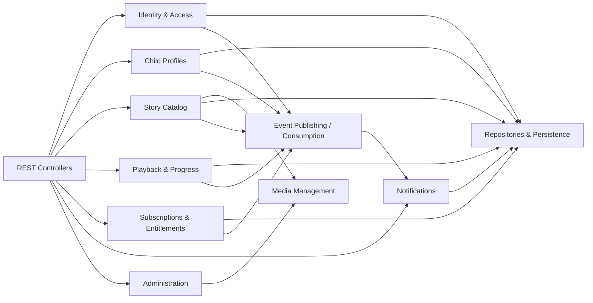

# C4 Model

Version: 1.0.0  
Status: Draft

## Purpose

This folder contains the official C4 architecture views for KidsAudioBookPlatform. The diagrams are implementation-oriented and must stay synchronized with `Software_Architecture.md`, `Backend_Architecture.md`, `Mobile_Architecture.md`, `Admin_Dashboard.md`, `Database_Design.md`, and `API_Specification.md`.

## Diagram Set

1. System Context — actors, external systems, and platform boundary.
2. Container View — mobile app, admin dashboard, backend services, databases, messaging, cache, object storage, observability.
3. Component View — internal components of the backend application and their responsibilities.
4. Code View — representative module/package structure for implementation.

## System Context



## Container View



## Backend Component View



## Code View

```text
backend/
  bootstrap/
  common/
    api/
    security/
    logging/
    events/
    validation/
  identity/
  profiles/
  catalog/
  playback/
  subscriptions/
  notifications/
  administration/
  media/

Each bounded context follows:
  api/
  application/
  domain/
  infrastructure/
```

## Diagram Rules

- A diagram must have a clear owner and purpose.
- Names must match code modules and API terminology.
- External systems must be visually separated from platform-owned components.
- Relationships must state protocol or intent where useful.
- C4 diagrams describe structure, while `System_Flows.md` describes behavior.
- Significant changes require an ADR and a diagram update in the same pull request.

## Review Checklist

- Does every container have one primary responsibility?
- Are data ownership boundaries explicit?
- Are synchronous and asynchronous interactions distinguishable?
- Are trust boundaries visible?
- Are external dependencies represented?
- Does the diagram still match the repository structure?
