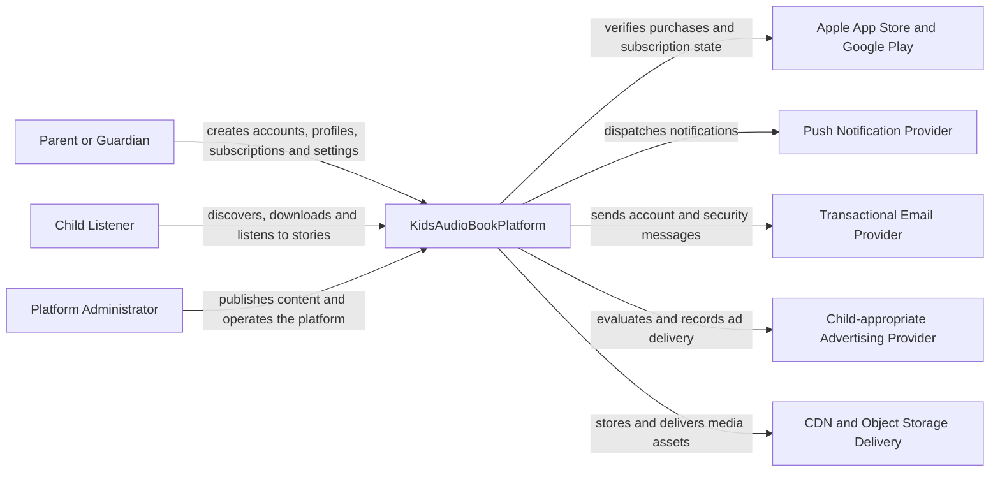
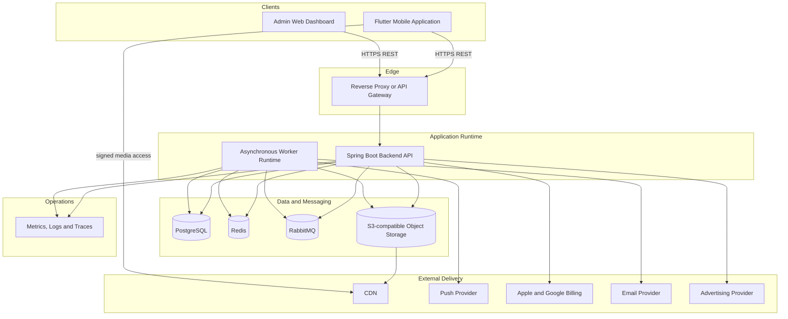
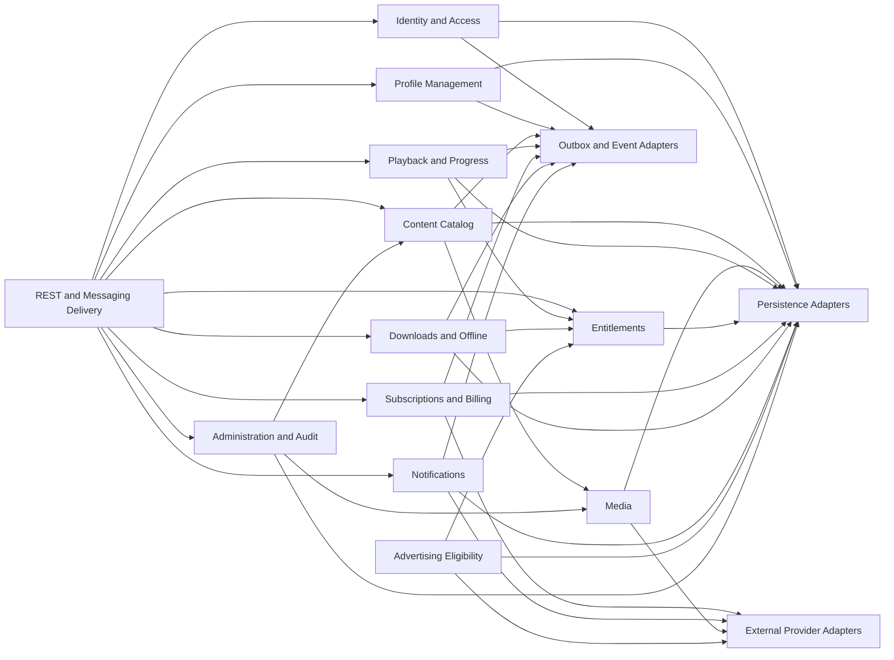

# C4 Model

Version: 1.1.0  
Status: Active Draft  
Owner: Project Architecture  
Last updated: 2026-07-15

## 1. Purpose

This directory contains the canonical structural architecture views for KidsAudioBookPlatform. The C4 model explains the platform from the outside inward, beginning with users and external systems and continuing through deployable containers, backend components, representative code structure, deployment topology, runtime behavior, and security trust boundaries.

These views are implementation-oriented and must remain synchronized with:

- `../Software_Architecture.md`;
- `../Backend_Architecture.md`;
- `../Mobile_Architecture.md`;
- `../Admin_Dashboard.md`;
- `../Database_Design.md`;
- `../API_Specification.md`;
- `../System_Flows.md`;
- `../Security_Architecture.md`;
- `../Technology_Stack.md`;
- `../../00_Project/ADR/README.md`.

The diagrams are not decorative assets. They are reviewable architecture contracts used during implementation, onboarding, threat modeling, service extraction, production readiness, and incident analysis.

## 2. C4 View Set

| Document | C4 level or concern | Primary question answered |
|---|---|---|
| `01_System_Context.md` | System context | Who uses the platform and which external systems does it depend on? |
| `02_Container_Diagram.md` | Containers | Which deployable applications and data services form the platform? |
| `03_Component_Diagram.md` | Components | Which major backend components and bounded contexts exist inside the runtime? |
| `04_Code_Diagram.md` | Code and packages | How are modules and dependency directions represented in source code? |
| `05_Deployment_Diagram.md` | Deployment | Where do containers run and how do environments differ? |
| `06_Runtime_Views.md` | Dynamic views | How do containers collaborate during critical flows? |
| `07_Security_Trust_Boundaries.md` | Security overlay | Where does trust change and which controls protect each crossing? |
| `08_Architecture_Decision_Guide.md` | Decision guidance | Which view and ADR must change for a given architecture decision? |
| `10_Diagram_Maintenance_Guide.md` | Governance | How are diagrams updated, reviewed, validated, and kept current? |
| `15_Architecture_Roadmap.md` | Evolution | How is the target architecture expected to evolve? |
| `16_Known_Technical_Debt.md` | Architecture debt | Which known compromises require tracking and remediation? |
| `20_Architecture_Operations_Handbook.md` | Operations | How is the architecture operated and diagnosed in production? |
| `21_Architecture_KPI_and_Metrics.md` | Architecture metrics | How is architectural health measured? |
| `22_Cost_and_Capacity_Model.md` | Capacity and cost | What are the scaling assumptions and cost drivers? |

## 3. Reading Order

### 3.1 New team members

Recommended order:

1. `01_System_Context.md`;
2. `02_Container_Diagram.md`;
3. `03_Component_Diagram.md`;
4. `06_Runtime_Views.md`;
5. `07_Security_Trust_Boundaries.md`;
6. `04_Code_Diagram.md`;
7. `05_Deployment_Diagram.md`.

### 3.2 Feature implementation

A developer implementing a feature should inspect:

1. the system and container boundary;
2. the owning bounded context in the component view;
3. the related runtime flow;
4. the code/package rules;
5. the data owner in `Database_Design.md`;
6. the API and event contracts;
7. applicable trust boundaries;
8. related ADRs.

### 3.3 Production or incident work

Operational investigation should begin with:

1. `05_Deployment_Diagram.md`;
2. `06_Runtime_Views.md`;
3. `20_Architecture_Operations_Handbook.md`;
4. `21_Architecture_KPI_and_Metrics.md`;
5. `22_Cost_and_Capacity_Model.md`.

## 4. System Boundary

KidsAudioBookPlatform includes:

- the Flutter mobile application;
- the child-facing experience;
- the protected Parent Zone;
- the administrative web dashboard;
- the backend API application;
- asynchronous workers;
- platform-owned PostgreSQL schemas;
- Redis caches and short-lived coordination state;
- RabbitMQ exchanges, queues, retries, and dead-letter queues;
- object-storage metadata and controlled media assets;
- observability configuration owned by the platform.

The following are external systems, even when accessed through platform adapters:

- Apple App Store and Google Play billing services;
- Firebase Cloud Messaging and platform push services;
- transactional email providers;
- advertising providers;
- CDN infrastructure when operated as a managed external service;
- third-party identity, analytics, or support providers introduced later.

External systems must never be drawn as if the platform controls their availability, data model, or deployment lifecycle.

## 5. Canonical System Context Summary



The authenticated parent account is the primary security principal. A child profile is a product and authorization scope owned by that account, not an independent login identity.

## 6. Canonical Container Summary



The initial deployment model is a modular monolith with asynchronous workers. Logical module boundaries exist before independent service boundaries.

## 7. Canonical Backend Component Summary



This summary is intentionally less detailed than `03_Component_Diagram.md`. The detailed file remains the authoritative component view.

## 8. Code Structure Summary

```text
backend/
  bootstrap/
  shared-kernel/
    api/
    security/
    observability/
    events/
    validation/
  identity/
    api/
    application/
    domain/
    infrastructure/
  profiles/
  catalog/
  media/
  playback/
  entitlements/
  subscriptions/
  downloads/
  notifications/
  advertising/
  administration/
```

Mandatory dependency direction:

```text
Delivery -> Application -> Domain
Infrastructure -> Application Ports
Domain -> no framework or infrastructure dependencies
```

A module may expose application interfaces and events. It may not expose repositories, JPA entities, internal database tables, or provider-specific models as cross-module contracts.

## 9. Modeling Conventions

### 9.1 Naming

- use product and domain terminology from the architecture documents;
- use singular names for bounded contexts and containers where practical;
- avoid vague labels such as `Service`, `Manager`, or `Helper` without a domain qualifier;
- names in diagrams must match code modules, API terminology, queue ownership, and operational dashboards;
- external providers must be named by role first and vendor second where vendor replacement is possible.

### 9.2 Relationships

Every important relationship should describe at least one of:

- intent;
- protocol;
- data direction;
- synchronization style;
- trust-boundary crossing.

Prefer:

```text
Mobile App -->|HTTPS REST: request playback authorization| Backend API
```

Avoid:

```text
Mobile App --> Backend
```

### 9.3 Ownership

Every container, component, database schema, exchange, queue, cache namespace, and object-storage prefix must have one primary owner.

Shared ownership is not a substitute for explicit accountability. Shared infrastructure may have a platform owner while domain data remains owned by one bounded context.

### 9.4 Current and target state

A single diagram must not silently mix current and target architecture.

Use one of these labels:

- `Current`;
- `Transitional`;
- `Target`;
- `Proposed`.

Target-state diagrams must identify the decision or roadmap item that justifies them.

### 9.5 Technology detail

C4 views describe architectural responsibilities first. Technology labels are included only when they affect implementation, deployment, security, operations, or a recorded decision.

For example, `PostgreSQL` is useful because it defines the transactional system of record. A specific patch version is not useful in a C4 diagram and belongs in dependency management.

## 10. Security Modeling Rules

Security-relevant diagrams must show:

- the public internet boundary;
- authenticated and unauthenticated entry points;
- Child Experience and Parent Zone separation;
- consumer and administrative API separation;
- external provider callbacks;
- signed media upload and download paths;
- secret-management boundaries;
- databases and queues containing sensitive or privileged state;
- observability paths with redaction requirements.

A diagram must never imply that client-side navigation or UI visibility is an authorization control.

## 11. Data Modeling Rules

C4 diagrams do not replace the database design, but they must show:

- the authoritative system of record;
- which module owns each schema or logical data area;
- which state is cached versus authoritative;
- where binary media is stored;
- where events are persisted before publication;
- external systems that remain authoritative for purchase state;
- read replicas, analytics stores, or projections when introduced.

Direct cross-module writes must not be normalized by drawing multiple components against the same unnamed database boundary. Ownership remains explicit even when PostgreSQL is shared physically.

## 12. Dynamic and Runtime Views

Static C4 diagrams answer what exists. Runtime views answer how components collaborate.

A dynamic view is required when a flow includes one or more of:

- authorization across multiple contexts;
- external provider verification;
- outbox publication;
- asynchronous retries;
- compensation;
- offline synchronization;
- signed media access;
- scheduled publication;
- account deletion;
- security-sensitive administrative actions.

Runtime views must identify the authoritative state transition and distinguish synchronous user response from asynchronous follow-up work.

## 13. Deployment Views

Deployment diagrams must represent at least:

- environment boundaries;
- ingress and TLS termination;
- API and worker replicas;
- PostgreSQL, Redis, RabbitMQ, and object storage;
- secret injection;
- health and readiness probes;
- migration execution;
- observability collection;
- backups and restore paths;
- CDN delivery path;
- external provider connectivity.

Local Docker Compose is not a production deployment model. Differences between local, shared development, staging, and production must be explicit.

## 14. Diagram Change Triggers

Update the relevant C4 documents when a change introduces or modifies:

- an actor or external system;
- a deployable application or worker;
- a bounded context;
- a database, cache, queue, exchange, or object-storage boundary;
- a synchronous or asynchronous integration;
- an authorization boundary;
- a new critical runtime flow;
- a service extraction;
- a deployment topology;
- operational ownership;
- scaling or failover behavior.

A code-only pull request is not exempt when its implementation changes the architecture represented by a diagram.

## 15. ADR Traceability

A significant diagram change must reference an ADR when it introduces:

- a new architectural style;
- a new system of record;
- a new communication mechanism;
- a new deployment boundary;
- a cross-cutting security decision;
- a major technology replacement;
- a backward-incompatible architecture contract.

The ADR records why the decision was made. The C4 view records what the accepted architecture looks like.

## 16. Review Requirements

Architecture reviewers should verify:

- the diagram has a clear purpose and audience;
- scope and abstraction level are consistent;
- names match current domain terminology;
- every container has a primary responsibility;
- data ownership is explicit;
- synchronous and asynchronous interactions are distinguishable;
- trust boundaries are visible;
- external systems are not represented as platform-owned;
- failure-sensitive dependencies are visible;
- current and target state are not mixed;
- related ADRs and documents are updated;
- the view matches the repository and deployment model.

## 17. Validation and CI

The documentation pipeline should validate:

- Markdown syntax;
- Mermaid rendering;
- broken relative links;
- duplicate or missing headings where linting rules apply;
- references to renamed files;
- forbidden raw secrets or credentials;
- stale version or ownership metadata where automation is available.

Rendering success does not prove architectural correctness. Human review remains required for boundaries, ownership, dependencies, security, and operational accuracy.

## 18. Diagram Drift

Diagram drift exists when implementation or deployment no longer matches an accepted diagram.

Examples:

- a module reads another module's tables directly;
- a new queue exists but is absent from the container or deployment view;
- an external provider callback bypasses the documented trust boundary;
- a worker becomes independently deployable but remains shown inside the API container;
- an extracted service still shares undocumented write ownership;
- dashboards and alerts reference component names not found in architecture views.

Detected drift must be resolved by either:

1. changing implementation back to the accepted architecture; or
2. documenting and approving the new architecture through the required ADR and diagram changes.

Documentation must never be changed merely to legitimize accidental architecture after the fact without review.

## 19. Ownership and Review Cadence

The Project Architecture owner is accountable for coherence of the complete C4 set. Individual bounded-context owners are accountable for the accuracy of their components, runtime relationships, data ownership, and operational dependencies.

Review cadence:

- during every architecture-impacting pull request;
- before each major milestone or release;
- during production-readiness review;
- after service extraction or major infrastructure change;
- after incidents that reveal undocumented dependencies;
- at least quarterly while the platform is under active development.

## 20. Definition of Completion

A C4 documentation change is complete when:

- the correct abstraction level was updated;
- affected related views are consistent;
- current versus target state is explicit;
- naming matches implementation and operational terminology;
- trust and data ownership boundaries are represented;
- runtime behavior is documented where static structure is insufficient;
- related ADRs, API contracts, event contracts, and database documents are synchronized;
- Mermaid renders successfully;
- reviewers can identify ownership, dependencies, and failure-sensitive paths without relying on undocumented knowledge.

## 21. Related Documents

- `../Software_Architecture.md`
- `../Backend_Architecture.md`
- `../Mobile_Architecture.md`
- `../Admin_Dashboard.md`
- `../Database_Design.md`
- `../API_Specification.md`
- `../System_Flows.md`
- `../Security_Architecture.md`
- `../Technology_Stack.md`
- `../../00_Project/ADR/README.md`
- `10_Diagram_Maintenance_Guide.md`
