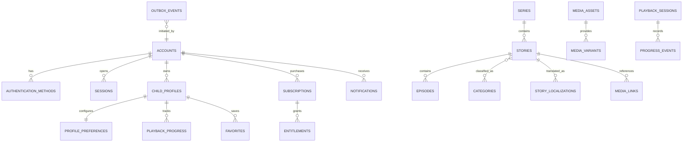
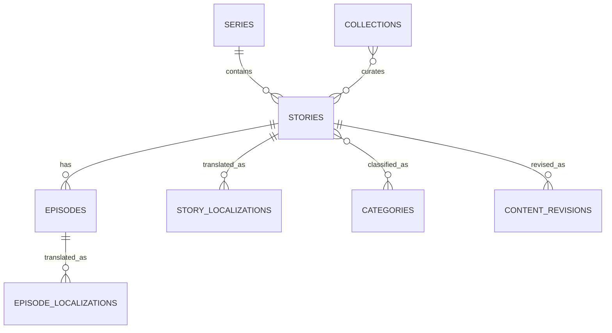
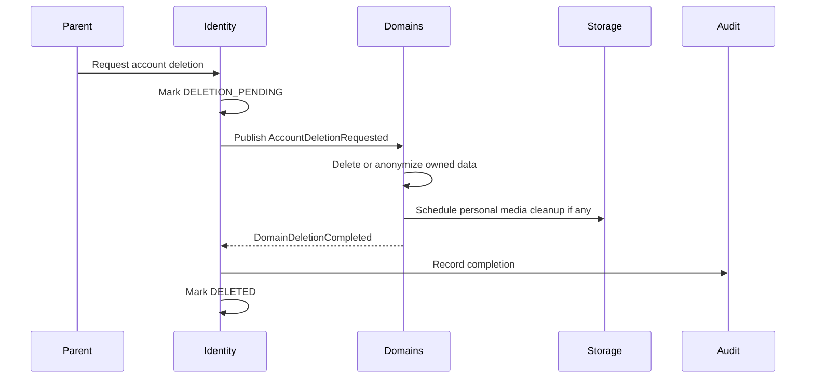

# Database Design

Version: 1.1.0  
Status: Implementation specification  
Owners: Backend Architecture, Data Engineering  
Last reviewed: 2026-07-14

## 1. Purpose

This document defines the persistence architecture for KidsAudioBookPlatform. It is the normative source for relational data ownership, schemas, tables, relationships, integrity constraints, indexes, auditability, migrations, retention, backup, recovery, and operational database practices.

The first production stage uses:

- PostgreSQL as the authoritative transactional data store;
- Redis for cache, rate-limit coordination, idempotency, and short-lived state;
- S3-compatible object storage for audio, images, synchronized text artifacts, and offline packages.

The initial deployment may use one PostgreSQL cluster and one physical database, but bounded-context ownership must be preserved so that selected domains can later be extracted into independent services and databases.

## 2. Database Design Principles

1. Every table has exactly one owning bounded context.
2. Business correctness is protected by both application rules and database constraints.
3. Child-related data is minimized by design.
4. Binary media is never stored in PostgreSQL.
5. Public identifiers are non-sequential UUIDs.
6. Cross-context writes are forbidden.
7. Schema evolution is performed only through versioned Flyway migrations.
8. Destructive changes use expand-and-contract migrations.
9. Audit records are append-only.
10. Redis is never the sole source of business truth.
11. Read optimization must not weaken ownership boundaries.
12. Large append-only tables receive explicit retention and partitioning policies.

## 3. Technology Baseline

### 3.1 PostgreSQL

Production baseline: PostgreSQL 16 or newer.

Required capabilities:

- ACID transactions;
- foreign keys and check constraints;
- partial, composite, expression, and covering indexes;
- `jsonb` for bounded extensibility;
- row-level locking and optimistic concurrency;
- native full-text search for the initial stage;
- logical backup and point-in-time recovery support;
- declarative partitioning for high-volume event tables.

### 3.2 Redis

Redis may contain only reconstructible or disposable data:

- cache entries;
- rate-limit counters;
- refresh-token revocation markers;
- short-lived challenges;
- idempotency outcomes;
- distributed-lock leases;
- temporary orchestration state.

Redis keys must have a namespace and version:

```text
kabp:v1:catalog:story:{storyId}
kabp:v1:entitlement:account:{accountId}
kabp:v1:ratelimit:login:{identifierHash}
kabp:v1:idempotency:{accountId}:{key}
```

### 3.3 Object Storage

Object keys are opaque and contain no personal information.

```text
media/audio/{assetId}/{variant}.m4a
media/images/{assetId}/{variant}.webp
media/text/{assetId}/{locale}.json
offline/packages/{manifestId}/{version}.zip
```

PostgreSQL stores metadata, checksums, processing state, and object references.

## 4. Schema Ownership

| Schema | Owning context | Main responsibility |
|---|---|---|
| `identity` | Identity and Access | Accounts, credentials, sessions, roles |
| `profiles` | Family and Profiles | Child profiles, preferences, parent controls |
| `catalog` | Content Catalog | Stories, series, episodes, categories, collections |
| `media` | Media | Assets, variants, processing, manifests |
| `playback` | Listening and Progress | Sessions, progress, favorites, history |
| `billing` | Subscription and Entitlements | Plans, subscriptions, purchases, entitlements |
| `advertising` | Advertising Policy | Eligibility counters and ad decisions |
| `notifications` | Notifications | Inbox, templates, preferences, delivery attempts |
| `admin` | Administration and Audit | Admin identities, audit records, moderation |
| `integration` | Platform Integration | Outbox, inbox, idempotency, scheduled jobs |
| `analytics` | Analytics | Privacy-aware product events and aggregates |

### 4.1 Ownership Rules

- only the owning module may modify its tables;
- another module must not import the owner's JPA repositories;
- cross-context reads use application contracts, APIs, or approved read models;
- cross-schema foreign keys are allowed only in the modular-monolith stage and must be documented as extraction dependencies;
- new cross-schema foreign keys require architecture review;
- reporting queries must use read replicas or reporting views when production load justifies it.

## 5. Naming and Type Conventions

### 5.1 Naming

- schemas, tables, columns, indexes, and constraints use `snake_case`;
- table names use plural nouns;
- primary key column: `id`;
- foreign key: `<entity>_id`;
- timestamps end with `_at`;
- date-only fields end with `_date`;
- boolean columns use positive names such as `is_active`;
- unique constraints: `uq_<table>__<columns>`;
- indexes: `idx_<table>__<columns>`;
- checks: `ck_<table>__<rule>`;
- foreign keys: `fk_<table>__<target>`.

### 5.2 Standard Types

| Concept | PostgreSQL type |
|---|---|
| Public ID | `uuid` |
| Timestamp | `timestamptz` |
| Calendar date | `date` |
| Local time | `time` |
| Locale | `varchar(16)` |
| Currency | `char(3)` |
| Money | `bigint` minor units |
| Duration | `integer` seconds or milliseconds, explicitly named |
| Percentage/volume | `smallint` with check constraint |
| Flexible metadata | bounded `jsonb` |

Enums should normally be represented by constrained `varchar` values rather than PostgreSQL enum types because application releases and rollback procedures are easier to manage.

### 5.3 IDs

Application-generated UUIDv7 is preferred. UUIDv4 is acceptable until the selected Java library supports UUIDv7 consistently.

Sequential IDs may be used only for internal append-only tables that are never exposed externally.

### 5.4 Audit Columns

Mutable business tables use:

```sql
created_at timestamptz not null default now(),
created_by uuid null,
updated_at timestamptz not null default now(),
updated_by uuid null,
version bigint not null default 0
```

`created_by` and `updated_by` may represent an account, administrator, or system process. The actor type must be available where ambiguity exists.

### 5.5 Optimistic Locking

Aggregates edited concurrently use `version bigint not null default 0` and JPA `@Version`.

A stale update results in `409 Conflict`. The system must never silently overwrite newer content, profile settings, or administrative decisions.

### 5.6 Soft Deletion

Soft deletion is not the default. It is used only for recoverability, billing history, privacy workflows, or legal audit.

```sql
deleted_at timestamptz null,
deleted_by uuid null
```

Active uniqueness uses partial indexes:

```sql
create unique index uq_accounts__email_active
    on identity.accounts(email_normalized)
    where deleted_at is null;
```

## 6. High-Level Entity Relationship Model



## 7. Identity and Access Schema

### 7.1 `identity.accounts`

Represents the adult account holder. A child profile is never a login principal.

```sql
create table identity.accounts (
    id uuid primary key,
    email_normalized varchar(320) not null,
    email_display varchar(320) not null,
    status varchar(32) not null,
    preferred_locale varchar(16) not null default 'ro-RO',
    timezone_id varchar(64) not null default 'Europe/Bucharest',
    email_verified_at timestamptz null,
    terms_version varchar(32) not null,
    terms_accepted_at timestamptz not null,
    privacy_version varchar(32) not null,
    privacy_accepted_at timestamptz not null,
    created_at timestamptz not null default now(),
    updated_at timestamptz not null default now(),
    deleted_at timestamptz null,
    version bigint not null default 0,
    constraint ck_accounts__status check (
        status in ('PENDING_VERIFICATION','ACTIVE','LOCKED','SUSPENDED','DELETION_PENDING','DELETED')
    )
);
```

Indexes:

```sql
create unique index uq_accounts__email_active
    on identity.accounts(email_normalized)
    where deleted_at is null;

create index idx_accounts__status_created_at
    on identity.accounts(status, created_at desc);
```

### 7.2 `identity.authentication_methods`

Supports password, Apple, Google, and future identity providers.

Important columns:

```text
id, account_id, method_type, provider_subject, password_hash,
is_primary, last_used_at, created_at, updated_at
```

Rules:

- password methods require `password_hash`;
- external providers require `provider_subject`;
- the tuple `(method_type, provider_subject)` is unique when the provider subject is present;
- password hashes must never appear in logs, audit payloads, or analytics.

### 7.3 `identity.sessions`

Stores durable session metadata, not raw access or refresh tokens.

```text
id
account_id
refresh_token_family_id
device_id_hash
device_platform
app_version
ip_hash
user_agent_summary
created_at
last_seen_at
expires_at
revoked_at
revocation_reason
```

Indexes:

```sql
create index idx_sessions__account_active
    on identity.sessions(account_id, expires_at desc)
    where revoked_at is null;

create unique index uq_sessions__refresh_family
    on identity.sessions(refresh_token_family_id);
```

Expired and revoked sessions are removed according to retention policy after security investigation windows expire.

### 7.4 Authorization Tables

```text
identity.roles
identity.permissions
identity.account_roles
identity.role_permissions
```

System roles:

- `PARENT`;
- `CONTENT_EDITOR`;
- `CONTENT_REVIEWER`;
- `SUPPORT_AGENT`;
- `BILLING_ADMIN`;
- `PLATFORM_ADMIN`.

Role changes create immutable audit events.

### 7.5 Security Challenges

`identity.security_challenges` stores short-lived verification challenges:

```text
id
account_id
challenge_type
secret_hash
attempt_count
expires_at
consumed_at
created_at
```

The table is periodically purged. Plain verification codes are never stored.

## 8. Family and Profiles Schema

### 8.1 `profiles.child_profiles`

```sql
create table profiles.child_profiles (
    id uuid primary key,
    account_id uuid not null,
    display_name varchar(40) not null,
    birth_year smallint null,
    age_band varchar(16) not null,
    avatar_asset_id uuid null,
    preferred_language varchar(16) not null,
    is_default boolean not null default false,
    status varchar(24) not null default 'ACTIVE',
    created_at timestamptz not null default now(),
    updated_at timestamptz not null default now(),
    deleted_at timestamptz null,
    version bigint not null default 0,
    constraint fk_child_profiles__accounts
        foreign key (account_id) references identity.accounts(id),
    constraint ck_child_profiles__age_band
        check (age_band in ('AGE_0_2','AGE_3_4','AGE_5_7','AGE_8_PLUS')),
    constraint ck_child_profiles__status
        check (status in ('ACTIVE','PAUSED','DELETION_PENDING','DELETED'))
);
```

Privacy requirements:

- exact birth date is not required for MVP;
- legal names are not required;
- no child email or telephone number is collected;
- analytics never records the display name;
- deletion must remove or pseudonymize profile-linked analytics according to policy.

Indexes:

```sql
create index idx_child_profiles__account_active
    on profiles.child_profiles(account_id, created_at)
    where deleted_at is null;

create unique index uq_child_profiles__one_default
    on profiles.child_profiles(account_id)
    where is_default = true and deleted_at is null;
```

### 8.2 `profiles.profile_preferences`

One-to-one with child profile.

```text
profile_id PK/FK
text_display_enabled
text_highlight_enabled
autoplay_next_enabled
ambient_sound_enabled
ambient_sound_key
ambient_sound_volume
story_volume
sleep_timer_minutes
content_language
updated_at
version
```

Checks:

```sql
constraint ck_profile_preferences__ambient_volume check (ambient_sound_volume between 0 and 100)
constraint ck_profile_preferences__story_volume check (story_volume between 0 and 100)
constraint ck_profile_preferences__sleep_timer check (sleep_timer_minutes is null or sleep_timer_minutes in (5,10,15,20,30,45,60))
```

### 8.3 `profiles.parental_content_settings`

```text
profile_id PK/FK
maximum_age_rating
allow_autoplay
allow_downloads
allow_marketing_content
bedtime_start
bedtime_end
daily_listening_limit_minutes
updated_at
version
```

Bedtime values are interpreted using the account timezone.

### 8.4 `profiles.parent_security_settings`

```text
account_id PK/FK
pin_hash
failed_attempt_count
locked_until
biometric_enabled
last_verified_at
updated_at
version
```

Concurrent failed PIN attempts must lock the row or use an atomic update.

## 9. Catalog Schema

### 9.1 Content Hierarchy



### 9.2 `catalog.series`

```text
id
slug
publication_status
cover_asset_id
created_by
updated_by
created_at
updated_at
version
```

### 9.3 `catalog.stories`

```sql
create table catalog.stories (
    id uuid primary key,
    series_id uuid null,
    content_type varchar(24) not null,
    slug varchar(160) not null,
    publication_status varchar(24) not null,
    access_tier varchar(16) not null,
    minimum_age smallint not null default 0,
    maximum_age smallint not null default 7,
    estimated_duration_seconds integer null,
    primary_language varchar(16) not null,
    cover_asset_id uuid null,
    published_at timestamptz null,
    unpublished_at timestamptz null,
    scheduled_publish_at timestamptz null,
    created_by uuid not null,
    updated_by uuid not null,
    created_at timestamptz not null default now(),
    updated_at timestamptz not null default now(),
    version bigint not null default 0,
    constraint uq_stories__slug unique (slug),
    constraint ck_stories__publication_status check (
      publication_status in ('DRAFT','IN_REVIEW','APPROVED','REJECTED','SCHEDULED','PUBLISHED','UNPUBLISHED','ARCHIVED')
    ),
    constraint ck_stories__access_tier check (access_tier in ('FREE','PREMIUM')),
    constraint ck_stories__age_range check (minimum_age >= 0 and maximum_age >= minimum_age),
    constraint ck_stories__duration check (estimated_duration_seconds is null or estimated_duration_seconds > 0)
);
```

Indexes:

```sql
create index idx_stories__published_age_tier
    on catalog.stories(minimum_age, maximum_age, access_tier, published_at desc)
    where publication_status = 'PUBLISHED';

create index idx_stories__series
    on catalog.stories(series_id, published_at)
    where series_id is not null;

create index idx_stories__scheduled
    on catalog.stories(scheduled_publish_at)
    where publication_status = 'SCHEDULED';
```

### 9.4 `catalog.story_localizations`

```text
id
story_id
locale
title
description
short_description
search_document
created_at
updated_at
version
```

Unique constraint: `(story_id, locale)`.

Initial search may use a generated `tsvector` or an explicitly maintained search column. Search implementation must be benchmarked before introducing an external search engine.

### 9.5 `catalog.episodes`

```text
id
story_id
sequence_number
publication_status
estimated_duration_seconds
published_at
created_at
updated_at
version
```

Unique: `(story_id, sequence_number)`.

An episode cannot be published if the parent story is not approved for publication.

### 9.6 Categories and Collections

```text
catalog.categories
catalog.category_localizations
catalog.story_categories
catalog.collections
catalog.collection_localizations
catalog.collection_stories
```

Join tables use composite primary keys unless independent lifecycle metadata is required.

Example:

```sql
create table catalog.story_categories (
    story_id uuid not null,
    category_id uuid not null,
    assigned_at timestamptz not null default now(),
    primary key (story_id, category_id)
);
```

`collection_stories` includes `position integer not null` and a unique constraint on `(collection_id, position)`.

### 9.7 Editorial Revisions

`catalog.content_revisions` stores structured revisions required for review and audit.

```text
id
content_type
content_id
revision_number
snapshot_json
change_summary
created_by
created_at
```

`snapshot_json` is allowed because it stores an immutable review snapshot, not operational fields queried in the hot path.

## 10. Media Schema

### 10.1 `media.media_assets`

```text
id
asset_type
owner_type
owner_id
original_filename_safe
content_type
size_bytes
checksum_sha256
storage_bucket
storage_key
processing_status
scan_status
created_by
created_at
updated_at
version
```

Rules:

- filenames are sanitized and are metadata only;
- object key is server-generated;
- checksum is required before publication;
- media cannot be attached to published content until malware scan and validation succeed;
- replacing media creates a new asset record rather than mutating historical identity.

### 10.2 `media.media_variants`

```text
id
asset_id
variant_key
content_type
size_bytes
duration_ms
width
height
bitrate_kbps
storage_key
checksum_sha256
created_at
```

Unique: `(asset_id, variant_key)`.

### 10.3 `media.content_media_links`

Maps a story or episode to an asset and semantic purpose.

```text
id
content_type
content_id
asset_id
usage_type
locale
position
created_at
```

Usage types include:

- `COVER`;
- `ILLUSTRATION`;
- `AUDIO_PRIMARY`;
- `AUDIO_ALTERNATE`;
- `SYNCHRONIZED_TEXT`;
- `WAVEFORM`.

### 10.4 Processing Jobs

`media.processing_jobs`:

```text
id
asset_id
job_type
status
attempt_count
next_attempt_at
started_at
completed_at
error_code
error_summary
created_at
updated_at
```

Large technical logs remain in the logging platform, not in PostgreSQL.

## 11. Playback and Progress Schema

### 11.1 `playback.playback_sessions`

```text
id
account_id
profile_id
story_id
episode_id
device_id_hash
started_at
ended_at
completion_reason
ad_eligible_after_session
client_session_id
created_at
```

`client_session_id` plus account or device identity supports idempotent retry.

### 11.2 `playback.playback_progress`

One current progress row per profile and playable item.

```sql
create table playback.playback_progress (
    id uuid primary key,
    profile_id uuid not null,
    story_id uuid not null,
    episode_id uuid null,
    position_ms bigint not null,
    duration_ms bigint not null,
    completion_percentage numeric(5,2) not null,
    status varchar(16) not null,
    last_played_at timestamptz not null,
    source_device_id_hash varchar(128) null,
    client_updated_at timestamptz null,
    updated_at timestamptz not null default now(),
    version bigint not null default 0,
    constraint ck_playback_progress__position check (position_ms >= 0),
    constraint ck_playback_progress__duration check (duration_ms > 0),
    constraint ck_playback_progress__percentage check (completion_percentage between 0 and 100),
    constraint ck_playback_progress__status check (status in ('NOT_STARTED','IN_PROGRESS','COMPLETED'))
);
```

Uniqueness must distinguish standalone stories and episodes. One safe approach is a generated playable key in application logic plus a unique expression index.

Conflict resolution:

1. reject impossible values;
2. prefer a confirmed completion over a lower position;
3. otherwise prefer the most recent trusted client timestamp within allowed skew;
4. never move progress backwards automatically unless the user explicitly restarts.

### 11.3 Progress Event History

`playback.progress_events` is append-only and optional for the MVP. It is useful for sync diagnostics and analytics.

High-volume event history must be partitioned monthly when volume justifies it.

### 11.4 Favorites

```text
playback.favorites
- profile_id
- story_id
- created_at
PK(profile_id, story_id)
```

### 11.5 Listening History

Listening history is derived from sessions or stored as a compact read model. It must not duplicate unrestricted event detail indefinitely.

## 12. Offline Download Schema

### 12.1 `media.offline_manifests`

```text
id
story_id
episode_id
manifest_version
package_asset_id
minimum_app_version
expires_at
created_at
```

### 12.2 `playback.device_downloads`

```text
id
account_id
profile_id
device_id_hash
manifest_id
status
downloaded_at
last_verified_at
revoked_at
revocation_reason
client_download_id
created_at
updated_at
```

Unique: `(device_id_hash, client_download_id)`.

Premium entitlement expiry does not delete history immediately; it marks downloads as revocable and allows the device to synchronize the decision safely.

## 13. Billing and Entitlements Schema

### 13.1 `billing.plans`

```text
id
plan_code
billing_period
provider_product_id
is_active
profile_limit
offline_enabled
ads_disabled
created_at
updated_at
```

### 13.2 `billing.subscriptions`

```text
id
account_id
plan_id
provider
provider_subscription_id
status
started_at
trial_started_at
trial_ends_at
current_period_start
current_period_end
grace_period_end
cancel_at_period_end
cancelled_at
ended_at
created_at
updated_at
version
```

Allowed statuses:

```text
PENDING, TRIAL, ACTIVE, GRACE_PERIOD, PAUSED, CANCELLED, EXPIRED, REVOKED
```

Indexes:

```sql
create index idx_subscriptions__account_status
    on billing.subscriptions(account_id, status, current_period_end desc);

create unique index uq_subscriptions__provider_reference
    on billing.subscriptions(provider, provider_subscription_id)
    where provider_subscription_id is not null;
```

### 13.3 Purchase Events

`billing.purchase_events` is append-only and preserves provider verification history.

```text
id
provider
event_id
account_id
subscription_id
event_type
provider_occurred_at
payload_hash
payload_redacted_json
processing_status
received_at
processed_at
```

Unique: `(provider, event_id)`.

Raw provider payload retention must be minimized and secrets removed.

### 13.4 `billing.entitlements`

Entitlements are authoritative evaluated capabilities.

```text
id
account_id
entitlement_key
source_type
source_id
status
valid_from
valid_until
created_at
updated_at
version
```

Examples:

- `PREMIUM_CONTENT`;
- `OFFLINE_DOWNLOADS`;
- `MULTIPLE_PROFILES`;
- `AD_FREE`.

A unique partial index prevents multiple overlapping active rows for the same entitlement where the chosen model requires a single effective source.

## 14. Advertising Schema

### 14.1 Session Counters

`advertising.profile_ad_counters`:

```text
profile_id
completed_eligible_sessions
last_ad_attempt_at
last_ad_completed_at
updated_at
version
```

The two-session policy must be transactionally evaluated.

### 14.2 Ad Decisions

`advertising.ad_decisions` provides auditable, idempotent decisions without storing provider tracking details unnecessarily.

```text
id
account_id
profile_id
playback_session_id
decision
reason_code
decision_token_hash
expires_at
created_at
consumed_at
```

No ad decision may be created for an account with an effective `AD_FREE` entitlement.

## 15. Notifications Schema

### 15.1 `notifications.notifications`

```text
id
account_id
category
title
body
deep_link
template_key
payload_json
priority
visible_from
expires_at
read_at
dismissed_at
created_at
```

`payload_json` must be small, versioned, and free of secrets.

Indexes:

```sql
create index idx_notifications__account_inbox
    on notifications.notifications(account_id, created_at desc)
    where dismissed_at is null;

create index idx_notifications__account_unread
    on notifications.notifications(account_id, created_at desc)
    where read_at is null and dismissed_at is null;
```

### 15.2 Preferences

`notifications.notification_preferences`:

```text
account_id
category
in_app_enabled
push_enabled
email_enabled
quiet_hours_start
quiet_hours_end
updated_at
version
```

Primary key: `(account_id, category)`.

### 15.3 Delivery Attempts

`notifications.delivery_attempts`:

```text
id
notification_id
channel
provider
status
attempt_number
scheduled_at
started_at
completed_at
provider_message_id
error_code
error_summary
created_at
```

Index pending attempts by `(status, scheduled_at)`.

## 16. Administration and Audit

### 16.1 Audit Events

`admin.audit_events` is append-only.

```text
id
occurred_at
actor_type
actor_id
action
resource_type
resource_id
correlation_id
ip_hash
result
reason
before_json
after_json
metadata_json
```

Rules:

- no update or delete through application roles;
- sensitive fields are redacted before insert;
- audit rows are not used as the only source of current business state;
- high-volume retention uses partitioning by month;
- archive and purge policies are approved by security and legal requirements.

### 16.2 Moderation Records

`admin.moderation_decisions`:

```text
id
content_type
content_id
revision_id
reviewer_id
decision
reason_code
comment
created_at
```

Decision values: `APPROVED`, `REJECTED`, `CHANGES_REQUESTED`.

## 17. Integration Tables

### 17.1 Transactional Outbox

```sql
create table integration.outbox_events (
    id uuid primary key,
    aggregate_type varchar(80) not null,
    aggregate_id uuid not null,
    event_type varchar(160) not null,
    event_version integer not null,
    payload_json jsonb not null,
    headers_json jsonb not null default '{}'::jsonb,
    occurred_at timestamptz not null,
    available_at timestamptz not null default now(),
    published_at timestamptz null,
    attempt_count integer not null default 0,
    last_error_code varchar(80) null,
    created_at timestamptz not null default now()
);

create index idx_outbox_events__pending
    on integration.outbox_events(available_at, occurred_at)
    where published_at is null;
```

Business mutation and outbox insert occur in the same transaction.

### 17.2 Consumer Inbox

```text
integration.inbox_messages
- consumer_name
- message_id
- event_type
- received_at
- processed_at
- processing_status
- error_code
PK(consumer_name, message_id)
```

This ensures idempotent event consumption.

### 17.3 HTTP Idempotency

`integration.idempotency_records`:

```text
idempotency_key
scope_type
scope_id
request_hash
response_status
response_body_json
created_at
expires_at
```

Unique: `(scope_type, scope_id, idempotency_key)`.

The same key with a different request hash returns a conflict.

### 17.4 Scheduled Jobs

`integration.scheduled_jobs` stores business-relevant schedules, not framework internals.

```text
id
job_type
business_key
payload_json
status
run_at
locked_at
locked_by
attempt_count
last_error_code
created_at
updated_at
```

## 18. Analytics Schema

Analytics data must be privacy-aware and non-blocking.

### 18.1 Product Events

`analytics.product_events` may contain:

```text
id
occurred_at
event_type
event_version
account_id_pseudonym
profile_id_pseudonym
session_id
properties_json
received_at
```

Rules:

- never store child display names;
- avoid raw IP addresses;
- reject unrestricted free-form properties;
- partition high-volume events monthly;
- define a retention window;
- aggregate before long-term retention where possible.

### 18.2 Aggregates

Daily aggregate tables may include:

- story starts;
- story completions;
- unique active accounts;
- subscription conversion counts;
- notification delivery rates;
- playback startup failures.

Aggregates must not be used as transactional truth.

## 19. Indexing Strategy

### 19.1 General Rules

An index must support a documented query. Every index has a write and storage cost.

Before adding an index:

1. capture the target SQL;
2. inspect `EXPLAIN (ANALYZE, BUFFERS)` in a representative environment;
3. confirm selectivity and sort requirements;
4. add the smallest useful index;
5. verify write impact;
6. monitor usage after release.

### 19.2 Common Patterns

- foreign-key columns are indexed when used in joins or cascade checks;
- active-row queries use partial indexes;
- timeline queries use `(owner_id, created_at desc)`;
- worker queues use partial indexes on pending status and due time;
- search indexes are locale-aware;
- large text and JSONB fields are excluded from covering indexes.

### 19.3 Avoid

- indexing every column;
- duplicate left-prefix indexes;
- low-selectivity boolean-only indexes;
- unbounded `%term%` scans in hot paths;
- indexes introduced without measured query evidence.

## 20. Partitioning

Partitioning is introduced only after volume evidence or when retention management clearly benefits.

Likely candidates:

- `admin.audit_events` by month;
- `analytics.product_events` by month;
- `playback.progress_events` by month;
- `billing.purchase_events` by quarter if volume requires it.

Partition keys must align with retention and common query predicates.

## 21. JSONB Policy

Use `jsonb` only for:

- immutable event payloads;
- redacted external-provider payload snapshots;
- versioned notification payloads;
- content revision snapshots;
- bounded metadata that is not part of critical relational integrity.

Do not use `jsonb` to avoid modeling:

- account status;
- subscription state;
- profile preferences;
- content publication status;
- searchable catalog relationships;
- entitlement validity.

Every JSONB structure has a documented schema version.

## 22. Transaction Boundaries

A transaction should normally update one aggregate and its outbox records.

Mandatory examples:

- account creation plus authentication method;
- profile creation plus default-profile correction;
- story publication state plus content revision and outbox event;
- subscription verification plus entitlement update and outbox event;
- progress merge plus session completion;
- ad counter update plus ad decision.

External HTTP calls must not run inside long database transactions.

## 23. Concurrency and Locking

Use optimistic locking by default.

Pessimistic locking is reserved for short, measured critical sections such as:

- refresh-token replay handling;
- parent PIN lockout counters;
- subscription provider-event reconciliation;
- two-session advertising counter evaluation;
- claiming scheduled jobs.

Worker claiming should use `FOR UPDATE SKIP LOCKED` where appropriate.

## 24. Migration Strategy

Flyway is mandatory.

### 24.1 File Naming

```text
V1__create_identity_schema.sql
V2__create_profile_tables.sql
V3__create_catalog_core.sql
V4__add_story_publication_indexes.sql
```

### 24.2 Migration Rules

- committed versioned migrations are immutable;
- each migration has one coherent purpose;
- schema objects are fully qualified;
- migrations are tested against an empty database and a realistic previous version;
- large data backfills are separated from blocking DDL;
- production rollout order is documented when application compatibility matters;
- repeatable migrations are limited to views or replaceable functions.

### 24.3 Expand and Contract

For a breaking column replacement:

1. add the new nullable column;
2. deploy code that writes both old and new representations;
3. backfill in bounded batches;
4. verify completeness;
5. switch reads to the new column;
6. stop writing the old column;
7. remove old column in a later release.

### 24.4 Rollback Philosophy

Forward-fix is preferred for applied migrations. Destructive down migrations are not assumed safe.

Application rollback must be considered before applying a schema change. Expand-and-contract maintains compatibility across releases.

## 25. Security Controls

- production application roles do not own schemas;
- migration credentials are separate from runtime credentials;
- runtime roles receive least privilege;
- admin/reporting access is read-only unless explicitly justified;
- TLS is required for database connections outside trusted local development;
- encrypted backups are mandatory;
- secrets are never stored in migration scripts;
- personally identifiable fields are minimized;
- raw tokens, PINs, passwords, and payment credentials are never persisted;
- sensitive audit fields are redacted.

Recommended role model:

```text
kabp_owner       owns schemas, not used by application
kabp_migrator    executes approved Flyway migrations
kabp_app         normal runtime read/write permissions
kabp_worker      worker-specific permissions
kabp_readonly    support/reporting read access
```

## 26. Data Retention and Deletion

Retention periods must be configurable and approved before production launch.

Categories:

| Data | Retention approach |
|---|---|
| Active account | while service is provided |
| Deleted account | staged deletion and legal exceptions |
| Sessions | short security window after expiry/revocation |
| Playback current progress | account/profile lifetime |
| Detailed playback events | limited operational/analytics window |
| Notifications | bounded inbox history |
| Purchase events | financial/legal retention requirement |
| Audit events | security and compliance requirement |
| Raw provider payloads | minimum necessary period |
| Analytics events | pseudonymized and time-limited |

Account deletion workflow:



## 27. Backup and Recovery

### 27.1 Requirements

- automated encrypted backups;
- point-in-time recovery for PostgreSQL;
- object storage versioning or equivalent recovery controls;
- backup monitoring and alerting;
- routine restore tests;
- documented RPO and RTO.

Initial targets, pending business approval:

- RPO: 15 minutes for transactional data;
- RTO: 4 hours for full service restoration;
- faster recovery for partial infrastructure failures where replicas exist.

### 27.2 Restore Testing

At least quarterly:

1. restore PostgreSQL to an isolated environment;
2. validate Flyway history;
3. compare row counts and checksums for critical tables;
4. verify object references;
5. run smoke tests for login, catalog, playback, and entitlement checks;
6. record actual recovery duration.

## 28. Observability

Monitor:

- connection pool utilization;
- transaction duration;
- query latency percentiles;
- deadlocks;
- lock wait time;
- replication lag;
- cache hit ratios;
- sequential scans on large tables;
- index usage;
- database size and growth;
- outbox backlog;
- worker queue age;
- failed migrations;
- backup freshness.

Slow-query logging must redact parameters that may contain personal or secret information.

## 29. Testing Strategy

### 29.1 Migration Tests

CI must:

- start PostgreSQL through Testcontainers;
- apply all migrations from zero;
- validate Flyway checksums;
- optionally migrate from a supported previous release snapshot;
- run schema assertions.

### 29.2 Repository Tests

Use real PostgreSQL for:

- partial indexes;
- JSONB queries;
- locking behavior;
- unique constraints;
- case-insensitive email uniqueness;
- transaction rollback;
- `SKIP LOCKED` workers;
- optimistic locking.

H2 is not accepted as a substitute for PostgreSQL integration tests.

### 29.3 Constraint Tests

Critical invariants must have tests proving that invalid direct inserts fail.

Examples:

- duplicate active email;
- second default child profile;
- invalid age range;
- duplicate provider purchase event;
- invalid progress percentage;
- duplicate inbox message;
- active premium entitlement conflict.

## 30. Performance Validation Queries

Representative queries must be benchmarked with realistic data volume:

- child home feed by age, language, and access tier;
- continue-listening list;
- story detail with localization and assets;
- unread notification count;
- active entitlement lookup;
- scheduled publication claiming;
- pending notification delivery claiming;
- outbox polling;
- admin content review queue;
- account support timeline.

No query that can grow without bound may be exposed without pagination or an explicit limit.

## 31. Extraction Readiness

A bounded context is ready for database extraction when:

- it owns all tables it writes;
- cross-schema foreign keys have documented replacement strategies;
- external modules do not query its internal tables;
- integration events are versioned;
- read models can be replicated or queried through APIs;
- migration ownership is clear;
- operational backup and recovery can be independent.

Likely early extraction candidates:

1. media processing;
2. notifications;
3. analytics;
4. content delivery reads.

Identity and billing extraction require especially careful consistency and security review.

## 32. Implementation Order

1. create schemas and database roles;
2. create identity tables;
3. create profiles and parent security settings;
4. create catalog core and localization tables;
5. create media metadata and processing tables;
6. create playback and progress tables;
7. create billing and entitlement tables;
8. create notification tables;
9. create outbox, inbox, and idempotency tables;
10. create audit tables;
11. introduce analytics tables only when event contracts are stable;
12. add partitioning only when load or retention evidence justifies it.

## 33. Database Review Checklist

A schema change is ready when:

- table ownership is documented;
- names follow conventions;
- required constraints exist;
- foreign keys and extraction dependencies are understood;
- query patterns and indexes are documented;
- migration is backward compatible;
- rollback or forward-fix strategy is defined;
- personal-data impact is reviewed;
- retention is defined;
- integration tests use PostgreSQL;
- operational metrics are available;
- related API and architecture documents are updated.

## 34. Related Documents

- `Architecture_Principles.md`
- `Software_Architecture.md`
- `Backend_Architecture.md`
- `API_Specification.md`
- `Security_Architecture.md`
- `Event_Catalog.md`
- `Error_Catalog.md`
- `../00_Project/ADR/ADR-0002-postgresql-primary-system-of-record.md`
- `../00_Project/ADR/ADR-0012-flyway-database-migrations.md`
