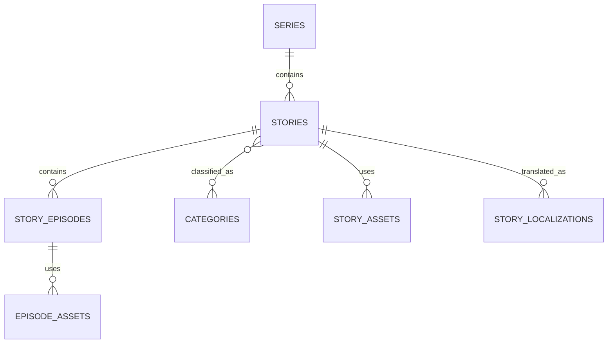
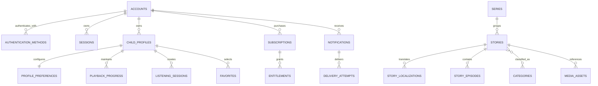

# Database Design

Version: 1.0.0  
Status: Draft for implementation  
Owners: Backend Architecture, Data Engineering  
Last reviewed: 2026-07-14

## 1. Purpose

This document defines the persistence model for KidsAudioBookPlatform. It establishes the database boundaries, naming rules, entity relationships, lifecycle policies, integrity constraints, indexing strategy, migration approach, audit model, retention rules, and performance expectations used by the backend services.

The design supports the first production release while preserving a controlled path toward independent microservice databases. It intentionally avoids premature distribution. The initial implementation uses PostgreSQL as the primary transactional database, Redis for ephemeral and cached data, and object storage for audio, images, and downloadable media assets.

This document is normative. When implementation details conflict with it, the architecture must be reviewed and the decision recorded through an ADR before the database model is changed.

## 2. Design Goals

The persistence layer must provide:

- strong transactional consistency for accounts, subscriptions, content publication, entitlements, and purchases;
- explicit ownership of every table by one bounded context;
- safe support for multiple child profiles under one parent account;
- durable storage of listening progress, favorites, downloads, and notification history;
- traceability for administrative actions and content changes;
- efficient content discovery by age, category, language, premium status, and publication state;
- reliable asynchronous event publication through an outbox pattern;
- privacy-aware data storage with minimal collection of child-related information;
- predictable migrations and rollback procedures;
- a future extraction path from a modular monolith to independent services.

The design must not rely on application code alone for data correctness. Important invariants are enforced by database constraints whenever PostgreSQL can express them safely.

## 3. Persistence Technology

### 3.1 PostgreSQL

PostgreSQL is the source of truth for transactional and relational data. The supported production baseline is PostgreSQL 16 or newer.

PostgreSQL is selected because it provides:

- mature transaction semantics;
- reliable foreign keys and constraints;
- partial, composite, covering, and expression indexes;
- JSONB for carefully bounded metadata;
- full-text search capabilities for the first product stage;
- robust migration tooling;
- row locking and concurrency controls;
- strong operational support and observability.

### 3.2 Redis

Redis is not a system of record. It may store:

- access-session metadata;
- refresh-token families or revocation markers;
- rate-limit counters;
- short-lived verification challenges;
- distributed locks with strict timeouts;
- content response caches;
- entitlement caches;
- idempotency results;
- temporary playback state awaiting persistence.

All Redis data must be reconstructible or safely disposable. Business records must never exist only in Redis.

### 3.3 Object Storage

Audio files, cover images, illustrations, waveform files, subtitles, and offline packages are stored in S3-compatible object storage. PostgreSQL stores only asset metadata and storage references.

Object storage keys must be opaque and must not contain names, email addresses, child profile names, or other personal data.

## 4. Database Ownership Model

The initial deployment may use one PostgreSQL cluster and one physical database, but ownership remains separated by schema.

Recommended schemas:

| Schema | Owner bounded context | Primary responsibility |
|---|---|---|
| `identity` | Identity & Access | Parent accounts, credentials, sessions, roles |
| `profiles` | Child Profiles | Child profiles, preferences, parental settings |
| `catalog` | Content Catalog | Stories, series, episodes, categories, assets |
| `playback` | Playback | Progress, sessions, bookmarks, favorites |
| `billing` | Subscription & Entitlements | Plans, subscriptions, purchases, entitlements |
| `notifications` | Notifications | Messages, delivery attempts, preferences |
| `admin` | Administration | Audit events, moderation, admin activity |
| `integration` | Platform Integration | Outbox, inbox, idempotency, scheduled jobs |

Rules:

1. A table has exactly one owning bounded context.
2. Only the owning module may write to its tables.
3. Cross-context reads occur through application interfaces, database views approved by architecture, or replicated read models.
4. Direct cross-context updates are forbidden.
5. Foreign keys across schemas are allowed in the modular-monolith phase only when they protect a critical invariant and do not block future extraction.
6. Every cross-schema foreign key must be documented as an extraction dependency.

## 5. General Conventions

### 5.1 Names

- schemas, tables, columns, indexes, and constraints use `snake_case`;
- table names are plural nouns;
- primary key columns are named `id`;
- foreign keys use `<entity>_id`;
- timestamp columns end in `_at`;
- date-only columns end in `_date`;
- boolean columns use positive names such as `is_active` and `is_premium`;
- monetary values use `amount_minor` plus `currency_code`;
- index names use `idx_<table>__<columns>`;
- unique constraints use `uq_<table>__<columns>`;
- check constraints use `ck_<table>__<rule>`;
- foreign keys use `fk_<table>__<referenced_table>`.

### 5.2 Identifiers

Business entities use UUID version 7 where supported by the application runtime. UUIDv7 provides globally unique, time-ordered identifiers that index more efficiently than random UUIDv4 values.

Identifiers must be generated in the application or through a database function consistently. Sequential numeric identifiers may be used only for internal append-only tables where they are never exposed externally.

Public API resources expose UUIDs. Database sequence values must not be exposed.

### 5.3 Timestamps

All timestamps use `timestamp with time zone` and are stored in UTC. The standard audit columns are:

```sql
created_at timestamptz not null default now(),
updated_at timestamptz not null default now()
```

The application is responsible for updating `updated_at`. Database triggers may be used only if the team adopts them consistently for all mutable tables.

### 5.4 Soft Deletion

Soft deletion is not the default. It is permitted only when records must remain for restoration, audit, billing, or legal reasons.

Soft-deleted tables use:

```sql
deleted_at timestamptz null,
deleted_by uuid null
```

Queries must explicitly exclude deleted records. Unique indexes on soft-deleted tables should normally be partial:

```sql
create unique index uq_child_profiles__account_name_active
    on profiles.child_profiles(account_id, lower(name))
    where deleted_at is null;
```

### 5.5 Optimistic Locking

Frequently edited aggregates include a numeric `version` column used for optimistic concurrency control.

```sql
version bigint not null default 0
```

JPA entities use `@Version`. A conflict returns HTTP `409 Conflict` and never silently overwrites a newer change.

## 6. Identity and Access Model

### 6.1 Parent Accounts

`identity.accounts` represents the adult account owner. Children do not receive standalone login accounts in the MVP.

Core columns:

```text
id
email_normalized
email_display
password_hash
status
email_verified_at
preferred_locale
terms_version
terms_accepted_at
privacy_version
privacy_accepted_at
created_at
updated_at
deleted_at
version
```

Constraints:

- `email_normalized` is unique among active accounts;
- `status` is one of `PENDING_VERIFICATION`, `ACTIVE`, `LOCKED`, `SUSPENDED`, `DELETION_PENDING`, `DELETED`;
- password hashes are never logged or copied to audit payloads;
- account deletion is a managed workflow rather than an immediate cascade.

Suggested indexes:

```sql
create unique index uq_accounts__email_active
    on identity.accounts(email_normalized)
    where deleted_at is null;

create index idx_accounts__status_created_at
    on identity.accounts(status, created_at desc);
```

### 6.2 Credentials and Authentication Methods

Authentication methods are separated from the account record so password, Google, Apple, or future identity providers can coexist.

`identity.authentication_methods`:

```text
id
account_id
method_type
provider_subject
password_hash
is_primary
last_used_at
created_at
updated_at
```

Only columns relevant to the selected method may be populated. A check constraint ensures that a password method has a password hash and an external method has a provider subject.

### 6.3 Roles and Administrative Access

Administrative authorization uses:

- `identity.roles`;
- `identity.permissions`;
- `identity.account_roles`;
- `identity.role_permissions`.

System roles include `PARENT`, `CONTENT_EDITOR`, `CONTENT_REVIEWER`, `SUPPORT_AGENT`, `BILLING_ADMIN`, and `PLATFORM_ADMIN`.

Role assignment and removal must produce immutable audit events.

### 6.4 Sessions and Token Families

`identity.sessions` stores long-lived session metadata, not raw access tokens.

Relevant columns:

```text
id
account_id
refresh_token_family_id
device_id_hash
device_platform
app_version
ip_hash
user_agent_summary
created_at
last_seen_at
expires_at
revoked_at
revocation_reason
```

Raw refresh tokens are never stored. Token hashes or family identifiers are used for replay detection. Expired session rows are deleted by a scheduled retention job.

### 6.5 Parent Zone PIN

The parent PIN is represented in `profiles.parent_security_settings`:

```text
account_id
pin_hash
failed_attempt_count
locked_until
biometric_enabled
updated_at
version
```

The PIN is hashed with an appropriate password-hashing algorithm. Plain PIN values are never persisted. Lockout state must be transactionally updated to prevent concurrent brute-force attempts.

## 7. Child Profile Model

### 7.1 Child Profiles

`profiles.child_profiles` contains the minimum information required to personalize the child experience.

```text
id
account_id
name
birth_year
age_band
avatar_asset_id
preferred_language
is_default
status
created_at
updated_at
deleted_at
version
```

Privacy rules:

- exact birth dates are not required for MVP;
- use `birth_year` or an explicit `age_band` rather than collecting unnecessary personal information;
- names may be nicknames and are not assumed to be legal names;
- analytics events reference profile IDs, never profile names;
- no child email address or phone number is collected.

Supported age bands should be modeled as stable codes such as `AGE_0_2`, `AGE_3_4`, `AGE_5_7`, and `AGE_8_PLUS`.

At most one active profile per account may be marked as default. PostgreSQL enforces this through a partial unique index.

```sql
create unique index uq_child_profiles__one_default
    on profiles.child_profiles(account_id)
    where is_default = true and deleted_at is null;
```

### 7.2 Profile Preferences

`profiles.profile_preferences` stores one-to-one preferences:

```text
profile_id
text_display_enabled
text_highlight_enabled
autoplay_next_enabled
ambient_sound_enabled
ambient_sound_type
ambient_sound_volume
story_volume
sleep_timer_minutes
content_language
updated_at
version
```

Volumes are constrained to a fixed range, for example `0..100`. Sleep timer values must belong to an approved set or be null.

### 7.3 Parental Content Settings

`profiles.parental_content_settings` stores controls configured by the parent:

```text
profile_id
maximum_age_rating
allow_autoplay
allow_downloads
allow_marketing_content
bedtime_start
bedtime_end
daily_listening_limit_minutes
updated_at
version
```

The service layer interprets bedtime using the account timezone. Database values use `time` without timezone plus the account timezone identifier stored in account preferences.

## 8. Content Catalog Model

### 8.1 Content Hierarchy

The catalog supports standalone stories and episodic series.



A `story` is the primary discoverable content item. A story may be standalone or may belong to a series. When a story has episodes, each episode has its own playback asset and sequence number.

### 8.2 Stories

`catalog.stories`:

```text
id
series_id
content_type
slug
publication_status
access_tier
minimum_age
maximum_age
estimated_duration_seconds
primary_language
cover_asset_id
published_at
unpublished_at
created_by
updated_by
created_at
updated_at
version
```

Allowed publication states:

```text
DRAFT -> IN_REVIEW -> APPROVED -> SCHEDULED -> PUBLISHED
                                  -> REJECTED
PUBLISHED -> UNPUBLISHED -> ARCHIVED
```

Publication state transitions are validated in the application layer and recorded in `catalog.content_status_history`.

Constraints:

- minimum age cannot exceed maximum age;
- duration must be non-negative;
- a published story requires a cover image and at least one playable audio asset;
- `slug` is unique per primary language among non-archived stories;
- premium access is represented by `access_tier`, not by duplicating catalog records.

### 8.3 Story Localization

Localized text is stored separately in `catalog.story_localizations`:

```text
id
story_id
locale
title
short_description
long_description
narrator_name
search_keywords
created_at
updated_at
version
```

The pair `(story_id, locale)` is unique. The localization row may exist before localized audio is ready, but a story cannot be published for a locale until all required localized assets are validated.

### 8.4 Series and Episodes

`catalog.series` stores series-level metadata and display ordering.

`catalog.story_episodes` stores:

```text
id
story_id
episode_number
publication_status
estimated_duration_seconds
published_at
created_at
updated_at
version
```

The pair `(story_id, episode_number)` is unique. Episode numbers are positive and stable after publication. Reordering must not rewrite historical episode numbers; display order may use a separate sortable column if needed.

### 8.5 Categories, Collections, and Tags

Categories are curated navigation entities. Tags are internal classification values. Collections are editorial groupings.

Tables:

- `catalog.categories`;
- `catalog.category_localizations`;
- `catalog.story_categories`;
- `catalog.tags`;
- `catalog.story_tags`;
- `catalog.collections`;
- `catalog.collection_localizations`;
- `catalog.collection_items`.

Many-to-many tables use composite primary keys unless an independent lifecycle or audit identity is required.

A collection item stores `position`, allowing deterministic ordering. The pair `(collection_id, story_id)` is unique.

### 8.6 Media Assets

`catalog.media_assets` stores metadata for every object-storage resource:

```text
id
asset_type
storage_provider
bucket_name
object_key
mime_type
file_size_bytes
checksum_sha256
duration_milliseconds
width_pixels
height_pixels
processing_status
scan_status
created_by
created_at
updated_at
```

Rules:

- object keys are unique;
- checksums support duplicate detection and integrity verification;
- assets must pass malware scanning before publication;
- audio assets must pass media validation and duration extraction;
- failed uploads are retained only for a short operational period;
- deleting a database record does not immediately delete the object; a controlled garbage-collection job verifies that no references remain.

### 8.7 Synchronized Text

Narration synchronization is represented by `catalog.story_cues` or `catalog.episode_cues`:

```text
id
content_id
sequence_number
start_millisecond
end_millisecond
text_value
paragraph_number
```

Constraints ensure:

- start is non-negative;
- end is greater than start;
- sequence numbers are unique per content item;
- cue times do not exceed known audio duration.

Overlap validation is best performed by the application and content-processing pipeline. A publication check rejects invalid cue sets.

## 9. Playback and Engagement Model

### 9.1 Playback Progress

`playback.progress` stores one current progress record per profile and playable content item.

```text
id
profile_id
story_id
episode_id
position_milliseconds
duration_milliseconds
progress_percent
status
first_started_at
last_played_at
completed_at
updated_at
version
```

Exactly one of `story_id` or `episode_id` must be populated. This is enforced by a check constraint.

The uniqueness rule is implemented with partial indexes:

```sql
create unique index uq_progress__profile_story
    on playback.progress(profile_id, story_id)
    where story_id is not null;

create unique index uq_progress__profile_episode
    on playback.progress(profile_id, episode_id)
    where episode_id is not null;
```

Progress updates are idempotent and use optimistic locking or an atomic upsert. Out-of-order updates from offline devices must not move progress backwards unless the user explicitly restarts the story.

### 9.2 Listening Sessions

`playback.listening_sessions` is append-oriented and supports analytics, parental summaries, free-tier ad frequency, and operational diagnostics.

```text
id
profile_id
story_id
episode_id
session_started_at
session_ended_at
start_position_ms
end_position_ms
listened_seconds
completion_reason
device_session_id
is_offline
created_at
```

A session is not a billing ledger. It may be corrected or deduplicated when clients retry. Idempotency is enforced using a client-generated session ID unique within the profile.

### 9.3 Favorites and Bookmarks

`playback.favorites` uses `(profile_id, story_id)` as a composite key.

Bookmarks are optional for MVP. If introduced, `playback.bookmarks` stores a content reference, playback position, optional parent-visible label, and timestamps.

### 9.4 Downloads

`playback.offline_downloads` tracks authorization and manifest state, not the files physically stored on the device.

```text
id
profile_id
story_id
episode_id
device_id_hash
manifest_version
entitlement_expires_at
status
created_at
last_verified_at
revoked_at
```

Offline records are revoked when the subscription ends, the content is removed, or the parent disables downloads. The mobile client must periodically revalidate entitlements.

## 10. Billing and Entitlement Model

### 10.1 Plans and Prices

`billing.plans` defines product capabilities. `billing.plan_prices` defines store-specific prices.

A plan is not identified by its current price. Historical subscriptions keep references to the plan and provider product identifiers used at purchase time.

Relevant fields:

```text
plan_code
billing_period
trial_days
maximum_profiles
offline_enabled
ads_enabled
is_active
```

### 10.2 Subscriptions

`billing.subscriptions`:

```text
id
account_id
plan_id
provider
provider_subscription_id
provider_original_transaction_id
status
current_period_start
current_period_end
trial_start
trial_end
cancel_at_period_end
cancelled_at
ended_at
created_at
updated_at
version
```

Status values include `TRIALING`, `ACTIVE`, `PAST_DUE`, `GRACE_PERIOD`, `CANCELLED`, `EXPIRED`, `REFUNDED`, and `REVOKED`.

Provider event timestamps and sequence information must be stored so delayed webhook delivery cannot overwrite a newer state.

### 10.3 Purchase Events

`billing.purchase_events` is append-only and stores normalized provider notifications.

Each provider event has a unique event identifier. Duplicate webhooks return success after detecting the existing event.

Raw provider payloads may be stored encrypted for a limited retention period, with secrets and unnecessary personal data removed.

### 10.4 Entitlements

`billing.entitlements` represents effective capabilities independently from subscription provider state.

Examples:

- `PREMIUM_CATALOG`;
- `OFFLINE_DOWNLOADS`;
- `MULTIPLE_PROFILES`;
- `AD_FREE`.

An entitlement has a source, validity interval, and revocation status. Sources may include subscription, promotion, support grant, or test account.

The unique active entitlement rule must prevent overlapping duplicate grants of the same source and capability where possible.

## 11. Advertising Frequency State

The free experience displays an advertisement after two completed listening sessions and never in the middle of a story.

`playback.ad_frequency_state` stores per-account or per-profile counters according to the final product rule:

```text
profile_id
eligible_session_count
last_ad_shown_at
last_eligible_session_at
updated_at
version
```

The counter update and ad-decision creation must be transactional to prevent multiple devices from independently triggering duplicate ads.

The actual ad network impression is external. The platform stores only the decision, placement, and delivery result required for policy verification and analytics.

## 12. Notification Model

### 12.1 Notifications

`notifications.notifications` is the durable, user-visible notification record.

```text
id
account_id
type
title_key
body_key
payload_json
priority
created_at
read_at
expires_at
```

`payload_json` contains versioned, non-sensitive navigation metadata. It must not become an unstructured replacement for relational columns.

### 12.2 Delivery Attempts

`notifications.delivery_attempts` records push, email, or in-app delivery.

```text
id
notification_id
channel
provider
provider_message_id
status
attempt_number
next_retry_at
sent_at
delivered_at
failed_at
failure_code
created_at
```

The pair `(notification_id, channel, attempt_number)` is unique. Retries use exponential backoff and terminate after the configured maximum.

### 12.3 Device Registrations

`notifications.device_registrations` stores hashed device identity and push tokens encrypted at rest.

A push token may move between accounts after logout/login, so activation is managed explicitly. Old tokens are deactivated rather than trusted indefinitely.

## 13. Administrative Audit Model

`admin.audit_events` is append-only.

Core fields:

```text
id
occurred_at
actor_account_id
actor_role
operation
resource_type
resource_id
correlation_id
request_id
ip_hash
before_json
after_json
reason
```

Audit requirements:

- sensitive fields are redacted;
- audit rows cannot be changed through application APIs;
- content publication, role assignment, subscription grants, account suspension, asset deletion, and moderation decisions are always audited;
- large binary data is never copied into audit records;
- audit retention is configurable and documented separately.

Database privileges should prevent the standard application role from deleting audit events.

## 14. Integration Reliability Tables

### 14.1 Transactional Outbox

`integration.outbox_events` guarantees that domain changes and event publication are coordinated.

```text
id
aggregate_type
aggregate_id
event_type
event_version
payload_json
headers_json
occurred_at
available_at
published_at
attempt_count
last_error
```

The business transaction inserts the outbox event in the same PostgreSQL transaction as the aggregate change. A publisher sends events to RabbitMQ and marks them as published.

Indexes prioritize unpublished available events:

```sql
create index idx_outbox__pending
    on integration.outbox_events(available_at, occurred_at)
    where published_at is null;
```

### 14.2 Consumer Inbox

`integration.inbox_messages` prevents duplicate side effects for event consumers.

The key includes `consumer_name` and `message_id`. Processing and inbox insertion occur in one transaction.

### 14.3 API Idempotency

`integration.idempotency_records` stores the result of retry-safe commands such as subscription validation, profile creation, and administrative publication actions.

Records include request fingerprint, response status, response body, owner account, and expiry time. Reusing the same idempotency key with a different request fingerprint returns a conflict.

## 15. Referential Integrity and Cascades

Cascade deletion is used sparingly.

Permitted examples:

- deleting a draft cue set when its unpublished draft asset is deleted;
- deleting profile preferences when a child profile is permanently purged;
- deleting join-table rows when the owning aggregate is deleted.

Forbidden examples:

- cascading account deletion into billing history;
- cascading story deletion into listening history;
- cascading plan deletion into subscriptions;
- cascading media deletion without reference checks.

Most business deletions are workflows that archive, anonymize, or detach records in a controlled order.

## 16. Indexing Strategy

Every index must correspond to a real query, constraint, ordering requirement, or operational process.

Standard priorities:

1. unique business constraints;
2. foreign-key lookup indexes;
3. high-frequency account and profile queries;
4. published catalog discovery;
5. pending outbox and notification delivery;
6. chronological audit and session queries;
7. provider webhook deduplication.

Examples:

```sql
create index idx_stories__published_age_tier
    on catalog.stories(publication_status, minimum_age, maximum_age, access_tier, published_at desc)
    where publication_status = 'PUBLISHED';

create index idx_progress__profile_recent
    on playback.progress(profile_id, last_played_at desc);

create index idx_sessions__profile_started
    on playback.listening_sessions(profile_id, session_started_at desc);

create unique index uq_purchase_events__provider_event
    on billing.purchase_events(provider, provider_event_id);
```

Avoid indexing low-cardinality booleans alone. Prefer partial or composite indexes aligned with actual filters.

Index usage must be reviewed with `EXPLAIN (ANALYZE, BUFFERS)` before production optimizations are accepted.

## 17. Search Strategy

The first release may implement catalog search using PostgreSQL full-text search and trigram indexes.

A generated or maintained search vector may include:

- localized title;
- short description;
- narrator;
- curated keywords;
- category names;
- series title.

Search is always filtered by publication status, language, age eligibility, and account entitlement.

A dedicated search engine should be introduced only after measured requirements exceed PostgreSQL capabilities. The source of truth remains PostgreSQL.

## 18. Partitioning and Data Growth

Partitioning is not mandatory for initial launch. It becomes appropriate when append-heavy tables reach operational thresholds.

Likely candidates:

- `playback.listening_sessions`, partitioned monthly by `session_started_at`;
- `admin.audit_events`, partitioned monthly by `occurred_at`;
- `integration.outbox_events`, partitioned by creation period if cleanup becomes expensive;
- `notifications.delivery_attempts`, partitioned by `created_at`.

Partitioning must not be introduced before retention, backup, and query behavior are understood.

## 19. Data Retention and Privacy

Retention periods must be finalized with legal and product owners. Architectural defaults:

| Data | Initial retention approach |
|---|---|
| Active account data | While account remains active |
| Deleted account identifiers | Anonymize after deletion workflow and legal hold checks |
| Listening progress | Until profile deletion or account deletion |
| Listening sessions | Retain for a bounded analytics period, then aggregate or delete |
| Push delivery attempts | Short operational retention |
| Expired sessions | Delete regularly |
| Failed upload metadata | Delete after troubleshooting window |
| Audit events | Long retention based on security and legal requirements |
| Raw billing provider payloads | Minimal encrypted retention |
| Outbox/inbox records | Delete or archive after safe replay window |

Account deletion must distinguish:

- data that can be immediately deleted;
- data that must be anonymized;
- financial records that must be retained;
- audit records that remain but lose direct personal identifiers;
- object-storage assets owned by the platform rather than the user.

## 20. Encryption and Sensitive Data

- TLS is required for all database connections;
- production storage and backups are encrypted at rest;
- passwords and PINs use one-way adaptive hashes;
- provider tokens, push tokens, and selected payloads use application-level encryption where necessary;
- encryption keys are stored outside the database in a secret-management system;
- logs and audit JSON must redact secrets;
- database roles follow least privilege.

No sensitive value may be placed in a column merely because the column is JSONB.

## 21. Database Roles

Recommended roles:

- `app_runtime`: normal application reads and writes within approved schemas;
- `migration_owner`: DDL and schema migration rights;
- `readonly_support`: restricted diagnostic queries with sensitive columns masked;
- `analytics_reader`: access to approved views or replicas;
- `audit_writer`: insert-only access to audit events where operationally practical;
- `backup_operator`: managed infrastructure permissions only.

The application must not run as the database owner or superuser.

## 22. Migration Strategy

Flyway is the preferred migration tool.

Migration rules:

1. Applied migrations are immutable.
2. File names follow `V<version>__<description>.sql`.
3. Repeatable migrations are limited to views and functions where appropriate.
4. Migrations run in CI against a clean database and an upgraded previous-version database.
5. Large table changes use expand-and-contract deployment.
6. Destructive changes require backups, verification queries, and explicit approval.
7. Application deployment must remain compatible during rolling upgrades.

Example expand-and-contract sequence:

1. add a nullable new column;
2. deploy code writing both old and new formats;
3. backfill in controlled batches;
4. deploy code reading the new format;
5. add constraints after verification;
6. remove old writes;
7. remove the old column in a later release.

## 23. Backup and Recovery

Production requires:

- automated full backups;
- point-in-time recovery through WAL archiving;
- encrypted backup storage;
- cross-region or independent failure-domain copies where commercially justified;
- periodic restore tests;
- documented RPO and RTO targets;
- pre-migration backups for high-risk releases.

A backup is not considered valid until restoration has been tested.

## 24. Testing Requirements

Database-related tests include:

- repository integration tests with Testcontainers PostgreSQL;
- migration tests from empty and previous schemas;
- constraint tests for critical invariants;
- concurrent progress-update tests;
- duplicate webhook and idempotency tests;
- outbox publishing and inbox deduplication tests;
- account deletion and anonymization tests;
- query-plan tests for critical catalog and playback queries where needed;
- data generation at realistic volumes for performance testing.

H2 or other in-memory databases must not replace PostgreSQL in persistence integration tests because SQL behavior and constraints differ.

## 25. Observability

Monitor at minimum:

- connection-pool usage and wait time;
- transaction duration;
- slow query count and latency percentiles;
- deadlocks and lock waits;
- replication lag;
- database size and table growth;
- index hit ratio and unused indexes;
- autovacuum health;
- migration duration and failure;
- outbox backlog;
- notification delivery backlog;
- backup completion and restore-test results.

Queries must carry correlation context through application telemetry where supported, but SQL logs must not expose sensitive values.

## 26. Initial Entity Relationship Overview



This diagram is intentionally conceptual. Exact physical foreign keys and join entities are defined in migrations and future schema-specific diagrams.

## 27. Implementation Sequence

Recommended delivery order:

1. database bootstrap, schemas, Flyway, roles, and common conventions;
2. identity accounts, authentication methods, and sessions;
3. child profiles, preferences, and parent security settings;
4. catalog stories, localization, categories, and media assets;
5. playback progress, favorites, and listening sessions;
6. subscriptions, provider events, and entitlements;
7. notifications and device registrations;
8. outbox, inbox, and idempotency infrastructure;
9. administrative audit and content status history;
10. search indexes, retention jobs, and performance tuning.

Each phase must include migrations, integration tests, repository code, OpenAPI changes, monitoring, and rollback considerations.

## 28. Decisions Requiring Confirmation

The following details may be refined without invalidating the architecture:

- whether ad frequency is tracked per account or per child profile;
- exact supported languages at launch;
- exact age-band codes;
- legal retention periods by deployment region;
- whether standalone stories and episodic stories share one aggregate or use separate aggregates;
- whether PostgreSQL full-text search is sufficient beyond MVP;
- when listening-session partitioning becomes necessary;
- final billing-provider normalization rules for Apple and Google stores.

Until a decision is finalized, implementations should use stable abstractions and avoid irreversible schema coupling.

## 29. Definition of Done

The database design is implementation-ready for a feature when:

- the owning bounded context is identified;
- tables and columns follow naming conventions;
- primary, foreign, unique, and check constraints are defined;
- privacy impact has been considered;
- required indexes correspond to known queries;
- deletion and retention behavior are explicit;
- concurrency and idempotency behavior are documented;
- migrations work from clean and previous versions;
- Testcontainers integration tests cover critical paths;
- operational metrics and failure recovery are defined;
- cross-context dependencies are recorded.

## 30. Related Documents

- `Architecture_Principles.md`
- `Software_Architecture.md`
- `Backend_Architecture.md`
- `API_Specification.md`
- `Security_Architecture.md`
- `Performance_Guidelines.md`
- `Logging_Monitoring.md`
- `Notifications.md`
