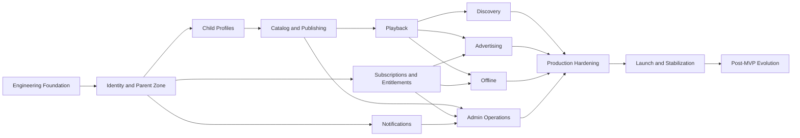

# Implementation Roadmap

Version: 1.1.0  
Status: Active Draft  
Owner: Project Architecture  
Last updated: 2026-07-15

## 1. Purpose

This document defines the recommended implementation order for KidsAudioBookPlatform. It translates the target architecture into executable delivery stages and keeps backend, mobile, administration, infrastructure, security, testing, observability, and documentation aligned.

The roadmap is dependency-driven rather than calendar-driven. A phase may begin only when its entry criteria are satisfied, and it is complete only when its exit gate is met with evidence.

## 2. Delivery Principles

1. Build vertical slices that produce testable user or operator value.
2. Keep the first production backend a modular monolith with explicit bounded contexts.
3. Treat security, observability, migrations, auditability, and automated testing as feature work.
4. Define OpenAPI and event contracts before dependent clients are implemented.
5. Prefer reversible decisions and incremental delivery over large coordinated releases.
6. Introduce infrastructure only for a verified use case.
7. Keep mobile, backend, and admin changes compatible during staged rollout.
8. Use feature flags for incomplete or high-risk capabilities.
9. Do not advance a phase while critical defects or unresolved architectural contradictions remain.
10. Update documentation and the project changelog in the same delivery increment as implementation.

## 3. Workstream Model

Each phase coordinates the following workstreams:

| Workstream | Primary responsibility |
|---|---|
| Product | Scope, acceptance criteria, child and parent experience |
| Backend | Domain model, APIs, persistence, events, integrations |
| Mobile | Child Experience, Parent Zone, offline and playback behavior |
| Admin | Content, support, operational and publishing workflows |
| Platform | CI/CD, runtime environments, secrets, deployment and recovery |
| Quality | Unit, integration, contract, end-to-end, performance and security tests |
| Security and Privacy | Threat modeling, authorization, data minimization, retention and audit |
| Operations | Metrics, logs, traces, alerts, runbooks and incident readiness |
| Documentation | API, architecture, flows, ADRs, operational guides and changelog |

A phase is not complete when only one workstream is finished.

## 4. Global Entry and Exit Gates

### Entry gate for implementation phases

- scope and acceptance criteria are documented;
- affected bounded contexts are identified;
- API and event contracts are drafted;
- authorization and data ownership are defined;
- migrations and compatibility risks are understood;
- failure, retry and rollback behavior are specified;
- required test environments are available.

### Exit gate for implementation phases

- product acceptance criteria pass;
- code review and architecture checks pass;
- migrations are versioned and verified;
- APIs and events match documented contracts;
- logs, metrics, traces and audit events are present;
- critical automated tests pass in CI;
- security and privacy requirements are verified;
- rollback or disablement strategy is documented;
- related documentation and changelog are updated.

## 5. Phase 0 — Repository and Engineering Foundation

### Objectives

Create a reproducible development and delivery baseline before domain implementation begins.

### Deliverables

- Java 21 and Spring Boot backend parent project;
- Flutter mobile application shell;
- React and TypeScript admin dashboard shell;
- Maven, Flutter and Node.js build conventions;
- Docker Compose for PostgreSQL, Redis, RabbitMQ and MinIO;
- Flyway baseline and migration conventions;
- structured logging and correlation ID propagation;
- health, readiness and liveness endpoints;
- CI workflows for build, test, static analysis, dependency and secret scanning;
- environment configuration and secret-handling conventions;
- architecture tests for module dependency rules;
- local-development setup guide.

### Required validation

- clean clone and documented startup succeed;
- CI passes for backend, mobile and admin;
- local infrastructure can be reset and recreated;
- no secrets or local credentials are committed;
- one sample API request, event and database migration are exercised end to end.

### Exit gate

The team can develop, test and run the platform locally and in a shared development environment using repeatable commands.

## 6. Phase 1 — Identity, Account and Parent Zone

### Scope

- account registration and email verification;
- login, logout, access-token issuance and refresh-token rotation;
- password reset and credential change;
- device sessions and session revocation;
- account status and security-event history;
- Parent Zone PIN setup, biometric-assisted unlock and cooldown policy;
- account-level audit events.

### Backend modules

- identity;
- account;
- security;
- audit.

### Required tests

- registration and verification integration tests;
- token rotation, replay and revocation tests;
- lockout, throttling and brute-force tests;
- authorization matrix tests;
- Parent Zone unlock and cooldown tests;
- session-expiry and device-removal tests.

### Exit gate

A parent can securely create, verify, access and manage an account, and protected operations require valid parent context.

## 7. Phase 2 — Child Profiles and Household Context

### Scope

- create, update, archive and restore child profiles;
- avatar, age band, language and playback preferences;
- free and premium profile limits;
- child-safe profile selection;
- profile ownership checks on every child-scoped request;
- profile deletion and dependent-data cleanup orchestration.

### Required validation

- child-facing APIs expose no billing or unnecessary personal data;
- changing a profile identifier cannot cross account boundaries;
- cache invalidation follows profile changes;
- audit records exist for parent-controlled profile operations;
- deletion behavior covers progress, downloads, preferences and notifications.

### Exit gate

Parent and child contexts are separated and every child experience request is safely scoped to an owned profile.

## 8. Phase 3 — Content Catalog, Media and Publishing Foundation

### Scope

- stories, series, episodes, categories, collections, tags and languages;
- age classification and content-tier metadata;
- draft, review, approved, scheduled, published, suspended and archived states;
- object-storage upload sessions;
- media metadata, checksum, validation and processing status;
- basic admin content editor and reviewer workflows;
- immutable published content versions;
- catalog cache invalidation and publication events.

### Required tests

- workflow transition tests;
- role and permission tests;
- invalid-media and upload-policy tests;
- scheduled publication tests;
- rollback and unpublish tests;
- catalog filtering by age, locale, state and tier.

### Exit gate

Authorized administrators can safely create, validate, approve and publish content, while mobile clients see only eligible published versions.

## 9. Phase 4 — Playback and Reading Experience

### Scope

- playback-session authorization;
- signed media manifests;
- audio playback and background controls;
- synchronized text and illustration sequencing;
- resume position, checkpoints and completion state;
- playback speed, sleep timer and ambient audio;
- interruption and transient-connectivity recovery;
- playback error mapping and telemetry.

### Technical rules

- application servers do not proxy normal media delivery;
- progress updates are idempotent and bounded;
- entitlement and publication checks occur server-side;
- signed URLs are short-lived and never logged;
- client timestamps are advisory and server timestamps authoritative.

### Exit gate

A child can reliably start, pause, resume and complete a story, with progress preserved and failures degrading safely.

## 10. Phase 5 — Discovery, Search and Personalization

### Scope

- home shelves and editorial collections;
- continue listening and recently played;
- favorites;
- age-appropriate rule-based recommendations;
- search and filtered browsing;
- time-of-day experience;
- cacheable catalog projections and fallback behavior.

### Required validation

- recommendation explanations are deterministic for the MVP;
- no sensitive child profiling is used;
- recommendation failure falls back to editorial content;
- search and catalog latency targets are met;
- unpublished and ineligible content cannot leak through cached projections.

### Exit gate

Children can discover appropriate content quickly, with predictable fallback behavior and measurable catalog performance.

## 11. Phase 6 — Subscriptions and Entitlements

### Scope

- monthly and annual products;
- three-day trial;
- Apple and Google purchase verification;
- provider notifications and scheduled reconciliation;
- subscription lifecycle states, grace periods and revocation;
- effective entitlement calculation;
- premium capabilities for profiles, downloads and advertising exclusion;
- support diagnostics and controlled overrides.

### Required tests

- receipt verification and invalid-proof tests;
- duplicate provider-event idempotency;
- renewal, cancellation, grace and expiry tests;
- entitlement rebuild tests;
- provider outage and delayed-notification tests;
- override authorization and audit tests.

### Exit gate

Premium access is derived exclusively from authoritative backend state and remains consistent under duplicate, delayed or missing provider events.

## 12. Phase 7 — Free-Tier Advertising

### Scope

- eligible listening-session counting;
- ad eligibility after two sessions;
- fifteen-second placement between sessions only;
- child-safe provider configuration and category restrictions;
- frequency caps and attempt tracking;
- impression outcome reporting;
- premium upsell after eligible ad completion.

### Safety rules

- ads never interrupt a story;
- premium users are never eligible;
- provider failure never blocks playback;
- the backend owns eligibility decisions;
- raw child behavior is not shared for behavioral advertising.

### Exit gate

Advertising operates within the documented safety and frequency policy and can be disabled without affecting playback.

## 13. Phase 8 — Offline Downloads and Synchronization

### Scope

- device registration and limits;
- download authorization and manifests;
- encrypted application-private storage;
- checksums, resumable download and partial-file cleanup;
- entitlement expiry and revocation;
- storage quota management;
- offline progress queue and synchronization;
- conflict-resolution and idempotency rules.

### Required tests

- interrupted download recovery;
- checksum mismatch and corrupt-file handling;
- expired and revoked entitlement behavior;
- stale progress and duplicate-operation handling;
- device-limit enforcement;
- migration of local manifest versions.

### Exit gate

Premium users can safely play authorized downloads offline, and synchronization restores authoritative state without data loss or duplicate effects.

## 14. Phase 9 — Notifications and Communication

### Scope

- persisted in-app notification inbox;
- Firebase and platform push delivery;
- email for account and security flows;
- templates, locale and variable validation;
- preferences and quiet hours;
- retry, dead-letter and delivery tracking;
- campaigns and operational announcements;
- token invalidation and cleanup.

### Exit gate

Notification creation is event-driven and idempotent, delivery failures are visible and recoverable, and parents control non-essential communication.

## 15. Phase 10 — Admin Operations and Support

### Scope

- role-based administrative navigation;
- user and account lookup;
- subscription and entitlement diagnostics;
- content moderation and publishing calendar;
- notification and campaign operations;
- feature-flag management;
- job, queue and dead-letter visibility;
- audit exploration and export;
- controlled support actions with reason capture.

### Exit gate

Authorized operators can manage content and support users without direct database access, with all privileged actions permission-controlled and audited.

## 16. Phase 11 — Production Hardening

### Workstreams

- load, stress, soak and failure-injection testing;
- threat-model review and penetration testing;
- dependency and container vulnerability remediation;
- backup and point-in-time recovery verification;
- restore drill and disaster-recovery rehearsal;
- SLO, alert and dashboard validation;
- incident, rollback and provider-outage runbooks;
- mobile accessibility and device-compatibility review;
- Apple and Google store compliance review;
- privacy, retention and account-deletion verification;
- cost and capacity review;
- support escalation and operational ownership.

### Production readiness gate

- critical journeys have end-to-end tests;
- critical and high security findings are resolved or formally accepted;
- restore objectives are demonstrated;
- alerts route to an accountable owner;
- release and rollback procedures are tested;
- data retention and deletion jobs are verified;
- provider credentials and secrets are production-ready;
- launch feature flags and kill switches are documented;
- known risks have owners and mitigation plans.

## 17. Phase 12 — Launch and Stabilization

### Scope

- staged rollout to internal users and controlled cohorts;
- production smoke tests;
- store release monitoring;
- SLO and business-metric review;
- crash, playback and purchase failure triage;
- support feedback collection;
- rollback or feature-disable decisions;
- post-launch architecture review.

### Stabilization exit gate

- no unresolved launch-blocking incidents;
- service levels remain within agreed thresholds;
- purchase and entitlement reconciliation is stable;
- playback-start and completion metrics are healthy;
- support workflows are operational;
- a launch retrospective and follow-up backlog exist.

## 18. Phase 13 — Post-MVP Evolution

Potential increments include:

- author and narrator workflows;
- additional languages and regional catalogs;
- advanced but privacy-safe recommendations;
- family-sharing improvements;
- educational progress insights for parents;
- casting and smart-speaker support;
- enhanced content-production automation;
- experimentation infrastructure;
- selective service extraction for independently scaling workloads.

Service extraction must follow measurable operational evidence and the process defined in `Software_Architecture.md`.

## 19. Dependency Map

## 20. Release Slice Strategy

Large phases should be delivered through small compatible slices. A recommended slice contains:

1. API and event contract;
2. database migration;
3. backend use case;
4. mobile or admin consumer;
5. automated tests;
6. metrics, logs and audit events;
7. feature flag or safe rollout mechanism;
8. documentation update.

A slice must not expose an unfinished child-facing experience unless it is hidden behind a disabled feature flag.

## 21. Risk Register

| Risk | Early mitigation |
|---|---|
| Store integration delays | Begin sandbox verification before subscription UI is finalized |
| Media-processing complexity | Validate representative audio and illustration files during Phase 3 |
| Offline synchronization defects | Build idempotency and operation queues before full offline UI |
| Child-safety regressions | Automate route, authorization and content-eligibility tests |
| Operational overload | Keep initial deployment simple and automate environment creation |
| Documentation drift | Require contract and documentation checks in pull requests |
| Performance issues | Establish baseline load tests before launch hardening |
| Provider lock-in | Keep provider-specific code behind adapters |

## 22. Definition of Done

A capability is done only when:

- acceptance criteria are met;
- source-of-truth ownership is clear;
- authorization and validation are implemented;
- migrations are versioned and tested;
- API and event contracts are synchronized;
- unit, integration and contract tests pass;
- critical user journeys have appropriate end-to-end coverage;
- logs, metrics, traces and audit records are present;
- retry, compensation and failure behavior are defined;
- mobile and admin error states are implemented;
- security and privacy requirements are verified;
- rollback, kill switch or disablement behavior is known;
- documentation and changelog are updated;
- CI passes without ignored critical findings.

## 23. Related Documents

- `Software_Architecture.md`
- `System_Flows.md`
- `Technology_Stack.md`
- `Backend_Architecture.md`
- `Mobile_Architecture.md`
- `Admin_Dashboard.md`
- `API_Specification.md`
- `Database_Design.md`
- `Security_Architecture.md`
- `Performance_Guidelines.md`
- `Logging_Monitoring.md`
- `Event_Catalog.md`
- `Error_Catalog.md`
- `C4_Model/15_Architecture_Roadmap.md`
- `C4_Model/16_Known_Technical_Debt.md`
- `C4_Model/20_Architecture_Operations_Handbook.md`
