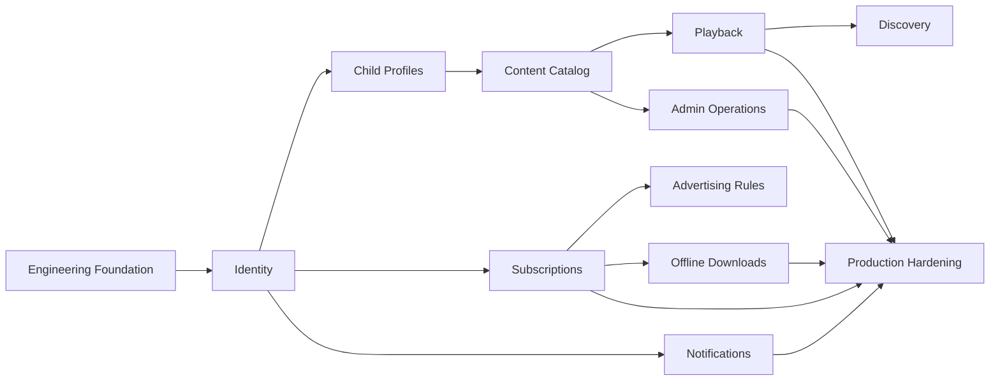

# Implementation Roadmap

Version: 1.0.0
Status: Draft

## Purpose

This document defines the recommended implementation order for KidsAudioBookPlatform. It translates the architecture into executable delivery stages and keeps backend, mobile, admin, infrastructure, testing, and documentation aligned.

## Delivery Principles

- Build vertical slices, not isolated technical layers.
- Every milestone must be deployable and testable.
- Security, observability, migrations, and automated tests are part of the feature definition of done.
- Prefer a modular monolith for the first production release while preserving bounded contexts and extraction seams.
- Do not introduce infrastructure without a concrete use case.
- All API contracts must be documented in OpenAPI before mobile and admin consumers depend on them.

## Phase 0 — Repository and Engineering Foundation

### Objectives

- Confirm repository structure.
- Configure Java 21, Spring Boot, Flutter, Node.js, Docker Compose, PostgreSQL, Redis, RabbitMQ, and MinIO.
- Add code quality checks, formatting, test execution, dependency scanning, and secret scanning.
- Establish local environment documentation.

### Deliverables

- Backend parent project and shared conventions.
- Flutter application shell.
- Admin dashboard shell.
- Docker Compose development environment.
- CI workflow for build and test.
- Flyway baseline migration.
- Structured logging and correlation ID middleware.
- Health, readiness, and liveness endpoints.

### Exit Criteria

- A clean clone can start the complete local platform using documented commands.
- CI passes for backend, mobile, and admin modules.
- No secrets are committed.

## Phase 1 — Identity and Parent Account

### Scope

- Registration, login, refresh, logout, password reset, email verification.
- Device sessions and session revocation.
- Parent profile management.
- Parent Zone PIN setup and verification.

### Backend Modules

- identity
- account
- security
- audit

### Required Tests

- Authentication integration tests.
- Token rotation and replay tests.
- Rate-limit and brute-force tests.
- Authorization matrix tests.

### Exit Criteria

- A parent can create and secure an account.
- Protected operations require authenticated parent context.
- Session and security events are auditable.

## Phase 2 — Child Profiles and Household Experience

### Scope

- Create, update, archive, and select child profiles.
- Age range, avatar, language, accessibility, and content preferences.
- Premium profile limit enforcement.
- Child-safe session context.

### Exit Criteria

- Parent and child contexts are separated.
- Child-facing APIs expose no unnecessary personal or billing data.
- Profile changes invalidate relevant cache entries.

## Phase 3 — Content Catalog Foundation

### Scope

- Stories, series, episodes, categories, collections, age bands, languages, tags.
- Draft, review, scheduled, published, unpublished, and archived states.
- Media metadata and object storage integration.
- Admin content management basics.

### Backend Modules

- catalog
- media
- publishing
- admin

### Exit Criteria

- Administrators can create and publish valid content.
- Mobile clients can browse only eligible published content.
- Content validation and audit trails are enforced.

## Phase 4 — Playback and Reading Experience

### Scope

- Audio playback.
- Synchronized text segments.
- Illustration sequencing.
- Resume position and completion state.
- Ambient sound mixing.
- Sleep timer and playback speed.

### Technical Notes

- Media files are delivered through object storage/CDN using short-lived signed URLs.
- Progress writes are throttled and idempotent.
- Playback remains functional during transient network loss.

### Exit Criteria

- A child can start, pause, resume, and finish a story.
- Progress synchronizes across sessions.
- Playback errors degrade safely and are observable.

## Phase 5 — Discovery and Personalization

### Scope

- Continue listening.
- Recently played.
- Favorites.
- Age-appropriate recommendations.
- Search and filtered browsing.
- Time-of-day home experience.

### Exit Criteria

- Recommendations are explainable and rule-based for the MVP.
- No advertising or recommendation logic uses sensitive child profiling.
- Search and catalog queries meet latency targets.

## Phase 6 — Subscription and Entitlements

### Scope

- Monthly and annual products.
- Three-day trial.
- Apple and Google purchase verification.
- Subscription lifecycle reconciliation.
- Entitlement calculation.
- Multiple profiles, offline mode, and no-ads premium benefits.

### Exit Criteria

- Store receipts are verified server-side.
- Entitlements are derived from authoritative purchase state.
- Duplicate store events are idempotent.
- Subscription state can be rebuilt from purchase events.

## Phase 7 — Advertising for Free Users

### Scope

- Session counting.
- Ad eligibility after two listening sessions.
- Fifteen-second advertisement between sessions only.
- Frequency caps and child-safe provider restrictions.
- Premium upsell after ad completion.

### Exit Criteria

- Ads never interrupt a story.
- Premium users never receive ads.
- Ad decisions are auditable and privacy-safe.

## Phase 8 — Offline Downloads

### Scope

- Download manifests.
- Encrypted local assets.
- Entitlement checks.
- Expiry and revocation.
- Storage quota management.
- Background download and retry.

### Exit Criteria

- Premium users can play downloaded stories without connectivity.
- Revoked or expired content becomes unavailable according to policy.
- Partial downloads are recoverable and do not corrupt local state.

## Phase 9 — Notifications and Messaging

### Scope

- In-app notification inbox.
- Push notifications through Firebase Cloud Messaging and APNs.
- Email for account and security flows.
- Preferences, quiet hours, templates, retry, and delivery tracking.

### Exit Criteria

- Notification creation is event-driven and idempotent.
- Delivery failures are retried and visible operationally.
- Parents can control non-essential communication.

## Phase 10 — Admin Operations and Support

### Scope

- User lookup and support notes.
- Subscription diagnostics.
- Content moderation and publishing calendar.
- Campaigns, announcements, offers, and discounts.
- Job monitoring and audit exploration.

### Exit Criteria

- Administrative actions are permission-controlled and audited.
- Sensitive data is masked by default.
- Dangerous actions require explicit confirmation.

## Phase 11 — Hardening and Production Readiness

### Workstreams

- Performance and load tests.
- Security testing and threat-model review.
- Backup restoration drill.
- Incident runbooks.
- Mobile accessibility review.
- Store compliance review.
- Privacy and retention verification.
- Cost and capacity review.

### Production Readiness Gate

- SLOs and alerts are active.
- Recovery objectives are tested.
- Critical flows have end-to-end tests.
- No unresolved critical or high security findings.
- Operational ownership is documented.

## Phase 12 — Post-MVP Evolution

Potential increments:

- Author and narrator workflows.
- Advanced recommendation engine.
- Additional languages and regional catalogs.
- Family sharing improvements.
- Educational progress insights.
- Smart speaker and casting support.
- Selective extraction of high-load modules into microservices.

## Dependency Map

## Definition of Done

A feature is done only when:

- product acceptance criteria are met;
- API and event contracts are documented;
- authorization and validation are implemented;
- migrations are versioned and reversible where practical;
- unit, integration, and contract tests pass;
- logs, metrics, traces, and audit events are added;
- failure and retry behavior is defined;
- mobile/admin error handling is implemented;
- documentation and changelog are updated;
- CI passes without ignored critical findings.
