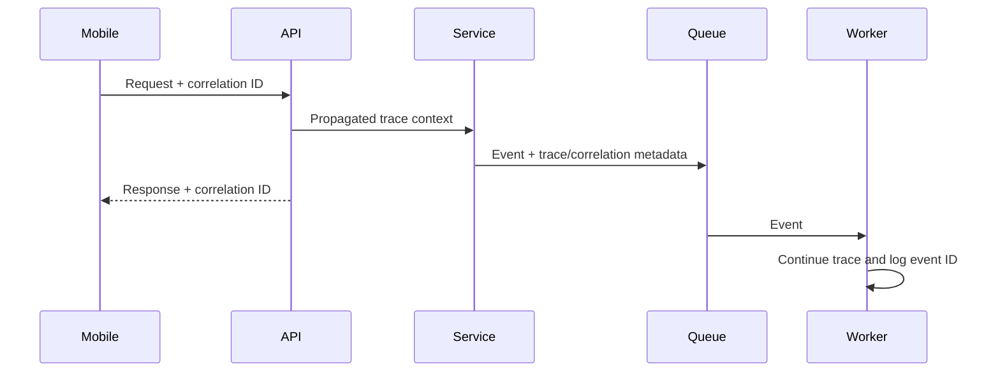
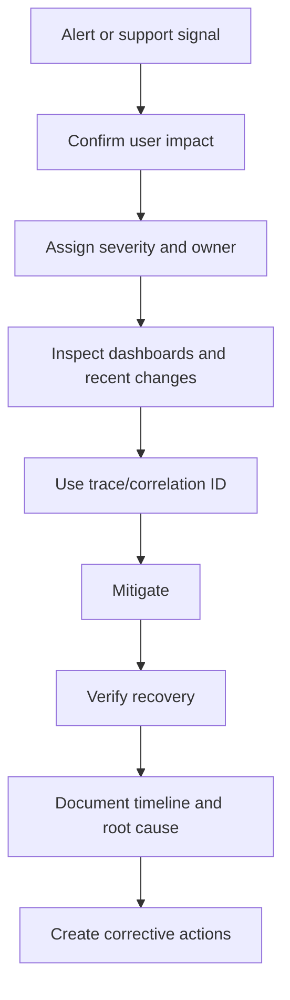

# Logging and Monitoring

Version: 1.0.0  
Status: Active Draft  
Owners: Architecture, Backend Engineering, DevOps  
Last reviewed: 2026-07-14

## 1. Purpose

This document defines the observability strategy for KidsAudioBookPlatform. It covers logs, metrics, traces, dashboards, alerting, audit trails, operational ownership, retention, privacy, and incident support across the backend, mobile clients, admin dashboard, PostgreSQL, Redis, RabbitMQ, object storage, and infrastructure.

Observability must answer four questions quickly:

1. Is the system healthy?
2. Is the user experience healthy?
3. What changed?
4. Where and why did a failure occur?

Logging is not a substitute for metrics, and metrics are not a substitute for traces. The platform uses all three.

## 2. Target stack

The preferred initial stack is:

- Spring Boot Actuator and Micrometer for application metrics;
- Prometheus for metric collection;
- Grafana for dashboards and alert visualization;
- structured JSON logs;
- Loki for centralized log aggregation;
- OpenTelemetry for distributed traces and context propagation;
- Tempo or another OpenTelemetry-compatible trace backend;
- Sentry or an equivalent tool for mobile and frontend crash reporting;
- PostgreSQL audit tables for durable business and administrative audit records.

The exact hosted or self-managed products may change, but the telemetry contracts in this document remain valid.

## 3. Observability principles

- Telemetry is designed with the feature, not added after incidents.
- Every request must be traceable across service boundaries.
- Logs must be structured and machine-searchable.
- Metrics must represent both technical health and business outcomes.
- Alerts must be actionable and owned.
- Sensitive information must never be exposed through telemetry.
- High-cardinality values must not be used as uncontrolled metric labels.
- Audit records and operational logs serve different purposes.
- Sampling decisions must preserve errors and critical flows.
- Dashboards must show percentiles, rates, and saturation, not only averages.

## 4. Correlation model

The platform uses the following identifiers:

| Identifier | Purpose |
|---|---|
| `traceId` | End-to-end distributed request or workflow trace |
| `spanId` | Individual operation inside a trace |
| `correlationId` | Stable identifier returned to clients and support teams |
| `requestId` | Unique inbound HTTP request |
| `eventId` | Unique domain or integration event |
| `causationId` | Event or command that caused another event |
| `accountId` | Internal account reference, included only where safe |
| `profileId` | Internal child-profile reference, included only where necessary |
| `deviceIdHash` | Non-reversible operational device reference |

Inbound APIs accept a valid correlation ID or generate one. The server always returns it in a response header. Invalid or excessively long values are replaced.

Asynchronous events must carry `eventId`, `correlationId`, `traceId` when available, and `causationId`.



## 5. Structured logging format

Application logs must use JSON in shared environments. A typical record contains:

```json
{
  "timestamp": "2026-07-14T18:20:31.421Z",
  "level": "INFO",
  "service": "content-service",
  "environment": "production",
  "version": "1.8.0",
  "message": "Story published",
  "eventType": "STORY_PUBLISHED",
  "traceId": "4fd...",
  "spanId": "8ac...",
  "correlationId": "c01...",
  "storyId": "6f8...",
  "actorType": "ADMIN",
  "durationMs": 84
}
```

Required common fields:

- timestamp in UTC;
- severity;
- service and environment;
- deployed version or commit;
- message;
- trace and correlation context when available;
- operation or event type;
- duration for completed operations;
- exception type and stack trace for failures.

Fields must use stable names across services.

## 6. Log levels

### TRACE

Disabled in normal shared environments. Used only for temporary, targeted diagnosis. Must not include payloads containing sensitive data.

### DEBUG

Development and controlled troubleshooting information. Production use must be temporary and scoped.

### INFO

Normal significant lifecycle and business events, for example:

- application started;
- story published;
- subscription activated;
- child profile created;
- background job completed;
- notification batch dispatched.

Do not log every successful repository method or every trivial function call.

### WARN

Unexpected but recoverable behavior:

- retry scheduled;
- cache unavailable with database fallback;
- stale entitlement accepted under grace policy;
- invalid client version approaching deprecation;
- queue lag above warning threshold.

### ERROR

An operation failed and requires investigation or produces user/business impact:

- unhandled exception;
- database transaction failure;
- media processing exhausted retries;
- push provider failure above threshold;
- corrupted or inconsistent state.

### FATAL

Reserved for conditions preventing process startup or continued safe operation.

## 7. What must never be logged

The following are prohibited:

- passwords;
- PIN values;
- access or refresh tokens;
- password reset tokens;
- complete authorization headers;
- biometric data;
- payment card details;
- app-store receipts in raw form;
- signed media URLs containing credentials;
- secrets, API keys, or private keys;
- full email addresses unless specifically approved and masked;
- child names in centralized operational logs;
- story audio or uploaded file contents;
- arbitrary request or response bodies.

Sensitive values must be omitted, masked, hashed, or represented by internal identifiers. Exception messages from external libraries must be reviewed because they may contain URLs or credentials.

## 8. HTTP request logging

Request logging must record:

- method;
- route template, not uncontrolled raw paths;
- status code;
- duration;
- request and correlation IDs;
- authenticated actor type;
- client application and version;
- response size where useful;
- rate-limit outcome;
- exception classification for failures.

Do not log complete query strings when they may contain search text or personal data. Health-check noise may be sampled or excluded from normal logs while remaining visible through metrics.

## 9. Business-event logging

Important business operations need concise, structured records:

- account registered, verified, blocked, or deleted;
- child profile created, updated, or removed;
- story submitted, approved, published, archived, or rejected;
- playback session started and completed at aggregate level;
- subscription trial started, activated, renewed, expired, or revoked;
- entitlement changed;
- notification created and delivered;
- administrative role or permission changed;
- data export or deletion requested.

Operational logs must not become the legal audit system. Operations requiring durable accountability are also stored in the audit model defined by `Database_Design.md`.

## 10. Audit logging

Audit records are immutable from normal application flows and include:

- actor identifier and actor type;
- action;
- target type and identifier;
- timestamp;
- source IP or privacy-safe network information when legally appropriate;
- correlation ID;
- before/after summary for high-risk changes;
- outcome;
- reason supplied by an administrator;
- application version.

High-risk audited actions include:

- content publication and removal;
- subscription overrides;
- account suspension;
- role and permission changes;
- access to protected exports;
- deletion requests;
- security-setting changes.

Audit access must itself be authorized and auditable.

## 11. Metrics taxonomy

Metrics use a consistent prefix such as `kids_audio_book_` where a platform prefix is required.

### 11.1 RED metrics for services

For every API or service operation:

- Rate: requests per second;
- Errors: failures per second and error ratio;
- Duration: p50, p95, and p99 latency.

### 11.2 USE metrics for resources

For each important resource:

- Utilization;
- Saturation;
- Errors.

Examples include CPU, memory, thread pools, database pools, queue consumers, disk, and network.

### 11.3 Required application metrics

- HTTP request count and duration by route template and status class;
- active requests;
- authentication success/failure;
- refresh-token rejection;
- database pool active, idle, pending, and timeout counts;
- database query timing for selected critical operations;
- Redis command latency, hit ratio, misses, and evictions;
- RabbitMQ queue depth, publish rate, consume rate, redelivery, and dead-letter count;
- scheduled job duration and outcome;
- media-upload and processing outcome;
- signed URL generation failures;
- notification dispatch and provider responses;
- entitlement lookup outcome;
- external dependency latency and circuit-breaker state.

### 11.4 Business metrics

Business metrics must be privacy-safe and aggregate:

- new verified accounts;
- active child profiles;
- story starts and completions;
- playback-start failure ratio;
- premium trial starts;
- subscription activations and expirations;
- ad eligibility and completed ad sessions;
- notification delivery and engagement;
- content publication volume.

Business metrics must not use individual user IDs as labels.

## 12. Metric-label rules

Allowed low-cardinality labels include:

- service;
- environment;
- route template;
- HTTP method;
- status class;
- exception category;
- event type;
- provider;
- result;
- app platform;
- coarse app-version family.

Prohibited uncontrolled labels include:

- account ID;
- profile ID;
- story ID;
- email;
- raw URL;
- correlation ID;
- exception message;
- arbitrary search text.

These values belong in logs or traces, not metrics.

## 13. Distributed tracing

Tracing is required for:

- inbound HTTP requests;
- internal HTTP calls;
- database operations at an appropriate abstraction level;
- Redis calls;
- RabbitMQ publish and consume operations;
- object-storage calls;
- push-notification providers;
- app-store receipt verification.

Spans must include stable operation names and safe attributes. Errors must mark spans appropriately.

Suggested sampling:

- 100% in local and testing environments where affordable;
- tail-based or probability sampling in production;
- retain 100% of errors and high-latency traces;
- retain security-relevant and critical purchase workflows at a higher rate.

## 14. Mobile and admin observability

Flutter and dashboard clients must report:

- crashes and unhandled exceptions;
- application version, platform, and OS family;
- screen-load timing;
- playback-start timing and failure category;
- API failure category;
- offline synchronization failures;
- download failures;
- UI hangs or severe frame degradation where tooling supports it.

Never attach complete API payloads or child-visible content to crash reports. User-provided text must be scrubbed.

Release health must show whether a new version increases crashes or playback failures.

## 15. Dashboards

At minimum, provide:

### Executive service-health dashboard

- availability;
- request volume;
- p95/p99 latency;
- server error ratio;
- playback-start success;
- active incidents;
- current release versions.

### Backend dashboard

- endpoint latency;
- JVM memory and garbage collection;
- CPU;
- thread and connection pools;
- downstream latency;
- exception rates.

### Data dashboard

- PostgreSQL connections, locks, slow queries, replication/backup status;
- Redis latency, memory, evictions, hit ratio;
- migration status.

### Messaging dashboard

- queue depth;
- consumer count;
- processing lag;
- retry volume;
- dead-letter messages;
- oldest queued message age.

### Mobile release dashboard

- crash-free sessions;
- API error ratio by app version;
- playback failure;
- adoption by version;
- offline sync failures.

### Business operations dashboard

- content publication;
- subscription state changes;
- notification delivery;
- support-impact indicators.

## 16. Alerting strategy

Alerts must be based on user impact, SLO consumption, or urgent infrastructure risk. Every alert needs:

- severity;
- owner;
- runbook link;
- concise description;
- relevant dashboard;
- expected response time;
- suppression or grouping policy.

### Severity levels

| Level | Meaning | Response expectation |
|---|---|---|
| SEV-1 | Major outage, security incident, or widespread playback/authentication failure | Immediate |
| SEV-2 | Significant degradation or critical subsystem failure | Urgent |
| SEV-3 | Limited degradation requiring planned intervention | Business hours |
| SEV-4 | Informational or trend requiring review | Backlog/review |

Initial alert examples:

- core API availability below objective;
- server error ratio above threshold for 5-10 minutes;
- p95 latency above objective;
- authentication failures increase abnormally;
- database pool saturation;
- RabbitMQ dead-letter growth;
- oldest queue message exceeds limit;
- PostgreSQL storage or connection risk;
- Redis evictions or memory saturation;
- media-processing failures exceed threshold;
- push-notification provider failure spike;
- crash-free mobile sessions fall after release.

Avoid paging on transient single errors.

## 17. SLO and error-budget monitoring

Core journeys should have SLOs and error budgets. Alerting should consider burn rate instead of only static thresholds.

Example:

- SLO: 99.9% successful core API requests over 30 days.
- Error budget: approximately 43 minutes of equivalent unavailability per 30-day period.
- Fast-burn alert: severe consumption over a short window.
- Slow-burn alert: sustained degradation over a longer window.

When an error budget is exhausted, reliability work receives priority over risky feature changes until the service returns to a healthy trajectory.

## 18. Retention

Retention depends on environment, cost, privacy, and legal requirements.

Suggested starting policy:

| Telemetry | Development | Staging | Production |
|---|---:|---:|---:|
| Application logs | 7 days | 14 days | 30-90 days |
| Security logs | 14 days | 30 days | 180+ days based on policy |
| Metrics | 14 days | 30 days | 13 months aggregated |
| Traces | 3 days | 7 days | 7-30 days sampled |
| Audit records | As defined by business/legal retention | As defined | Long-term controlled retention |

Retention must be documented and automated. Deletion of expired telemetry is required.

## 19. Environment rules

### Local

Human-readable console logs are acceptable. Developers must be able to enable JSON locally. Local Docker Compose should expose basic dashboards when practical.

### Test

Tests should capture correlation IDs and include relevant logs on failure without flooding CI output.

### Staging

Staging must resemble production telemetry closely enough to validate dashboards, alerts, trace propagation, and releases.

### Production

Production logging configuration is centrally managed. Ad-hoc debug logging requires approval, a narrow scope, and automatic expiry.

## 20. Incident workflow



During an incident:

- preserve relevant evidence;
- avoid logging sensitive data as a shortcut;
- record timestamps in UTC;
- identify current and previous release versions;
- note configuration and feature-flag changes;
- communicate impact and mitigation clearly.

## 21. Health endpoints

Services expose separate health concepts:

- liveness: process is running and not irrecoverably stuck;
- readiness: instance can accept traffic;
- startup: application initialization has completed.

A temporary dependency outage should not necessarily fail liveness and trigger restart loops. Readiness may fail when serving traffic would be unsafe.

Health endpoints must not expose credentials, internal topology, stack traces, or detailed sensitive dependency data publicly.

## 22. Deployment observability

Every deployment must annotate dashboards with:

- service;
- version/commit;
- environment;
- deployment start and completion;
- outcome;
- responsible workflow.

After deployment, compare:

- error ratio;
- latency;
- resource use;
- crash rate;
- business journey success;
- queue lag.

Automated rollback criteria may be introduced once signals are reliable.

## 23. Quality gates

A feature is not operationally complete unless:

- important operations have structured logs;
- errors preserve correlation context;
- metrics exist for success, failure, latency, and saturation where relevant;
- asynchronous processing exposes lag and retry metrics;
- sensitive data has been reviewed;
- dashboards can display the feature's health;
- meaningful failure modes have alerts or documented monitoring;
- support can locate a request using a correlation ID;
- runbooks are updated for critical components.

## 24. Anti-patterns

Prohibited practices include:

- logging full request bodies globally;
- using string concatenation instead of structured fields;
- using account IDs as metric labels;
- alerting on every exception;
- swallowing errors after only a DEBUG message;
- creating alerts without an owner;
- treating audit records as disposable application logs;
- retaining telemetry forever without policy;
- exposing detailed health endpoints publicly;
- relying on a single dashboard for all audiences.

## 25. Review and evolution

This document must be reviewed whenever the architecture, hosting platform, privacy requirements, or operational support model changes. New services must inherit the common telemetry conventions. Exceptions require an ADR and an explicit migration plan.