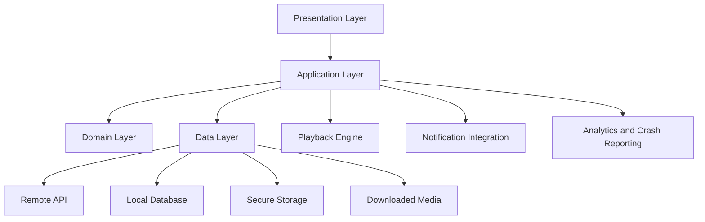
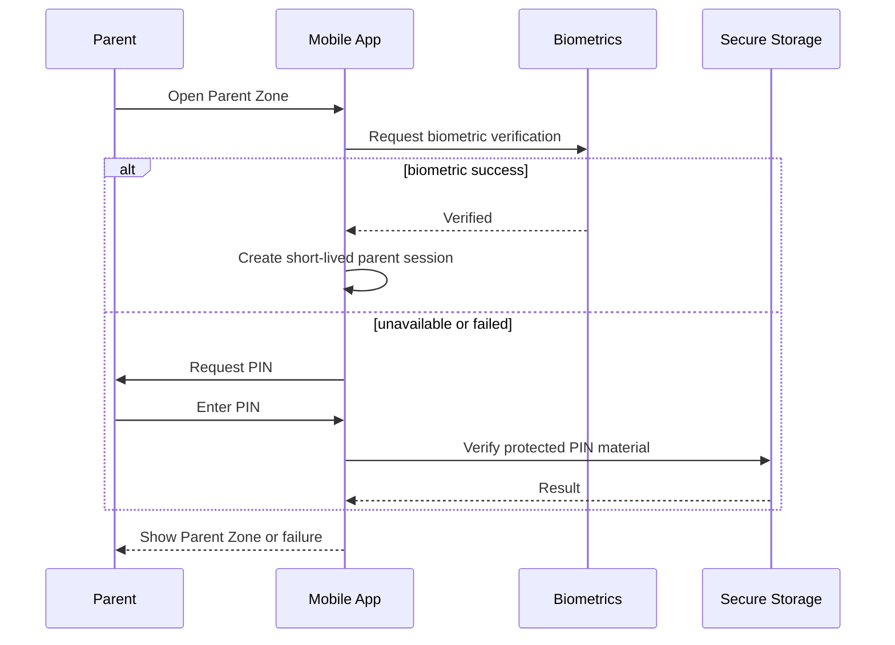
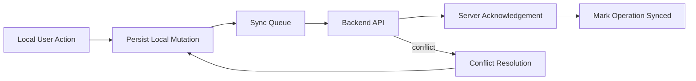
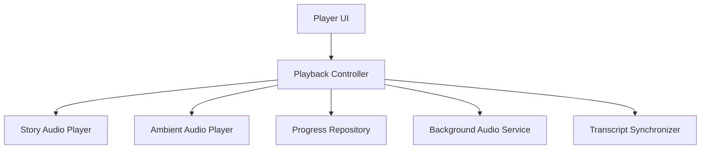
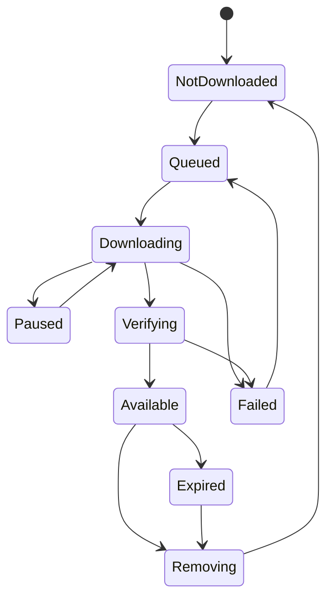

# Mobile Architecture

Version: 1.0.0  
Status: Draft  
Owner: Mobile Engineering  
Last Updated: 2026-07-14

## 1. Purpose

This document defines the target architecture for the Flutter mobile application used by parents and children. It translates the product principles into concrete engineering rules for structure, state management, navigation, networking, offline playback, security, observability, testing, and release management.

The mobile application must serve two very different experiences inside one product:

- a child-facing experience that is calm, visual, simple, and resilient;
- a parent-facing experience that is secure, informative, and operationally complete.

The architecture must keep those experiences isolated enough to evolve independently while sharing infrastructure such as authentication, networking, storage, analytics, media playback, and synchronization.

## 2. Scope

This document covers:

- Flutter application structure;
- feature and layer boundaries;
- dependency rules;
- navigation and route protection;
- state management;
- API integration;
- local persistence and offline synchronization;
- audio playback and ambient sounds;
- child profile selection;
- Parent Zone security;
- subscription and entitlement handling;
- ads for free users;
- notifications and deep links;
- accessibility and performance;
- logging, crash reporting, analytics, testing, CI/CD, and release practices.

It does not redefine backend contracts, database design, business ownership, or infrastructure. Those are described in the corresponding architecture documents.

## 3. Architectural Goals

The mobile architecture must optimize for the following outcomes:

1. predictable behavior across Android and iOS;
2. fast startup and smooth navigation on mid-range devices;
3. reliable playback under unstable network conditions;
4. safe separation between Child Experience and Parent Zone;
5. offline access for Premium users without weakening entitlement controls;
6. maintainable feature boundaries and low coupling;
7. testability of business logic without rendering widgets;
8. clear observability for failures that occur only on mobile devices;
9. a migration path for future features without architectural rewrites.

## 4. Technology Baseline

The approved baseline is:

- Flutter and Dart;
- Riverpod for dependency injection and state management;
- GoRouter for declarative navigation;
- Dio for HTTP networking;
- Freezed and json_serializable for immutable models and serialization;
- Drift for structured local data;
- flutter_secure_storage for secrets and sensitive tokens;
- just_audio for playback;
- audio_service for background playback and operating-system media controls;
- Firebase Cloud Messaging for push notifications;
- Sentry or Firebase Crashlytics for crash reporting;
- integration_test for end-to-end tests.

Package choices may evolve, but any replacement must preserve the architectural responsibilities defined in this document.

## 5. High-Level Architecture



The application follows a pragmatic clean architecture. The goal is not to maximize abstractions, but to make responsibilities and dependencies explicit.

The core dependency rule is:

> Presentation depends on application contracts. Application depends on domain contracts. Infrastructure implements those contracts. Domain code does not depend on Flutter widgets, Dio, Drift, Firebase, or platform APIs.

## 6. Repository Structure

The recommended structure is feature-first with shared platform modules.

```text
mobile/
  lib/
    app/
      app.dart
      bootstrap.dart
      router/
      theme/
      localization/
      configuration/
    core/
      auth/
      networking/
      persistence/
      security/
      playback/
      analytics/
      logging/
      errors/
      synchronization/
      design_system/
    features/
      onboarding/
      authentication/
      profile_selection/
      child_home/
      catalog/
      story_details/
      playback/
      downloads/
      favorites/
      subscriptions/
      notifications/
      parent_zone/
      parental_controls/
      account/
      support/
    shared/
      models/
      widgets/
      extensions/
      utilities/
    main_dev.dart
    main_staging.dart
    main_prod.dart
  test/
  integration_test/
```

Each feature may contain:

```text
feature_name/
  domain/
  application/
  data/
  presentation/
```

Small features do not need empty folders. Structure is created when a real responsibility exists.

## 7. Layer Responsibilities

### 7.1 Presentation Layer

The presentation layer contains:

- pages and dialogs;
- reusable feature widgets;
- view state models;
- route entry points;
- user interaction handlers;
- accessibility labels;
- loading, empty, and error states.

Presentation code must not:

- call Dio directly;
- read secure storage directly;
- manipulate database tables directly;
- decide subscription entitlements independently;
- contain complex synchronization logic;
- implement business rules that should be tested outside widgets.

### 7.2 Application Layer

The application layer coordinates use cases such as:

- register parent account;
- select child profile;
- load child home;
- start or resume a story;
- persist playback progress;
- download a story;
- verify Premium entitlement;
- open Parent Zone;
- acknowledge a notification.

Use cases are intentionally named after user intent. They orchestrate repositories and services but do not know how HTTP, SQL, or native plugins work.

### 7.3 Domain Layer

The domain layer contains:

- entities and value objects;
- business invariants;
- repository interfaces;
- domain-specific errors;
- policies such as content access or download eligibility.

Examples of domain concepts include:

- ParentAccount;
- ChildProfile;
- Story;
- Episode;
- PlaybackProgress;
- Entitlement;
- DownloadPermission;
- QuietHours;
- ParentalControlSettings.

Domain objects must be immutable where practical.

### 7.4 Data Layer

The data layer contains:

- API clients;
- DTOs;
- repository implementations;
- Drift DAOs;
- secure storage adapters;
- download managers;
- notification token adapters;
- mappers between DTOs, local entities, and domain entities.

Network DTOs are not exposed directly to presentation code.

## 8. State Management

Riverpod is the default state management mechanism.

State is divided into three categories:

1. transient UI state, such as selected tabs or expanded cards;
2. feature state, such as catalog loading or download progress;
3. session state, such as authenticated parent, active child profile, and entitlement snapshot.

Rules:

- use local widget state for purely visual concerns;
- use providers for shared or asynchronous state;
- avoid global mutable singletons;
- model asynchronous states explicitly;
- do not hide errors by converting them into empty collections;
- cancel obsolete requests when screens are disposed or filters change;
- separate commands from read models when workflows become complex.

Example state shape:

```dart
@freezed
class ChildHomeState with _$ChildHomeState {
  const factory ChildHomeState.loading() = ChildHomeLoading;
  const factory ChildHomeState.ready({
    required ChildProfile profile,
    required List<StoryCardModel> continueListening,
    required List<StoryCardModel> recommendations,
    required List<CollectionCardModel> collections,
  }) = ChildHomeReady;
  const factory ChildHomeState.empty() = ChildHomeEmpty;
  const factory ChildHomeState.failure(AppFailure failure) = ChildHomeFailure;
}
```

## 9. Navigation Architecture

GoRouter provides declarative navigation.

Primary route groups:

```text
/splash
/onboarding
/auth/*
/profiles
/child/:profileId/*
/parent/*
/subscription/*
/support/*
```

Route guards enforce:

- authentication before protected routes;
- active child profile before Child Experience routes;
- valid Parent Zone session before parent routes;
- Premium entitlement before download management where required;
- safe fallback when a deep link targets unavailable content.

### 9.1 Parent Zone Session

Opening Parent Zone requires a short-lived local authorization session.

The flow is:



The Child Experience must never be able to navigate into Parent Zone through back gestures, stale routes, or deep links.

## 10. Application Bootstrap

Startup must execute in controlled phases:

1. initialize logging and crash reporting;
2. load build configuration;
3. initialize secure storage;
4. initialize local database;
5. restore authentication tokens;
6. restore selected child profile;
7. restore cached entitlement snapshot;
8. initialize notification services;
9. initialize playback services;
10. render the correct initial route;
11. refresh session data asynchronously.

A failed non-critical integration must not block startup. For example, analytics failure is not allowed to prevent access to downloaded stories.

## 11. Configuration and Environments

The application supports development, staging, and production flavors.

Configuration includes:

- API base URL;
- CDN base URL;
- logging level;
- feature flag source;
- crash reporting environment;
- analytics enabled state;
- ad provider identifiers;
- subscription product identifiers;
- certificate pinning mode;
- mock service switches for local development.

Secrets must not be committed to source control. Mobile applications cannot permanently hide embedded values, so only public identifiers belong in the build.

## 12. Networking

Dio is wrapped by a shared API client.

The networking stack provides:

- authorization headers;
- correlation IDs;
- locale and app version headers;
- request timeouts;
- token refresh coordination;
- structured error mapping;
- retry rules for safe operations;
- network connectivity awareness;
- optional certificate pinning;
- sanitized logging in non-production environments.

### 12.1 Token Refresh

Only one token refresh may run at a time. Requests receiving an authentication failure wait for the same refresh result instead of triggering a refresh storm.

If refresh fails:

- protected requests fail with an authentication-specific error;
- local session state is cleared safely;
- downloaded Premium content is handled according to the offline entitlement grace policy;
- the user is sent to authentication without losing non-sensitive local preferences.

### 12.2 Error Mapping

Backend errors are mapped into stable application failures.

```dart
sealed class AppFailure {
  const AppFailure();
}

final class NetworkUnavailable extends AppFailure {}
final class AuthenticationExpired extends AppFailure {}
final class PremiumRequired extends AppFailure {}
final class ContentUnavailable extends AppFailure {}
final class ValidationFailure extends AppFailure {
  final Map<String, String> fields;
  const ValidationFailure(this.fields);
}
final class UnexpectedFailure extends AppFailure {
  final String correlationId;
  const UnexpectedFailure(this.correlationId);
}
```

User-visible text comes from localization resources, not raw server messages.

## 13. Local Persistence

Local storage is separated by sensitivity and purpose.

| Data | Storage |
|---|---|
| access and refresh tokens | secure storage |
| Parent Zone protected material | secure storage |
| profiles and cached catalog | Drift |
| playback progress | Drift |
| notification inbox cache | Drift |
| downloaded audio and images | application file storage |
| feature flags and non-sensitive preferences | shared preferences or Drift |

Database migrations are versioned and tested.

Sensitive data must not be written to logs, crash reports, analytics events, or unencrypted preference storage.

## 14. Offline-First Read Strategy

The application uses a cache-first-with-refresh strategy for content that is safe to cache.

Typical behavior:

1. render valid local data immediately;
2. refresh from backend when connectivity exists;
3. merge remote changes into local storage;
4. update providers from the database stream;
5. preserve stale data with a visible freshness indicator if refresh fails.

This approach is used for:

- catalog metadata;
- child home sections;
- favorites;
- progress;
- notification inbox;
- downloaded story metadata.

Authentication, subscription purchase, Parent Zone security changes, and destructive actions remain server-authoritative.

## 15. Synchronization Model

Synchronization is explicit and idempotent.

Client-generated operation IDs are used for retryable writes such as progress updates and favorite changes.



### 15.1 Conflict Rules

- playback progress: use the furthest valid position unless the user explicitly restarted;
- favorites: latest acknowledged action wins;
- profile settings: server version wins after conflict, with user notification when needed;
- downloaded assets: local file state is reconciled against server entitlement and manifest;
- notification read state: read wins over unread.

## 16. Audio Playback Architecture

Playback is a core platform capability, not a screen-specific implementation.

The playback module owns:

- audio queue;
- current story and episode;
- position, duration, speed, and volume;
- background playback;
- headset and lock-screen controls;
- interruption handling;
- progress persistence;
- transcript synchronization;
- ambient sound mixing;
- completion detection;
- recovery after process termination.



### 16.1 Playback Rules

- progress is persisted periodically and on meaningful lifecycle events;
- completion is reported only after the configured threshold;
- seeking must update transcript position immediately;
- network streams use buffered playback and recoverable retry;
- downloaded assets are preferred when valid;
- playback continues when the screen locks if the parent has enabled it;
- phone calls and audio focus changes are handled according to platform guidelines.

### 16.2 Ambient Sounds

Ambient audio is controlled independently from story narration.

The system supports:

- independent volume;
- independent start and stop;
- looping;
- fade in and fade out;
- optional persistence between stories;
- safe behavior during interruptions.

Ambient playback must not create duplicate audio sessions or bypass parental volume limits.

## 17. Synchronized Text and Illustrations

Story playback may contain timed transcript segments and illustration cues.

A playback manifest contains:

- media version;
- duration;
- transcript segment start and end times;
- text content or localization key;
- illustration cue timestamps;
- checksum and asset references.

The renderer must tolerate missing optional cues. Audio remains playable even if an illustration fails to load.

## 18. Offline Downloads

Offline downloads are Premium functionality.

The download manager handles:

- eligibility validation;
- storage availability;
- manifest retrieval;
- resumable downloads;
- checksums;
- encryption or platform-protected storage where required;
- progress reporting;
- cancellation and retry;
- entitlement revalidation;
- asset cleanup;
- version replacement.

### 18.1 Download State Machine



The app must never show a story as offline-ready until all required assets pass verification.

## 19. Authentication and Session Security

Authentication tokens are stored only in secure storage.

Security requirements:

- never log tokens;
- clear sensitive state on logout;
- revoke refresh token on explicit logout when online;
- support forced logout and token revocation;
- protect against repeated refresh attempts;
- avoid exposing parent account details in Child Experience;
- use generic authentication errors where appropriate;
- validate deep-link parameters and route ownership.

## 20. Child Profile Context

The active child profile is a first-class session context.

All child-specific operations require a profile identifier, including:

- recommendations;
- progress;
- favorites;
- playback history;
- parental controls;
- age filtering;
- notification personalization where applicable.

Switching profile must invalidate profile-scoped providers and clear transient state from the previous child.

## 21. Child Experience Architecture

The Child Experience must minimize cognitive load.

Engineering rules:

- large touch targets;
- shallow navigation;
- no hidden destructive actions;
- predictable back behavior;
- no external links;
- no unrestricted web views;
- no account or billing details;
- no accidental entry into Parent Zone;
- calm loading transitions;
- graceful handling of network loss;
- child-safe wording and imagery.

Child screens use a restricted design-system surface to prevent parent-style controls from leaking into the experience.

## 22. Parent Zone Architecture

The Parent Zone contains:

- account settings;
- profile management;
- subscription management;
- downloads and storage;
- parental controls;
- notification preferences;
- listening insights;
- support and legal information.

Parent Zone state must not remain visible after session timeout, app backgrounding beyond the configured threshold, or explicit profile return.

## 23. Subscription and Entitlements

The mobile app integrates with Apple App Store and Google Play purchase flows while treating the backend as the authority for entitlements.

The app may cache entitlement data for responsiveness, but must reconcile it with the backend.

States include:

- free;
- trial active;
- premium active;
- grace period;
- billing retry;
- expired;
- revoked;
- unknown or pending verification.

UI must not infer Premium status solely from a local purchase callback.

## 24. Advertising

Free-user ads are shown only according to product policy:

- never during a story;
- never in the middle of a calming or bedtime flow;
- shown after two completed listening sessions, subject to policy and frequency caps;
- followed by a respectful Premium message;
- disabled immediately for active Premium entitlements;
- no behavioral advertising based on child data;
- no child-directed navigation into external advertiser content.

The ad decision engine is isolated behind an interface so policy can change without affecting feature screens.

## 25. Notifications and Deep Links

Push notifications are received through Firebase Cloud Messaging and translated into internal notification intents.

Supported intents include:

- open notification inbox;
- open a story or collection;
- open subscription status;
- open Parent Zone announcements;
- open support conversation.

Every deep link is validated against:

- authentication status;
- active profile;
- age and content availability;
- entitlement;
- route safety;
- object existence.

Notifications targeted at parents must not expose sensitive content on the lock screen unless explicitly enabled.

## 26. Design System

The design system contains:

- colors and semantic tokens;
- typography;
- spacing;
- radii and elevation;
- buttons and inputs;
- story cards;
- profile avatars;
- dialogs and sheets;
- loading skeletons;
- error and empty states;
- child-safe and parent-specific variants.

Feature code uses semantic tokens instead of hard-coded visual values.

## 27. Accessibility

The application must support:

- screen readers;
- semantic labels;
- dynamic text in Parent Zone;
- sufficient contrast;
- reduced motion preferences;
- visible focus where relevant;
- non-color status indicators;
- captions and synchronized text;
- accessible playback controls;
- large touch targets.

Child Experience must remain visually stable when accessibility settings change, even when layouts need to adapt.

## 28. Localization

All user-facing strings are externalized.

The architecture supports:

- Romanian and English initially;
- pluralization;
- locale-aware dates and numbers;
- right-to-left readiness;
- localized story metadata;
- localized notification content;
- fallback locale behavior.

Backend error codes map to localized mobile messages.

## 29. Performance Guidelines

Key mobile targets:

- fast first meaningful paint;
- smooth 60 FPS interactions on supported devices;
- no unnecessary full-screen rebuilds;
- lazy loading for large catalogs;
- image resizing and caching;
- bounded local caches;
- pagination for history and catalog lists;
- background parsing where justified;
- no synchronous file or database work on the UI thread;
- controlled prefetching for the next story asset.

Performance measurements are taken on representative mid-range Android devices, not only emulators or flagship phones.

## 30. Error Experience

Every asynchronous screen defines:

- loading state;
- initial empty state;
- recoverable failure state;
- non-recoverable failure state;
- offline state;
- retry behavior.

Errors must be calm and actionable. Child Experience avoids technical wording and correlation identifiers. Parent Zone may expose a support code when useful.

## 31. Logging, Analytics, and Privacy

Mobile logs are structured and sanitized.

Recommended fields:

- timestamp;
- environment;
- app version;
- platform version;
- feature;
- operation;
- correlation ID;
- failure category;
- sanitized metadata.

Never record:

- tokens;
- PINs;
- biometric data;
- full child names;
- private story text entered by users;
- raw payment details;
- complete API request or response bodies containing personal data.

Analytics must follow data minimization. Child behavior data is used only for product functionality and approved aggregated insights.

## 32. Feature Flags

Feature flags are used for controlled rollout, not as permanent configuration debt.

Examples:

- new child home layout;
- ambient sound mixing;
- new recommendation section;
- experimental download manager;
- subscription offer presentation.

Flags must have an owner, default value, rollout plan, and removal date.

## 33. Testing Strategy

### 33.1 Unit Tests

Cover:

- use cases;
- domain policies;
- error mapping;
- entitlement decisions;
- synchronization conflict resolution;
- download state transitions;
- playback progress rules.

### 33.2 Widget Tests

Cover:

- loading, empty, ready, and failure states;
- child-safe navigation;
- Parent Zone access flows;
- accessibility semantics;
- responsive layouts;
- subscription and download states.

### 33.3 Integration Tests

Critical journeys:

1. register and log in;
2. create and select a child profile;
3. play and resume a story;
4. lose network and continue downloaded playback;
5. purchase Premium and refresh entitlement;
6. download and remove a story;
7. open Parent Zone with biometrics and PIN fallback;
8. receive a notification and follow a deep link;
9. log out and verify sensitive state removal.

### 33.4 Golden Tests

Golden tests are useful for high-value stable components but must not replace behavioral tests.

## 34. CI/CD

The mobile pipeline performs:

- formatting and static analysis;
- dependency validation;
- unit and widget tests;
- generated-code consistency checks;
- Android build;
- iOS build where signing infrastructure is available;
- integration tests on selected devices or device farms;
- artifact signing;
- release notes generation;
- staged distribution to internal testers.

Production releases require successful backend compatibility checks and approved store metadata.

## 35. Release and Compatibility Policy

The backend must support the minimum active mobile versions during a defined compatibility window.

The mobile app sends:

- app version;
- build number;
- platform;
- operating system version;
- supported API version.

Forced upgrades are reserved for security, data integrity, or unavoidable compatibility events. Normal upgrades use soft prompts.

## 36. Security Checklist

Before release, verify:

- secure token storage;
- sensitive logs disabled;
- Parent Zone route protection;
- deep-link validation;
- certificate and TLS configuration;
- screenshot protection where legally or operationally justified;
- no debug endpoints or test credentials;
- dependency vulnerability review;
- local database and downloaded asset cleanup on logout where required;
- purchase verification through backend;
- child-safe ad configuration.

## 37. Architectural Decision Rules

A new dependency is accepted only when it:

- solves a clear problem;
- has active maintenance;
- supports both target platforms;
- has an acceptable license;
- can be tested;
- does not introduce disproportionate startup or binary-size cost;
- does not bypass existing module boundaries.

A new feature must define:

- owner;
- state model;
- API dependencies;
- offline behavior;
- error behavior;
- analytics and privacy impact;
- accessibility behavior;
- test strategy.

## 38. Future Evolution

Potential future capabilities include:

- multiple simultaneous device sessions;
- household sharing;
- personalized reading plans;
- author or narrator tools;
- richer interactive stories;
- casting to smart speakers or televisions;
- advanced parental insights;
- additional languages;
- downloadable theme packs.

These additions must preserve the separation between child safety, parent control, and platform infrastructure.

## 39. Definition of Done

A mobile feature is architecturally complete when:

- responsibilities follow the defined layers;
- network and local models are mapped explicitly;
- loading, empty, offline, and failure states exist;
- accessibility is verified;
- logs and analytics are privacy-safe;
- unit and widget tests cover critical behavior;
- integration impact is documented;
- generated API models remain compatible;
- no sensitive data is stored incorrectly;
- Child Experience and Parent Zone boundaries remain intact.

## 40. Related Documents

- `Architecture_Principles.md`
- `Software_Architecture.md`
- `Backend_Architecture.md`
- `Database_Design.md`
- `API_Specification.md`
- `Security_Architecture.md`
- `Performance_Guidelines.md`
- `Logging_Monitoring.md`
- `Notifications.md`
