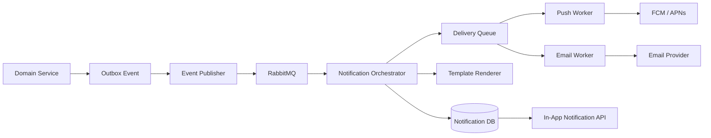
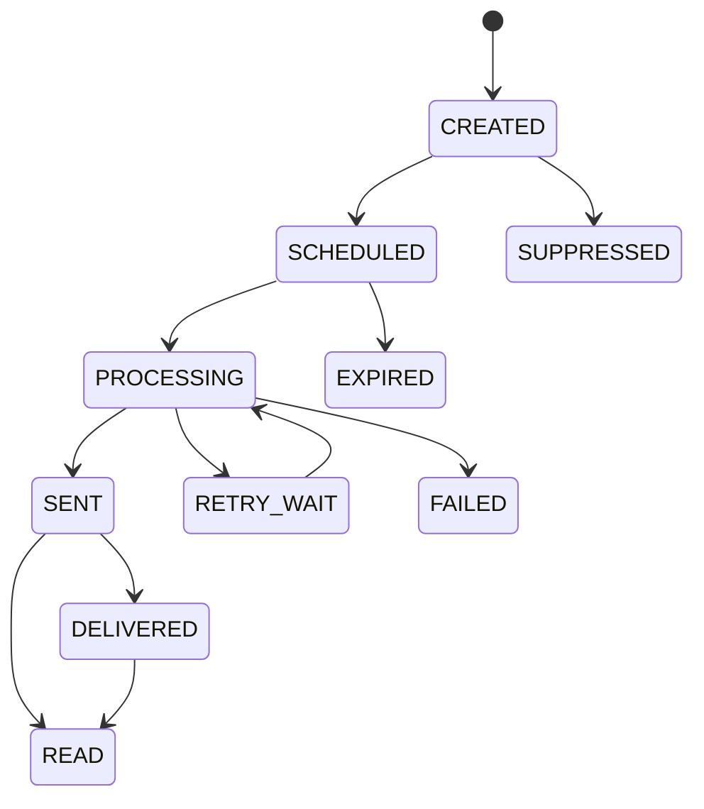

# Notifications

Version: 1.0.0  
Status: Active Draft  
Owners: Architecture, Backend Engineering, Mobile Engineering  
Last reviewed: 2026-07-14

## 1. Purpose

This document defines the notification architecture for KidsAudioBookPlatform. It covers in-app notifications, mobile push notifications, email, administrative announcements, delivery preferences, persistence, templates, scheduling, retries, observability, security, and future extensibility.

The system must provide useful communication without becoming intrusive. Notifications are primarily addressed to parents or account holders. Child-facing communication must be carefully controlled, age-appropriate, non-commercial, and presented inside the child experience rather than through unrestricted external messaging.

## 2. Product principles

1. Notifications must be relevant and understandable.
2. The parent remains in control of communication preferences.
3. Marketing is never mixed silently with transactional communication.
4. No notification should pressure or manipulate a child.
5. Important account, safety, and subscription events must remain visible in-app.
6. Delivery failures must not block the business transaction that generated the notification.
7. Notifications are persisted before external delivery is attempted.
8. Duplicate delivery must be prevented through idempotency.
9. Every notification type has a documented audience, channel, and priority.
10. Quiet hours and locale are respected.

## 3. Supported channels

| Channel | Primary use |
|---|---|
| In-app inbox | Durable account communication, announcements, subscription and content updates |
| Push notification | Timely reminders and important updates on registered mobile devices |
| Email | Account verification, password reset, receipts or important account communication |
| Admin banner | Platform-wide or targeted operational announcements |
| Child experience card | Safe, non-commercial prompts such as continuing a story |

SMS is not part of the MVP. It may be introduced later only through an approved architecture decision and privacy review.

## 4. Notification categories

### 4.1 Security and account

Examples:

- email verification;
- password changed;
- suspicious login or new device;
- account blocked or restored;
- data-export ready;
- account-deletion status.

These are high-priority and usually cannot be fully disabled when required for account security.

### 4.2 Subscription and billing

Examples:

- trial started;
- trial ending;
- subscription activated;
- renewal confirmed;
- renewal failed;
- subscription expired;
- entitlement restored;
- refund or revocation processed.

Messages must accurately reflect store-provider state and must not claim a payment succeeded before verification.

### 4.3 Content and listening

Examples:

- new story in a followed series;
- new curated collection;
- downloaded content changed or expired;
- a previously unavailable story is available again;
- optional parent-controlled listening reminder.

Child-facing prompts are generated locally or through safe in-app content and must not expose subscription pressure.

### 4.4 Administrative and operational

Examples:

- maintenance announcement;
- terms or privacy-policy update;
- regional service disruption;
- important content correction;
- support response.

### 4.5 Marketing

Examples:

- premium offer;
- seasonal campaign;
- discount;
- re-engagement communication.

Marketing requires explicit preference handling and must be independently opt-out capable. It must never be sent directly to a child profile.

## 5. Priority levels

| Priority | Meaning | Typical channels |
|---|---|---|
| Critical | Security, legal, severe service or account event | In-app, push, email as required |
| High | Subscription failure, account action, important support response | In-app and push/email |
| Normal | New content, reminders, routine updates | In-app and optionally push |
| Low | Marketing, non-urgent discovery | In-app or opted-in push/email |

Priority influences delivery ordering and retry policy, not authorization or consent.

## 6. High-level architecture



Business services do not call push or email providers directly. They publish a domain event through the transactional outbox. The notification component consumes the event, determines eligibility, persists the notification, and schedules deliveries.

## 7. Core components

### Notification Orchestrator

Responsible for:

- consuming notification-relevant events;
- resolving recipients;
- checking preferences and legal requirements;
- selecting channels;
- choosing locale and template version;
- creating durable notification records;
- creating delivery attempts;
- enforcing idempotency and deduplication.

### Template Renderer

Responsible for rendering channel-specific content from approved templates and safe structured variables. Templates must not execute arbitrary code.

### Delivery Workers

Channel-specific workers send push or email messages, classify provider results, schedule retries, and update delivery state.

### Notification API

Provides the authenticated account with paginated notification lists, unread count, mark-as-read operations, and preference management.

### Device Registry

Stores mobile push tokens and device metadata in a secure, revocable form.

## 8. Domain model

Recommended entities:

### `notification`

- `id`
- `account_id`
- `profile_id` nullable
- `type`
- `category`
- `priority`
- `title`
- `body`
- `deep_link`
- `image_asset_id` nullable
- `locale`
- `created_at`
- `available_from`
- `expires_at` nullable
- `read_at` nullable
- `dismissed_at` nullable
- `source_event_id`
- `template_key`
- `template_version`
- `metadata_json` containing only safe structured values

### `notification_delivery`

- `id`
- `notification_id`
- `channel`
- `destination_reference`
- `status`
- `attempt_count`
- `next_attempt_at`
- `provider_message_id` nullable
- `failure_code` nullable
- `created_at`
- `sent_at` nullable
- `delivered_at` nullable when supported

### `notification_preference`

- `account_id`
- `category`
- `channel`
- `enabled`
- `quiet_hours_start`
- `quiet_hours_end`
- `timezone`
- `updated_at`

### `device_registration`

- `id`
- `account_id`
- `device_id_hash`
- `platform`
- `push_token_encrypted`
- `app_version`
- `locale`
- `timezone`
- `enabled`
- `last_seen_at`
- `created_at`
- `revoked_at` nullable

## 9. Notification lifecycle



Not every provider reports `DELIVERED`. `SENT` means accepted by the provider, not necessarily displayed on a device.

In-app notifications are available once persisted and their `available_from` timestamp is reached.

## 10. Event contract

A notification-relevant event includes sufficient facts, not rendered user-facing text.

```json
{
  "eventId": "b8b6790b-53f3-4db3-89b4-1a0b8fb3c150",
  "eventType": "SUBSCRIPTION_TRIAL_ENDING",
  "occurredAt": "2026-07-14T18:00:00Z",
  "correlationId": "c9a1f63b-0e42-4ca3-bd20-391612f6ed0e",
  "accountId": "770cce6c-4995-46e2-b50c-3625b19789fe",
  "data": {
    "trialEndDate": "2026-07-16",
    "store": "GOOGLE_PLAY"
  },
  "schemaVersion": 1
}
```

Rendered text is owned by the notification system to ensure localization, wording control, and template versioning.

## 11. Idempotency and deduplication

Every source event has a globally unique `eventId`. The orchestrator stores processed event IDs. Reprocessing the same event must not create another logical notification.

Additional deduplication keys may be used for scheduled or repeated reminders:

```text
{notificationType}:{accountId}:{businessReference}:{effectiveDate}
```

Examples:

- one trial-ending reminder per account and trial period;
- one new-episode notification per account and episode;
- one maintenance announcement per targeted account.

Provider retries must reuse the same logical delivery where supported.

## 12. Recipient resolution

The account is the primary notification recipient. A profile reference may be included when the message relates to a child profile, but the message remains visible to the parent account.

Recipient resolution must verify:

- the account is active;
- the event belongs to that account;
- the category is allowed;
- the selected channel is enabled;
- the destination is verified and valid;
- the notification has not expired;
- legal or security rules do not require delivery regardless of optional preferences.

No child email or phone destination is stored for the MVP.

## 13. Preferences and consent

Preferences are category and channel specific.

Suggested categories:

- `SECURITY`
- `ACCOUNT`
- `SUBSCRIPTION`
- `CONTENT_UPDATES`
- `LISTENING_REMINDERS`
- `PRODUCT_ANNOUNCEMENTS`
- `MARKETING`

Security and legally required account communication may be mandatory. Optional categories must be easy to disable.

Preference changes are audited at an aggregate level. Marketing consent must store source, timestamp, policy version, and withdrawal timestamp where required.

## 14. Quiet hours

Quiet hours apply to non-critical push and optional email communication.

Rules:

- use the account's selected timezone;
- if none exists, use the most recently known device timezone cautiously;
- critical security notifications may bypass quiet hours;
- scheduled messages are delayed until quiet hours end;
- expiration is checked before delayed delivery;
- daylight-saving changes must be handled by timezone identifiers, not fixed UTC offsets.

The suggested default quiet period is 21:00-08:00 local time, but the product decision may vary.

## 15. Localization

Templates are localized using BCP 47 language tags such as `ro-RO` and `en-US`.

Locale resolution order:

1. explicit account communication language;
2. current application locale;
3. supported language fallback;
4. English fallback only when approved.

Templates use named parameters, not positional string concatenation.

```text
Hello {{parentDisplayName}}, a new episode is available in {{seriesTitle}}.
```

Variables must be escaped for the target channel. Missing mandatory variables cause rendering failure and must not produce a malformed message.

## 16. Template governance

Each template has:

- stable key;
- version;
- category;
- supported channels;
- locale;
- title and body;
- required variables;
- deep-link policy;
- review status;
- activation date;
- owner.

Template changes must be reviewable and versioned. Historical notifications keep their rendered text and template version.

Admin-authored announcements use restricted template forms and sanitized input. Arbitrary HTML is prohibited unless a safe renderer and sanitizer are explicitly approved.

## 17. Push notifications

Firebase Cloud Messaging is the preferred abstraction for Android and may be used for iOS delivery through APNs integration.

Push payloads should be small and contain:

- notification ID;
- type;
- safe title/body or a localization key when appropriate;
- deep link;
- optional image URL from an approved domain;
- no sensitive account data.

Example:

```json
{
  "notification": {
    "title": "O poveste nouă te așteaptă",
    "body": "A apărut un episod nou în seria preferată."
  },
  "data": {
    "notificationId": "68c04c45-1454-47c8-a512-59d26ca3c086",
    "type": "NEW_EPISODE",
    "deepLink": "kidsaudio://series/3b2f..."
  }
}
```

Push notifications must not reveal sensitive subscription or security details on a locked screen unless wording is intentionally generic.

Invalid or unregistered tokens are revoked after provider confirmation.

## 18. Email

Email is used for verified account destinations. The provider integration must support:

- transactional templates;
- message IDs;
- bounce and complaint webhooks;
- suppression handling;
- domain authentication;
- rate limits;
- delivery metrics.

Email links must use secure, expiring tokens for verification or password reset. Tokens must not be stored in plaintext in logs or the notification body persisted for long-term access.

Marketing emails require unsubscribe support that does not require login.

## 19. In-app inbox

The in-app inbox is the durable presentation layer for notifications.

Required API capabilities:

```text
GET    /api/v1/notifications
GET    /api/v1/notifications/unread-count
PATCH  /api/v1/notifications/{id}/read
POST   /api/v1/notifications/read-all
PATCH  /api/v1/notifications/{id}/dismiss
GET    /api/v1/notification-preferences
PUT    /api/v1/notification-preferences
```

Lists use cursor or keyset pagination ordered by creation time and ID. Access is restricted to the authenticated account.

Mark-as-read operations are idempotent.

## 20. Deep links

Every deep link must map to an allow-listed application route. The mobile client validates links before navigation.

Examples:

- `kidsaudio://story/{storyId}`
- `kidsaudio://series/{seriesId}`
- `kidsaudio://parent/subscription`
- `kidsaudio://parent/notifications/{notificationId}`

Do not embed arbitrary web URLs from event data. External links require an approved domain allow list and should open only from the Parent Zone.

## 21. Scheduling

Scheduled notifications are persisted with `available_from` and processed by a scheduler or delayed queue strategy.

Use cases:

- trial-ending reminder;
- optional bedtime reminder;
- scheduled announcement;
- campaign start;
- delayed retry after provider throttling.

Scheduling must remain correct after process restart and horizontal scaling. Database-backed claiming or a distributed scheduler must prevent duplicate execution.

## 22. Retry policy

Retries apply to transient failures only.

Transient examples:

- provider timeout;
- HTTP 429;
- temporary 5xx response;
- connection failure.

Permanent examples:

- invalid push token;
- unverified email when verification is required;
- unsupported destination;
- rejected template;
- unauthorized provider credentials until configuration is fixed.

Use exponential backoff with jitter and a bounded number of attempts. Critical notifications may use a longer retry horizon than low-priority marketing messages.

After retries are exhausted, the delivery becomes `FAILED`, remains visible operationally, and may enter a dead-letter queue.

## 23. Ordering

Strict global ordering is not required. Ordering is maintained where business meaning depends on it, for example subscription state changes for the same account.

Consumers may use account or business-reference partitioning and state checks. A delayed event must not create a misleading notification if a newer state already supersedes it.

Example: do not send `SUBSCRIPTION_EXPIRED` if a later verified event already restored the subscription.

## 24. Rate limiting and fatigue control

The system protects users from excessive communication.

Controls include:

- maximum optional pushes per account per day;
- campaign frequency caps;
- deduplication windows;
- quiet hours;
- suppression after repeated non-engagement where appropriate;
- batching multiple low-priority content updates into one digest;
- channel preference enforcement.

Security and essential account messages are excluded from marketing caps but must still be concise.

## 25. Admin announcements

Authorized administrators can create targeted announcements based on safe criteria such as:

- locale;
- platform;
- application version;
- subscription tier;
- region where legally appropriate;
- affected service cohort.

The dashboard must provide:

- draft and approval workflow;
- preview per locale and channel;
- estimated recipient count;
- scheduling;
- cancellation before dispatch;
- delivery metrics;
- audit history.

High-impact announcements require a second approval role in a future mature stage.

## 26. Security

- Push tokens are encrypted at rest.
- Provider credentials are stored in secret management, not source control.
- Notification APIs enforce account ownership.
- Template variables are allow-listed and escaped.
- Deep links are allow-listed.
- Webhook signatures from providers are verified.
- Email verification and reset tokens are single-purpose and expiring.
- Logs never contain full tokens, credentials, or sensitive message bodies.
- Admin announcement permissions are separated from general content editing.

## 27. Privacy and child safety

- No advertising notification is addressed to a child profile.
- No child name appears in lock-screen push text by default.
- Child-listening behavior is not exposed in unnecessarily detailed marketing segmentation.
- Notification analytics are aggregated and minimized.
- Optional reminders are controlled by the parent.
- Data retention follows the platform privacy policy.
- Account deletion removes or anonymizes device registrations and optional communication records according to legal retention requirements.

## 28. Observability

Required metrics:

- notifications created by type and category;
- notifications suppressed by reason;
- delivery attempts by channel;
- provider acceptance and failure ratio;
- retry count;
- dead-letter count;
- oldest pending delivery age;
- invalid push-token count;
- email bounce and complaint rate;
- in-app unread count distribution at aggregate level;
- deep-link open rate where consent and analytics policy permit.

Required log fields:

- notification ID;
- event ID;
- account ID where operationally necessary;
- channel;
- template key/version;
- attempt count;
- provider result code;
- correlation ID;
- duration.

Do not log complete rendered content by default.

## 29. Alerts

Alert on:

- critical notification queue lag;
- provider failure ratio above threshold;
- dead-letter growth;
- invalid credential or authentication failures;
- scheduler not running;
- abnormal invalid-token spike;
- email bounce or complaint rate above safe threshold;
- persistent database write failure;
- notification creation drop for expected critical events.

Alerts must link to a runbook and dashboard.

## 30. Testing

### Unit tests

- recipient resolution;
- preference evaluation;
- quiet-hour calculation;
- template validation;
- deduplication key generation;
- retry classification;
- state transitions.

### Integration tests

- outbox to RabbitMQ;
- event consumption and persistence;
- device registration;
- provider adapter with WireMock or fake provider;
- webhook verification;
- database concurrency and claiming;
- idempotent event reprocessing.

### Contract tests

- event schemas;
- provider adapter contracts;
- mobile notification payload;
- public API response format.

### End-to-end tests

- subscription event creates in-app and push notification;
- disabled marketing preference suppresses delivery;
- quiet hours delay non-critical push;
- invalid token is revoked;
- duplicate event creates one logical notification;
- read state synchronizes across devices.

## 31. Failure behavior

| Failure | Required behavior |
|---|---|
| RabbitMQ unavailable | Source transaction succeeds with outbox record; publication resumes later |
| Notification DB unavailable | Consumer retries without acknowledging message |
| Push provider unavailable | Persist delivery and retry asynchronously |
| Email provider unavailable | Persist delivery and retry asynchronously |
| Template missing | Suppress delivery, raise error metric, preserve event for investigation |
| User preference unavailable | Fail safely according to category; do not send optional marketing |
| Invalid token | Revoke token and stop retrying that destination |
| Mobile offline | In-app notification remains available after synchronization |

## 32. API response example

```json
{
  "items": [
    {
      "id": "68c04c45-1454-47c8-a512-59d26ca3c086",
      "type": "NEW_EPISODE",
      "category": "CONTENT_UPDATES",
      "title": "Un episod nou este disponibil",
      "body": "Seria preferată are o poveste nouă.",
      "deepLink": "kidsaudio://series/3b2f...",
      "createdAt": "2026-07-14T18:00:00Z",
      "read": false
    }
  ],
  "nextCursor": "eyJjcmVhdGVkQXQiOi..."
}
```

## 33. Implementation sequence

1. Create notification, delivery, preference, and device-registration tables.
2. Define event envelope and outbox integration.
3. Implement notification orchestrator and in-app persistence.
4. Implement notification API and unread count.
5. Add device registration and FCM push adapter.
6. Add preferences and quiet hours.
7. Add email adapter for mandatory transactional cases.
8. Add templates and localization governance.
9. Add admin announcements.
10. Add dashboards, alerts, dead-letter management, and operational runbooks.

## 34. Anti-patterns

The following are prohibited:

- calling FCM or email directly inside a business transaction;
- storing only push delivery without an in-app record for important account messages;
- sending marketing without preference checks;
- using child names in lock-screen messages;
- placing arbitrary URLs in deep links;
- retrying invalid tokens indefinitely;
- rendering text inside every source service;
- treating provider acceptance as confirmed user delivery;
- using notification delivery as the only source of subscription truth;
- creating unbounded campaigns without recipient estimation and rate controls.

## 35. Future evolution

Possible future capabilities include:

- parent-configurable digests;
- richer inbox actions;
- multi-parent household recipients;
- experimentation over approved non-critical templates;
- advanced segmentation with privacy safeguards;
- customer-support conversation notifications;
- additional regional channels;
- provider failover.

Any new channel or child-facing communication model requires security, privacy, product, and architecture review.