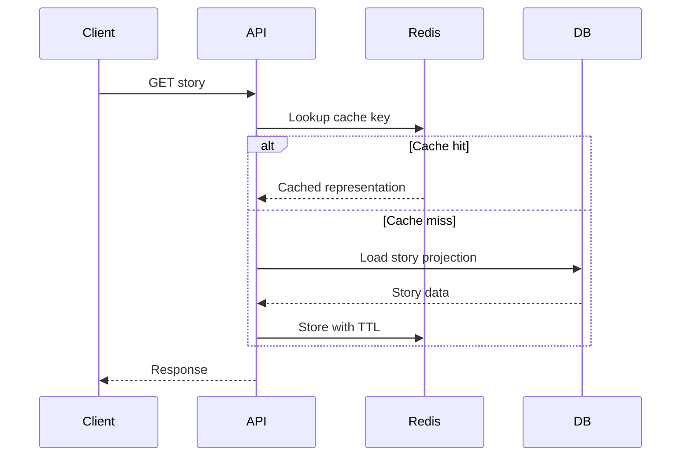

# Performance Guidelines

Version: 1.0.0  
Status: Active Draft  
Owners: Architecture and Backend Engineering  
Last reviewed: 2026-07-14

## 1. Purpose

This document defines the performance, scalability, efficiency, and capacity-engineering rules for KidsAudioBookPlatform. It applies to the Spring Boot backend, Flutter mobile application, admin dashboard, PostgreSQL, Redis, RabbitMQ, object storage, CDN, and supporting infrastructure.

Performance is treated as a product capability. The platform must feel immediate for children, predictable for parents, and operable for administrators. A technically successful request that arrives too late is still a failed user experience.

## 2. Performance principles

1. Measure before optimizing.
2. Protect user-facing latency before background throughput.
3. Keep synchronous request paths short.
4. Cache stable and frequently requested data.
5. Paginate every unbounded collection.
6. Move expensive, non-interactive work to asynchronous processing.
7. Prefer simple, observable solutions over premature distributed complexity.
8. Establish explicit service-level objectives before launch.
9. Design for graceful degradation.
10. Treat database efficiency as part of application design.

## 3. Primary user journeys

The following journeys receive the highest performance priority:

| Journey | Expected behavior |
|---|---|
| Open child home | Personalized content should appear without visible blocking |
| Open story details | Metadata and artwork should load quickly |
| Start playback | Audio should begin with minimal delay |
| Resume story | Saved progress should restore accurately and quickly |
| Browse catalog | Pagination and filtering should remain responsive |
| Switch child profile | Profile context should update immediately |
| Validate premium access | Entitlement checks should not noticeably delay playback |
| Save progress | Updates should be reliable without interrupting audio |
| Open Parent Zone | Authentication and data loading should remain predictable |
| Use admin dashboard | Large datasets must remain paginated and searchable |

## 4. Initial service-level objectives

These are starting targets and must be validated using production-like tests.

| Capability | Target |
|---|---:|
| API availability | 99.9% monthly for core user APIs |
| Read API p50 | <= 150 ms |
| Read API p95 | <= 400 ms |
| Read API p99 | <= 900 ms |
| Write API p95 | <= 700 ms |
| Authentication p95 | <= 800 ms |
| Catalog query p95 | <= 500 ms |
| Progress update p95 | <= 400 ms |
| Admin query p95 | <= 1,000 ms |
| Background event processing | 95% within 30 seconds |
| Push notification dispatch | 95% within 60 seconds |
| Playback start on good network | <= 2 seconds |

The backend must expose metrics that allow these targets to be calculated by endpoint, status code, and service.

## 5. Performance budgets

Each feature must have a performance budget before implementation. The budget includes:

- maximum synchronous downstream calls;
- maximum database queries;
- maximum response size;
- maximum payload size;
- cache strategy;
- expected throughput;
- acceptable failure behavior;
- timeout and retry policy.

A normal mobile API request should avoid more than two synchronous internal dependencies. Fan-out to many services is prohibited on critical paths unless an aggregation layer, read model, or cache is used.

## 6. Backend request-path rules

Controllers must perform transport concerns only. Business work belongs in application services. Database access must be explicit and observable.

For every endpoint:

- define a timeout;
- validate input before costly operations;
- reject impossible requests early;
- avoid N+1 database access;
- avoid loading entire aggregates when a projection is sufficient;
- use bounded result sets;
- avoid synchronous media processing;
- avoid synchronous notification delivery;
- include correlation and trace context.

External calls must use connection pooling, bounded timeouts, and circuit breakers where appropriate. Infinite waits are not permitted.

## 7. Database performance

PostgreSQL is the source of truth for transactional business data. Performance depends on schema design, query discipline, and operational maintenance.

### 7.1 Query rules

- Every list query must be paginated.
- Prefer keyset pagination for large or frequently updated datasets.
- Use offset pagination only for small administrative lists or where page-number navigation is essential.
- Select only required columns.
- Use DTO projections for read-heavy endpoints.
- Inspect generated SQL for important JPA queries.
- Use batch writes where atomicity and business rules permit.
- Avoid database calls inside loops.
- Avoid wildcard searches over large unindexed text fields.
- Use PostgreSQL full-text or a dedicated search engine when requirements justify it.

### 7.2 Indexing

Every index must support an identified query. Candidate indexes include:

- active stories by publication status and language;
- episodes by series and sequence;
- progress by child profile and story;
- notifications by account, read state, and creation time;
- subscriptions by account and status;
- audit entries by actor and creation time;
- outbox events by publication state and creation time.

Composite index column order must reflect filtering and sorting patterns. Indexes must be reviewed because excessive indexing slows writes and increases storage.

### 7.3 Query review thresholds

A query requires investigation when it:

- exceeds 100 ms under normal production-like load;
- performs a sequential scan over a large table unexpectedly;
- returns substantially more rows than the API uses;
- appears repeatedly in one request;
- causes lock waits;
- grows non-linearly with dataset size.

Use `EXPLAIN (ANALYZE, BUFFERS)` in non-production environments with representative data.

### 7.4 Connection pools

Database pools must be bounded. Pool size is not increased merely to hide slow queries. Configure:

- connection timeout;
- idle timeout;
- maximum lifetime below infrastructure termination limits;
- leak detection in testing and staging;
- pool utilization metrics.

The sum of all application pools must remain safely below the database connection limit.

## 8. Redis caching

Redis is an acceleration and coordination component, not the source of truth.

Good cache candidates:

- published story metadata;
- category and collection definitions;
- entitlement snapshots with short TTLs;
- feature flags and configuration;
- rate-limit counters;
- short-lived session or verification data;
- frequently requested home-page read models.

Do not cache secrets, raw payment information, or mutable data without a clear invalidation strategy.

### 8.1 Cache patterns

Use cache-aside by default:

Rules:

- include version and locale in keys where relevant;
- add TTL jitter to reduce synchronized expiry;
- invalidate or replace cache entries after authoritative writes;
- protect hot keys;
- monitor hit ratio, memory use, evictions, and latency;
- define behavior when Redis is unavailable.

A cache failure must not cause a total platform outage for data that can still be retrieved from PostgreSQL.

## 9. Media delivery

Audio and illustration bytes must not normally pass through the Spring Boot application. Use object storage and CDN delivery with controlled signed URLs.

The backend is responsible for:

- authorization;
- entitlement validation;
- media metadata;
- signed URL generation;
- audit and analytics events.

The CDN/object-storage path is responsible for efficient byte delivery, range requests, and geographic distribution.

Media rules:

- provide audio formats and bitrates appropriate for mobile use;
- support HTTP range requests;
- keep artwork dimensions aligned with UI needs;
- generate thumbnails and derivatives asynchronously;
- use immutable versioned media keys;
- configure long cache lifetimes for immutable assets;
- never overwrite an object while retaining the same public cache key.

## 10. Asynchronous processing

Use RabbitMQ and background workers for operations that do not need to complete before the user receives a response:

- media validation and transcoding;
- notification dispatch;
- analytics aggregation;
- search indexing;
- subscription reconciliation;
- content publication side effects;
- cleanup and retention jobs;
- administrative exports.

Consumers must be idempotent. Queues must have bounded retry policies, dead-letter handling, and observable lag.

Back-pressure is mandatory. A worker must not accept unlimited work when downstream services are degraded.

## 11. API payload efficiency

Responses must be designed for mobile networks.

- Do not return internal persistence models.
- Avoid deeply nested documents.
- Provide summaries for list endpoints and details for detail endpoints.
- Compress text responses at the gateway or server.
- Avoid base64 media in JSON.
- Use stable identifiers and signed media URLs.
- Support conditional requests for stable public metadata where useful.
- Use field-specific endpoints only when they reduce meaningful cost, not as arbitrary fragmentation.

Recommended default maximum page size is 50. Public catalog endpoints should normally default to 20. Admin endpoints may allow larger pages with a documented upper bound.

## 12. Mobile performance

Flutter performance is part of the architecture.

Requirements:

- avoid unnecessary widget rebuilds;
- keep heavy parsing and image processing off the UI thread;
- use lazy lists for catalog screens;
- cache artwork responsibly;
- prefetch only the next likely content, not the entire catalog;
- persist playback progress locally before synchronization;
- use optimistic UI where failure can be safely reconciled;
- avoid re-downloading unchanged assets;
- measure cold start, warm start, frame time, memory, and battery impact.

The child experience must remain usable during temporary network degradation. Previously downloaded premium content must continue to work according to entitlement and offline-license rules.

## 13. Admin dashboard performance

The dashboard must assume datasets will grow.

- Server-side filtering, sorting, and pagination are required.
- Exports run asynchronously.
- Dashboards use pre-aggregated metrics where appropriate.
- Autocomplete queries must be debounced.
- Large images and audio files are uploaded directly to object storage using controlled upload sessions.
- Long-running tasks must display status rather than hold an HTTP request open.

## 14. Resilience and graceful degradation

Performance incidents often become availability incidents. The system must degrade intentionally.

Examples:

- if recommendation logic fails, show curated or popular content;
- if Redis is unavailable, fall back to PostgreSQL for essential reads;
- if notifications are delayed, persist them for later delivery;
- if analytics is unavailable, do not block playback;
- if the subscription provider is temporarily unavailable, use a recently verified entitlement according to documented grace rules;
- if artwork fails, show a safe placeholder without blocking audio.

## 15. Timeouts, retries, and circuit breakers

Timeouts must be shorter than caller timeouts. Retries are allowed only for transient and idempotent operations.

Do not retry:

- validation failures;
- authorization failures;
- deterministic business-rule failures;
- non-idempotent writes without an idempotency key.

Use exponential backoff with jitter. Cap attempts. Record retry counts. Open a circuit when a dependency is persistently failing to avoid exhausting threads and connections.

## 16. Capacity planning

Before production launch, estimate:

- registered accounts;
- active child profiles;
- daily and monthly active users;
- peak concurrent playback sessions;
- API requests per second;
- progress updates per minute;
- notification volume;
- audio storage and egress;
- database growth;
- audit and event retention;
- backup volume and restore duration.

Capacity assumptions must be versioned and reviewed after real usage data becomes available.

## 17. Load and performance testing

Required test categories:

| Test | Purpose |
|---|---|
| Baseline | Establish normal latency and resource use |
| Load | Validate expected peak traffic |
| Stress | Identify failure point and bottlenecks |
| Spike | Validate sudden traffic changes |
| Soak | Detect leaks and degradation over time |
| Scalability | Confirm added resources improve capacity |
| Failover | Validate dependency loss and recovery |

Use production-like data sizes. A test with an empty database is not representative. Test plans must include login, catalog browsing, story detail, entitlement checks, progress writes, notifications, and administrative operations.

Performance tests must report:

- throughput;
- p50, p95, and p99 latency;
- error rate;
- CPU and memory;
- garbage collection;
- thread and connection pools;
- database latency and locks;
- Redis hit ratio;
- RabbitMQ queue depth and processing lag.

## 18. JVM and Spring Boot guidance

- Use Java 21 supported collectors and defaults unless measurements justify changes.
- Set explicit container memory limits.
- Leave headroom for native memory, threads, direct buffers, and metaspace.
- Monitor pause time and allocation rate.
- Avoid unbounded executor queues.
- Use virtual threads only after validating library compatibility and workload behavior.
- Keep blocking operations out of event-loop threads.
- Do not tune the JVM from copied internet settings without measurement.

## 19. Observability requirements

Every production component must expose:

- request count and latency;
- error count;
- saturation metrics;
- dependency latency;
- database pool utilization;
- cache hit and eviction metrics;
- queue depth and consumer lag;
- media signing failures;
- playback-start indicators where measurable;
- business metrics such as completed stories and failed entitlement checks.

Dashboards must separate client errors from server errors and show percentiles rather than averages alone.

## 20. Performance review checklist

Before merging a feature:

- Is the main request path bounded?
- Are lists paginated?
- Is query count known?
- Are required indexes documented?
- Is the response payload appropriately sized?
- Is caching justified and invalidation defined?
- Can expensive work be asynchronous?
- Are timeouts and retries explicit?
- Are metrics and alerts included?
- Has behavior under dependency failure been defined?
- Is a load-test scenario required?

## 21. Anti-patterns

The following are prohibited without an approved architecture decision:

- loading all rows and filtering in Java;
- returning unbounded collections;
- using Redis as an undocumented primary database;
- sending audio through application memory;
- synchronous email or push delivery in user requests;
- retrying all exceptions automatically;
- increasing thread or connection pools without identifying bottlenecks;
- caching data forever without versioning or invalidation;
- optimizing code paths without measurement;
- relying on average latency as the only indicator.

## 22. Evolution

Performance targets will evolve with traffic, geography, content volume, device diversity, and product maturity. Changes to critical budgets, caching rules, storage delivery, or scalability strategy must be recorded in an ADR and reflected in automated tests and dashboards.