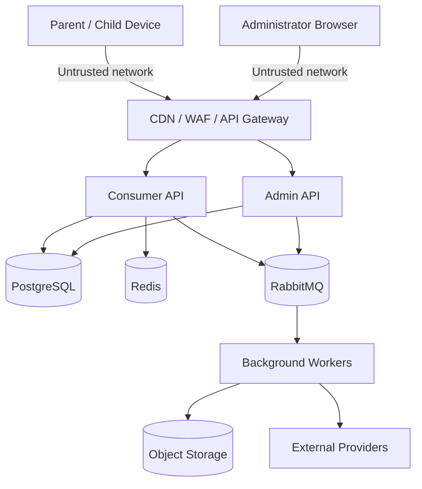
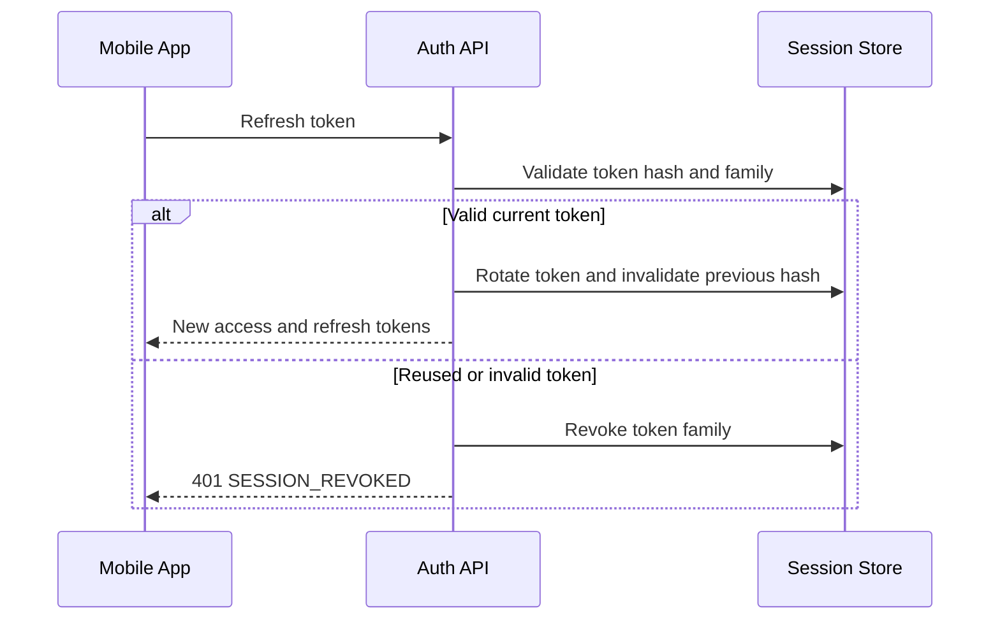
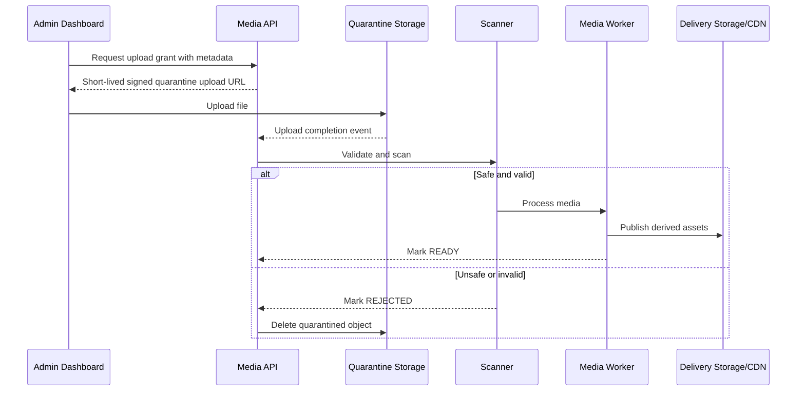

# Security Architecture

Version: 1.1.0  
Status: Draft for implementation  
Owner: Platform Architecture and Security  
Last updated: 2026-07-14

## 1. Purpose

This document defines the security architecture of KidsAudioBookPlatform. It establishes the mandatory controls for the Flutter mobile application, the administrative dashboard, backend services, databases, object storage, messaging, CI/CD, and production operations.

The platform is designed for families and children. Security and privacy are therefore product requirements, not optional infrastructure concerns. The implementation must minimize collected child data, isolate child-facing experiences from privileged parent and administrative functions, and provide strong auditability for sensitive operations.

This document is normative. When a requirement uses **must**, it is mandatory unless superseded by an approved Architecture Decision Record.

## 2. Scope

This specification covers:

- parent and administrator authentication;
- child-profile context and authorization;
- Parent Zone protection;
- session and token lifecycle;
- API, mobile, dashboard, database, messaging, and media security;
- upload and object-storage controls;
- secrets and cryptographic key management;
- logging, audit, monitoring, and incident response;
- secure development and release controls;
- privacy and data-retention requirements;
- third-party and supply-chain security.

It does not define legal policy text or replace a formal data-protection impact assessment.

## 3. Security Objectives

The platform must protect the following outcomes:

1. Only authorized adults can access account, payment, subscription, and parental settings.
2. Child profiles cannot escape the child experience or access privileged functionality.
3. One family cannot access another family's profiles, progress, downloads, or notifications.
4. Administrative access is explicit, least-privileged, audited, and revocable.
5. Premium entitlements, purchase verification, and content publication cannot be forged by clients.
6. Uploaded media cannot introduce malware or unsafe executable content.
7. Secrets, passwords, PINs, tokens, and personal data are never exposed through logs or source code.
8. Security events are observable and actionable.
9. A compromised component does not automatically compromise the entire platform.
10. Security controls remain practical for a small team and can mature as the platform grows.

## 4. Security Principles

### 4.1 Security and privacy by design

Security requirements are defined before implementation. Sensitive workflows require threat modeling, abuse-case review, and explicit authorization rules.

### 4.2 Least privilege

Every user, service, database role, queue consumer, and CI/CD identity receives only the permissions required for its responsibilities.

### 4.3 Defense in depth

No single control is considered sufficient. Authentication, authorization, network restrictions, validation, rate limiting, encryption, audit, and monitoring work together.

### 4.4 Zero trust between components

Internal traffic is not trusted only because it originates inside a private network. Service identity, transport security, authorization, and input validation remain required.

### 4.5 Deny by default

Unknown routes, roles, file types, permissions, origins, claims, and state transitions are rejected unless explicitly allowed.

### 4.6 Minimize sensitive data

The platform collects only the information needed for product behavior. Child profiles should use nicknames, age bands, or birth year rather than unnecessary legal names or exact dates of birth.

### 4.7 Server-side authority

The backend is authoritative for identity, ownership, publication state, subscriptions, entitlements, ad eligibility, profile limits, and download grants. Client flags are never trusted as proof.

### 4.8 Safe failure

A failed dependency or security check must not silently downgrade authorization. Sensitive operations fail closed.

## 5. Threat Model

### 5.1 Protected assets

Critical assets include:

- parent accounts and credentials;
- administrative accounts and permissions;
- child profiles and preferences;
- listening history and progress;
- subscriptions, purchase receipts, and entitlements;
- unpublished stories and media;
- signed media URLs and offline grants;
- notification data;
- audit records;
- application secrets and signing keys;
- production infrastructure and CI/CD credentials.

### 5.2 Primary threat actors

The design considers:

- unauthenticated internet attackers;
- credential-stuffing and brute-force attackers;
- malicious or compromised users;
- compromised mobile devices;
- malicious uploaded files;
- compromised third-party dependencies;
- over-privileged or malicious administrators;
- accidental disclosure by developers or operators;
- automated bots and abusive clients.

### 5.3 Important abuse cases

The platform must explicitly prevent or detect:

- enumeration of registered email addresses;
- refresh-token replay;
- cross-account access through predictable identifiers;
- child-profile ID substitution;
- bypassing the Parent Zone through direct API calls;
- forged premium status;
- replayed purchase notifications;
- publishing unapproved content;
- downloading premium media without entitlement;
- obtaining long-lived unrestricted media URLs;
- uploading executable or polyglot files disguised as audio or images;
- mass scraping of the catalog or media library;
- administrative bulk actions without audit evidence;
- leakage of tokens, PINs, passwords, or personal data into logs.

## 6. Trust Boundaries



Every transition across a boundary requires authenticated identity where applicable, validated input, explicit authorization, encrypted transport, and observable failure handling.

## 7. Identity Model

### 7.1 Authentication principals

The supported principals are:

- `PARENT` account;
- administrative account with one or more explicit roles;
- internal service identity;
- trusted external provider callback identity.

A child profile is **not** an authentication principal. Child actions execute under an authenticated parent session with an explicitly selected profile context.

### 7.2 Account status

Authentication and authorization must respect account state:

- `PENDING_VERIFICATION`;
- `ACTIVE`;
- `LOCKED`;
- `SUSPENDED`;
- `DELETION_PENDING`;
- `DELETED`.

Locked, suspended, deletion-pending, or deleted accounts must not receive normal authenticated access.

## 8. Password Authentication

Passwords must:

- be hashed using Argon2id or an approved adaptive password-hashing algorithm;
- use unique salts managed by the hashing implementation;
- never be reversibly encrypted;
- never be logged, echoed, or included in audit payloads;
- be checked against reasonable minimum-length and compromised-password policies;
- be protected from unlimited guessing through rate limiting and progressive delays.

Password validation must not impose arbitrary complexity rules that encourage predictable substitutions. Long passphrases are allowed.

Authentication responses must avoid revealing whether an email address is registered.

## 9. JWT Access Tokens

Access tokens are short-lived JWTs signed with asymmetric keys.

Recommended baseline:

- lifetime: 15 minutes;
- signing algorithm: ES256 or RS256;
- key identifier through `kid` header;
- issuer and audience validation required;
- clock-skew tolerance limited and documented;
- no sensitive personal data in claims.

Minimum claims:

```json
{
  "sub": "account-uuid",
  "session_id": "session-uuid",
  "roles": ["PARENT"],
  "iat": 1784058000,
  "exp": 1784058900,
  "iss": "kids-audio-book-platform",
  "aud": "kids-audio-book-mobile"
}
```

The backend must validate signature, algorithm, issuer, audience, expiration, session state, and account state.

Access tokens must not be stored in application logs, analytics, crash reports, URLs, or browser local storage.

## 10. Refresh Tokens and Session Security

Refresh tokens are opaque, high-entropy values and rotate on every successful use.

Mandatory controls:

- raw refresh tokens are never stored server-side;
- token hashes and token-family metadata are stored;
- reuse of an already rotated token revokes the entire token family;
- sessions are device-scoped;
- logout revokes the current session;
- password reset may revoke all sessions;
- suspicious activity can revoke one or all sessions;
- expired and revoked session metadata is retained only as required for security analysis and then purged.



## 11. Parent Zone Security

The Parent Zone protects account settings, subscriptions, parental controls, profile deletion, and other adult-only functions.

### 11.1 Entry controls

Parent Zone entry requires:

- a valid authenticated parent session;
- successful PIN verification or approved biometric unlock on the device;
- server-side issuance of a short-lived parent-zone proof for sensitive API actions.

Biometrics unlock a locally protected credential; they do not replace server authorization.

### 11.2 PIN controls

The PIN must:

- be hashed with an adaptive password-hashing algorithm;
- never be stored or logged in plaintext;
- be protected by rate limits and progressive lockout;
- require recent password authentication for reset where risk warrants it;
- avoid weak default or sequential values where feasible.

### 11.3 Parent-zone proof

A successful challenge issues a short-lived opaque proof bound to:

- account;
- session;
- device;
- allowed action scope where practical;
- expiration time.

Recommended lifetime: five minutes.

The proof must be invalidated by logout, session revocation, password change, or PIN change.

## 12. Authorization

### 12.1 Role-based access control

Initial administrative roles:

- `SUPPORT_AGENT`;
- `CONTENT_EDITOR`;
- `CONTENT_REVIEWER`;
- `BILLING_ADMIN`;
- `PLATFORM_ADMIN`.

Permissions are explicit and narrowly scoped. Broad wildcard permissions should be avoided.

### 12.2 Resource ownership

Every account-scoped operation must derive the account ID from the authenticated principal. Client-supplied account identifiers are not trusted.

For profile-scoped operations, the backend verifies:

1. the profile exists;
2. it belongs to the authenticated parent account;
3. it is active;
4. the operation is allowed for the current entitlement and parental settings.

### 12.3 Administrative separation of duties

High-impact workflows should support separation of duties where appropriate:

- an editor may prepare content;
- a reviewer approves or rejects content;
- publication is audited;
- exceptional billing overrides require an explicit permission and reason.

### 12.4 Method-level authorization

Controllers and use cases must enforce authorization. UI visibility is never treated as a security control.

## 13. API Security

All APIs must use HTTPS. The edge should enforce modern TLS and reject obsolete protocols and weak cipher suites.

Mandatory controls:

- explicit route authorization;
- strict request-body size limits;
- JSON schema and Bean Validation checks;
- domain validation after transport validation;
- idempotency for retry-sensitive commands;
- consistent error responses without stack traces;
- correlation IDs that contain no personal data;
- rate limiting by endpoint risk, principal, IP range, and device where appropriate;
- allow-listed HTTP methods and content types;
- safe timeouts for downstream dependencies.

Sensitive values must never appear in query parameters.

## 14. Input Validation

Validation occurs at multiple layers:

1. edge validation for protocol and size;
2. transport validation for shape and type;
3. domain validation for business rules;
4. persistence constraints for critical invariants.

Input handling must account for:

- Unicode normalization;
- maximum string lengths;
- integer and duration bounds;
- invalid enum values;
- duplicate identifiers;
- unexpected JSON properties according to API policy;
- malicious regular-expression input;
- path traversal sequences;
- oversized nested payloads;
- unsafe URLs and redirects.

## 15. OWASP-Oriented Controls

### 15.1 Broken access control

Prevented through deny-by-default routing, method-level authorization, ownership validation, profile scoping, role tests, and authorization integration tests.

### 15.2 Cryptographic failures

Prevented through managed TLS, approved algorithms, secure key storage, key rotation, encrypted backups, and prohibition of custom cryptography.

### 15.3 Injection

Prevented through parameterized queries, ORM bindings, allow-listed sorting and filtering fields, safe command execution, and output encoding.

### 15.4 Insecure design

Mitigated through threat modeling, abuse cases, ADR review, secure defaults, and security acceptance criteria.

### 15.5 Security misconfiguration

Mitigated through hardened production profiles, disabled debug endpoints, minimal container images, automated configuration checks, and environment separation.

### 15.6 Vulnerable components

Mitigated through dependency scanning, lockfiles or dependency management, SBOM generation, patch SLAs, and removal of unused libraries.

### 15.7 Authentication failures

Mitigated through token rotation, rate limiting, secure password storage, session revocation, and anomaly monitoring.

### 15.8 Integrity failures

Mitigated through signed artifacts, protected CI/CD, reviewed dependencies, checksums, and controlled deployment identities.

### 15.9 Logging and monitoring failures

Mitigated through structured security events, dashboards, alerts, immutable audit records, and tested response playbooks.

### 15.10 SSRF

Outbound network calls use allow-listed destinations, validated URLs, DNS and IP restrictions, strict timeouts, and no access to cloud metadata endpoints.

## 16. SQL Injection and Persistence Security

The backend must use:

- parameterized queries;
- Spring Data bindings;
- allow-listed dynamic sort columns;
- no concatenated user input in native SQL;
- dedicated least-privilege database roles;
- migration credentials separate from runtime credentials.

Database error details must not be exposed to clients.

## 17. XSS, HTML, and Dashboard Security

The administrative dashboard must treat all backend content as untrusted.

Controls include:

- framework-default output encoding;
- no unsafe HTML rendering without sanitization;
- Content Security Policy;
- `HttpOnly`, `Secure`, and appropriate `SameSite` cookie attributes when cookies are used;
- protection against DOM-based injection;
- no secrets in browser storage;
- dependency and bundle scanning.

Story text should be stored and rendered as structured text or a tightly restricted safe format rather than unrestricted HTML.

## 18. CSRF and CORS

Bearer-token mobile APIs are not inherently protected by CSRF if tokens are also accepted from cookies. Authentication modes must remain explicit.

For dashboard cookie-based sessions, CSRF protection is mandatory.

CORS must use an allow-list of approved origins. Wildcard origins are forbidden for authenticated APIs.

## 19. SSRF and External Integrations

Provider callbacks and outbound integrations must:

- validate signatures or use mutual authentication;
- verify timestamp and replay windows;
- store provider event IDs for idempotency;
- allow-list endpoints;
- use bounded timeouts and response-size limits;
- reject redirects unless specifically required and safely validated;
- never accept arbitrary user-provided URLs for backend fetching.

## 20. File Upload Security

Uploads are considered hostile until validated and scanned.

### 20.1 Upload flow



### 20.2 Required controls

- uploads go to a quarantine bucket or prefix;
- signed URLs are short-lived and scoped to one object key;
- maximum file sizes are enforced at edge and storage levels;
- extension, declared MIME type, detected MIME type, and file signature must agree;
- only allow-listed image, audio, subtitle, and text formats are accepted;
- archive formats and executables are rejected unless a future use case explicitly approves them;
- images are decoded and re-encoded before publication where practical;
- audio is parsed and transcoded by isolated workers;
- malware scanning occurs before publication;
- metadata is stripped where privacy requires it;
- rejected files are deleted according to quarantine-retention policy;
- processing workers have no broad production credentials.

## 21. Object Storage and CDN Security

Production buckets are private. Public access is denied by default.

Media delivery uses:

- CDN origin access controls;
- short-lived signed URLs or signed cookies for restricted assets;
- opaque object keys without personal data;
- separate prefixes or buckets for quarantine, processed, and archived assets;
- lifecycle rules;
- server-side encryption;
- access logging;
- checksum validation.

Signed URLs must be scoped to the requested object and expire quickly. They must not provide list access or reusable wildcard access.

## 22. Offline Download Security

Offline downloads require an active premium entitlement and a registered device.

The download grant must include:

- account and profile scope;
- device scope;
- story or episode scope;
- issue and expiry timestamps;
- manifest version;
- checksums;
- revocation or revalidation rules.

The mobile application should store downloaded assets in app-private storage. Sensitive download metadata belongs in secure storage where supported.

Offline access cannot guarantee perfect DRM. The objective is to prevent casual unauthorized access, enforce product rules, and support revocation without creating unsafe custom cryptography.

## 23. Mobile Application Security

The Flutter app must:

- store refresh tokens and sensitive proofs in platform secure storage;
- avoid logging tokens and personal data;
- use app-private file storage;
- validate deep links;
- treat local entitlement state as cached, not authoritative;
- clear sensitive state on logout;
- obscure privileged content in app-switcher previews where appropriate;
- use release signing and protected signing keys;
- enable platform integrity checks where justified;
- minimize exported Android components and iOS URL handlers;
- avoid embedded secrets.

Certificate pinning is not mandatory for MVP because unsafe implementations can cause outages and complicate key rotation. It may be introduced through an ADR after operational requirements and backup-pin procedures are defined.

## 24. Administrative Dashboard Security

The dashboard has a higher risk profile than the consumer application.

Requirements:

- dedicated administrative authentication and routes;
- multi-factor authentication for privileged roles before production launch;
- shorter idle session timeout;
- explicit reauthentication for high-impact actions;
- role and permission checks on every request;
- audit trail with actor, action, target, reason, and result;
- no mass export of user data without a specific approved permission;
- safe bulk-operation previews and confirmation;
- anti-clickjacking headers;
- CSP and CSRF protection;
- secure browser session management.

## 25. Service-to-Service Security

During the modular-monolith phase, internal modules communicate in-process through explicit interfaces. If services are extracted, they must use:

- TLS for all traffic;
- workload identity or short-lived service credentials;
- audience-restricted tokens;
- network policies;
- explicit service authorization;
- schema validation for events and HTTP payloads;
- replay protection for privileged callbacks.

Shared static secrets across many services are prohibited.

## 26. RabbitMQ Security

RabbitMQ controls include:

- TLS connections in production;
- separate users or identities per application responsibility;
- least-privilege virtual-host and queue permissions;
- no secrets or unnecessary personal data in message payloads;
- payload size limits;
- schema and version validation;
- dead-letter queues with restricted access;
- consumer idempotency;
- audit and alerting for repeated processing failures.

Management interfaces are not exposed publicly.

## 27. Redis Security

Redis is protected through:

- private network access;
- TLS in production where supported;
- authentication and ACLs;
- disabled dangerous commands where operationally feasible;
- key namespaces;
- TTLs for temporary data;
- no raw passwords, PINs, access tokens, or personal data in cache values;
- no treatment of Redis as the only source of business truth.

## 28. PostgreSQL Security

Database security requirements:

- private network access;
- TLS connections;
- separate migration, runtime-read/write, read-only, and operational roles;
- least-privilege schema grants;
- encrypted backups;
- protected credentials supplied through a secret manager;
- audit of privileged access;
- no application use of superuser credentials;
- tested backup restoration;
- row-level security considered only when it materially improves safety and operational clarity.

## 29. Secrets Management

Secrets include:

- database passwords;
- JWT signing keys;
- provider credentials;
- app-store verification secrets;
- push-notification credentials;
- storage access keys;
- encryption keys;
- webhook secrets.

Secrets must:

- remain outside source control;
- be injected at runtime from approved secret storage;
- have documented owners and rotation procedures;
- be scoped by environment;
- never be copied into container images;
- never be included in logs, test reports, screenshots, or documentation examples.

Local development may use `.env` files only when they are excluded from Git and contain non-production credentials.

## 30. Cryptographic Key Management

JWT and encryption keys require:

- managed generation using secure randomness;
- documented algorithm and purpose;
- `kid`-based rotation;
- overlapping verification windows during rotation;
- protected backup where necessary;
- revocation and emergency-rotation procedures;
- access restricted to the minimum workload identities.

Custom encryption formats are prohibited.

## 31. Data Protection and Privacy

### 31.1 Data minimization

The platform must avoid collecting:

- child email addresses;
- child phone numbers;
- unnecessary exact birth dates;
- precise location;
- advertising identifiers for profile behavior;
- unrestricted free-form child input.

### 31.2 Sensitive data classification

Suggested classes:

| Class | Examples | Handling |
|---|---|---|
| Public | Published story titles and descriptions | CDN/cache allowed |
| Internal | Operational metrics, non-sensitive configuration | Authenticated access |
| Confidential | Parent email, subscription details, support messages | Encryption, least privilege, masked logs |
| Highly sensitive | Password hashes, PIN hashes, tokens, signing keys | Restricted systems, never logged |

### 31.3 Deletion and retention

Account deletion is an orchestrated workflow. Data is deleted, anonymized, or retained according to product, security, billing, and legal requirements.

Audit and billing records retained after deletion must be minimized and access-restricted.

## 32. Logging and Audit Security

Application logs and audit logs serve different purposes.

Application logs must never include:

- passwords;
- PINs;
- access or refresh tokens;
- full purchase receipts;
- provider credentials;
- full email addresses unless explicitly approved and masked;
- child profile names;
- signed media URLs.

Sensitive administrative actions create immutable audit records containing:

- actor ID;
- role;
- action;
- target type and ID;
- timestamp;
- correlation ID;
- reason when required;
- result;
- security-relevant metadata without secrets.

Audit records must be protected from ordinary update and deletion operations.

## 33. Security Monitoring

Security telemetry includes:

- failed and successful login rates;
- account lockouts;
- refresh-token reuse;
- unusual session creation;
- Parent Zone failures;
- authorization denials;
- admin privilege changes;
- unexpected bulk operations;
- upload rejections and malware findings;
- webhook signature failures;
- rate-limit activations;
- secret-access anomalies;
- repeated DLQ security-related events.

Alerts must be actionable and have an owner and response playbook.

## 34. Incident Response

The response lifecycle is:

1. detect;
2. classify;
3. contain;
4. preserve evidence;
5. eradicate;
6. recover;
7. communicate;
8. review and improve.

Security incidents require documented severity, affected assets, timeline, decisions, and follow-up actions.

Emergency capabilities should include:

- revoke all sessions for an account;
- revoke a token-signing key;
- disable an integration;
- suspend administrative accounts;
- block an abusive IP or device pattern;
- disable uploads or purchases through feature flags;
- invalidate signed media delivery policies.

## 35. Secure Development Lifecycle

Every security-sensitive change must include:

- threat or abuse-case review;
- explicit authorization checks;
- negative tests;
- dependency review;
- secret scanning;
- static analysis;
- code review by another contributor;
- updated documentation and ADRs where architecture changes.

Security requirements belong in acceptance criteria and Definition of Done.

## 36. Supply-Chain Security

The project must use:

- dependency version management;
- automated vulnerability scanning;
- source and container secret scanning;
- software bill of materials generation for releases;
- minimal and pinned container base images;
- signed or verifiable build artifacts where available;
- protected default branches;
- required pull-request review;
- least-privilege GitHub Actions permissions;
- isolated untrusted pull-request execution.

Critical vulnerabilities require a documented remediation or mitigation decision before release.

## 37. SAST, DAST, and Security Testing

### 37.1 Static analysis

Static checks should detect:

- injection risks;
- hard-coded secrets;
- unsafe deserialization;
- weak cryptography;
- path traversal;
- insecure random generation;
- logging of sensitive values.

### 37.2 Dynamic testing

Staging security testing should cover:

- authentication and session behavior;
- broken object-level authorization;
- role bypass attempts;
- Parent Zone bypass attempts;
- upload validation;
- rate limits;
- common injection payloads;
- security headers;
- webhook replay.

### 37.3 Authorization test matrix

Every protected endpoint should have tests for:

- unauthenticated request;
- wrong role;
- wrong account owner;
- wrong profile owner;
- missing Parent Zone proof;
- expired proof;
- insufficient entitlement;
- suspended account;
- successful authorized request.

## 38. Security Headers

Web-facing responses should use appropriate headers, including:

- `Strict-Transport-Security`;
- `Content-Security-Policy`;
- `X-Content-Type-Options: nosniff`;
- `Referrer-Policy`;
- `Permissions-Policy`;
- frame-ancestor restrictions through CSP;
- secure cache directives for sensitive responses.

Legacy headers may be included only where they improve compatibility without creating ambiguity.

## 39. Environment Separation

Development, test, staging, and production use separate:

- credentials;
- databases;
- storage buckets;
- messaging namespaces;
- provider applications;
- signing keys;
- monitoring access.

Production data must not be copied into lower environments unless anonymized through an approved process.

## 40. Security Release Checklist

Before release, confirm:

- [ ] no unresolved critical vulnerabilities;
- [ ] secret scanning passed;
- [ ] dependency and container scans passed;
- [ ] authentication and authorization tests passed;
- [ ] Parent Zone negative tests passed;
- [ ] upload validation and scanning are enabled;
- [ ] production debug features are disabled;
- [ ] TLS and security headers are correct;
- [ ] database and service accounts use least privilege;
- [ ] signing keys and secrets are environment-specific;
- [ ] audit events exist for privileged actions;
- [ ] rate limits are configured;
- [ ] incident contacts and rollback procedures are known;
- [ ] backup restoration remains verified.

## 41. Security Definition of Done

A feature is not complete until:

1. authentication requirements are documented;
2. authorization rules are implemented server-side;
3. ownership and profile scoping are tested;
4. sensitive data is classified and minimized;
5. inputs and outputs are validated;
6. logs contain no prohibited data;
7. abuse and failure cases are tested;
8. required audit events exist;
9. rate-limit requirements are applied;
10. dependency and static checks pass;
11. documentation and API contracts are updated.

## 42. AI Implementation Rules

An AI coding agent working on the project must:

- consult this document before modifying authentication, authorization, sessions, uploads, storage, billing, or administrative APIs;
- never weaken a security rule to simplify implementation;
- never introduce hard-coded credentials or custom cryptography;
- never trust account, profile, role, or entitlement values supplied by the client;
- generate negative authorization tests;
- keep API DTOs separate from persistence entities;
- redact sensitive data from logs and examples;
- request an ADR when a new security-sensitive infrastructure component is proposed.

## 43. Related Documents

- `Architecture_Principles.md`
- `Software_Architecture.md`
- `Backend_Architecture.md`
- `Database_Design.md`
- `API_Specification.md`
- `Logging_Monitoring.md`
- `Performance_Guidelines.md`
- `Error_Catalog.md`
- `System_Flows.md`
- `../00_Project/ADR/ADR-0005-jwt-refresh-token-strategy.md`
- `../00_Project/ADR/ADR-0006-parent-zone-security.md`
- `../00_Project/ADR/ADR-0008-object-storage-and-cdn.md`
- `../00_Project/ADR/ADR-0009-observability-stack.md`

## 44. Review Triggers

This document must be reviewed when:

- authentication or session strategy changes;
- a new privileged role is introduced;
- a new external provider is integrated;
- media upload formats change;
- a module is extracted into a microservice;
- sensitive data collection changes;
- a security incident exposes an architectural weakness;
- infrastructure moves to a new hosting or multi-region model.
