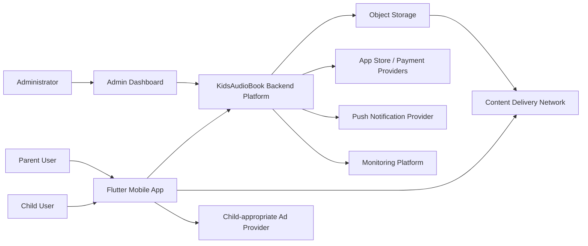
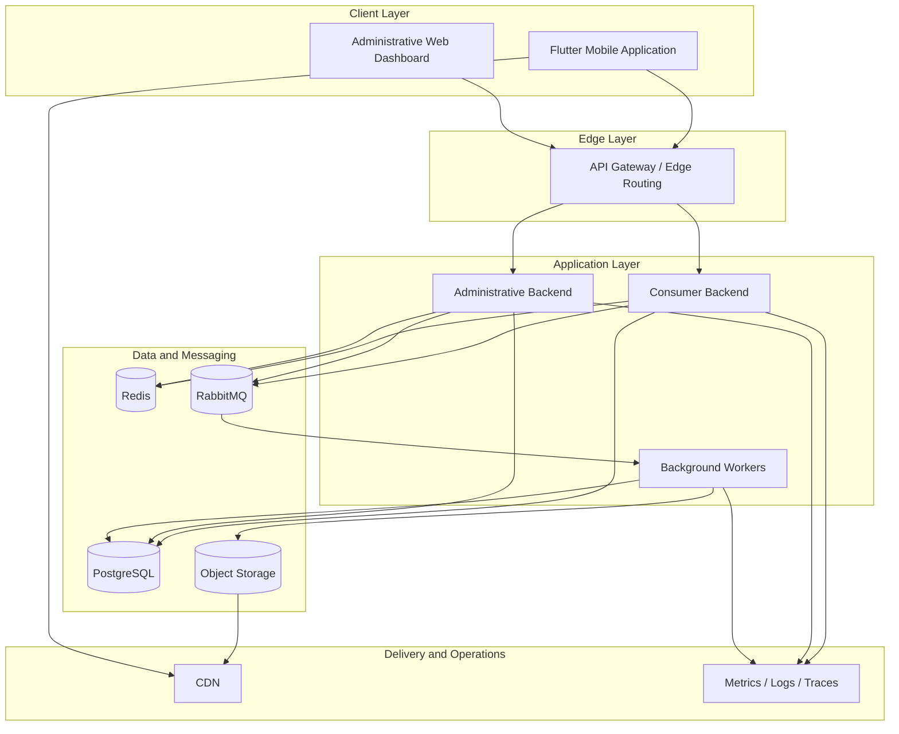
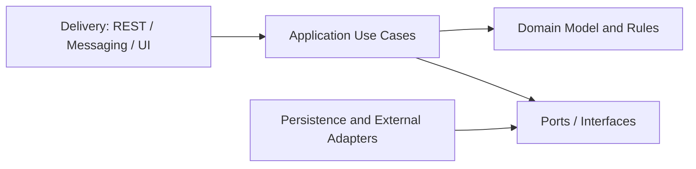
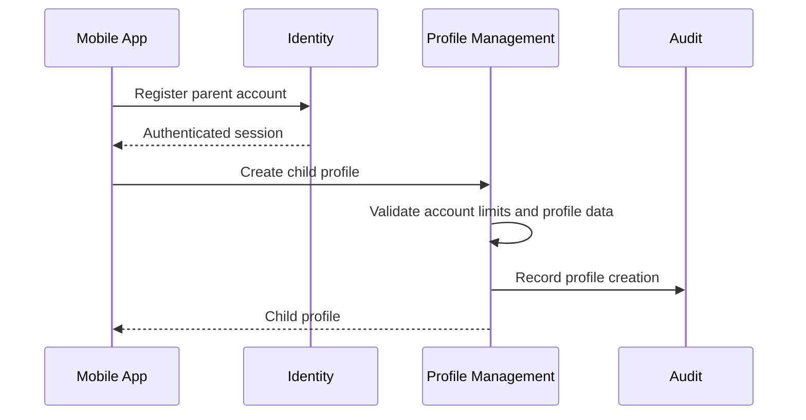
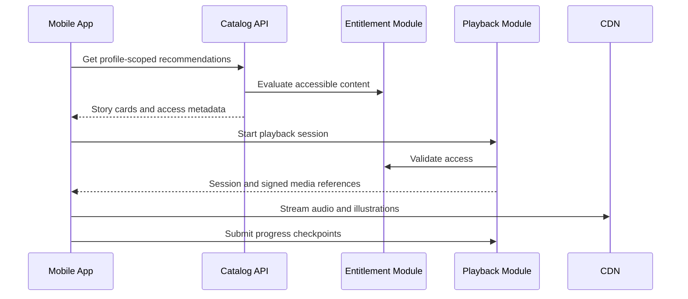
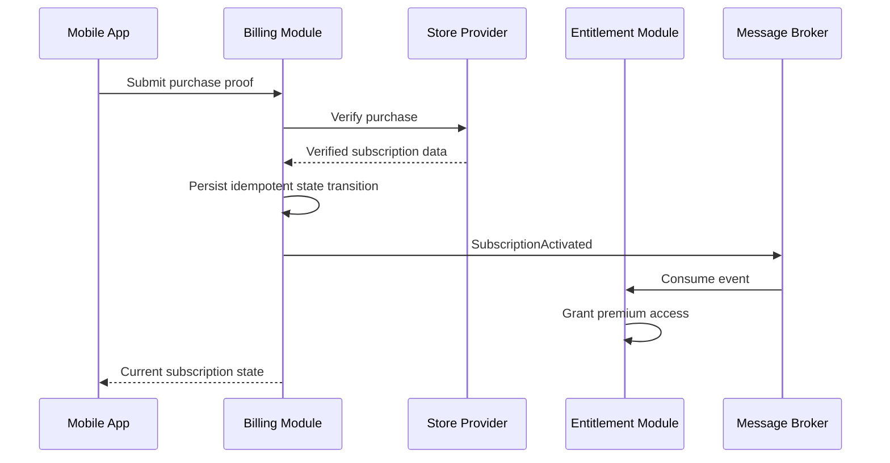
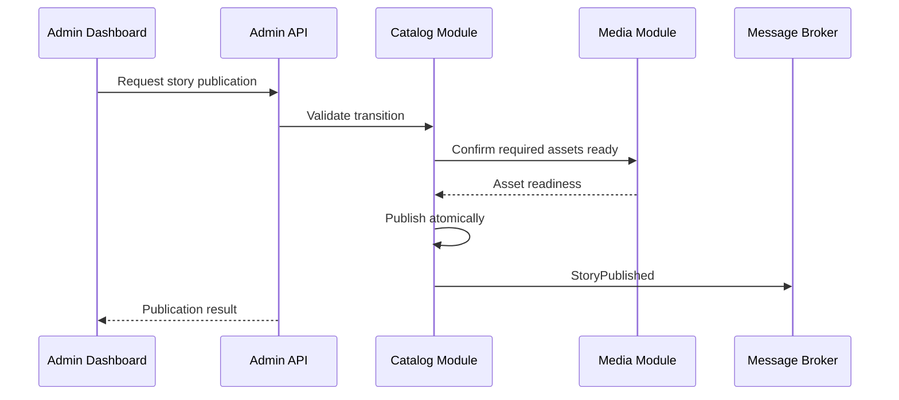
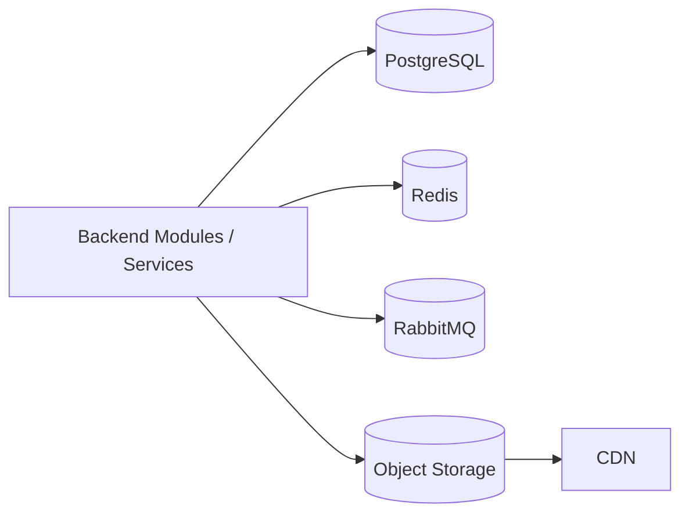
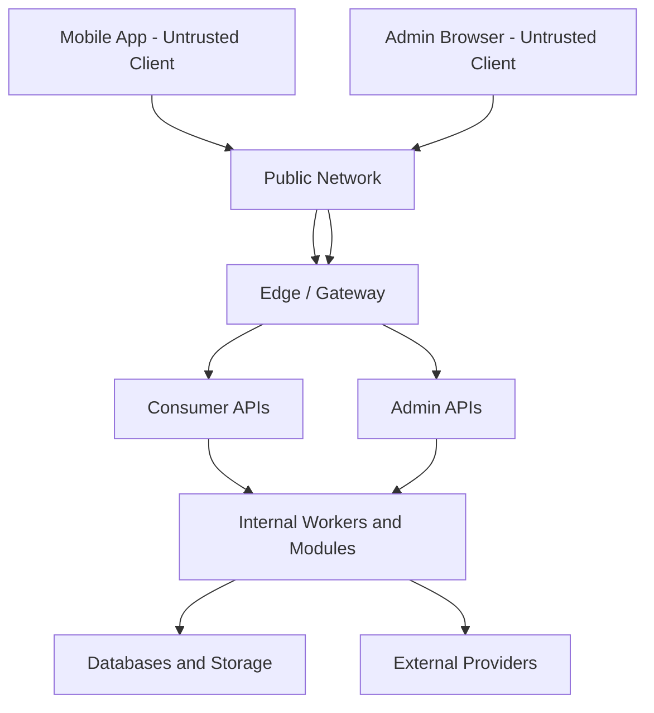
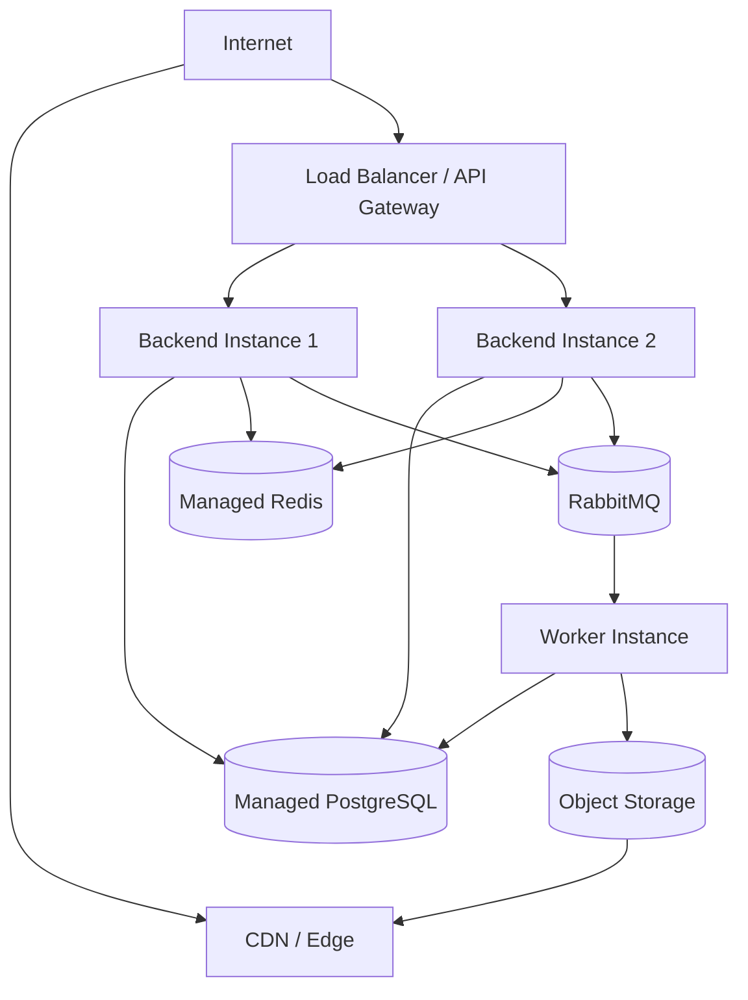

# Software Architecture

Version: 1.0.0  
Status: Active Draft  
Owner: Project Architecture  
Last updated: 2026-07-14

## 1. Purpose

This document describes the high-level software architecture of KidsAudioBookPlatform. It explains how the product is decomposed, how its major applications and backend capabilities collaborate, how data moves through the system, and how the architecture is expected to evolve.

This document is intentionally broader than `Backend_Architecture.md`. It covers the complete product system:

- Flutter mobile application;
- parent and child experiences;
- administrative web dashboard;
- backend platform;
- media storage and delivery;
- databases, cache, and messaging;
- external integrations;
- monitoring and operations;
- security and privacy boundaries.

Detailed implementation conventions are documented in the specialized architecture files.

## 2. Product Summary

KidsAudioBookPlatform is a mobile-first storytelling platform for children, primarily ages 0–7. A parent creates the account and controls one or more child profiles. Children discover and listen to stories in a safe, calm interface, while parents manage profiles, preferences, subscriptions, downloads, notifications, and parental controls from a protected Parent Zone.

The platform supports:

- narrated stories;
- synchronized text;
- multiple illustrations per story;
- series and episodes;
- categories and editorial collections;
- playback progress and continue-listening;
- free and premium plans;
- a three-day premium trial;
- offline downloads for premium users;
- ambient sounds and white noise;
- controlled advertising for eligible free users;
- persistent notifications;
- administrative content management;
- user and subscription support;
- offers, announcements, and discounts.

The system must support future internationalization, author workflows, larger content volumes, and independent scaling without forcing premature complexity into the MVP.

## 3. Architectural Goals

The architecture must optimize for the following outcomes:

1. **Safety** — child-facing functionality must remain isolated from sensitive parent and administrative capabilities.
2. **Correctness** — subscriptions, entitlements, publishing, progress, and profile ownership must be deterministic and auditable.
3. **Maintainability** — modules must have clear responsibilities and dependencies.
4. **Operational clarity** — failures must be observable and diagnosable.
5. **Evolution** — the MVP must not block later service extraction, internationalization, or additional content models.
6. **Performance** — catalog browsing and playback startup must feel fast on real mobile networks.
7. **Resilience** — media listening should remain usable even when non-critical capabilities degrade.
8. **Security and privacy** — personal and child-related data must be minimized and protected by design.

## 4. Architectural Drivers

The most important drivers are:

| Driver | Architectural consequence |
|---|---|
| Mobile-first experience | APIs must be bandwidth-aware, tolerant of unstable networks, and versioned |
| Child safety | Child and Parent Zone capabilities require explicit authorization and navigation boundaries |
| Audio-heavy product | Binary media must use object storage and CDN delivery rather than application servers |
| Free and premium plans | Entitlement decisions require a dedicated authoritative model |
| Offline premium listening | Download manifests, local asset management, revocation, and sync are first-class concerns |
| Editorial content workflow | Draft, review, scheduled, published, and archived states must be modeled explicitly |
| Multiple child profiles | Data and progress must be scoped by parent account and selected profile |
| Admin operations | Privileged actions require dedicated authorization and immutable audit records |
| Future growth | Bounded contexts must be defined before independent service deployment is necessary |
| Small initial team | Operational complexity must remain proportional to real product needs |

## 5. Architectural Approach

The system uses a **modular, service-oriented architecture** with explicit bounded contexts.

The strategic direction allows independently deployable services, but the initial implementation should not create a separate deployment for every domain noun. Closely related capabilities may be deployed together as long as module boundaries and data ownership remain clear.

The recommended starting shape is a small number of deployable backend applications containing well-isolated modules, with later extraction based on evidence.

This approach gives the project:

- faster initial delivery;
- simpler local development;
- fewer distributed transactions;
- lower infrastructure cost;
- clear migration paths toward microservices;
- less risk of a tightly coupled monolith.

## 6. System Context



The parent and child may use the same physical device, but they do not operate under the same application permissions. The selected child profile controls child content and progress, while the authenticated parent account remains the security principal.

## 7. Major Software Containers



### 7.1 Flutter Mobile Application

The Flutter application contains two deliberately separated experiences:

- Child Experience;
- Parent Zone.

The application is responsible for presentation, local state, playback coordination, secure token storage, downloaded media management, and offline synchronization. It must not become the authority for subscription status, profile ownership, publication rules, or advertising eligibility.

### 7.2 Administrative Dashboard

The admin dashboard supports content and platform operations. It is not a general-purpose consumer interface with hidden admin buttons. It uses privileged APIs and stricter authorization policies.

Primary capabilities include:

- story, series, episode, category, and collection management;
- content preview and publication workflow;
- user support;
- subscription inspection and controlled overrides;
- announcements, promotions, and discounts;
- notification management;
- audit-log review;
- operational reporting.

### 7.3 Consumer Backend

The consumer backend exposes APIs used by the mobile application. It owns consumer-facing orchestration, authentication integration, profile-scoped reads, playback workflows, entitlement evaluation, and mobile-compatible response models.

### 7.4 Administrative Backend

The administrative backend exposes privileged workflows and may initially share a deployment with the consumer backend. Its modules, routes, authorization, rate limits, auditing, and testing remain separate.

### 7.5 Background Workers

Background workers process slow or asynchronous operations, such as:

- media inspection and transformation;
- notification delivery;
- event consumption;
- subscription reconciliation;
- scheduled publication;
- analytics aggregation;
- cleanup and retention jobs;
- download revocation propagation.

Workers must be idempotent and retry-safe.

## 8. Domain Decomposition

The platform is divided into the following bounded contexts.

### 8.1 Identity and Access

Responsibilities:

- parent account registration;
- login and logout;
- access and refresh tokens;
- session and device management;
- password reset;
- role assignment;
- account suspension;
- security event generation.

### 8.2 Profile Management

Responsibilities:

- child profile creation and editing;
- avatar and display-name selection;
- age-band settings;
- content and playback preferences;
- selected profile state;
- parental settings;
- profile deletion workflow.

### 8.3 Content Catalog

Responsibilities:

- story metadata;
- series and episode relationships;
- categories and collections;
- age recommendations;
- languages;
- editorial availability;
- free and premium classification;
- publication lifecycle;
- search and discovery metadata.

### 8.4 Media

Responsibilities:

- audio assets;
- illustration assets;
- synchronized text assets;
- metadata and checksums;
- processing status;
- signed URL generation;
- CDN delivery references;
- asset lifecycle.

### 8.5 Playback and Progress

Responsibilities:

- playback session creation;
- progress checkpoints;
- resume position;
- completion state;
- continue-listening queries;
- history;
- session eligibility for advertising rules.

### 8.6 Entitlements

Responsibilities:

- effective access to premium content;
- feature eligibility;
- trial eligibility;
- offline eligibility;
- ad-free eligibility;
- entitlement expiry and revocation.

### 8.7 Subscriptions and Billing

Responsibilities:

- subscription plans;
- provider purchase references;
- verification;
- lifecycle state;
- renewals and cancellations;
- grace periods;
- provider callbacks;
- reconciliation;
- billing audit history.

### 8.8 Downloads and Offline

Responsibilities:

- download manifests;
- device association;
- offline license metadata;
- download status synchronization;
- storage limits;
- expiry and revocation.

### 8.9 Ambient Audio

Responsibilities:

- ambient-sound catalog;
- availability;
- sound categories;
- default volume recommendations;
- mixing presets;
- premium eligibility where applicable.

Actual audio mixing is performed on the device.

### 8.10 Notifications

Responsibilities:

- persistent notification records;
- targeting;
- categories and templates;
- push dispatch;
- read and dismissal state;
- user preferences;
- delivery status.

### 8.11 Advertising Eligibility

Responsibilities:

- free-user eligibility;
- two-session frequency rule;
- placement restrictions;
- premium exclusion;
- ad-attempt tracking;
- provider-independent policy decisions.

### 8.12 Administration and Audit

Responsibilities:

- privileged workflows;
- support actions;
- publication approvals;
- subscription overrides;
- administrative roles;
- immutable audit records.

## 9. Logical Dependency Direction

Dependencies must flow inward toward domain logic.



The domain must not depend on:

- Spring MVC;
- JPA entities;
- RabbitMQ clients;
- HTTP provider payloads;
- Flutter UI widgets;
- database-specific query APIs.

This does not require excessive abstraction for trivial code. It requires protection of meaningful business rules from technical coupling.

## 10. Primary User Journeys

### 10.1 Parent Registration and Profile Creation



The parent account owns every child profile. Profile operations require server-side ownership validation.

### 10.2 Story Discovery and Playback



The app may cache catalog responses, but server authorization remains authoritative before protected playback begins.

### 10.3 Premium Purchase Verification



The client never grants itself premium access based solely on a local purchase callback.

### 10.4 Content Publication



Publication must fail when required audio, text, illustrations, metadata, or review conditions are incomplete.

## 11. Communication Patterns

### 11.1 Client-to-Backend

Mobile and dashboard communication uses HTTPS and versioned REST APIs.

API responses should be optimized for their consuming application rather than exposing raw persistence structures.

### 11.2 Internal Synchronous Communication

Within one deployment, modules should communicate through application interfaces rather than HTTP calls.

Across deployments, synchronous HTTP is allowed only when the caller requires an immediate answer.

Long synchronous service chains are discouraged because they amplify latency and failure probability.

### 11.3 Internal Asynchronous Communication

RabbitMQ is used for business events and background work where eventual consistency is acceptable.

The transactional outbox pattern protects reliable event publication after database commits.

### 11.4 External Integrations

Each external provider is isolated behind an adapter. Provider-specific payloads do not become domain models.

Initial integration categories include:

- App Store and payment providers;
- push notification services;
- advertisement providers;
- email delivery;
- object storage;
- optional analytics services.

## 12. Data Architecture

PostgreSQL is the primary system of record.

Redis supports caching, idempotency, selected distributed coordination, and rate-limiting data.

RabbitMQ carries asynchronous messages.

S3-compatible object storage contains audio, images, and generated media assets.

A CDN delivers large assets efficiently.



Each context owns its data. Even when contexts share one physical PostgreSQL instance initially, tables and migration ownership must remain separated by module or schema.

## 13. Catalog Read Model

Catalog browsing is read-heavy. Mobile responses may require data from stories, categories, collections, entitlements, and profile preferences.

The architecture should avoid issuing a large number of cross-module calls for every home-screen request.

Recommended approach:

- maintain optimized catalog queries or read models;
- cache public and slowly changing catalog metadata;
- apply profile and entitlement rules in a controlled orchestration layer;
- invalidate or refresh caches after publication events;
- paginate large collections;
- precompute selected editorial sections when justified.

The write model remains authoritative for publication and content integrity.

## 14. Media Architecture

The application backend does not stream large audio files byte-by-byte under normal operation.

The expected flow is:

1. admin uploads source media through a controlled upload flow;
2. media enters quarantine;
3. validation and scanning run;
4. background processing creates delivery variants if required;
5. metadata and checksum are persisted;
6. the asset becomes eligible for editorial use;
7. an authorized playback request receives a short-lived media reference;
8. the mobile app streams or downloads from the CDN.

This architecture protects backend capacity and improves global media performance.

## 15. Offline Architecture

Offline listening is not simply a cached network response.

The system requires:

- premium entitlement verification;
- a server-issued download manifest;
- device-scoped local records;
- checksums;
- resumable download support where practical;
- storage quota handling;
- expiry and revocation policy;
- local encrypted or platform-protected storage;
- progress synchronization after reconnect;
- logout and account-switch cleanup rules.

The mobile app may continue playback temporarily while offline according to a valid local manifest. The server reconciles entitlement and progress when connectivity returns.

## 16. Security Boundaries

The major trust boundaries are:



Clients are untrusted even when they are official applications. Every sensitive decision is revalidated by the backend.

Administrative access uses stronger controls than consumer access and must always produce audit records for high-impact actions.

## 17. Authorization Model

The authenticated principal is the parent account or an administrative user.

Authorization decisions combine:

- platform role;
- account ownership;
- child-profile ownership;
- subscription entitlement;
- resource state;
- administrative permission;
- recent parent verification where needed.

Examples:

- a parent may update only profiles owned by that account;
- a child-profile-scoped request may access only content allowed by that profile and entitlement;
- only authorized editors may modify draft content;
- only publishers may publish;
- support roles may inspect limited user data but not change billing state unless separately authorized.

## 18. Reliability and Failure Isolation

The system must classify dependencies as core or optional.

Core dependencies include:

- identity data;
- catalog data;
- entitlement evaluation;
- playback-session persistence for online protected playback.

Optional or degradable dependencies may include:

- recommendations;
- marketing notifications;
- analytics;
- advertisements;
- selected dashboard reports.

Examples of graceful degradation:

- if recommendations fail, show cached editorial collections;
- if analytics fails, do not block playback;
- if push delivery fails, preserve the in-app notification;
- if ad delivery fails, do not trap the user or interrupt the story;
- if ambient catalog refresh fails, use locally cached ambient sounds.

## 19. Observability Architecture

All backend deployments emit:

- structured logs;
- metrics;
- traces;
- health information;
- audit events where required.

Correlation IDs propagate through HTTP requests, internal calls, and asynchronous messages.

The observability platform must allow operators to connect a mobile-visible error to the responsible backend request and dependency.

Key dashboards should cover:

- API latency and errors;
- login failures;
- playback session creation;
- media authorization;
- subscription verification;
- entitlement propagation;
- queue depth;
- dead-letter messages;
- notification delivery;
- publication failures;
- database and cache health.

## 20. Deployment Topology

The exact hosting provider remains an ADR decision. The logical deployment model is:



Backend instances are stateless and horizontally scalable. Persistent state lives in managed data services.

## 21. Environment Strategy

The expected environments are:

| Environment | Purpose |
|---|---|
| Local | Developer workstation and Docker-based dependencies |
| Test/CI | Automated tests and ephemeral validation |
| Development | Integrated team testing |
| Staging | Production-like acceptance and release validation |
| Production | Live customer environment |

Environment differences must be configuration-based, not implemented through different code branches.

Production data must not be copied into lower environments without controlled anonymization.

## 22. Scalability Model

The architecture initially scales through:

- stateless API replicas;
- CDN media delivery;
- asynchronous worker scaling;
- database indexing;
- Redis caching;
- efficient pagination;
- optimized read models;
- queue-based load leveling.

Independent service extraction is considered when one context has significantly different scaling, deployment, security, or ownership needs.

Likely future extraction candidates include:

- media processing;
- notifications;
- subscription and billing integration;
- analytics processing;
- search and recommendation capabilities.

## 23. Evolution Stages

### Stage 1 — Architecture Foundation

- establish module boundaries;
- define contracts;
- create shared engineering standards;
- build local Docker environment;
- implement authentication, profiles, catalog, and basic playback;
- keep deployment count low.

### Stage 2 — MVP Production Readiness

- subscriptions and entitlements;
- media pipeline and CDN;
- admin publication workflow;
- notifications;
- observability;
- security hardening;
- backup and recovery.

### Stage 3 — Growth

- offline downloads;
- richer recommendations;
- localization;
- advanced campaign management;
- independent worker scaling;
- selective service extraction.

### Stage 4 — Platform Expansion

- author workflows;
- additional content formats;
- partner integrations;
- broader age ranges;
- regional deployment;
- advanced analytics and personalization under strict privacy rules.

## 24. Architecture Risks

| Risk | Mitigation |
|---|---|
| Premature microservice fragmentation | Start with explicit modules and extract based on evidence |
| Coupled shared database | Enforce ownership by schema/module and prohibit cross-context writes |
| Mobile/backend contract drift | OpenAPI-first contracts and compatibility checks |
| Subscription inconsistency | Internal state machine, idempotent callbacks, reconciliation jobs |
| Slow playback startup | CDN, signed media references, small metadata payloads, monitoring |
| Unsafe admin capabilities | Separate policies, least privilege, audit records, controlled workflows |
| Excessive personal data collection | Data minimization and field-level purpose documentation |
| Offline entitlement abuse | Device manifests, expiry, revocation, secure storage |
| Event loss | Transactional outbox and monitored consumers |
| Documentation drift | Documentation updates included in definition of done |

## 25. Initial Deployable Units

A pragmatic initial deployment may contain:

1. **platform-api** — consumer and administrative HTTP APIs, with module separation;
2. **platform-worker** — background jobs and message consumers;
3. **admin-dashboard** — administrative web application;
4. **mobile-app** — Flutter iOS and Android application.

Infrastructure components:

- PostgreSQL;
- Redis;
- RabbitMQ;
- S3-compatible object storage;
- CDN;
- monitoring stack.

This topology is an initial recommendation, not a prohibition against future service extraction.

## 26. Source-Code Organization Direction

The repository may organize backend code by bounded context rather than horizontal technical folders.

Illustrative structure:

```text
backend/
  platform-api/
  platform-worker/
  modules/
    identity/
    profiles/
    catalog/
    media/
    playback/
    entitlements/
    subscriptions/
    notifications/
    administration/
  shared/
    observability/
    security-support/
    test-support/
```

The `shared` area must remain small and technical. Shared business models often indicate missing ownership and should not become a dependency shortcut.

## 27. Related Documents

This document must be read together with:

- `Architecture_Principles.md`;
- `Backend_Architecture.md`;
- `Mobile_Architecture.md`;
- `Admin_Dashboard.md`;
- `Database_Design.md`;
- `API_Specification.md`;
- `Security_Architecture.md`;
- `Performance_Guidelines.md`;
- `Logging_Monitoring.md`;
- `Notifications.md`;
- Architecture Decision Records under `00_Project/ADR`.

## 28. Open Decisions

The following decisions require future ADRs or validation:

- exact Spring Boot version and dependency baseline;
- modular monolith framework usage versus plain Java module boundaries;
- hosting provider;
- managed RabbitMQ provider or alternative broker;
- identity implementation versus external identity provider;
- exact object-storage and CDN provider;
- admin frontend framework;
- subscription providers and store-verification libraries;
- search implementation for the first production release;
- production secrets-management platform;
- observability vendor or self-hosted stack.

Until decided, implementation must depend on internal abstractions rather than provider-specific assumptions.

## 29. Architecture Acceptance Criteria

The software architecture is being followed when:

- every feature has a clear owning context;
- domain rules are not implemented in controllers or clients;
- modules do not write each other's data;
- protected media access is server-authorized;
- subscription and entitlement states are explicit;
- administrative actions are audited;
- child and parent experiences remain separated;
- errors, metrics, and traces are consistent;
- asynchronous workflows are idempotent;
- documentation and code remain aligned;
- deployment complexity grows only when justified.

## 30. Conclusion

KidsAudioBookPlatform should begin as a well-structured product platform, not as either an accidental monolith or an over-engineered distributed system.

The central architectural strategy is to establish strong domain boundaries, keep the initial deployment practical, protect child safety and parent control, move media delivery to purpose-built infrastructure, and preserve clear paths for future scaling.

The architecture succeeds when the team can add features quickly without weakening safety, correctness, or coherence.
