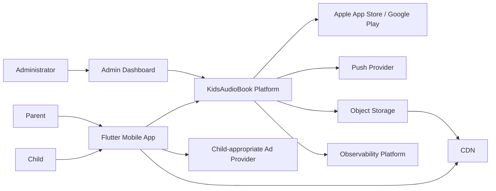
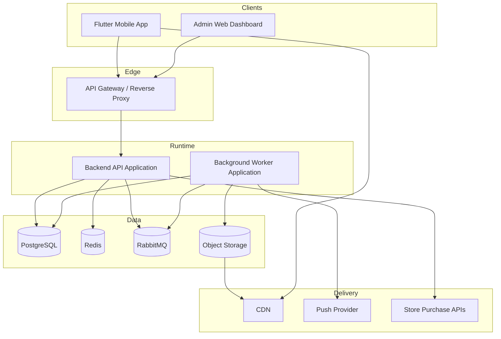
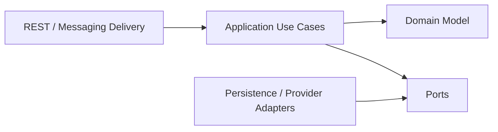
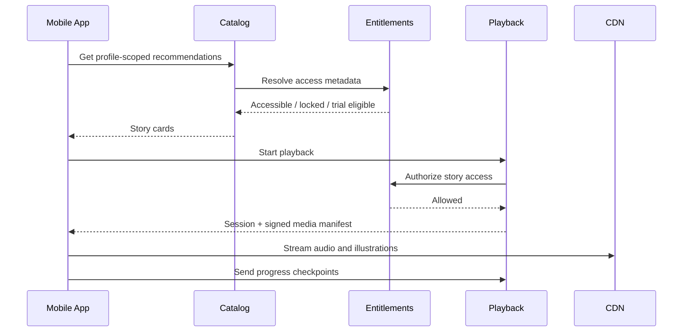
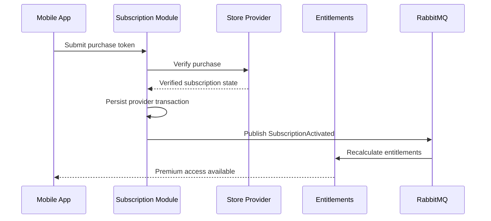
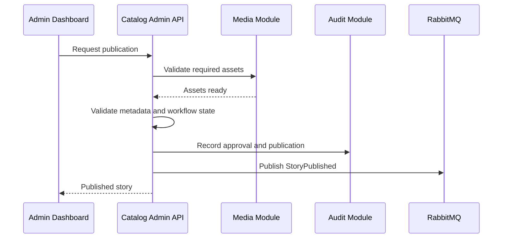

# Software Architecture

Version: 1.1.0  
Status: Active Draft  
Owner: Project Architecture  
Last updated: 2026-07-14

## 1. Purpose

This document defines the software architecture of KidsAudioBookPlatform as a complete product system. It is the high-level source of truth for system boundaries, deployable units, bounded contexts, dependency direction, runtime collaboration, resilience, scalability, security boundaries, and evolution toward independently deployable services.

It covers:

- the Flutter mobile application;
- the Child Experience and protected Parent Zone;
- the administrative web dashboard;
- backend applications and domain modules;
- PostgreSQL, Redis, RabbitMQ, object storage, and CDN;
- external providers for purchases, push notifications, and advertising;
- operational tooling, security controls, and architecture governance.

Implementation-specific details belong in the specialized documents referenced throughout this file.

## 2. Product Context

KidsAudioBookPlatform is a mobile-first audio storytelling platform for children, initially focused on ages 0–7. Parents create accounts and control child profiles. Children use a safe, calm interface to discover and listen to stories, while parents manage profiles, subscriptions, downloads, notifications, and parental controls through a protected Parent Zone.

The product supports narrated stories, synchronized text, multiple illustrations, series, episodes, categories, editorial collections, playback progress, ambient audio, a free tier, premium subscriptions, a three-day trial, offline downloads, carefully constrained advertising, persistent notifications, and administrative content operations.

The architecture must support future localization, author workflows, larger content catalogs, advanced recommendations, and service extraction without forcing premature distributed-system complexity into the MVP.

## 3. Architecture Principles

The platform follows these principles:

1. **Child safety is a system property.** It is enforced through navigation, authorization, data minimization, content workflow, and operational controls.
2. **The server is authoritative.** Subscription status, entitlement decisions, profile ownership, publication state, and advertising eligibility are never trusted solely from the client.
3. **Domain boundaries precede deployment boundaries.** Modules are designed as bounded contexts before they are extracted into separate services.
4. **Start with a modular monolith.** Independent services are introduced only when scale, ownership, reliability, or release cadence justify them.
5. **Media does not flow through application servers.** Audio and images are delivered through object storage and CDN using controlled URLs.
6. **Asynchronous work is explicit.** Slow, retryable, or fan-out operations use messaging and workers.
7. **Every privileged action is auditable.** Administrative and support actions produce immutable audit records.
8. **Failures degrade safely.** Optional capabilities may fail without blocking core playback whenever possible.
9. **Observability is part of the design.** Logs, metrics, traces, correlation IDs, and business events are defined with the feature.
10. **Documentation and contracts are executable assets.** OpenAPI, database migrations, event schemas, and architecture tests must remain synchronized with implementation.

## 4. Architectural Drivers

| Driver | Architectural consequence |
|---|---|
| Mobile-first use | APIs are bandwidth-aware, paginated, cacheable, and tolerant of intermittent connectivity |
| Children as users | Strict separation between child-safe and parent-only capabilities |
| Audio-heavy product | Object storage and CDN are mandatory for media distribution |
| Free and premium tiers | Central entitlement model and provider-independent access decisions |
| Offline listening | Download manifests, device association, revocation, and synchronization are first-class concerns |
| Editorial publishing | Explicit draft, review, scheduled, published, suspended, and archived states |
| Multiple profiles | Progress and recommendations are always scoped to a child profile |
| Small initial team | Operational simplicity is prioritized over premature microservices |
| Future growth | Clear bounded contexts and extractable adapters |
| Compliance and trust | Data minimization, retention rules, auditability, and incident readiness |

## 5. Architecture Style

### 5.1 Initial deployment model

The initial backend is a **modular monolith with asynchronous workers**. It may be deployed as:

- one consumer/admin API application;
- one worker application;
- PostgreSQL;
- Redis;
- RabbitMQ;
- object storage;
- observability services.

The codebase remains modular even when modules share a process. Modules communicate through application interfaces or published domain events, never by directly accessing another module's internal repository or tables.

### 5.2 Evolution model

A module may be extracted into an independent service when one or more of the following become true:

- it requires independent scaling;
- it has a different reliability target;
- it changes at a significantly different rate;
- it is owned by a separate team;
- it needs independent deployment for risk reduction;
- its workload is operationally distinct, such as media processing or notifications.

Likely early extraction candidates are media processing, notifications, subscription reconciliation, search, and analytics.

### 5.3 Rejected starting point

The project does not begin with a service per domain noun. That would introduce distributed transactions, local-development friction, deployment overhead, monitoring burden, and contract-management cost before the product has evidence that those costs are justified.

## 6. System Context



The authenticated parent account is the security principal. A selected child profile is a scoped product context, not an independent login identity.

## 7. Container Architecture



### 7.1 Flutter mobile application

The application contains two deliberately separated navigation and authorization surfaces:

- **Child Experience** for discovery, playback, favorites, and profile-scoped history;
- **Parent Zone** for profile management, subscriptions, downloads, preferences, and account operations.

The application owns presentation, local state, secure token storage, media playback, ambient-audio mixing, local downloads, and offline synchronization. It does not own authoritative entitlement or ownership decisions.

### 7.2 Admin dashboard

The dashboard is a privileged operational product, not a consumer UI with hidden buttons. It uses dedicated routes, stricter authorization, detailed audit logging, and workflow-specific permissions.

### 7.3 Backend API application

The API application exposes consumer and administrative APIs. Shared deployment does not imply shared authorization or shared module internals. Consumer and admin endpoints remain separated by route namespace, policy, rate limits, and tests.

### 7.4 Worker application

Workers process media, notifications, scheduled publication, subscription reconciliation, cleanup, retry queues, and analytics aggregation. All handlers must be idempotent and safe under redelivery.

## 8. Bounded Contexts

### 8.1 Identity and Access

Owns registration, login, access and refresh tokens, password reset, device sessions, account status, roles, and security events.

### 8.2 Profile Management

Owns child profiles, avatars, age bands, playback preferences, profile limits, parental controls, and profile deletion.

### 8.3 Content Catalog

Owns stories, series, episodes, categories, collections, languages, age recommendations, content tier, discoverability, and publication state.

### 8.4 Media

Owns audio, illustration, synchronized-text assets, checksums, technical metadata, processing state, signed delivery URLs, and lifecycle cleanup.

### 8.5 Playback and Progress

Owns playback sessions, checkpoints, resume positions, completion, listening history, and continue-listening projections.

### 8.6 Entitlements

Owns the effective answer to whether an account or profile may access a feature or content item. It combines subscription state, trial state, content tier, plan capabilities, and temporary administrative overrides.

### 8.7 Subscriptions and Billing

Owns provider transactions, verification, subscription lifecycle, renewals, cancellations, grace periods, provider notifications, reconciliation, and billing audit history.

### 8.8 Downloads and Offline

Owns download manifests, device association, offline-license metadata, limits, synchronization, expiry, and revocation.

### 8.9 Notifications

Owns notification records, templates, targeting, preferences, delivery attempts, read state, and push dispatch.

### 8.10 Advertising Eligibility

Owns provider-independent ad policy, including free-tier eligibility, the two-session rule, premium exclusion, age-safe placement, and attempt tracking.

### 8.11 Administration and Audit

Owns privileged workflows, support operations, role assignment, publication approvals, controlled subscription overrides, and immutable audit records.

## 9. Module Dependency Rules

Dependencies flow inward:



Mandatory rules:

- controllers call application use cases, not repositories;
- domain objects do not depend on Spring, JPA, RabbitMQ, or provider SDKs;
- JPA entities are persistence representations, not public API contracts;
- one module may not import another module's persistence package;
- cross-module reads use published application interfaces or dedicated read models;
- cross-module writes use commands, domain services, or events;
- package-private visibility is preferred for internal implementation types;
- architecture tests must enforce forbidden dependencies.

Example package shape:

```text
com.kidsaudiobook
  identity/
    api/
    application/
    domain/
    infrastructure/
  catalog/
    api/
    application/
    domain/
    infrastructure/
  playback/
  entitlements/
  subscriptions/
  notifications/
```

## 10. Communication Patterns

### 10.1 Synchronous communication

Use synchronous calls when the caller needs an immediate answer to continue the user request, such as:

- validating credentials;
- fetching story details;
- evaluating entitlement;
- starting playback;
- updating progress;
- reading notification state.

Inside the modular monolith, these are in-process application-interface calls. After service extraction, the same conceptual contract may become HTTP or gRPC, but that is not assumed prematurely.

### 10.2 Asynchronous communication

Use RabbitMQ when work is slow, retryable, fan-out, or not required for the immediate response:

- `StoryPublished`;
- `MediaProcessingRequested`;
- `SubscriptionActivated`;
- `SubscriptionExpired`;
- `NotificationCreated`;
- `StoryCompleted`;
- `ProfileDeleted`;
- `OfflineLicenseRevoked`.

Events use versioned envelopes:

```json
{
  "eventId": "01J2...",
  "eventType": "StoryPublished",
  "eventVersion": 1,
  "occurredAt": "2026-07-14T18:20:00Z",
  "correlationId": "01J2...",
  "producer": "catalog",
  "payload": {
    "storyId": "01J1...",
    "language": "ro-RO"
  }
}
```

The transactional outbox pattern guarantees that database state and emitted events cannot diverge silently.

## 11. Data Ownership

Each bounded context owns its write model. Even when contexts share one PostgreSQL instance, ownership remains explicit through schemas, repository boundaries, and migration ownership.

Rules:

- no module writes another module's tables;
- foreign keys across schemas are used only when ownership and lifecycle are stable;
- reporting joins are read-only and isolated from transactional logic;
- shared concepts are referenced by stable IDs, not duplicated mutable objects;
- Redis is never the system of record;
- object storage contains binary media, while PostgreSQL contains authoritative metadata;
- deletion workflows must account for database records, cache entries, object assets, notifications, and audit retention.

## 12. Primary Runtime Flows

### 12.1 Story discovery and playback



### 12.2 Premium purchase reconciliation



### 12.3 Content publication



## 13. Media Architecture

Media upload and delivery are separated.

### Upload path

1. Admin requests an upload session.
2. Backend validates intended type and creates a restricted pre-signed upload URL.
3. Client uploads directly to object storage.
4. A worker validates file signature, size, duration, dimensions, malware status, and checksum.
5. Derived assets are generated where needed.
6. Asset state changes from `UPLOADED` to `PROCESSING`, then `READY` or `REJECTED`.

### Delivery path

1. Mobile requests a playback or download manifest.
2. Backend validates publication and entitlement.
3. Backend returns short-lived CDN URLs or signed cookies.
4. Mobile streams directly from the CDN.

Application servers never proxy large audio files in normal operation.

## 14. Offline Architecture

Offline support uses a manifest model rather than arbitrary local copies.

A manifest contains:

- story and asset identifiers;
- checksums;
- expected sizes;
- version information;
- entitlement expiry;
- revocation metadata;
- synchronization cursor.

The client stores encrypted local metadata and validates checksums after download. Progress changes are queued locally and synchronized with idempotency keys. Server state wins for entitlement and revocation; progress conflict resolution favors the furthest valid playback position unless a newer explicit reset exists.

## 15. Security Boundaries

### 15.1 Child and Parent Zone boundary

Entering Parent Zone requires explicit local re-authentication through biometrics or PIN fallback. That local check unlocks navigation but does not replace server authorization.

### 15.2 Consumer and administrative boundary

Administrative APIs use separate roles, route namespaces, stricter token policies, lower rate limits, and mandatory audit logs. Admin privileges are never inferred from UI state.

### 15.3 Media boundary

Private source assets remain inaccessible. Delivery uses short-lived signed access through CDN. Upload URLs are scoped to one object key, content type, and expiration.

### 15.4 Trust boundaries

Provider callbacks, purchase receipts, push tokens, and ad-provider responses are untrusted external input and require validation, replay protection, and observability.

## 16. Resilience and Failure Handling

| Dependency failure | Required behavior |
|---|---|
| Redis unavailable | Fall back to PostgreSQL where safe; disable non-essential cache-dependent optimizations |
| RabbitMQ unavailable | Persist outbox records and retry publishing; do not lose business transactions |
| Push provider unavailable | Queue and retry notifications; in-app records remain available |
| CDN transient failure | Retry with bounded backoff; allow downloaded content to continue |
| Store verification unavailable | Keep purchase pending; never grant permanent entitlement without verification |
| Ad provider unavailable | Skip the ad; never block story playback |
| Recommendation failure | Fall back to editorial and recently used collections |
| Analytics failure | Drop or buffer non-critical telemetry without failing user requests |

Circuit breakers, timeouts, bounded retries, bulkheads, and dead-letter queues are applied at external boundaries. Retries must not multiply side effects.

## 17. Caching Strategy

Redis is used for:

- catalog and editorial projections;
- short-lived entitlement snapshots;
- rate limiting;
- distributed locks for narrowly defined jobs;
- idempotency response storage;
- session and revocation metadata where required.

Cache keys are versioned and namespaced:

```text
catalog:v1:story:{storyId}:{locale}
entitlement:v1:account:{accountId}
profile:v1:home:{profileId}:{locale}
```

Cache invalidation is driven by successful writes and domain events. Correctness must not depend on cache presence.

## 18. Scalability Model

The first scaling strategy is horizontal stateless API replication. State remains in PostgreSQL, Redis, RabbitMQ, and object storage.

Scaling priorities:

1. CDN offload for media;
2. database indexes and query tuning;
3. caching of high-read projections;
4. asynchronous workers for slow tasks;
5. horizontal API and worker replicas;
6. read replicas for reporting and heavy catalog reads;
7. service extraction only when operational evidence supports it.

Partitioning is considered for high-volume append-only tables such as playback events, notification attempts, audit records, and provider webhook history.

## 19. Observability

Every request and event carries a correlation ID. Structured logs include:

- timestamp;
- severity;
- service and module;
- trace and correlation IDs;
- actor type and anonymized actor ID;
- operation;
- outcome;
- duration;
- error code.

Sensitive values, access tokens, refresh tokens, passwords, PINs, purchase receipts, and raw child data are never logged.

Key service-level indicators include:

- API latency and error rate;
- playback-start success rate;
- media-manifest latency;
- subscription verification success;
- event age and dead-letter count;
- push-delivery success;
- cache hit ratio;
- database connection saturation;
- worker backlog;
- offline synchronization failures.

## 20. Deployment Architecture

Environments:

- local development with Docker Compose;
- shared development;
- staging;
- production.

Production deployments use immutable container images, environment-specific configuration, secret injection, health probes, migration gates, rolling deployment, and rollback procedures.

Database migrations run as a controlled deployment step. Application instances do not independently race to apply migrations at startup.

## 21. Testing Architecture

The quality model includes:

- domain unit tests;
- application-service tests;
- repository integration tests with Testcontainers;
- API contract tests;
- architecture dependency tests;
- event schema and consumer tests;
- provider adapter tests with WireMock or provider sandboxes;
- end-to-end tests for critical journeys;
- load tests for catalog, playback start, and progress updates;
- security tests for authentication, authorization, rate limits, and upload validation.

Critical journeys include registration, profile creation, story playback, progress resume, premium purchase, offline download, publication, and account deletion.

## 22. Architecture Governance

Architecture decisions are recorded in `docs/00_Project/ADR/`.

A change requires an ADR when it introduces or replaces:

- a major framework or datastore;
- a new communication style;
- a cross-cutting security rule;
- a new deployment boundary;
- a new source of truth;
- a backward-incompatible contract strategy.

Pull requests that alter architecture must update the relevant document, diagrams, OpenAPI, event catalog, error catalog, and implementation roadmap.

## 23. Service Extraction Playbook

When extracting a module:

1. confirm a measurable reason;
2. identify owned tables and events;
3. introduce an explicit module API if one does not exist;
4. remove direct cross-module persistence access;
5. add contract tests;
6. replicate data through events where needed;
7. move tables or introduce a dedicated schema/database;
8. deploy behind stable routing;
9. compare behavior and metrics;
10. remove the old in-process path only after verification.

A service extraction is complete only when ownership, operations, data recovery, alerting, and on-call responsibility are clear.

## 24. Quality Attribute Scenarios

### Availability

When the ad provider is unavailable during a free user's eligible ad moment, playback must continue without an ad and the failure must be recorded without exposing an error to the child.

### Performance

For a cached catalog request under normal load, the platform should return the first page within the defined mobile API latency SLO, excluding client network time.

### Security

When a child attempts to reach Parent Zone without successful local verification, no parent-only screen or sensitive data may be exposed.

### Recoverability

When RabbitMQ is unavailable after a successful subscription transaction, the outbox record must remain pending and publish automatically after recovery without duplicating entitlement grants.

### Maintainability

A developer adding a new notification type should modify the notification module, event catalog, template registry, and tests without changing unrelated catalog or playback internals.

## 25. Related Documents

- `Architecture_Principles.md`
- `Backend_Architecture.md`
- `Mobile_Architecture.md`
- `Admin_Dashboard.md`
- `Database_Design.md`
- `API_Specification.md`
- `Security_Architecture.md`
- `Performance_Guidelines.md`
- `Logging_Monitoring.md`
- `Notifications.md`
- `Technology_Stack.md`
- `System_Flows.md`
- `Event_Catalog.md`
- `Error_Catalog.md`
- `Implementation_Roadmap.md`
- `C4_Model/README.md`

## 26. Definition of Architectural Completion

A major capability is architecturally ready for implementation when:

- its bounded context and owner are clear;
- APIs and events are documented;
- source-of-truth data is identified;
- authorization rules are explicit;
- failure behavior is defined;
- observability and audit requirements are specified;
- migration and compatibility strategy are known;
- tests are listed;
- diagrams and related documents are updated;
- no unresolved contradiction remains between architecture documents.
