# System Flows

Version: 1.1.0  
Status: Active Draft  
Owner: Project Architecture  
Last updated: 2026-07-15

## 1. Purpose

This document defines the end-to-end behavior of the most important KidsAudioBookPlatform product and operational flows across mobile clients, the administrative dashboard, backend modules, PostgreSQL, Redis, RabbitMQ, object storage, CDN, and external providers.

It complements the structural architecture described in `Software_Architecture.md` and `C4_Model/README.md`. API payloads belong in `API_Specification.md`, event contracts in `Event_Catalog.md`, error codes in `Error_Catalog.md`, and persistence details in `Database_Design.md`.

## 2. Flow Documentation Standard

Every implementation-ready flow must identify:

- actors and initiating trigger;
- preconditions and authorization policy;
- happy path;
- validation rules;
- transactional boundary;
- source-of-truth state changes;
- cache changes;
- emitted events;
- idempotency strategy;
- failure and retry behavior;
- audit requirements;
- metrics, logs, and traces;
- user-visible outcome.

### 2.1 Shared conventions

- The authenticated parent account is the security principal.
- A child profile is a scoped product context and never an independent login identity.
- The server is authoritative for ownership, entitlement, publication state, subscription state, and advertising eligibility.
- Every mutating request carries an idempotency key where a retry could duplicate a side effect.
- Database state and emitted events are coordinated through the transactional outbox pattern.
- External provider calls occur after the primary transaction whenever the flow does not require an immediate provider result.
- Every request and event carries correlation and causation identifiers.
- Sensitive data, tokens, PINs, purchase receipts, and signed media URLs are never logged.

## 3. Account Registration

### Preconditions

- The email address is syntactically valid.
- Registration rate limits have not been exceeded.
- The client accepts the current legal documents where required.

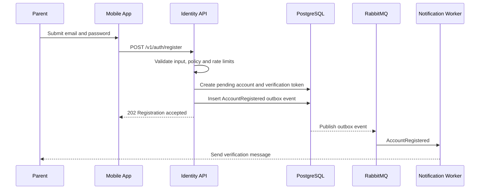

### Rules

- Email is normalized before uniqueness checks.
- Password is hashed with an approved adaptive algorithm.
- Duplicate registration responses do not reveal sensitive account state.
- Verification tokens are random, single-use, hashed at rest, and expire.
- Repeated requests with the same idempotency key return the original outcome.
- Notification delivery failure does not roll back account creation.

### Observability

Record registration acceptance rate, rejection reason, duplicate rate, verification-delivery latency, and verification completion rate without logging the raw email address.

## 4. Email Verification

1. Parent opens the verification link or enters the verification code.
2. Identity verifies token hash, expiry, purpose, account state, and previous use.
3. Account state changes from `PENDING_VERIFICATION` to `ACTIVE` in one transaction.
4. The token is marked consumed.
5. `AccountVerified` is written to the outbox.
6. Welcome notification creation may occur asynchronously.

Expired or consumed tokens return a stable public error. Resend requests are rate-limited and invalidate older active tokens according to policy.

## 5. Login and Session Refresh

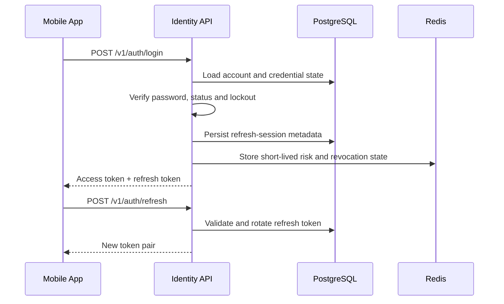

### Rules

- Access tokens are short-lived.
- Refresh tokens are rotated on every successful use.
- Reuse of an invalidated refresh token revokes the entire token family.
- Failed authentication increments throttling counters.
- Suspended, deleted, or unverified accounts cannot create normal sessions.
- Device and session metadata are auditable.
- Concurrent refresh attempts are serialized or resolved deterministically.

## 6. Logout and Session Revocation

### Single-device logout

1. Client submits the refresh-session identifier.
2. Identity verifies account ownership.
3. The refresh session is revoked transactionally.
4. Short-lived revocation metadata is updated in Redis.
5. The client deletes local access and refresh tokens.

### Logout from all devices

All active refresh sessions are revoked and a `SessionsRevoked` event is emitted. Access tokens remain bounded by their short lifetime and may additionally be denied through revocation state for high-risk operations.

## 7. Password Reset

1. Parent submits an email address.
2. The public response is identical whether the account exists or not.
3. For an eligible account, a short-lived single-use reset token is persisted as a hash.
4. Notification is sent asynchronously.
5. Parent submits the token and new password.
6. Identity validates password policy and consumes the token transactionally.
7. All refresh sessions are revoked.
8. `PasswordChanged` and `SessionsRevoked` are emitted.

Reset attempts, token failures, and notification requests are rate-limited and security-audited.

## 8. Enter Parent Zone

The Parent Zone is protected independently from account login.

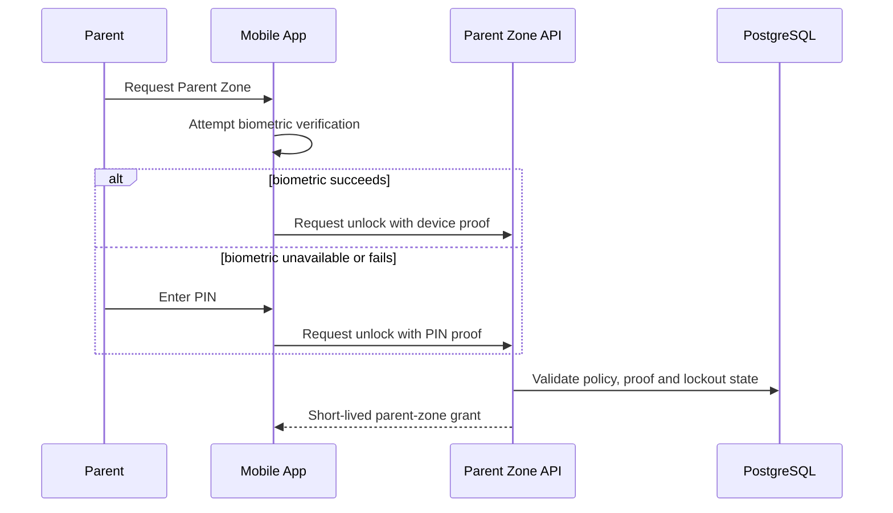

### Rules

- Raw biometric data never leaves the device.
- PIN is never stored or logged in plain text.
- Parent-zone grants are short-lived, account-scoped, device-scoped, and operation-scoped where necessary.
- Repeated failures trigger cooldown and security logging.
- Backgrounding the app or exceeding inactivity timeout may invalidate the local unlocked state.

## 9. Create Child Profile

1. Parent enters Parent Zone.
2. Client submits profile name, age band, avatar, and initial preferences.
3. Backend validates account ownership, parent-zone grant, entitlement, and profile limit.
4. Profile is created in one transaction.
5. `ChildProfileCreated` is written to the outbox.
6. Profile-list and home-projection caches are invalidated.
7. An audit record is created.

### Required validations

- profile name length and allowed characters;
- supported age band;
- maximum profile count;
- valid and allowed avatar;
- safe default settings;
- no client-controlled account identifier.

## 10. Update Child Profile

Profile updates use optimistic locking. The request includes the current profile version. A stale version returns a conflict instead of silently overwriting newer changes.

Changes to age band, parental controls, or content restrictions invalidate relevant catalog and recommendation projections. Security-sensitive changes require a valid Parent Zone grant and produce an audit record.

## 11. Select Child Profile

The app loads available profiles after authentication. Selecting a profile creates client context only; it does not grant Parent Zone access.

The profile identifier is sent on child-scoped API calls. Every backend module verifies that the profile belongs to the authenticated account. Changing an identifier cannot grant access to another account's data.

## 12. Delete Child Profile

1. Parent enters Parent Zone and confirms deletion.
2. Backend verifies ownership and policy.
3. Profile state changes to `DELETION_PENDING`.
4. Active profile sessions and download authorizations are revoked.
5. `ChildProfileDeletionRequested` is emitted.
6. Asynchronous handlers delete or anonymize progress, history, preferences, recommendations, local-device associations, and non-required notification targeting data.
7. Required audit evidence is retained without unnecessary child data.
8. Final state becomes `DELETED` and `ChildProfileDeleted` is emitted.

The operation is idempotent and resumable. Partial cleanup is visible through operational metrics and retry queues.

## 13. Browse and Discover Stories

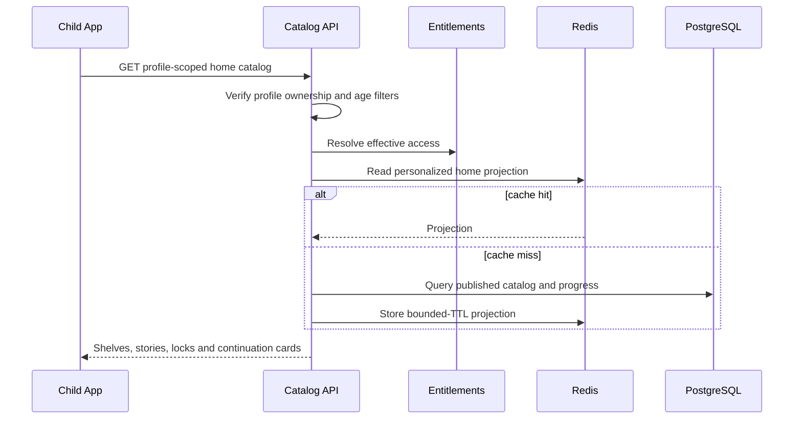

Catalog responses exclude unpublished, suspended, unavailable, geographically restricted, or age-inappropriate content. Premium locking is represented explicitly rather than hiding all premium content.

When recommendation generation fails, the API falls back to editorial, popular, age-appropriate, and recently used collections.

## 14. Search Stories

1. Client submits a normalized query, locale, filters, and page cursor.
2. Backend verifies selected profile ownership.
3. Search applies publication, locale, age, entitlement, and safety filters.
4. Results return stable identifiers, matched metadata, access state, and pagination cursor.
5. Empty or failed personalized search falls back to safe editorial suggestions.

Search queries from children are treated as sensitive behavioral data. Retention and analytics use minimized or aggregated forms.

## 15. View Story Details

The details endpoint returns only the currently visible story version and compatible episode metadata. It may include synchronized text, illustration references, content warnings for the parent surface, duration, language, series position, entitlement state, and offline availability.

The endpoint never returns private source-object keys or permanent media URLs.

## 16. Start Story Playback

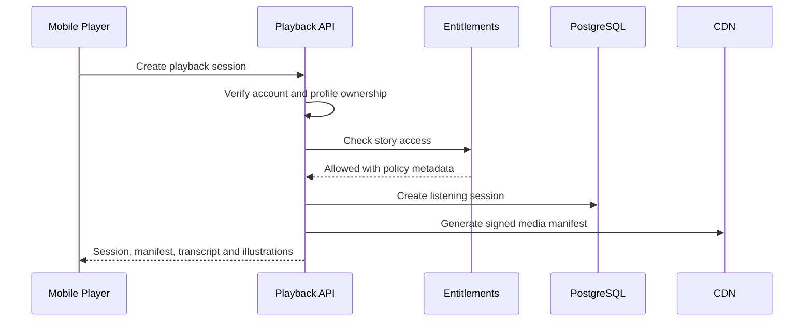

### Rules

- Story and episode must be published and available.
- Signed access expires and is never persisted in logs.
- Session is associated with account, child profile, device, story version, and episode.
- Progress cannot exceed episode duration.
- Client timestamps are advisory; server timestamps are authoritative.
- Duplicate session creation with the same idempotency key returns the existing session.

If CDN signing fails, the session is not reported as playable. If an ad provider fails, playback still proceeds.

## 17. Progress Checkpoint

1. Client batches progress checkpoints at bounded intervals and significant lifecycle moments.
2. Backend verifies session ownership and validates position, duration, and sequence.
3. The latest valid progress is persisted.
4. Completion threshold evaluation occurs in the same transaction.
5. Cache projections for continue-listening are invalidated or updated.
6. Analytics events are emitted asynchronously.

Progress writes are idempotent by operation ID. Out-of-order checkpoints do not move normal playback progress backwards unless the request is an explicit restart.

## 18. Continue Story

The home endpoint returns the most recent incomplete listening state for the selected profile. Completed episodes are excluded unless replay is explicitly requested.

### Conflict resolution

- Prefer the greatest valid position for normal forward listening.
- Accept an explicit restart command.
- Never overwrite newer server progress with stale offline data.
- Deduplicate using client operation IDs.
- A completed state is not reverted by an older checkpoint.

## 19. Complete Story

When playback crosses the configured completion threshold:

1. Progress is marked completed transactionally.
2. Listening session receives completion metadata.
3. `StoryCompleted` is written to the outbox once.
4. Continue-listening projections are invalidated.
5. Recommendation, analytics, and optional achievement consumers process the event asynchronously.

Repeated completion updates return success without duplicating events or rewards.

## 20. Ambient Audio Playback

Ambient audio is mixed locally by the mobile application with independent volume controls. Backend configuration determines which ambient tracks are available and safe for the selected experience.

Ambient playback does not create story progress. Failure to load an ambient track does not interrupt narration.

## 21. Offline Download Authorization

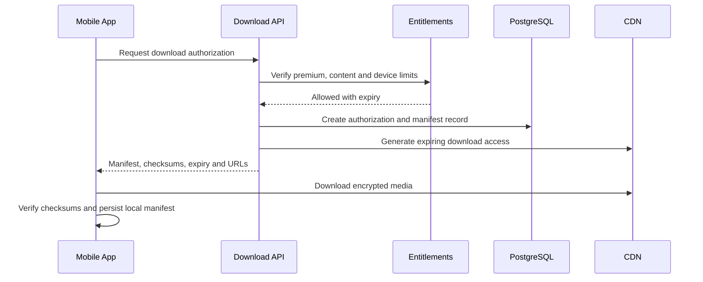

### Rules

- Offline download is Premium-only unless a future plan explicitly allows otherwise.
- Files remain in application-private storage.
- Manifest includes content version, asset checksums, expected sizes, entitlement expiry, and synchronization cursor.
- Authorization is rate-limited, device-scoped, auditable, and idempotent.
- The backend never assumes download completion only because authorization succeeded.

## 22. Offline License Validation and Revocation

At configured intervals and entitlement-sensitive moments, the client reconciles local manifests with the server.

The server may return `VALID`, `RENEWED`, `EXPIRED`, `REVOKED`, or `CONTENT_REPLACED`. Revoked or expired assets become unavailable according to policy. The client removes inaccessible content safely and preserves only non-sensitive diagnostic metadata.

## 23. Offline Progress Synchronization

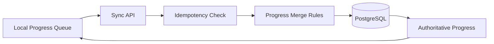

The client submits ordered operations with stable IDs, local sequence, recorded position, and story version. The server processes each operation once and returns the authoritative merged state plus the next synchronization cursor.

A failed batch is retryable. Invalid operations are isolated so one malformed item does not necessarily reject the entire batch.

## 24. Subscription Purchase

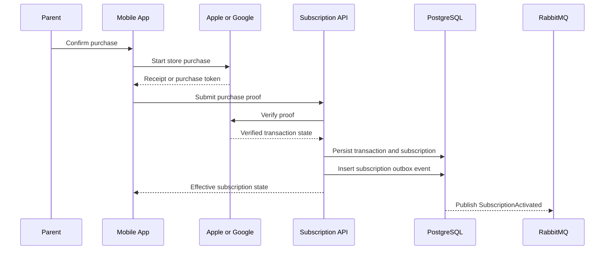

The client is never authoritative for Premium status. Provider transaction IDs are unique. Repeated proof submission returns the existing verified outcome.

If provider verification is unavailable, the purchase remains `PENDING_VERIFICATION`; permanent entitlement is not granted based only on client claims.

## 25. Trial Activation

1. Parent requests trial activation from Parent Zone.
2. Backend verifies account eligibility, previous trial history, plan availability, and provider rules.
3. Trial subscription and entitlement are created transactionally.
4. `TrialActivated` is emitted.
5. Client refreshes entitlements.

Trial activation is one-time according to policy and cannot be reset by account reinstall, profile deletion, or device change.

## 26. Store Webhook Processing

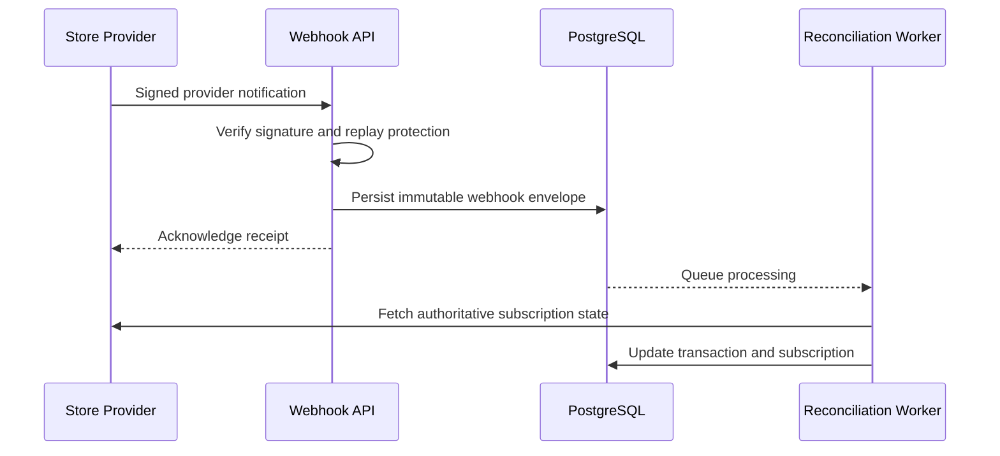

Provider callbacks are untrusted input. Processing is deduplicated by provider event ID and transaction identity. Unknown event types are retained for investigation without corrupting subscription state.

## 27. Subscription Renewal, Expiration, Cancellation, and Revocation

Store notifications and scheduled reconciliation update subscription state. Effective entitlements are recalculated and the relevant event is emitted:

- `SubscriptionRenewed`;
- `SubscriptionInGracePeriod`;
- `SubscriptionExpired`;
- `SubscriptionCancelled`;
- `SubscriptionRevoked`.

Cancellation may preserve access until the paid-through date. Revocation may remove access immediately. Offline manifests are invalidated at the next required reconciliation. User-facing notifications respect communication preferences.

## 28. Restore Purchases

1. Parent requests restore from Parent Zone.
2. Client obtains provider-owned purchase history.
3. Backend independently verifies submitted transactions.
4. Existing records are reconciled idempotently.
5. Effective entitlement is recalculated.
6. The client receives the authoritative state.

Restore never creates duplicate subscription records or extends access beyond provider truth.

## 29. Free Advertising Eligibility

1. A listening session finishes or reaches its qualifying threshold.
2. Client asks the backend for an advertising eligibility decision.
3. Backend evaluates plan, trial, account policy, selected profile, session count, cooldown, placement, geography, and child-safety configuration.
4. Backend returns `ELIGIBLE` or a non-sensitive ineligibility reason.
5. Client may request an ad from the approved provider.
6. Client reports attempt and impression outcome.

### Mandatory rules

- An ad may be considered only after two eligible listening sessions.
- Ads never interrupt a story.
- Premium and trial users are not eligible unless product policy explicitly changes.
- Failed ad loading never blocks playback.
- Provider responses cannot override backend eligibility.
- Attempts and impressions are deduplicated.

## 30. Notification Creation and Delivery

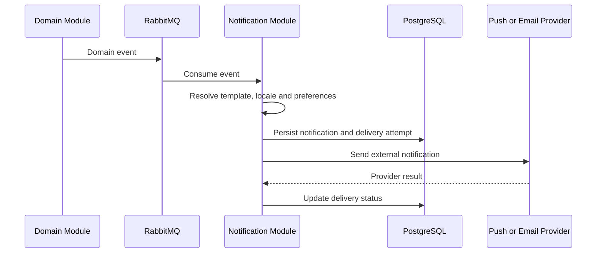

Quiet hours, locale, opt-in state, targeting, expiry, and deduplication are evaluated before delivery. In-app notifications remain persisted independently of push success.

Transient provider failures use bounded retries. Permanent failures record a terminal reason and may invalidate an unusable device token.

## 31. Mark Notification Read

The authenticated account marks an owned notification read. The operation is idempotent. Read state is persisted with server timestamp and reflected in unread-count projections.

A child-profile context may filter visible notifications but does not change account ownership.

## 32. Register and Refresh Push Token

1. Mobile obtains a platform push token.
2. Client submits token, device identifier, platform, app version, and locale.
3. Backend validates account session and upserts device-token association.
4. A token previously associated with another session is handled according to takeover policy.
5. Invalid-token provider responses deactivate the token asynchronously.

Raw push tokens are treated as secrets and are never logged.

## 33. Admin Authentication and Authorization

Administrative users authenticate through a dedicated security surface. The backend evaluates role and permission for every operation.

High-risk actions may require stronger authentication, recent login, or dual approval. UI visibility never substitutes server authorization.

## 34. Admin Media Upload

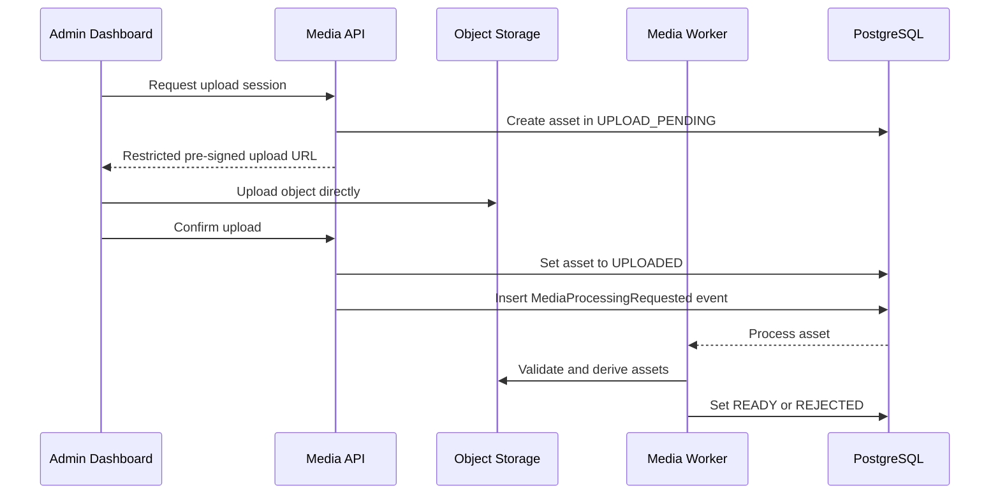

Validation includes file signature, MIME type, extension, size, duration, dimensions, checksum, malware status, and allowed codecs. Upload URLs are restricted to one object key, content type, size policy, and short expiry.

## 35. Admin Story Draft and Review

1. Authorized editor creates draft metadata.
2. Editor assembles series, episodes, transcript timing, illustrations, age classification, locale, and content tier.
3. Backend validates references and workflow transition.
4. Editor submits the version for review.
5. Reviewer records approval or rejection with reason.
6. Every transition creates an audit record.

The author of a change may be prevented from approving it when separation-of-duties policy requires another reviewer.

## 36. Admin Story Publication

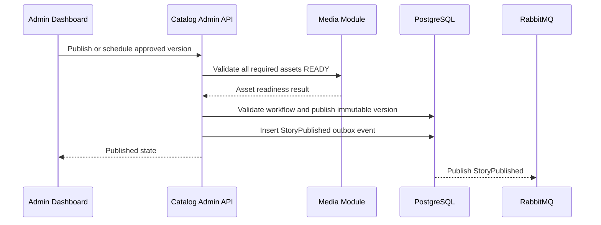

Publication is atomic for the selected story version. Cache invalidation, search indexing, recommendation updates, and notifications are asynchronous consumers.

Scheduled publication uses a claimed job with idempotent transition checks so multiple workers cannot publish the same version twice.

## 37. Content Suspension and Rollback

Published versions are immutable. A privileged operator may:

- suspend availability immediately;
- activate a previous approved version;
- schedule a corrected version;
- archive the story.

Every action requires reason, actor, timestamp, affected version, and policy decision in the audit log. Cache and delivery projections are invalidated. Existing playback sessions follow the explicitly configured safety policy.

## 38. Administrative Subscription Override

A support or administrative override requires a dedicated permission, reason, expiry, and audit record. Overrides do not modify provider transaction history.

Effective entitlement is derived from provider state plus the active override according to policy. Override creation and expiration emit dedicated events.

## 39. Account Deletion

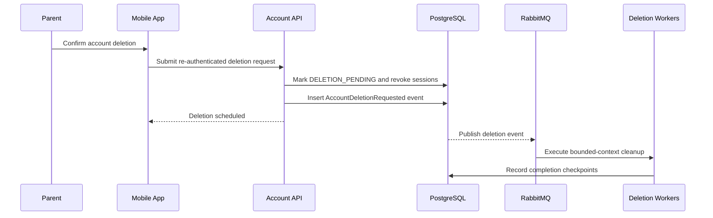

### Rules

- Recent re-authentication and Parent Zone proof are required.
- Subscription implications are clearly presented before confirmation.
- Personal data is deleted or anonymized according to retention policy.
- Financial, fraud, and security evidence is retained only where legally or operationally required.
- The workflow is resumable and idempotent.
- Completion remains auditable without preserving unnecessary personal data.

## 40. Data Export

1. Parent requests export after recent authentication.
2. Backend creates an export job and audit record.
3. Workers gather eligible account, profile, preference, progress, and subscription data.
4. Export is generated in a documented portable format.
5. A short-lived authenticated download mechanism is created.
6. Parent is notified when ready.
7. Export expires and is deleted automatically.

Export generation is rate-limited, access-controlled, and excludes internal secrets, fraud signals, and data belonging to other accounts.

## 41. Scheduled Jobs

Scheduled publication, subscription reconciliation, cleanup, notification campaigns, export expiry, token cleanup, and retention jobs use the following pattern:

1. Scheduler creates or claims a durable work item.
2. Worker acquires a bounded lease.
3. Handler verifies current source-of-truth state.
4. Work executes idempotently.
5. Success or retry state is persisted.
6. Metrics record duration, lag, attempts, and outcome.

A lost worker lease allows safe reprocessing. Jobs must not depend on a single in-memory scheduler instance.

## 42. Event Processing and Dead-Letter Recovery

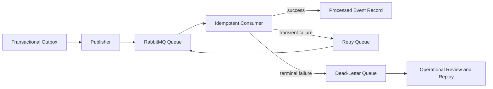

Consumers store event-processing identity or apply an equivalent idempotency mechanism. Replay is performed only after the root cause is understood. Manual replay records operator, reason, original event, attempt, and outcome.

## 43. Cache Invalidation

Source-of-truth writes commit before cache invalidation. The preferred sequence is:

1. persist domain state;
2. persist outbox event in the same transaction;
3. return the authoritative response;
4. publish event;
5. invalidate or rebuild projections asynchronously.

For correctness-critical reads, the write path may synchronously evict a local key after commit. Cache absence or failure never changes authorization or entitlement truth.

## 44. External Provider Failure Matrix

| Provider or dependency | Required behavior |
|---|---|
| Apple or Google verification unavailable | Keep purchase pending and retry; do not grant permanent access from client proof alone |
| Push provider unavailable | Persist in-app notification and retry external delivery |
| Email provider unavailable | Keep verification or reset request valid and retry within token lifetime |
| Ad provider unavailable | Skip the ad and continue playback |
| CDN transient failure | Return controlled playback failure or retry access generation; downloaded content may continue |
| Redis unavailable | Fall back to source-of-truth storage where safe |
| RabbitMQ unavailable | Keep outbox records pending until publishing recovers |
| Object storage unavailable during upload | Keep asset non-ready and allow safe retry |
| Recommendation pipeline unavailable | Return safe editorial fallback |

No external failure may leave the primary domain transaction in an unknown state.

## 45. Cross-Flow Security Requirements

Every flow must enforce:

- authentication where required;
- account and child-profile ownership;
- explicit Parent Zone proof for parent-only operations;
- administrative role and permission checks;
- request validation and output minimization;
- rate limiting and abuse protection;
- replay protection for tokens, webhooks, and idempotency keys;
- secure handling of signed URLs and provider credentials;
- audit logging for privileged and security-relevant actions.

## 46. Cross-Flow Observability Requirements

Every request, command, event, and job records the applicable fields:

- correlation ID;
- causation ID;
- trace ID and span ID;
- actor type and anonymized actor identifier;
- account, profile, story, or subscription identifier where safe;
- operation and module;
- outcome and stable error code;
- duration;
- retry count;
- event age or queue lag;
- idempotency outcome.

Business metrics must distinguish attempted, accepted, completed, failed, retried, and abandoned flows.

## 47. Cross-Flow Transaction and Idempotency Requirements

- One local business transaction changes one bounded context's authoritative write model.
- Cross-context side effects use events or explicit application interfaces.
- Idempotency records have defined scope, request fingerprint, response reference, and expiry.
- Duplicate provider events and client retries return the original outcome where possible.
- Compensation is explicit; distributed rollback is not assumed.
- Retry policies are bounded and never multiply irreversible side effects.

## 48. Flow Completion Checklist

A flow is ready for implementation when:

- actors and preconditions are documented;
- authorization and ownership checks are explicit;
- request and response contracts exist;
- source-of-truth writes are identified;
- transaction boundaries are clear;
- events and consumers are listed;
- idempotency and retry behavior are defined;
- failure states map to the error catalog;
- audit and retention requirements are known;
- metrics, logs, traces, and alerts are specified;
- mobile and administrative behavior is consistent;
- tests cover happy path, validation, authorization, retries, duplicates, and provider failure.

## 49. Related Documents

- `Software_Architecture.md`
- `Backend_Architecture.md`
- `Mobile_Architecture.md`
- `Admin_Dashboard.md`
- `API_Specification.md`
- `Database_Design.md`
- `Security_Architecture.md`
- `Notifications.md`
- `Event_Catalog.md`
- `Error_Catalog.md`
- `Logging_Monitoring.md`
- `Performance_Guidelines.md`
- `Technology_Stack.md`
- `C4_Model/README.md`
