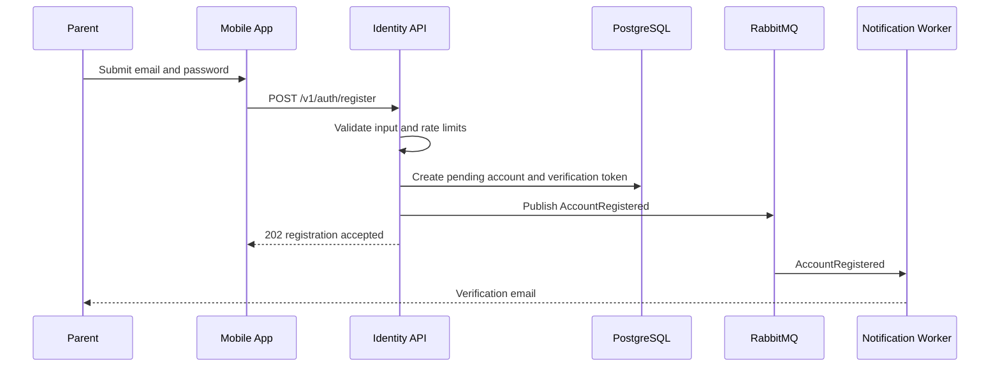
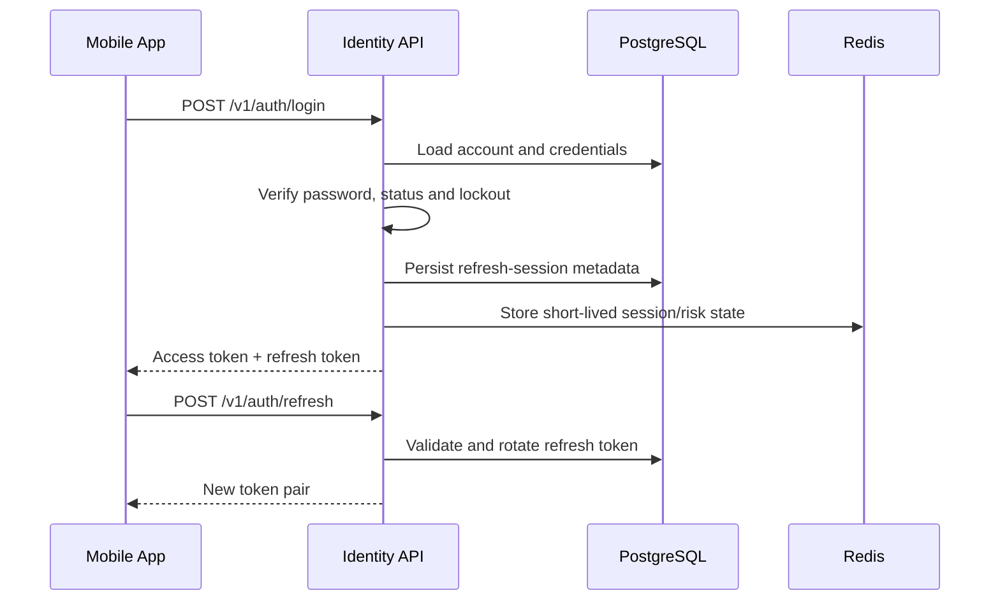
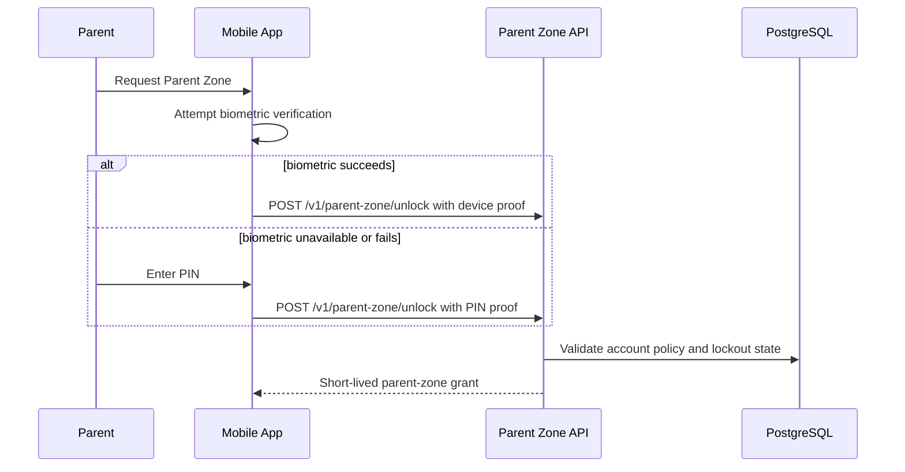
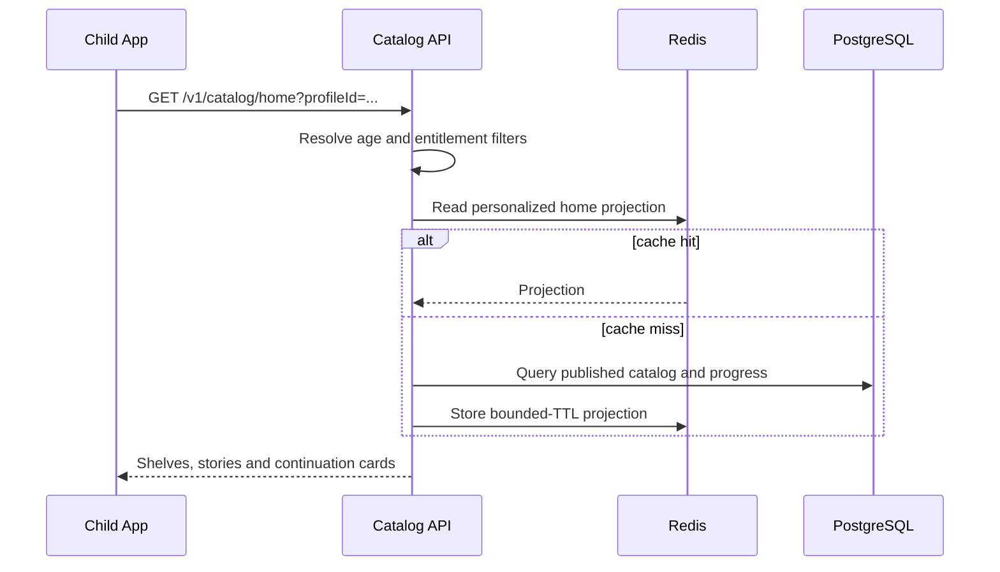
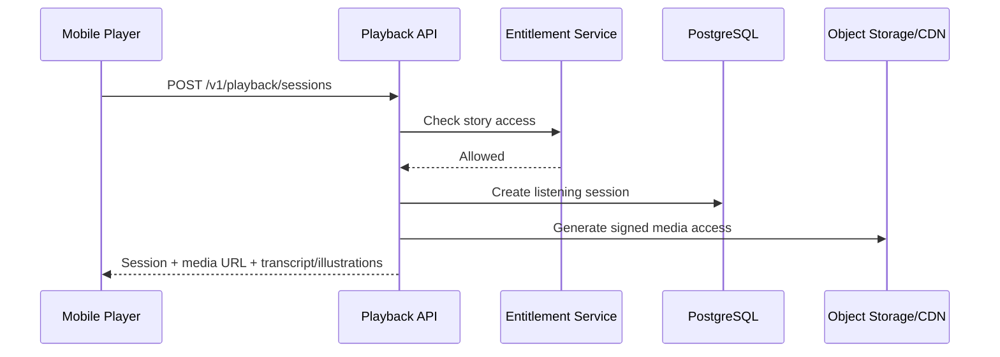
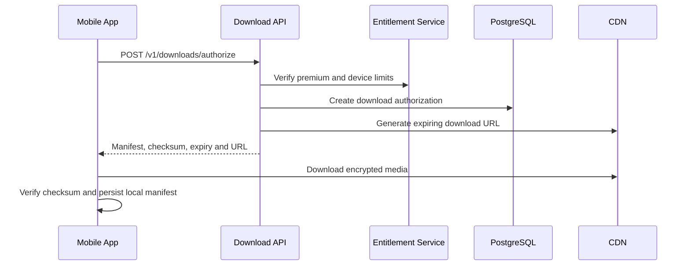
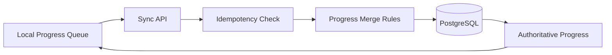
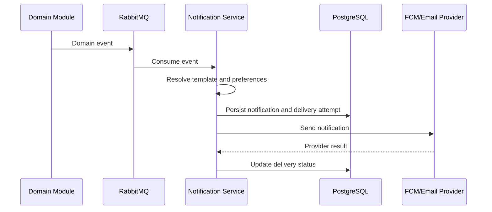

# System Flows

Version: 1.0.0  
Status: Draft

## Purpose

This document describes the behavior of the most important product flows across clients, backend modules, databases, messaging and external systems. Structural views are documented in `C4_Model/README.md`.

## Flow Documentation Template

Each flow specifies:
- actor and preconditions;
- happy path;
- validation and authorization;
- persistence changes;
- emitted events;
- failure behavior;
- observability requirements.

## 1. Account Registration

Rules:
- Email is normalized before uniqueness checks.
- Password is hashed with an approved adaptive algorithm.
- Duplicate registration responses must not reveal sensitive account state.
- Verification tokens are single-use, hashed at rest and expire.
- Registration is idempotent for the same request key.

## 2. Login and Session Refresh

Rules:
- Refresh tokens are rotated on every use.
- Reuse of an old refresh token revokes the token family.
- Access tokens are short-lived.
- Failed authentication increments throttling counters.
- Device and session metadata are auditable.

## 3. Enter Parent Zone

The Parent Zone is protected independently from account login.

Rules:
- Raw biometric data never leaves the device.
- PIN is never stored or logged in plain text.
- Parent-zone grants are short-lived and scoped.
- Repeated failures trigger cooldown and security logging.

## 4. Create Child Profile

1. Parent enters Parent Zone.
2. Mobile app sends profile name, age band, avatar and preferences.
3. Backend validates entitlement and profile limit.
4. Profile is created in a transaction.
5. `ChildProfileCreated` is written to the outbox.
6. Cache entries for account profile lists are invalidated.
7. Audit record is created.

Required validations:
- parent owns the account;
- parent-zone grant is valid;
- name length and allowed characters;
- age band is supported;
- maximum profile count is not exceeded;
- avatar identifier exists and is allowed.

## 5. Select Child Profile

The app loads available profiles after authentication. Selecting a profile creates only client context; it does not grant Parent Zone access.

The selected profile identifier is sent on child-scoped API calls. The backend verifies that the profile belongs to the authenticated account. A client cannot access another account's profile by changing an identifier.

## 6. Browse and Discover Stories

Catalog responses exclude unpublished, unavailable or age-inappropriate content. Premium locking is represented explicitly rather than by omitting all premium content.

## 7. Start Story Playback

1. Client requests playback authorization for an episode.
2. Backend validates publication status, age filters, geography if applicable and entitlement.
3. Backend returns metadata plus a short-lived signed media URL.
4. Mobile app begins playback using the audio service.
5. Client creates a listening session.
6. Progress updates are batched and sent periodically.

Rules:
- Signed URLs expire and are not persisted in logs.
- A session is associated with account and child profile.
- Progress cannot exceed episode duration.
- Client timestamps are advisory; server timestamps are authoritative.

## 8. Continue Story

The home endpoint obtains the most recent incomplete listening state for the selected profile. Completed episodes are excluded unless a restart recommendation is explicitly requested.

Conflict resolution for progress:
- prefer the greatest valid position for normal forward listening;
- accept an explicit restart command;
- never overwrite newer server progress with stale offline data;
- use client operation IDs for deduplication.

## 9. Complete Story

When playback crosses the completion threshold, the client sends a completion update. The backend marks the progress as completed and emits `StoryCompleted`. Consumers may update recommendations, achievements or analytics projections without blocking the API response.

## 10. Offline Download

Rules:
- Offline download is Premium-only.
- Files are stored in application-private storage.
- Manifest includes content version and entitlement expiry.
- Revoked or expired content becomes unavailable after reconciliation.
- Download authorization is rate-limited and auditable.

## 11. Offline Progress Synchronization

The mobile app stores progress operations in a local queue. When connectivity returns, it sends ordered operations with stable IDs. The server deduplicates operations and returns the authoritative state.

## 12. Subscription Purchase

1. Parent starts purchase through Apple or Google.
2. Store completes payment and returns a receipt/purchase token.
3. Client sends proof to the backend.
4. Backend verifies proof directly with the store.
5. Subscription and entitlement records are updated transactionally.
6. `SubscriptionActivated` or `SubscriptionRenewed` is published.
7. Client refreshes entitlements.

The client is never the authority for Premium status.

## 13. Subscription Expiration or Revocation

Store notifications and scheduled reconciliation update subscription state. Entitlements are recalculated. Offline access is disabled at the next required validation. A user-facing notification may be created according to communication preferences.

## 14. Free Advertising Flow

- An ad may be considered only after two eligible listening sessions.
- Ads never interrupt a story.
- Child safety and category restrictions are mandatory.
- The backend provides an eligibility decision; the client reports impression outcome.
- Premium users are never eligible.
- Failed ad loading must not block story playback.

## 15. Notification Creation and Delivery

Quiet hours, locale, opt-in status and deduplication are evaluated before external delivery. In-app notifications remain persisted until read or expired.

## 16. Admin Story Publishing

1. Authorized editor creates draft metadata.
2. Audio and illustration uploads use pre-authorized object-storage paths.
3. Backend validates file type, size, checksum and malware scan result.
4. Editor assembles episodes, transcript timings and age classification.
5. Reviewer approves the version.
6. Publisher schedules or performs publication.
7. Catalog transaction marks the immutable version published.
8. `StoryPublished` is emitted.
9. Catalog caches and recommendation projections are invalidated asynchronously.

A user cannot publish content without the required permission, even if the UI exposes the action incorrectly.

## 17. Content Rollback

Published versions are immutable. Rollback activates a previous approved version or removes content from availability. Existing sessions may finish only if policy allows. Every rollback requires reason, actor and timestamp in the audit log.

## 18. Account Deletion

- Parent re-authentication is required.
- Subscription implications are explained before confirmation.
- Deletion request is recorded and scheduled.
- Active sessions are revoked.
- Personal data is deleted or anonymized according to retention policy.
- Financial and security records are retained only where legally required.
- Completion is auditable without retaining unnecessary personal data.

## Cross-Flow Requirements

Every write flow must define:
- authorization policy;
- idempotency behavior;
- transactional boundary;
- emitted events;
- audit requirements;
- metric and log fields;
- retry and compensation behavior.

No external provider failure may leave the primary domain transaction in an unknown state. External work is performed after commit through outbox-driven processing whenever possible.
